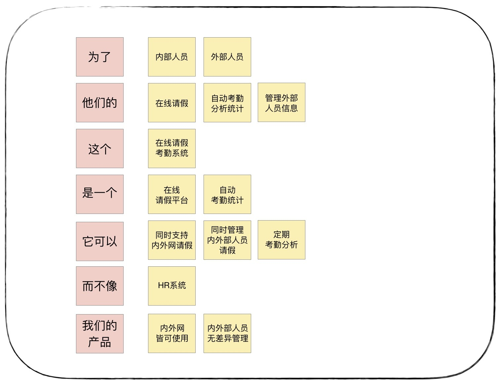
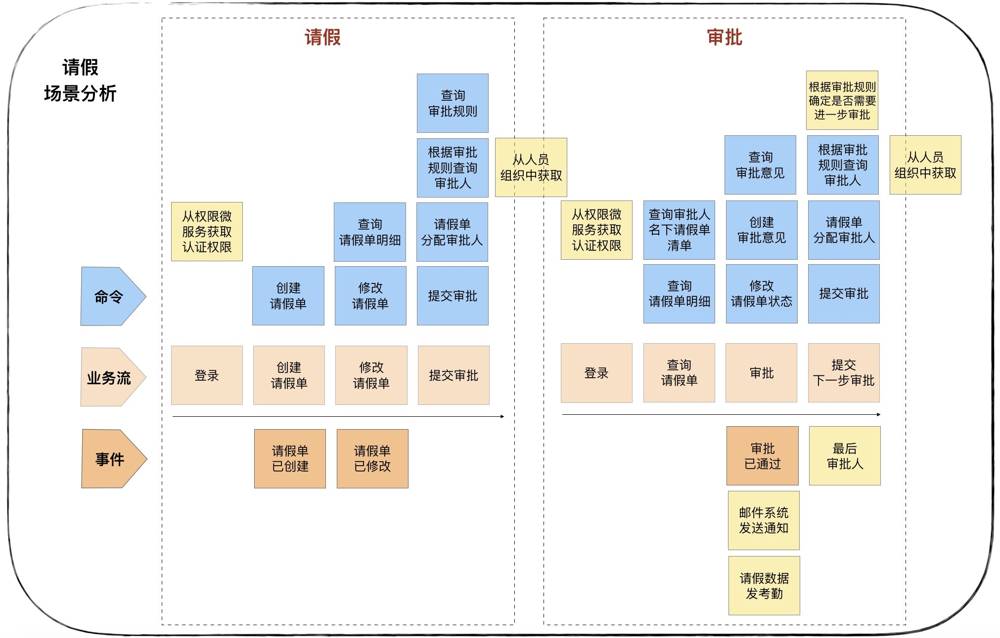
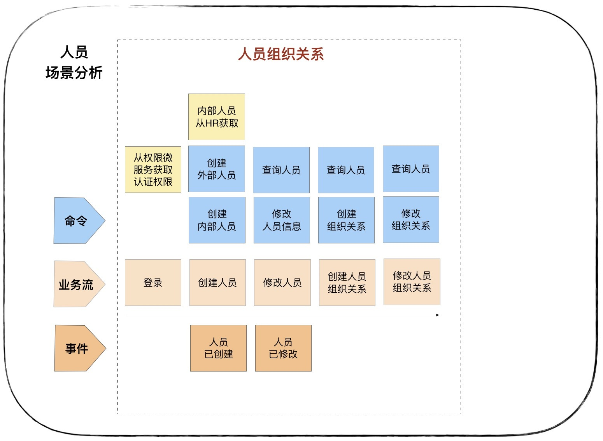
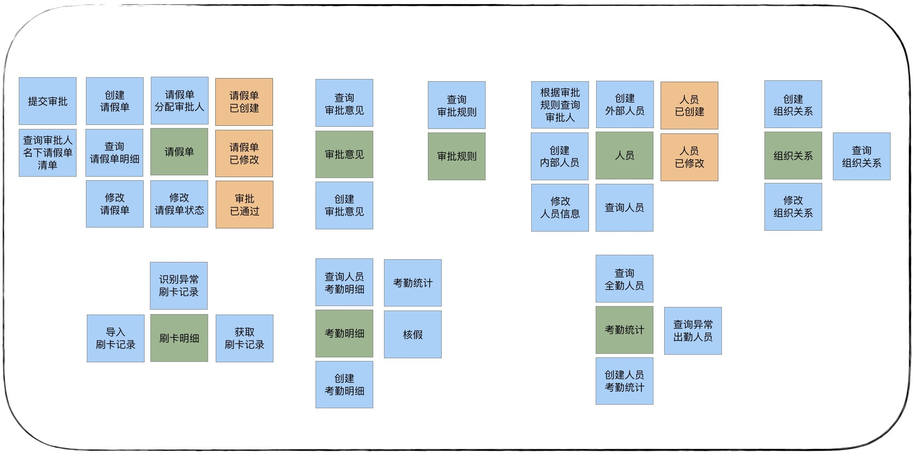
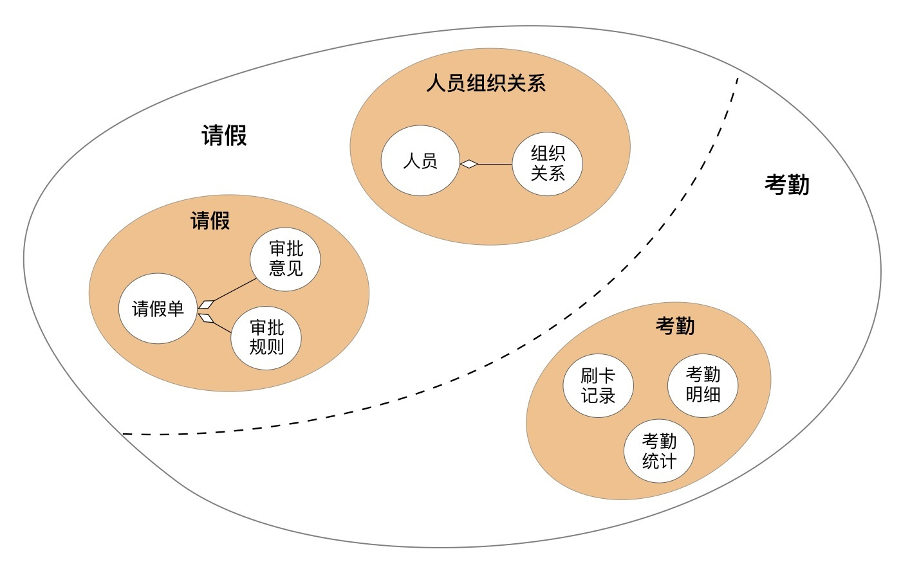
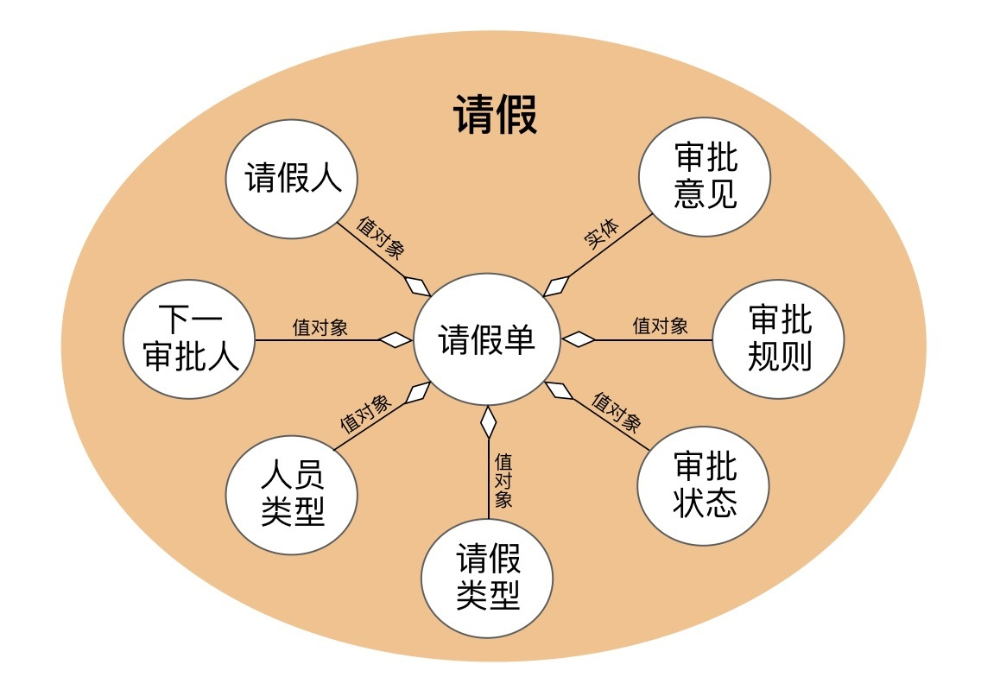
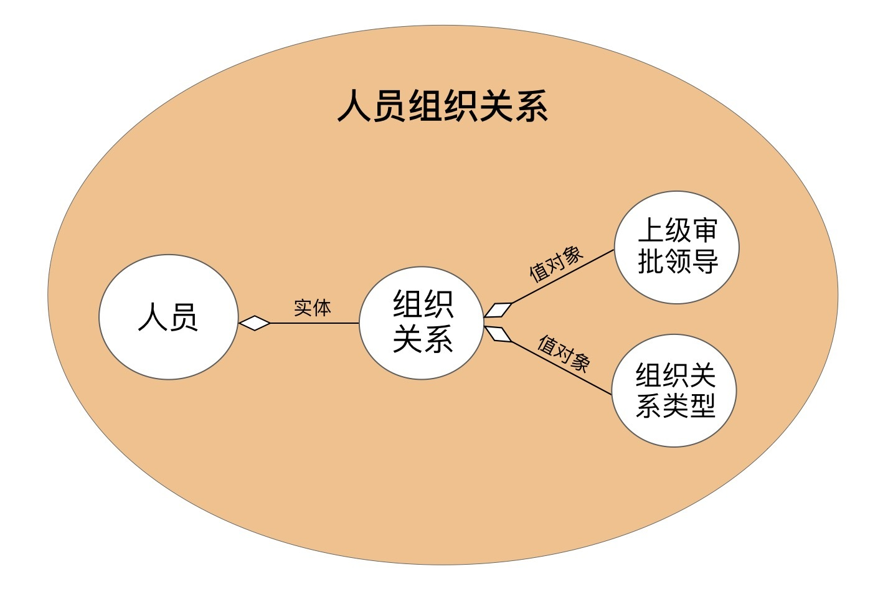
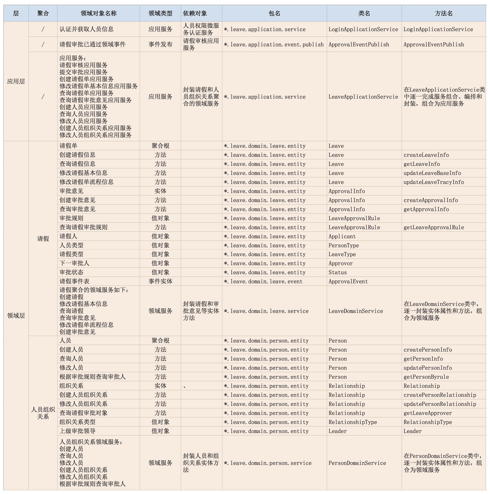
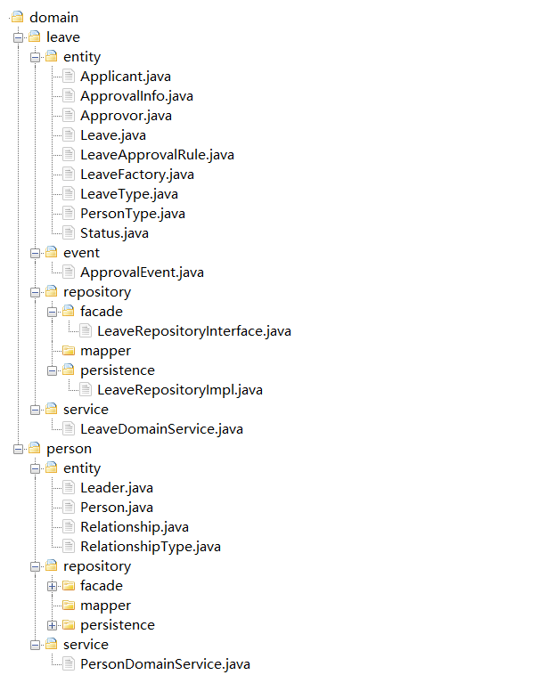

你好，我是欧创新。

为了更好地理解 DDD 的设计流程，今天我会用一个项目来带你了解 DDD 的战略设计和战术设计，走一遍从领域建模到微服务设计的全过程，一起掌握 DDD 的主要设计流程和关键点。

## 项目基本信息

项目的目标是实现在线请假和考勤管理。功能描述如下：

1\. 请假人填写请假单提交审批，根据请假人身份、请假类型和请假天数进行校验，根据审批规则逐级递交上级审批，逐级核批通过则完成审批，否则审批不通过退回申请人。

2\. 根据考勤规则，核销请假数据后，对考勤数据进行校验，输出考勤统计。

## 战略设计

战略设计是根据用户旅程分析，找出领域对象和聚合根，对实体和值对象进行聚类组成聚合，划分限界上下文，建立领域模型的过程。

战略设计采用的方法是事件风暴，包括：产品愿景、场景分析、领域建模和微服务拆分等几个主要过程。

战略设计阶段建议参与人员：领域专家、业务需求方、产品经理、架构师、项目经理、开发经理和测试经理。

### 1\. 产品愿景

产品愿景是对产品顶层价值设计，对产品目标用户、核心价值、差异化竞争点等信息达成一致，避免产品偏离方向。

事件风暴时，所有参与者针对每一个要点，在贴纸上写出自己的意见，贴到白板上。事件风暴主持者会对每个贴纸，讨论并对发散的意见进行收敛和统一，形成下面的产品愿景图。

<b>我们把这个产品愿景图整理成一段文字就是：</b>为了满足内外部人员，他们的在线请假、自动考勤统计和外部人员管理的需求，我们建设这个在线请假考勤系统，它是一个在线请假平台，可以自动考勤统计。它可以同时支持内外网请假，同时管理内外部人员请假和定期考勤分析，而不像 HR 系统，只管理内部人员，且只能内网使用。我们的产品内外网皆可使用，可实现内外部人员无差异管理。

通过产品愿景分析，项目团队统一了系统名称——在线请假考勤系统，明确了项目目标和关键功能，与竞品（HR）的关键差异以及自己的优势和核心竞争力等。

产品愿景分析对于初创系统明确系统建设重点，统一团队建设目标和建立通用语言是很有价值的。但如果你的系统目标和需求非常清晰，这一步可以忽略。

### 2\. 场景分析

场景分析是从用户视角出发，探索业务领域中的典型场景，产出领域中需要支撑的场景分类、用例操作以及不同子域之间的依赖关系，用以支撑领域建模。

项目团队成员一起用事件风暴分析请假和考勤的用户旅程。根据不同角色的旅程和场景分析，尽可能全面地梳理从前端操作到后端业务逻辑发生的所有操作、命令、领域事件以及外部依赖关系等信息。

**下面我就以请假和人员两个场景作为示例。**

第一个场景：请假

用户：请假人

* 请假人登录系统：从权限微服务获取请假人信息和权限数据，完成登录认证。

* 创建请假单：打开请假页面，选择请假类型和起始时间，录入请假信息。保存并创建请假单，提交请假审批。

* 修改请假单：查询请假单，打开请假页面，修改请假单，提交请假审批。

* 提交审批：获取审批规则，根据审批规则，从人员组织关系中获取审批人，给请假单分配审批人。

第二个场景：审批

用户：审批人

* 审批人登录系统：从权限微服务获取审批人信息和权限数据，完成登录认证。

* 获取请假单：获取审批人名下请假单，选择请假单。

* 审批：填写审批意见。

* 逐级审批：如果还需要上级审批，根据审批规则，从人员组织关系中获取审批人，给请假单分配审批人。重复以上 4 步。

* 最后审批人完成审批。

完成审批后，产生请假审批已通过领域事件。后续有两个进一步的业务操作：发送请假审批已通过的通知，通知邮件系统告知请假人；将请假数据发送到考勤以便核销。

下面这个图是人员组织关系场景分析结果图，详细的分析过程以及考勤的场景分析就不描述了。

### 3\. 领域建模

领域建模是通过对业务和问题域进行分析，建立领域模型。向上通过限界上下文指导微服务边界设计，向下通过聚合指导实体对象设计。

领域建模是一个收敛的过程，分三步：

* 第一步找出领域实体和值对象等领域对象；

* 第二步找出聚合根，根据实体、值对象与聚合根的依赖关系，建立聚合；

* 第三步根据业务及语义边界等因素，定义限界上下文。

下面我们就逐步详细讲解一下。

**第一步：找出实体和值对象等领域对象**

根据场景分析，分析并找出发起或产生这些命令或领域事件的实体和值对象，将与实体或值对象有关的命令和事件聚集到实体。

下面这个图是分析后的实体与命令的关系。通过分析，我们找到了：请假单、审批意见、审批规则、人员、组织关系、刷卡明细、考勤明细以及考勤统计等实体和值对象。

**第二步：定义聚合**

定义聚合前，先找出聚合根。从上面的实体中，我们可以找出“请假单”和“人员”两个聚合根。然后找出与聚合根紧密依赖的实体和值对象。我们发现审批意见、审批规则和请假单紧密关联，组织关系和人员紧密关联。

找出这些实体的关系后，我们发现还有刷卡明细、考勤明细和考勤统计，这几个实体没有聚合根。这种情形在领域建模时你会经常遇到，对于这类场景我们需要分情况特殊处理。

刷卡明细、考勤明细和考勤统计这几个实体，它们之间相互独立，找不出聚合根，不是富领域模型，但它们一起完成考勤业务逻辑，具有很高的业务内聚性。我们将这几个业务关联紧密的实体，放在一个考勤聚合内。在微服务设计时，我们依然采用 DDD 的设计和分析方法。由于没有聚合根来管理聚合内的实体，我们可以用传统的方法来管理实体。

经过分析，我们建立了请假、人员组织关系和考勤三个聚合。其中请假聚合有请假单、审批意见实体和审批规则等值对象。人员组织关系聚合有人员和组织关系等实体。考勤聚合有刷卡明细、考勤明细和考勤统计等实体。

**第三步：定义限界上下文**

由于人员组织关系聚合与请假聚合，共同完成请假的业务功能，两者在请假的限界上下文内。考勤聚合则单独构成考勤统计限界上下文。因此我们为业务划分请假和考勤统计两个限界上下文，建立请假和考勤两个领域模型。

### 4\. 微服务的拆分

理论上一个限界上下文就可以设计为一个微服务，但还需要综合考虑多种外部因素，比如：职责单一性、敏态与稳态业务分离、非功能性需求（如弹性伸缩、版本发布频率和安全等要求）、软件包大小、团队沟通效率和技术异构等非业务要素。

在这个项目，我们划分微服务主要考虑职责单一性原则。因此根据限界上下文就可以拆分为请假和考勤两个微服务。其中请假微服务包含人员组织关系和请假两个聚合，考勤微服务包含考勤聚合。

到这里，战略设计就结束了。通过战略设计，我们建立了领域模型，划分了微服务边界。下一步就是战术设计了，也就是微服务设计。下面我们以请假微服务为例，讲解其设计过程。

## 战术设计

战术设计是根据领域模型进行微服务设计的过程。这个阶段主要梳理微服务内的领域对象，梳理领域对象之间的关系，确定它们在代码模型和分层架构中的位置，建立领域模型与微服务模型的映射关系，以及服务之间的依赖关系。

战术设计阶段建议参与人员：领域专家、产品经理、架构师、项目经理、开发经理和测试经理等。

战术设计包括以下两个阶段：分析微服务领域对象和设计微服务代码结构。

### 1\. 分析微服务领域对象

领域模型有很多领域对象，但是这些对象带有比较重的业务属性。要完成从领域模型到微服务的落地，还需要进一步的分析和设计。在事件风暴基础上，我们进一步细化领域对象以及它们的关系，补充事件风暴可能遗漏的业务和技术细节。

我们分析微服务内应该有哪些服务？服务的分层？应用服务由哪些服务组合和编排完成？领域服务包括哪些实体和实体方法？哪个实体是聚合根？实体有哪些属性和方法？哪些对象应该设计为值对象等。

**服务的识别和设计**

事件风暴的命令是外部的一些操作和业务行为，也是微服务对外提供的能力。它往往与微服务的应用服务或者领域服务对应。我们可以将命令作为服务识别和设计的起点。具体步骤如下：

* 根据命令设计应用服务，确定应用服务的功能，服务集合，组合和编排方式。服务集合中的服务包括领域服务或其它微服务的应用服务。

* 根据应用服务功能要求设计领域服务，定义领域服务。这里需要注意：应用服务可能是由多个聚合的领域服务组合而成的。

* 根据领域服务的功能，确定领域服务内的实体以及功能。

* 设计实体基本属性和方法。

另外，我们还要考虑领域事件的异步化处理。

我以提交审批这个动作为例，来说明服务的识别和设计。提交审批的大体流程是：

* 根据请假类型和时长，查询请假审批规则，获取下一步审批人的角色。

* 根据审批角色从人员组织关系中查询下一审批人。

* 为请假单分配审批人，并将审批规则保存至请假单。

* 通过分析，我们需要在应用层和领域层设计以下服务和方法。

<b>应用层：</b>提交审批应用服务。

<b>领域层：</b>领域服务有查询审批规则、修改请假流程信息服务以及根据审批规则查询审批人服务，分别位于请假和人员组织关系聚合。请假单实体有修改请假流程信息方法，审批规则值对象有查询审批规则方法。人员实体有根据审批规则查询审批人方法。下图是我们分析出来的服务以及它们之间的依赖关系。

服务的识别和设计过程就是这样了，我们再来设计一下聚合内的对象。

**聚合中的对象**

在请假单聚合中，聚合根是请假单。

请假单经多级审核后，会产生多条审批意见，为了方便查询，我们可以将审批意见设计为实体。请假审批通过后，会产生请假审批通过的领域事件，因此还会有请假事件实体。请假聚合有以下实体：审批意见（记录审批人、审批状态和审批意见）和请假事件实体。

我们再来分析一下请假单聚合的值对象。请假人和下一审批人数据来源于人员组织关系聚合中的人员实体，可设计为值对象。人员类型、请假类型和审批状态是枚举值类型，可设计为值对象。确定请假审批规则后，审批规则也可作为请假单的值对象。请假单聚合将包含以下值对象：请假人、人员类型、请假类型、下一审批人、审批状态和审批规则。

综上，我们就可以画出请假聚合对象关系图了。

在人员组织关系聚合中，我们可以建立人员之间的组织关系，通过组织关系类型找到上级审批领导。它的聚合根是人员，实体有组织关系（包括组织关系类型和上级审批领导），其中组织关系类型（如项目经理、处长、总经理等）是值对象。上级审批领导来源于人员聚合根，可设计为值对象。人员组织关系聚合将包含以下值对象：组织关系类型、上级审批领导。

综上，我们又可以画出人员组织关系聚合对象关系图了。

**微服务内的对象清单**

在确定各领域对象的属性后，我们就可以设计各领域对象在代码模型中的代码对象（包括代码对象的包名、类名和方法名），建立领域对象与代码对象的一一映射关系了。根据这种映射关系，相关人员可快速定位到业务逻辑所在的代码位置。在经过以上分析后，我们在微服务内就可以分析出如下图的对象清单。

### 2\. 设计微服务代码结构

根据 DDD 的代码模型和各领域对象所在的包、类和方法，我们可以定义出请假微服务的代码结构，设计代码对象。

**应用层代码结构**

应用层包括：应用服务、DTO 以及事件发布相关代码。在 LeaveApplicationService 类内实现与聚合相关的应用服务，在 LoginApplicationService 封装外部微服务认证和权限的应用服务。

这里提醒一下：如果应用服务逻辑复杂的话，一个应用服务就可以构建一个类，这样可以避免一个类的代码过于庞大，不利于维护。

**领域层代码结构**

领域层包括一个或多个聚合的实体类、事件实体类、领域服务以及工厂、仓储相关代码。一个聚合对应一个聚合代码目录，聚合之间在代码上完全隔离，聚合之间通过应用层协调。

请假微服务领域层包含请假和人员两个聚合。人员和请假代码都放在各自的聚合所在目录结构的代码包中。如果随着业务发展，人员相关功能需要从请假微服务中拆分出来，我们只需将人员聚合代码包稍加改造，独立部署，即可快速发布为人员微服务。到这里，微服务内的领域对象，分层以及依赖关系就梳理清晰了。微服务的总体架构和代码模型也基本搭建完成了。

## 后续的工作

### 1\. 详细设计

在完成领域模型和微服务设计后，我们还需要对微服务进行详细的设计。主要设计以下内容：实体属性、数据库表和字段、实体与数据库表映射、服务参数规约及功能实现等。

### 2\. 代码开发和测试

开发人员只需要按照详细的设计文档和功能要求，找到业务功能对应的代码位置，完成代码开发就可以了。代码开发完成后，开发人员要编写单元测试用例，基于挡板模拟依赖对象完成服务测试。

## 总结

今天我们通过在线请假考勤项目，把 DDD 设计过程完整地走了一遍。

DDD 战略设计从事件风暴开始，然后我们要找出实体等领域对象，找出聚合根构建聚合，划分限界上下文，建立领域模型。

战术设计从事件风暴的命令开始，识别和设计服务，建立各层服务的依赖关系，设计微服务内的实体和值对象，找出微服务中所有的领域对象，并建立领域对象与代码对象的映射关系。

这样就可以很好地指导项目团队进行微服务开发和测试了。总结完毕，到这你是否已经清楚 DDD 全部的设计过程了呢？有疑问欢迎留言讨论。

## 思考题

你现在采用的是什么样的微服务设计方法？你认为有什么需要特别注意的事项呢？目前有何难点痛点？分享出来，也许我能给你一些有效的建议。

最后，如果今天的实战项目，可以让你举一反三、有所收获，欢迎分享给你的朋友，邀请他加入学习。