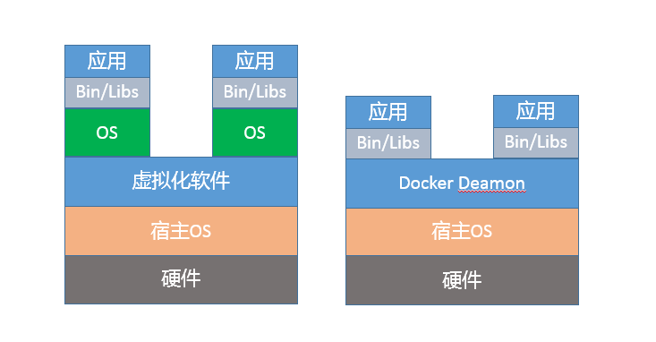

如今，Docker 等容器早已不是新生事物，正在逐步成为日常开发、部署环境的一部分。Java 能否无缝地运行在容器环境，是否符合微服务、Serverless 等新的软件架构和场景，在一定程度上也会影响未来的技术栈选择。当然，Java 对 Docker 等容器环境的支持也在不断增强，自然地，Java 在容器场景的实践也逐渐在面试中被涉及。我希望通过专栏今天这一讲，能够帮你能做到胸有成竹。

今天我要问你的问题是，<font color="#fa8e24">Java 程序运行在 Docker 等容器环境有哪些新问题？</font>

## 典型回答

对于 Java 来说，Docker 毕竟是一个较新的环境，例如，其内存、CPU 等资源限制是通过 CGroup（Control Group）实现的，早期的 JDK 版本（8u131 之前）并不能识别这些限制，进而会导致一些基础问题：

* 如果未配置合适的 JVM 堆和元数据区、直接内存等参数，Java 就有可能试图使用超过容器限制的内存，最终被容器 OOM kill，或者自身发生 OOM。

* 错误判断了可获取的 CPU 资源，例如，Docker 限制了 CPU 的核数，JVM 就可能设置不合适的 GC 并行线程数等。

从应用打包、发布等角度出发，JDK 自身就比较大，生成的镜像就更为臃肿，当我们的镜像非常多的时候，镜像的存储等开销就比较明显了。

如果考虑到微服务、Serverless 等新的架构和场景，Java 自身的大小、内存占用、启动速度，都存在一定局限性，因为 Java 早期的优化大多是针对长时间运行的大型服务器端应用。

## 考点分析

今天的问题是个针对特定场景和知识点的问题，我给出的回答简单总结了目前业界实践中发现的一些问题。

如果我是面试官，针对这种问题，如果你确实没有太多 Java 在 Docker 环境的使用经验，直接说不知道，也算是可以接受的，毕竟没有人能够掌握所有知识点嘛。

但我们要清楚，有经验的面试官，一般不会以纯粹偏僻的知识点作为面试考察的目的，更多是考察思考问题的思路和解决问题的方法。所以，如果有基础的话，可以从操作系统、容器原理、JVM 内部机制、软件开发实践等角度，展示系统性分析新问题、新场景的能力。毕竟，变化才是世界永远的主题，能够在新变化中找出共性与关键，是优秀工程师的必备能力。

今天我会围绕下面几个方面展开：

* 面试官可能会进一步问到，有没有想过为什么类似 Docker 这种容器环境，会有点“欺负”Java？从 JVM 内部机制来说，问题出现在哪里？

* 我注意到有种论调说“没人在容器环境用 Java”，不去争论这个观点正确与否，我会从工程实践出发，梳理问题原因和相关解决方案，并探讨下新场景下的最佳实践。

## 知识扩展

首先，我们先来搞清楚 Java 在容器环境的局限性来源，**Docker 到底有什么特别？**

虽然看起来 Docker 之类容器和虚拟机非常相似，例如，它也有自己的 shell，能独立安装软件包，运行时与其他容器互不干扰。但是，如果深入分析你会发现，Docker 并不是一种完全的**虚拟化**技术，而更是一种轻量级的**隔离**技术。



上面的示意图，展示了 Docker 与虚拟机的区别。从技术角度，基于 namespace，Docker 为每个容器提供了单独的命名空间，对网络、PID、用户、IPC 通信、文件系统挂载点等实现了隔离。对于 CPU、内存、磁盘 IO 等计算资源，则是通过 CGroup 进行管理。如果你想了解更多 Docker 的细节，请参考相关[技术文档](https://www.freecodecamp.org/news/a-beginner-friendly-introduction-to-containers-vms-and-docker-79a9e3e119b)。

Docker 仅在类似 Linux 内核之上实现了有限的隔离和虚拟化，并不是像传统虚拟化软件那样，独立运行一个新的操作系统。如果是虚拟化的操作系统，不管是 Java 还是其他程序，只要调用的是同一个系统 API，都可以透明地获取所需的信息，基本不需要额外的兼容性改变。

容器虽然省略了虚拟操作系统的开销，实现了轻量级的目标，但也带来了额外复杂性，它限制对于应用不是透明的，需要用户理解 Docker 的新行为。所以，有专家曾经说过，“幸运的是 Docker 没有完全隐藏底层信息，但是不幸的也是 Docker 没有隐藏底层信息！”

对于 Java 平台来说，这些未隐藏的底层信息带来了很多意外的困难，主要体现在几个方面：

第一，容器环境对于计算资源的管理方式是全新的，CGroup 作为相对比较新的技术，历史版本的 Java 显然并不能自然地理解相应的资源限制。

第二，namespace 对于容器内的应用细节增加了一些微妙的差异，比如 jcmd、jstack 等工具会依赖于“/proc//”下面提供的部分信息，但是 Docker 的设计改变了这部分信息的原有结构，我们需要对原有工具进行[修改](https://bugs.openjdk.org/browse/JDK-8179498)以适应这种变化。

**从 JVM 运行机制的角度，为什么这些“沟通障碍”会导致 OOM 等问题呢？**

你可以思考一下，这个问题实际是反映了 JVM 如何根据系统资源（内存、CPU 等）情况，在启动时设置默认参数。

这就是所谓的[Ergonomics](https://docs.oracle.com/javase/10/gctuning/ergonomics.htm#JSGCT-GUID-DB4CAE94-2041-4A16-90EC-6AE3D91EC1F1)机制，例如：

* JVM 会大概根据检测到的内存大小，设置最初启动时的堆大小为系统内存的 1/64；并将堆最大值，设置为系统内存的 1/4。

* 而 JVM 检测到系统的 CPU 核数，则直接影响到了 Parallel GC 的并行线程数目和 JIT complier 线程数目，甚至是我们应用中 ForkJoinPool 等机制的并行等级。

这些默认参数，是根据通用场景选择的初始值。但是由于容器环境的差异，Java 的判断很可能是基于错误信息而做出的。这就类似，我以为我住的是整栋别墅，实际上却只有一个房间是给我住的。

更加严重的是，JVM 的一些原有诊断或备用机制也会受到影响。为保证服务的可用性，一种常见的选择是依赖“-XX:OnOutOfMemoryError”功能，通过调用处理脚本的形式来做一些补救措施，比如自动重启服务等。但是，这种机制是基于 fork 实现的，当 Java 进程已经过度提交内存时，fork 新的进程往往已经不可能正常运行了。

根据前面的总结，似乎问题非常棘手，那我们在实践中，**如何解决这些问题呢？**

首先，如果你能够**升级到最新的 JDK 版本**，这个问题就迎刃而解了。

* 针对这种情况，JDK 9 中引入了一些实验性的参数，以方便 Docker 和 Java“沟通”，例如针对内存限制，可以使用下面的参数设置：

    ```
    -XX:+UnlockExperimentalVMOptions
    -XX:+UseCGroupMemoryLimitForHeap
    ```

    注意，这两个参数是顺序敏感的，并且只支持 Linux 环境。而对于 CPU 核心数限定，Java 已经被修正为可以正确理解“–cpuset-cpus”等设置，无需单独设置参数。

* 如果你可以切换到 JDK 10 或者更新的版本，问题就更加简单了。Java 对容器（Docker）的支持已经比较完善，默认就会自适应各种资源限制和实现差异。前面提到的实验性参数“UseCGroupMemoryLimitForHeap”已经被标记为废弃。

    与此同时，新增了参数用以明确指定 CPU 核心的数目。

    ```
    -XX:ActiveProcessorCount=N
    ```

    如果实践中发现有问题，也可以使用“-XX:-UseContainerSupport”，关闭 Java 的容器支持特性，这可以作为一种防御性机制，避免新特性破坏原有基础功能。当然，也欢迎你向 OpenJDK 社区反馈问题。

* 幸运的是，JDK 9 中的实验性改进已经被移植到 Oracle JDK 8u131 之中，你可以直接下载相应镜像，并配置“UseCGroupMemoryLimitForHeap”，后续很有可能还会进一步将 JDK 10 中相关的增强，应用到 JDK 8 最新的更新中。

但是，如果我暂时只能使用老版本的 JDK 怎么办？

我这里有几个建议：

* 明确设置堆、元数据区等内存区域大小，保证 Java 进程的总大小可控。

    例如，我们可能在环境中，这样限制容器内存：

    ```
    $ docker run -it --rm --name yourcontainer -p 8080:8080 -m 800M repo/your-java-container:openjdk
    ```

    那么，就可以额外配置下面的环境变量，直接指定 JVM 堆大小。

    ```
    -e JAVA_OPTIONS='-Xmx300m'
    ```

* 明确配置 GC 和 JIT 并行线程数目，以避免二者占用过多计算资源。

    ```
    -XX:ParallelGCThreads
    -XX:CICompilerCount
    ```

除了我前面介绍的 OOM 等问题，在很多场景中还发现 Java 在 Docker 环境中，似乎会意外使用 Swap。具体原因待查，但很有可能也是因为 Ergonomics 机制失效导致的，我建议配置下面参数，明确告知 JVM 系统内存限额。

```
-XX:MaxRAM=`cat /sys/fs/cgroup/memory/memory.limit_in_bytes`
```

也可以指定 Docker 运行参数，例如：

```
--memory-swappiness=0
```

这是受操作系统Swappiness机制影响，当内存消耗达到一定门限，操作系统会试图将不活跃的进程换出（Swap out），上面的参数有显式关闭 Swap 的作用。所以可以看到，Java 在 Docker 中的使用，从操作系统、内核到 JVM 自身机制，需要综合运用我们所掌握的知识。

回顾我在专栏第 25 讲 JVM 内存区域的介绍，JVM 内存消耗远不止包括堆，很多时候仅仅设置 Xmx 是不够的，MaxRAM 也有助于 JVM 合理分配其他内存区域。如果应用需要设置更多 Java 启动参数，但又不确定什么数值合理，可以试试一些社区提供的[工具](https://github.com/cloudfoundry/java-buildpack-memory-calculator)，但要注意通用工具的局限性。

更进一步来说，对于容器镜像大小的问题，如果你使用的是 JDK 9 以后的版本，完全可以使用 jlink 工具定制最小依赖的 Java 运行环境，将 JDK 裁剪为几十 M 的大小，这样运行起来并不困难。

今天我从 Docker 环境中 Java 可能出现的问题开始，分析了为什么容器环境对应用并不透明，以及这种偏差干扰了 JVM 的相关机制。最后，我从实践出发，介绍了主要问题的解决思路，希望对你在实际开发时有所帮助。

## 一课一练

关于今天我们讨论的题目你做到心中有数了吗？今天的思考题是，针对我提到的微服务和 Serverless 等场景 Java 表现出的不足，有哪些方法可以改善 Java 的表现？

请你在留言区写写你对这个问题的思考，我会选出经过认真思考的留言，送给你一份学习奖励礼券，欢迎你与我一起讨论。

你的朋友是不是也在准备面试呢？你可以“请朋友读”，把今天的题目分享给好友，或许你能帮到他。