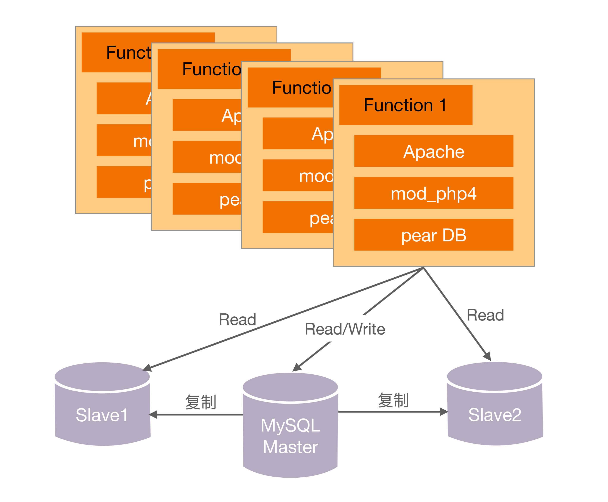
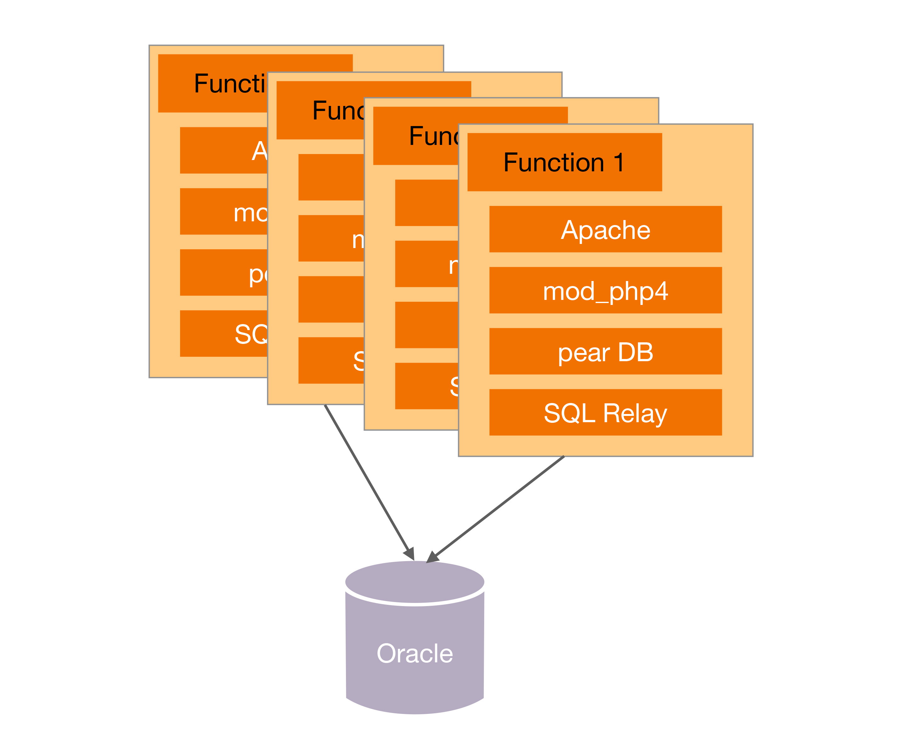
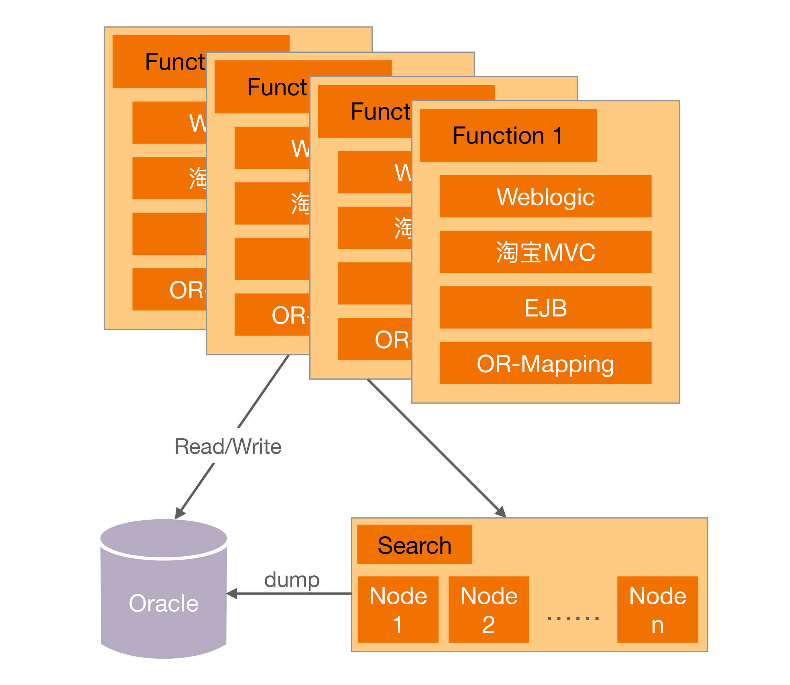
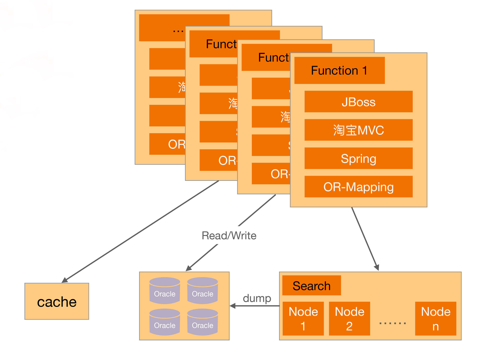
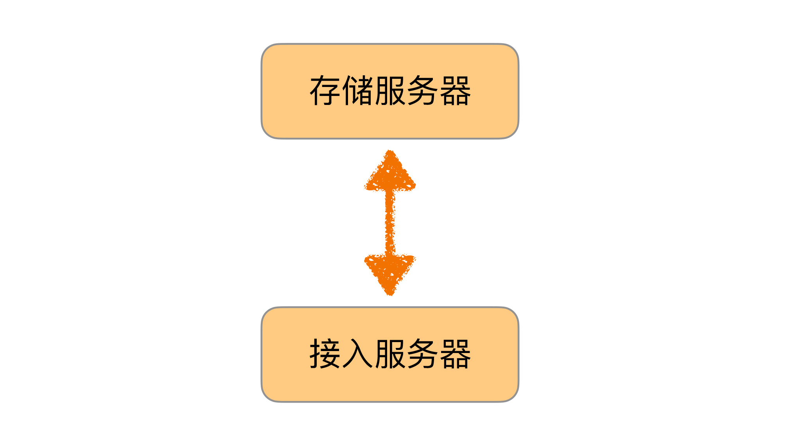
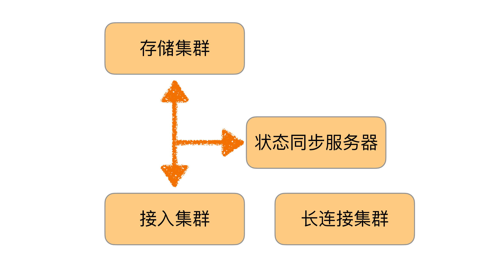
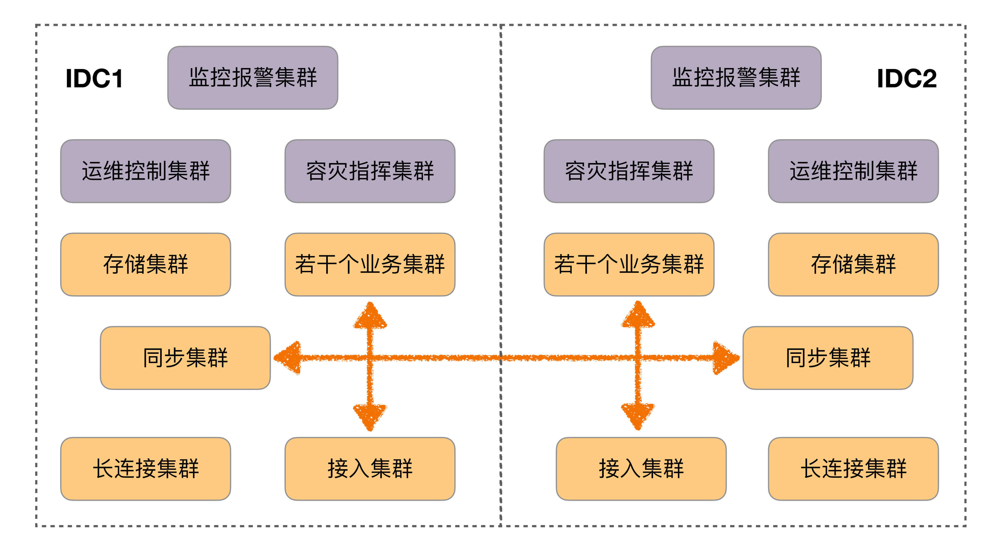
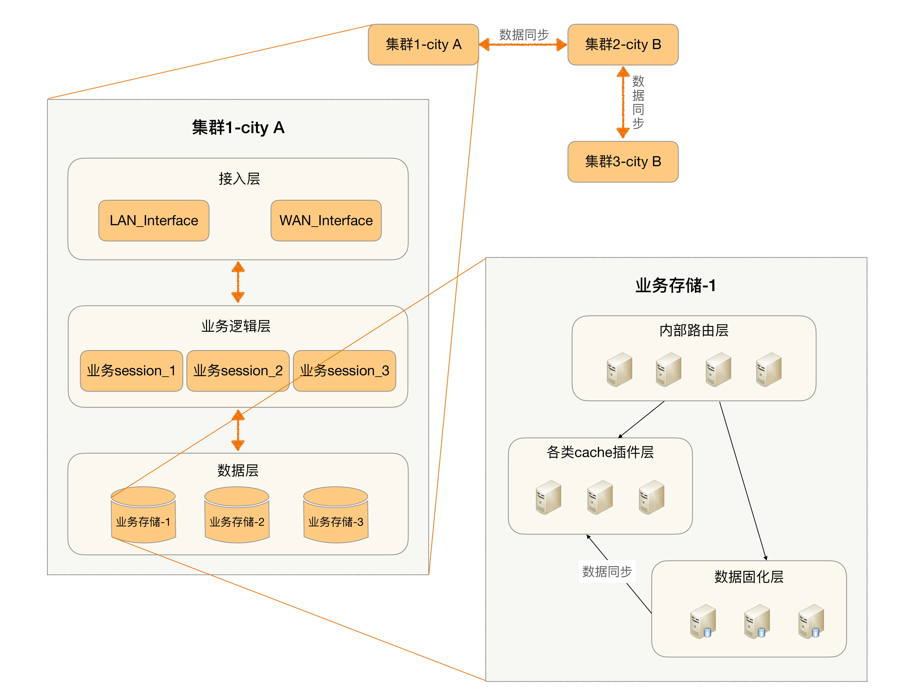
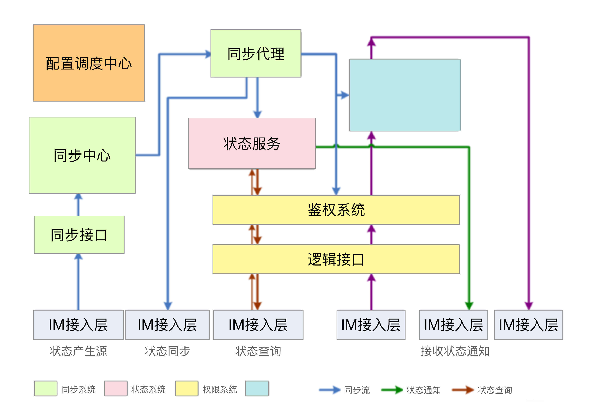

周二，我给你介绍了架构设计的三条核心原则，先复习一下：合适原则、简单原则和演化原则。我们在架构设计实践中，应该时刻谨记这三条设计原则，指导我们设计出合适的架构，即使是代表中国互联网技术最顶尖水平的 BAT，其架构的发展历程也同样遵循这三条原则。

今天我就以大家耳熟能详的淘宝和手机 QQ 作为案例，来简单分析一下。

## 淘宝

注：以下部分内容摘自《淘宝技术发展》。

淘宝技术发展主要经历了“个人网站”→“Oracle/ 支付宝 / 旺旺”→“Java 时代 1.0”→“Java 时代 2.0”→“Java 时代 3.0”→“分布式时代”。我们看看每个阶段的主要驱动力是什么。

1\. 个人网站

>2003 年 4 月 7 日马云提出成立淘宝，2003 年 5 月 10 日淘宝就上线了，中间只有 1 个月，怎么办？淘宝的答案就是：买一个。

>估计大部分人很难想象如今技术牛气冲天的阿里最初的淘宝竟然是买来的，我们看看当初决策的依据：

>当时对整个项目组来说压力最大的就是时间，怎么在最短的时间内把一个从来就没有的网站从零开始建立起来？了解淘宝历史的人知道淘宝是在 2003 年 5 月 10 日上线的，这之间只有一个月。要是你在这个团队里，你怎么做？我们的答案就是：买一个来。

淘宝当时在初创时，没有过多考虑技术是否优越、性能是否海量以及稳定性如何，主要的考虑因素就是：快！

因为此时业务要求快速上线，时间不等人，等你花几个月甚至十几个月搞出一个强大的系统出来，可能市场机会就没有了，黄花菜都凉了。

同样，在考虑如何买的时候，淘宝的决策依据主要也是“快”。

>买一个网站显然比做一个网站要省事一些，但是他们的梦想可不是做一个小网站而已，要做大，就不是随便买个就行的，要有比较低的维护成本，要能够方便地扩展和二次开发。

>那接下来就是第二个问题：买一个什么样的网站？答案是：轻量一点的，简单一点的。

**买一个系统是为了“快速可用”，而买一个轻量级的系统是为了“快速开发”**。因为系统上线后肯定有大量的需求需要做，这时能够快速开发就非常重要。

从这个实例我们可以看到：淘宝最开始的时候业务要求就是“快”，因此反过来要求技术同样要“快”，业务决定技术，这里架构设计和选择主要遵循的是“合适原则”和“简单原则”。

第一代的技术架构如图所示。

2.Oracle/ 支付宝 / 旺旺

淘宝网推出后，由于正好碰到“非典”，网购很火爆，加上采取了成功的市场运作，流量和交易量迅速上涨，业务发展很快，在 2003 年底，MySQL 已经撑不住了。

一般人或者团队在这个时候，可能就开始优化系统、优化架构、分拆业务了，因为这些是大家耳熟能详也很拿手的动作。那我们来看看淘宝这个时候怎么采取的措施：

>技术的替代方案非常简单，就是换成 Oracle。换 Oracle 的原因除了它容量大、稳定、安全、性能高，还有人才方面的原因。

可以看出这个时候淘宝的策略主要还是“买”，买更高配置的 Oracle，这个是当时情况下最快的方法。

除了购买 Oracle，后来为了优化，又买了更强大的存储：

>后来数据量变大了，本地存储不行了。买了 NAS（Network Attached Storage，网络附属存储），NetApp 的 NAS 存储作为了数据库的存储设备，加上 Oracle RAC（Real Application Clusters，实时应用集群）来实现负载均衡。

为什么淘宝在这个时候继续采取“买”的方式来快速解决问题呢？我们可以从时间上看出端倪：此时离刚上线才半年不到，业务飞速发展，最快的方式支撑业务的发展还是去买。如果说第一阶段买的是“方案”，这个阶段买的就是“性能”，这里架构设计和选择主要遵循的还是“合适原则”和“简单原则”。

换上 Oracle 和昂贵的存储后，第二代架构如图所示。

3\. 脱胎换骨的 Java 时代 1.0

>淘宝切换到 Java 的原因很有趣，主要因为找了一个 PHP 的开源连接池 SQL Relay 连接到 Oracle，而这个代理经常死锁，死锁了就必须重启，而数据库又必须用 Oracle，于是决定换个开发语言。最后淘宝挑选了 Java，而且当时挑选 Java，也是请 Sun 公司的人，这帮人很厉害，先是将淘宝网站从 PHP 热切换到了 Java，后来又做了支付宝。

这次切换的最主要原因是因为技术影响了业务的发展，频繁的死锁和重启对用户业务产生了严重的影响，从业务的角度来看这是不得不解决的技术问题。

但这次淘宝为什么没有去“买”呢？我们看最初选择 SQL Relay 的原因：

>但对于 PHP 语言来说，它是放在 Apache 上的，每一个请求都会对数据库产生一个连接，它没有连接池这种功能（Java 语言有 Servlet 容器，可以存放连接池）。那如何是好呢？这帮人打探到 eBay 在 PHP 下面用了一个连接池的工具，是 BEA 卖给他们的。我们知道 BEA 的东西都很贵，我们买不起，于是多隆在网上寻寻觅觅，找到一个开源的连接池代理服务 SQL Relay。

不清楚当时到底有多贵，Oracle 都可以买，连接池买不起 ？所以我个人感觉这次切换语言，更多是为以后业务发展做铺垫，毕竟当时 PHP 语言远远没有 Java 那么火、那么好招人。淘宝选择 Java 语言的理由可以从侧面验证这点：

>Java 是当时最成熟的网站开发语言，它有比较良好的企业开发框架，被世界上主流的大规模网站普遍采用，另外有 Java 开发经验的人才也比较多，后续维护成本会比较低。

综合来看，这次架构的变化没有再简单通过“买”来解决，而是通过重构来解决，架构设计和选择遵循了“演化原则”。

从 PHP 改为 Java 后，第三代技术架构如图所示。

4\. 坚若磐石的 Java 时代 2.0

Java 时代 2.0，淘宝做了很多优化工作：数据分库、放弃 EJB、引入 Spring、加入缓存、加入 CDN、采用开源的 JBoss。为什么在这个时候要做这些动作？原文作者很好地概括了做这些动作的原因：

>这些杂七杂八的修改，我们对数据分库、放弃 EJB、引入 Spring、加入缓存、加入 CDN、采用开源的 JBoss，看起来没有章法可循，其实都是围绕着提高容量、提高性能、节约成本来做的。

我们思考一下，为什么在前面的阶段，淘宝考虑的都是“快”，而现在开始考虑“容量、性能、成本”了呢？而且为什么这个时候不采取“买”的方式来解决容量、性能、成本问题呢？

简单来说，就是“买”也搞不定了，此时的业务发展情况是这样的：

>随着数据量的继续增长，到了 2005 年，商品数有 1663 万，PV 有 8931 万，注册会员有 1390 万，这给数据和存储带来的压力依然很大，数据量大，性能就慢。

原有的方案存在固有缺陷，随着业务的发展，已经不是靠“买”就能够解决问题了，此时必须从整个架构上去进行调整和优化。比如说 Oracle 再强大，在做 like 类搜索的时候，也不可能做到纯粹的搜索系统如 Solr、Sphinx 等的性能，因为这是机制决定的。

另外，随着规模的增大，纯粹靠买的一个典型问题开始成为重要的考虑因素，那就是成本。当买一台两台 Oracle 的时候，可能对成本并不怎么关心，但如果要买 100 台 Oracle，成本就是一个关键因素了。这就是“量变带来质变”的一个典型案例，业务和系统发生质变后，架构设计遵循“演化原则”的思想，需要再一次重构甚至重写。

Java 架构经过各种优化，第四代技术架构如图所示。

5.Java 时代 3.0 和分布式时代

>Java 时代 3.0 我个人认为是淘宝技术飞跃的开始，简单来说就是淘宝技术从商用转为“自研”，典型的就是去 IOE 化。
>
>分布式时代我认为是淘宝技术的修炼成功，到了这个阶段，自研技术已经自成一派，除了支撑本身的海量业务，也开始影响整个互联网的技术发展。

到了这个阶段，业务规模急剧上升后，原来并不是主要复杂度的 IOE 成本开始成为了主要的问题，因此通过自研系统来降低 IOE 的成本，去 IOE 也是系统架构的再一次演化。

## 手机 QQ

注：以下部分内容摘自《QQ 1.4 亿在线背后的故事》。

手机 QQ 的发展历程按照用户规模可以粗略划分为 4 个阶段：十万级、百万级、千万级、亿级，不同的用户规模，IM 后台的架构也不同，而且基本上都是用户规模先上去，然后产生各种问题，倒逼技术架构升级。

1\. 十万级 IM 1.X

最开始的手机 QQ 后台是这样的，可以说是简单得不能再简单、普通得不能再普通的一个架构了，因为当时业务刚开始，架构设计遵循的是“合适原则”和“简单原则”。

2\. 百万级 IM 2.X

随着业务发展到 2001 年，QQ 同时在线人数也突破了一百万。第一代架构很简单，明显不可能支撑百万级的用户规模，主要的问题有：

* 以接入服务器的内存为例，单个在线用户的存储量约为 2KB，索引和在线状态为 50 字节，好友表 400 个好友 × 5 字节 / 好友 = 2000 字节，大致来说，2GB 内存只能支持一百万在线用户。

* CPU/ 网卡包量和流量 / 交换机流量等瓶颈。

* 单台服务器支撑不下所有在线用户 / 注册用户。

于是针对这些问题做架构改造，按照“演化原则”的指导进行了重构，重构的方案相比现在来说也还是简单得多，因此当时做架构设计时也遵循了“合适原则”和“简单原则”。IM 2.X 的最终架构如图所示。

3\. 千万级 IM 3.X

业务发展到 2005 年，QQ 同时在线人数突破了一千万。第二代架构支撑百万级用户是没问题的，但支撑千万级用户又会产生新问题，表现有：

* 同步流量太大，状态同步服务器遇到单机瓶颈。

* 所有在线用户的在线状态信息量太大，单台接入服务器存不下，如果在线数进一步增加，甚至单台状态同步服务器也存不下。

* 单台状态同步服务器支撑不下所有在线用户。

* 单台接入服务器支撑不下所有在线用户的在线状态信息。

针对这些问题，架构需要继续改造升级，再一次“演化”。IM 3.X 的最终架构如下图，可以看到这次的方案相比之前的方案来说并不简单了，这是业务特性决定的。

4\. 亿级 IM 4.X

业务发展到 2010 年 3 月，QQ 同时在线人数过亿。第三代架构此时也不适应了，主要问题有：

* 灵活性很差，比如“昵称”长度增加一半，需要两个月；增加“故乡”字段，需要两个月；最大好友数从 500 变成 1000，需要三个月。

* 无法支撑某些关键功能，比如好友数上万、隐私权限控制、PC QQ 与手机 QQ 不可互踢、微信与 QQ 互通、异地容灾。

除了不适应，还有一个更严重的问题：

>IM 后台从 1.0 到 3.5 都是在原来基础上做改造升级的，但是持续打补丁已经难以支撑亿级在线，IM 后台 4.0 必须从头开始，重新设计实现！

这里再次遵循了“演化原则”，决定重新打造一个这么复杂的系统，不得不佩服当时决策人的勇气和魄力！

重新设计的 IM 4.0 架构如图所示，和之前的架构相比，架构本身都拆分为两个主要的架构：存储架构和通信架构。

* 存储架构

* 通信架构

## 小结

今天我给你讲了淘宝和手机 QQ 两个典型互联网业务的架构发展历程，通过这两个案例我们可以看出，即使是现在非常复杂、非常强大的架构，也并不是一开始就进行了复杂设计，而是首先采取了简单的方式（简单原则），满足了当时的业务需要（合适原则），随着业务的发展逐步演化而来的（演化原则）。罗马不是一天建成的，架构也不是一开始就设计成完美的样子，然后可以一劳永逸一直用下去。

这就是今天的全部内容，留一道思考题给你吧。搜索一个互联网大厂（BATJ、TMD 等）的架构发展案例，分析一下其发展过程，看看哪些地方体现了这三条架构设计原则。

欢迎把你的答案写到留言区，和我一起讨论。相信经过深度思考的回答，也会让你对知识的理解更加深刻。（编辑乱入：精彩的留言有机会获得丰厚福利哦！）