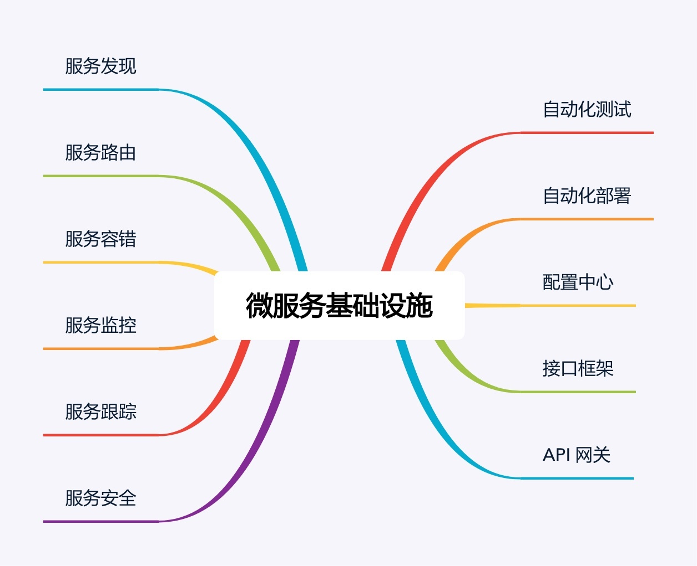

专栏上一期，我谈了实施微服务需要避免踩的陷阱，简单提炼为：

* 微服务拆分过细，过分强调“small”。

* 微服务基础设施不健全，忽略了“automated”。

* 微服务并不轻量级，规模大了后，“lightweight”不再适应。

针对这些问题，今天我们看看微服务最佳实践应该如何去做。我会分两期介绍这部分内容，今天是微服务架构最佳实践的方法篇，下一期是基础设施篇。

## 服务粒度

针对微服务拆分过细导致的问题，我建议基于团队规模进行拆分，类似贝索斯在定义团队规模时提出的“两个披萨”理论（每个团队的人数不能多到两张披萨都不够吃的地步），分享一个我认为微服务拆分粒度的“三个火枪手”原则，即一个微服务三个人负责开发。当我们在实施微服务架构时，根据团队规模来划分微服务数量，如果业务规继续发展，团队规模扩大，我们再将已有的微服务进行拆分。例如，团队最初有 6 个人，那么可以划分为 2 个微服务，随着业务的发展，业务功能越来越多，逻辑越来越复杂，团队扩展到 12 个人，那么我们可以将已有的 2 个微服务进行拆分，变成 4 个微服务。

为什么是 3 个人，不是 4 个，也不是 2 个呢？

首先，从系统规模来讲，3 个人负责开发一个系统，系统的复杂度刚好达到每个人都能全面理解整个系统，又能够进行分工的粒度；如果是 2 个人开发一个系统，系统的复杂度不够，开发人员可能觉得无法体现自己的技术实力；如果是 4 个甚至更多人开发一个系统，系统复杂度又会无法让开发人员对系统的细节都了解很深。

其次，从团队管理来说，3 个人可以形成一个稳定的备份，即使 1 个人休假或者调配到其他系统，剩余 2 个人还可以支撑；如果是 2 个人，抽调 1 个后剩余的 1 个人压力很大；如果是 1 个人，这就是单点了，团队没有备份，某些情况下是很危险的，假如这个人休假了，系统出问题了怎么办？

最后，从技术提升的角度来讲，3 个人的技术小组既能够形成有效的讨论，又能够快速达成一致意见；如果是 2 个人，可能会出现互相坚持自己的意见，或者 2 个人经验都不足导致设计缺陷；如果是 1 个人，由于没有人跟他进行技术讨论，很可能陷入思维盲区导致重大问题；如果是 4 个人或者更多，可能有的参与的人员并没有认真参与，只是完成任务而已。

“三个火枪手”的原则主要应用于微服务设计和开发阶段，如果微服务经过一段时间发展后已经比较稳定，处于维护期了，无须太多的开发，那么平均 1 个人维护 1 个微服务甚至几个微服务都可以。当然考虑到人员备份问题，每个微服务最好都安排 2 个人维护，每个人都可以维护多个微服务。

## 拆分方法

基于“三个火枪手”的理论，我们可以计算出拆分后合适的服务数量，但具体怎么拆也是有技巧的，并不是快刀斩乱麻随便拆分成指定数量的微服务就可以了，也不是只能按照业务来进行拆分，而是可以根据目的的不同灵活地选取不同的拆分方式。接下来我一一介绍常见的拆分方式。

1\. 基于业务逻辑拆分

这是最常见的一种拆分方式，将系统中的业务模块按照职责范围识别出来，每个单独的业务模块拆分为一个独立的服务。

基于业务逻辑拆分虽然看起来很直观，但在实践过程中最常见的一个问题就是团队成员对于“职责范围”的理解差异很大，经常会出现争论，难以达成一致意见。例如：假设我们做一个电商系统，第一种方式是将服务划分为“商品”“交易”“用户”3 个服务，第二种方式是划分为“商品”“订单”“支付”“发货”“买家”“卖家”6 个服务，哪种方式更合理，是不是划分越细越正确？

导致这种困惑的主要根因在于从业务的角度来拆分的话，规模粗和规模细都没有问题，因为拆分基础都是业务逻辑，要判断拆分粒度，不能从业务逻辑角度，而要根据前面介绍的“三个火枪手”的原则，计算一下大概的服务数量范围，然后再确定合适的“职责范围”，否则就可能出现划分过粗或者过细的情况，而且大部分情况下会出现过细的情况。

例如：如果团队规模是 10 个人支撑业务，按照“三个火枪手”规则计算，大约需要划分为 4 个服务，那么“登录、注册、用户信息管理”都可以划到“用户服务”职责范围内；如果团队规模是 100 人支撑业务，服务数量可以达到 40 个，那么“用户登录“就是一个服务了；如果团队规模达到 1000 人支撑业务，那“用户连接管理”可能就是一个独立的服务了。

2\. 基于可扩展拆分

将系统中的业务模块按照稳定性排序，将已经成熟和改动不大的服务拆分为**稳定服务**，将经常变化和迭代的服务拆分为**变动服务**。稳定的服务粒度可以粗一些，即使逻辑上没有强关联的服务，也可以放在同一个子系统中，例如将“日志服务”和“升级服务”放在同一个子系统中；不稳定的服务粒度可以细一些，但也不要太细，始终记住要控制服务的总数量。

这样拆分主要是为了提升项目快速迭代的效率，避免在开发的时候，不小心影响了已有的成熟功能导致线上问题。

3\. 基于可靠性拆分

将系统中的业务模块按照优先级排序，将可靠性要求高的核心服务和可靠性要求低的非核心服务拆分开来，然后重点保证核心服务的高可用。具体拆分的时候，核心服务可以是一个也可以是多个，只要最终的服务数量满足“三个火枪手”的原则就可以。

这样拆分带来下面几个好处：

* 避免非核心服务故障影响核心服务

例如，日志上报一般都属于非核心服务，但是在某些场景下可能有大量的日志上报，如果系统没有拆分，那么日志上报可能导致核心服务故障；拆分后即使日志上报有问题，也不会影响核心服务。

* 核心服务高可用方案可以更简单

核心服务的功能逻辑更加简单，存储的数据可能更少，用到的组件也会更少，设计高可用方案大部分情况下要比不拆分简单很多。

* 能够降低高可用成本

将核心服务拆分出来后，核心服务占用的机器、带宽等资源比不拆分要少很多。因此，只针对核心服务做高可用方案，机器、带宽等成本比不拆分要节省较多。

4\. 基于性能拆分

基于性能拆分和基于可靠性拆分类似，将性能要求高或者性能压力大的模块拆分出来，避免性能压力大的服务影响其他服务。常见的拆分方式和具体的性能瓶颈有关，可以拆分 Web 服务、数据库、缓存等。例如电商的抢购，性能压力最大的是入口的排队功能，可以将排队功能独立为一个服务。

以上几种拆分方式不是多选一，而是可以根据实际情况自由排列组合，例如可以基于可靠性拆分出服务 A，基于性能拆分出服务 B，基于可扩展拆分出 C/D/F 三个服务，加上原有的服务 X，最后总共拆分出 6 个服务（A/B/C/D/F/X）。

## 基础设施

大部分人主要关注的是微服务的“small”和“lightweight”特性，但实际上真正决定微服务成败的，恰恰是那个被大部分人都忽略的“automated”。为何这样说呢？因为服务粒度即使划分不合理，实际落地后如果团队遇到麻烦，自然会想到拆服务或者合服务；如果“automated”相关的基础设施不健全，那微服务就是焦油坑，让研发、测试、运维陷入我上一期讲的各种微服务陷阱中。

微服务基础设施如下图所示：

看到上面这张图，相信很多人都会倒吸一口凉气，说好的微服务的“轻量级”呢？都这么多基础设施还好意思说自己是“轻量级”，感觉比 ESB 还要复杂啊？

确实如此，微服务并不是很多人认为的那样又简单又轻量级。要做好微服务，这些基础设施都是必不可少的，否则微服务就会变成一个焦油坑，让业务和团队在里面不断挣扎且无法自拔。因此也可以说，微服务并没有减少复杂度，而只是将复杂度从 ESB 转移到了基础设施。你可以看到，“服务发现”“服务路由”等其实都是 ESB 的功能，只是在微服务中剥离出来成了独立的基础系统。

虽然建设完善的微服务基础设施是一项庞大的工程，但也不用太过灰心，认为自己团队小或者公司规模不大就不能实施微服务了。第一个原因是已经有开源的微服务基础设施全家桶了，例如大名鼎鼎的 Spring Cloud 项目，涵盖了服务发现、服务路由、网关、配置中心等功能；第二个原因是如果微服务的数量并不是很多的话，并不是每个基础设施都是必须的。通常情况下，我建议按照下面优先级来搭建基础设施：

1\. 服务发现、服务路由、服务容错：这是最基本的微服务基础设施。

2\. 接口框架、API 网关：主要是为了提升开发效率，接口框架是提升内部服务的开发效率，API 网关是为了提升与外部服务对接的效率。

3\. 自动化部署、自动化测试、配置中心：主要是为了提升测试和运维效率。

4\. 服务监控、服务跟踪、服务安全：主要是为了进一步提升运维效率。

以上 3 和 4 两类基础设施，其重要性会随着微服务节点数量增加而越来越重要，但在微服务节点数量较少的时候，可以通过人工的方式支撑，虽然效率不高，但也基本能够顶住。

## 小结

今天我为你讲了微服务架构实践中的三个关键点：如何把握拆分粒度、按照什么维度进行拆分、需要什么基础设施支撑，希望对你有所帮助。

这就是今天的全部内容，留一道思考题给你吧，参考文章中提到的方法，思考一下你所在的业务微服务架构是否还有可以改进和提升的空间？

欢迎你把答案写到留言区，和我一起讨论。相信经过深度思考的回答，也会让你对知识的理解更加深刻。（编辑乱入：精彩的留言有机会获得丰厚福利哦！）