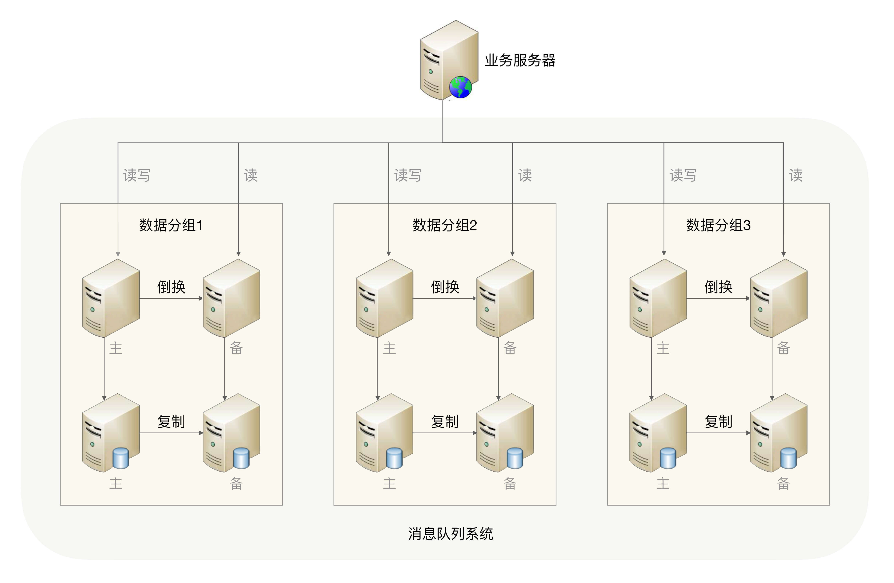

在前面的专栏里，有同学留言说想看看具体的架构设计文档。由于信息安全的原因，再加上稍微复杂的系统，设计文档都是几十页，因此专栏无法直接给出详细的文档案例。但我认为提供一个架构设计文档模板还是很有必要的，可以方便你在实际进行架构设计的时候更好地编写相关文档。我还以前面讲过的“前浪微博”消息队列为例，给出架构设计中最重要的两个文档的模板和关键说明。这个案例文档仅给出一些关键内容供你参考，部分细节无法全面覆盖或者完全保证正确。

## 备选方案模板

1\. 需求介绍

\[需求介绍主要描述需求的背景、目标、范围等\]

随着前浪微博业务的不断发展，业务上拆分的子系统越来越多，目前系统间的调用都是同步调用，由此带来几个明显的系统问题：

* 性能问题：当用户发布了一条微博后，微博发布子系统需要同步调用“统计子系统”“审核子系统”“奖励子系统”等共 8 个子系统，性能很低。

* 耦合问题：当新增一个子系统时，例如如果要增加“广告子系统”，那么广告子系统需要开发新的接口给微博发布子系统调用。

* 效率问题：每个子系统提供的接口参数和实现都有一些细微的差别，导致每次都需要重新设计接口和联调接口，开发团队和测试团队花费了许多重复工作量。

基于以上背景，我们需要引入消息队列进行系统解耦，将目前的同步调用改为异步通知。

2\. 需求分析

\[需求分析主要全方位地描述需求相关的信息\]

5W

\[5W 指 Who、When、What、Why、Where。

Who：需求利益干系人，包括开发者、使用者、购买者、决策者等。

When：需求使用时间，包括季节、时间、里程碑等。

What：需求的产出是什么，包括系统、数据、文件、开发库、平台等。

Where：需求的应用场景，包括国家、地点、环境等，例如测试平台只会在测试环境使用。

Why：需求需要解决的问题，通常和需求背景相关\]

消息队列的 5W 分析如下：

Who：消息队列系统主要是业务子系统来使用，子系统发送消息或者接收消息。

When：当子系统需要发送异步通知的时候，需要使用消息队列系统。

What：需要开发消息队列系统。

Where：开发环境、测试环境、生产环境都需要部署。

Why：消息队列系统将子系统解耦，将同步调用改为异步通知。

**1H**

\[这里的 How 不是设计方案也不是架构方案，而是关键业务流程。消息队列系统这部分内容很简单，但有的业务系统 1H 就是具体的用例了，有兴趣的同学可以尝试写写 ATM 机取款的业务流程。如果是复杂的业务系统，这部分也可以独立成“用例文档”\]

消息队列有两大核心功能：

* 业务子系统发送消息给消息队列。

* 业务子系统从消息队列获取消息。

**8C**

\[8C 指的是 8 个约束和限制，即 Constraints，包括性能 Performance、成本 Cost、时间 Time、可靠性 Reliability、安全性 Security、合规性 Compliance、技术性 Technology、兼容性 Compatibility\]

注：需求中涉及的性能、成本、可靠性等仅仅是利益关联方提出的诉求，不一定准确；如果经过分析有的约束没有必要，或成本太高、难度太大，这些约束是可以调整的。

性能：需要达到 Kafka 的性能水平。

成本：参考 XX 公司的设计方案，不超过 10 台服务器。

时间：期望 3 个月内上线第一个版本，在两个业务尝试使用。

可靠性：按照业务的要求，消息队列系统的可靠性需要达到 99.99%。

安全性：消息队列系统仅在生产环境内网使用，无需考虑网络安全；如消息中有敏感信息，消息发送方需要自行进行加密，消息队列系统本身不考虑通用的加密。

合规性：消息队列系统需要按照公司目前的 DevOps 规范进行开发。

技术性：目前团队主要研发人员是 Java，最好用 Java 开发。

兼容性：之前没有类似系统，无需考虑兼容性。

3\. 复杂度分析

\[分析需求的复杂度，复杂度常见的有高可用、高性能、可扩展等，具体分析方法请参考专栏前面的内容\]

注：文档的内容省略了分析过程，实际操作的时候每个约束和限制都要有详细的逻辑推导，避免完全拍脑袋式决策，具体请参考专栏第 10 期的分析。

**高可用**

对于微博子系统来说，如果消息丢了，导致没有审核，然后触犯了国家法律法规，则是非常严重的事情；对于等级子系统来说，如果用户达到相应等级后，系统没有给他奖品和专属服务，则 VIP 用户会很不满意，导致用户流失从而损失收入，虽然也比较关键，但没有审核子系统丢消息那么严重。

综合来看，消息队列需要高可用性，包括消息写入、消息存储、消息读取都需要保证高可用性。

**高性能**

前浪微博系统用户每天发送 1000 万条微博，那么微博子系统一天会产生 1000 万条消息，平均一条消息有 10 个子系统读取，那么其他子系统读取的消息大约是 1 亿次。将数据按照秒来计算，一天内平均每秒写入消息数为 115 条，每秒读取的消息数是 1150 条；再考虑系统的读写并不是完全平均的，设计的目标应该以峰值来计算。峰值一般取平均值的 3 倍，那么消息队列系统的 TPS 是 345，QPS 是 3450，考虑一定的性能余量。由于现在的基数较低，为了预留一定的系统容量应对后续业务的发展，我们将设计目标设定为峰值的 4 倍，因此最终的性能要求是：TPS 为 1380，QPS 为 13800。TPS 为 1380 并不高，但 QPS 为 13800 已经比较高了，因此高性能读取是复杂度之一。

**可扩展**

消息队列的功能很明确，基本无须扩展，因此可扩展性不是这个消息队列的关键复杂度。

4\. 备选方案

\[备选方案设计，至少 3 个备选方案，每个备选方案需要描述关键的实现，无须描述具体的实现细节。此处省略具体方案描述，详细请参考[专栏第 11 期](https://time.geekbang.org/column/article/7800)\]

**备选方案 1：直接引入开源 Kafka**

\[此处省略方案描述\]

**备选方案 2：集群 + MySQL 存储**

\[此处省略方案描述\]

**备选方案 3：集群 + 自研存储**

\[此处省略方案描述\]

5\. 备选方案评估

\[备选方案 360 度环评，详细请参考专栏第 12 期。注意备选方案评估的内容会根据评估会议的结果进行修改，也就是说架构师首先给出自己的备选方案评估，然后举行备选方案评估会议，再根据会议结论修改备选方案文档\]

## 架构设计模板

\[备选方案评估后会选择一个方案落地实施，架构设计文档就是用来详细描述细化方案的\]

1\. 总体方案

\[总体方案需要从整体上描述方案的结构，其核心内容就是架构图，以及针对架构图的描述，包括模块或者子系统的职责描述、核心流程\]

2\. 架构总览

\[架构总览给出架构图以及架构的描述\]

架构关键设计点：

* 采用数据分散集群的架构，集群中的服务器进行分组，每个分组存储一部分消息数据。

* 每个分组包含一台主 MySQL 和一台备 MySQL，分组内主备数据复制，分组间数据不同步。

* 正常情况下，分组内的主服务器对外提供消息写入和消息读取服务，备服务器不对外提供服务；主服务器宕机的情况下，备服务器对外提供消息读取的服务。

* 客户端采取轮询的策略写入和读取消息。

3\. 核心流程

* 消息发送流程

\[此处省略流程描述\]

* 消息读取流程

\[此处省略流程描述\]

4\. 详细设计

\[详细设计需要描述具体的实现细节\]

**高可用设计**

* 消息发送可靠性

业务服务器中嵌入消息队列系统提供的 SDK，SDK 支持轮询发送消息，当某个分组的主服务器无法发送消息时，SDK 挑选下一个分组主服务器重发消息，依次尝试所有主服务器直到发送成功；如果全部主服务器都无法发送，SDK 可以缓存消息，也可以直接丢弃消息，具体策略可以在启动 SDK 的时候通过配置指定。

如果 SDK 缓存了一些消息未发送，此时恰好业务服务器又重启，则所有缓存的消息将永久丢失，这种情况 SDK 不做处理，业务方需要针对某些非常关键的消息自己实现永久存储的功能。

* 消息存储可靠性

消息存储在 MySQL 中，每个分组有一主一备两台 MySQL 服务器，MySQL 服务器之间复制消息以保证消息存储高可用。如果主备间出现复制延迟，恰好此时 MySQL 主服务器宕机导致数据无法恢复，则部分消息会永久丢失，这种情况不做针对性设计，DBA 需要对主备间的复制延迟进行监控，当复制延迟超过 30 秒的时候需要及时告警并进行处理。

* 消息读取可靠性

每个分组有一主一备两台服务器，主服务器支持发送和读取消息，备服务器只支持读取消息，当主服务器正常的时候备服务器不对外提供服务，只有备服务器判断主服务器故障的时候才对外提供消息读取服务。

主备服务器的角色和分组信息通过配置指定，通过 ZooKeeper 进行状态判断和决策。主备服务器启动的时候分别连接到 ZooKeeper，在 /MQ/Server/\[group\]目录下建立 EPHEMERAL 节点，假设分组名称为 group1，则主服务器节点为 /MQ/Server/group1/master，备服务器的节点为 /MQ/Server/group1/slave。节点的超时时间可以配置，默认为 10 秒。

**高性能设计**

\[此处省略具体设计\]

**可扩展设计**

\[此处省略具体设计。如果方案不涉及，可以简单写上“无”，表示设计者有考虑但不需要设计；否则如果完全不写的话，方案评审的时候可能会被认为是遗漏了设计点\]

无

**安全设计**

消息队列系统需要提供权限控制功能，权限控制包括两部分：身份识别和队列权限控制。

* 身份识别

消息队列系统给业务子系统分配身份标识和接入 key，SDK 首先需要建立连接并进行身份校验，消息队列服务器会中断校验不通过的连接。因此，任何业务子系统如果想接入消息队列系统，都必须首先申请身份标识和接入 key，通过这种方式来防止恶意系统任意接入。

* 队列权限

某些队列信息可能比较敏感，只允许部分子系统发送或者读取，消息队列系统将队列权限保存在配置文件中，当收到发送或者读取消息的请求时，首先需要根据业务子系统的身份标识以及配置的权限信息来判断业务子系统是否有权限，如果没有权限则拒绝服务。

**其他设计**

\[其他设计包括上述以外的其他设计考虑点，例如指定开发语言、符合公司的某些标准等，如果篇幅较长，也可以独立进行描述\]

* 消息队列系统需要接入公司已有的运维平台，通过运维平台发布和部署。

* 消息队列系统需要输出日志给公司已有的监控平台，通过监控平台监控消息队列系统的健康状态，包括发送消息的数量、发送消息的大小、积压消息的数量等，详细监控指标在后续设计方案中列出。

**部署方案**

\[部署方案主要包括硬件要求、服务器部署方式、组网方式等\]

消息队列系统的服务器和数据库服务器采取混布的方式部署，即：一台服务器上，部署同一分组的主服务器和主 MySQL，或者备服务器和备 MySQL。因为消息队列服务器主要是 CPU 密集型，而 MySQL 是磁盘密集型的，所以两者混布互相影响的几率不大。

硬件的基本要求：32 核 48G 内存 512G SSD 硬盘，考虑到消息队列系统动态扩容的需求不高，且对性能要求较高，因此需要使用物理服务器，不采用虚拟机。

5\. 架构演进规划

\[通常情况下，规划和设计的需求比较完善，但如果一次性全部做完，项目周期可能会很长，因此可以采取分阶段实施，即：第一期做什么、第二期做什么，以此类推\]

整个消息队列系统分三期实现：

第一期：实现消息发送、权限控制功能，预计时间 3 个月。

第二期：实现消息读取功能，预计时间 1 个月。

第三期：实现主备基于 ZooKeeper 切换的功能，预计时间 2 周。