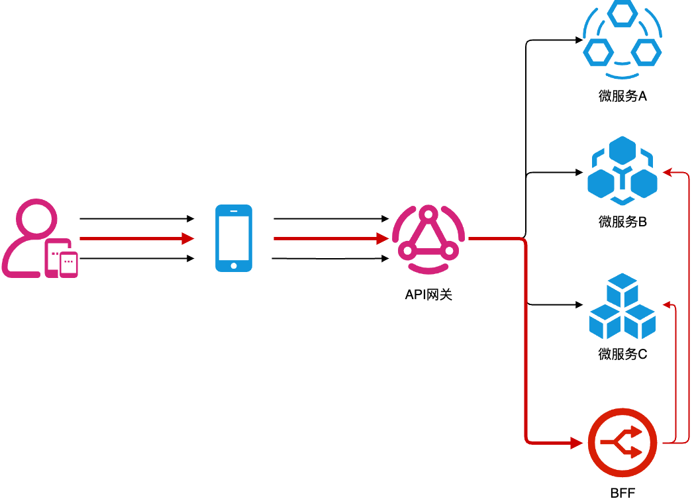
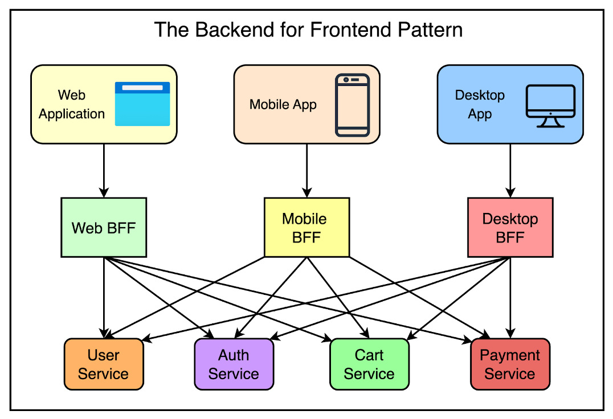
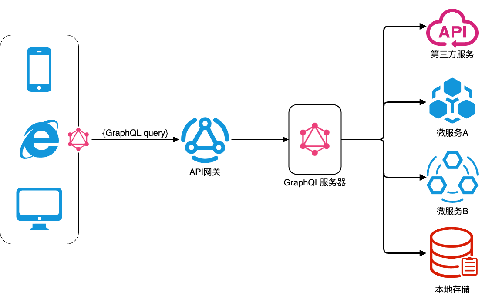
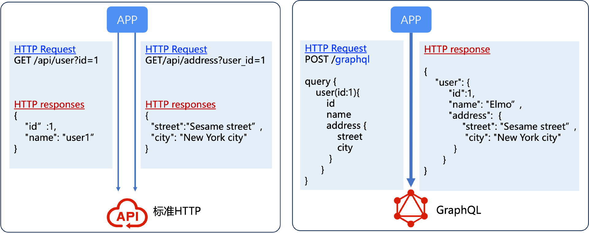

你好，我是华仔。

很高兴能通过这次课程迭代计划，继续与你一同提升架构设计能力。我将通过多篇加餐对大家感兴趣的问题进行补充和深入，同时融入我近期的思考，希望能对你有所帮助。

专栏中我们讲解了微服务架构设计的最佳实践，包括微服务拆分的技巧，以及需要配置哪些基础设施。按照这两类最佳实践去落地微服务架构，我们可以让微服务架构发挥最大的价值，避免掉入微服务架构设计不合理导致的陷阱。

但是微服务架构设计并不是简单的一拆了之，将单体或者 SOA 类系统拆分为微服务后也会带来一些新的**技术挑战**。当粗粒度的单体或者 SOA 系统拆分为细粒度的微服务后，原来一些常用做法在微服务架构里面已经不能用了，需要采用新的手段来实现。这些技术挑战本质上和**微服务架构的特点**有关。

微服务架构的特点可以总结为“**两个分布式**”：

* 服务分布式：原本由单体或者 SOA 系统提供的功能，现在由多个微服务来提供，不同微服务提供不同的功能。

* 数据分布式：原本由大一统的存储系统（主要是关系数据库 RDBMS）存储的数据，现在分散存储在多个独立的存储系统上，不同微服务可以根据数据特性，采用不同的存储系统。

接下来，我将用两篇加餐来详细讲讲这两个分布式带来的技术挑战以及常用的应对技巧。这一篇我们先关注“服务分布式”带来的挑战以及其应对技巧，也就是微服务接口类设计技巧，包括 **BFF 和 GraphQL 以及接口循环调用如何应对**。

## BFF（Backend For Frontend）

服务分布式带来的第一个挑战，就是前端（广义上的前端，含 App/H5/ 桌面客户端等，下同）原来可能只需要一个接口请求就能完成的功能，现在需要多次请求多个微服务不同的接口，尤其是一些复杂的页面，需要请求的后端接口会更多。这就导致了几个典型问题的出现。

第一个是请求性能问题。这里的性能问题其实不是单个微服务接口处理的性能，而是前端和服务端来回请求的网络消耗。当一个页面需要请求多个接口获取后端数据的时候，即便能够并行发送多个请求，由于网络尤其是移动端网络的不稳定性，如果其中一个或几个请求访问慢的话，整个页面就可能会加载缓慢，从而影响用户体验。

第二个是网络带宽问题。虽然单个微服务接口请求的数据可能不大，但是由于网络传输协议本身也需要占用不少字节空间（例如 HTTP 请求 header），大量的小请求会导致机房入口带宽大大增加，从而增加企业网络带宽成本。

第三个是前端开发成本问题。前端需要理解和对接多个后端微服务，开发工作量、联调工作量都会增加不少。尤其是后端微服务经过演变，提供了多个版本接口时，多版本接口的选择和适配会给前端开发人员带来较大的理解和开发负担。

### 什么是 BFF？

BFF 技术就是应对上述挑战的接口技术方案，全称是 Backend For Frontend，中文一般翻译为“前端专属后端”或“服务前端的后端”。它是一种为前端专门设计的后端服务，位于前端和后端微服务之间，充当中间层的角色。其主要功能是将后端多个微服务提供的数据进行整合、转换和适配。其基本架构模式如下：

结合上图，接口访问基本逻辑如下：

* 当用户访问一个普通不复杂的页面时（图中黑色窄箭头），前端发起普通的微服务接口请求，API 网关收到请求后直接转发给对应的微服务即可；

* 当用户访问一个复杂页面时（图中红色粗体箭头），前端发起聚合接口请求，API 网关收到请求后转发给 BFF 服务，BFF 服务再分别请求多个微服务然后组装结果返回给前端。

看完上面的 BFF 架构图和逻辑，细心的同学可能会有一个疑惑：是否可以在 API 网关做接口聚合呢？

理论上确实可以，但是现实中千万别这么做。API 网关作为一个和业务无关的网络基础设施，对稳定性和可靠性要求很高，一旦出故障就是整个业务系统全部故障，因此应该尽量避免改动。而 BFF 和业务相关，会经常随着业务版本开发而迭代，本质上与 API 网关的定位和要求是冲突的。

### BFF 应用场景

BFF 在实践中主要有 3 个应用场景，我们分别来看。

首先是**接口聚合**，这是 BFF 最常见的应用场景。由微服务提供原子接口，BFF 根据不同前端页面的具体需求来设计接口，由 BFF 来完成多个微服务接口的访问、转换、合并和裁剪，然后对前端提供聚合接口，使得前端可以直接使用最优化的数据结构，减少前端与多个后端系统的交互次数，提高接口访问效率，从而提升用户体验。

其次是**多端适配**。不同的前端展示层可能有不同的需求，BFF 可以为每类前端提供量身定制的服务接口，以满足各自的特点和限制。基本结构如下：

最后是**接口兼容**。在微服务架构中，后端服务不断迭代和更新会导致接口版本的变化，BFF 可以隔离这种变化。当后端引入新的 API 版本时，BFF 可以帮助实现平滑过渡或者新旧接口转换。

例如，BFF 可以在一段时间内同时支持旧版和新版 API，允许前端逐步迁移。这为前端团队提供了灵活性，使他们能够在不影响用户体验的情况下完成代码更新。

既然 BFF 有这么多的优势，那它该如何落地？落地时又会遇到哪些困难呢？

### BFF 落地经验

BFF 落地时面临的第一个疑惑，就是**到底是前端还是后端来负责开发 BFF，用什么技术来开发 BFF 服务**。产生这个疑惑的原因在于 BFF 服务名义上是一个后端服务，但本质上又是为了前端的价值（性能、多版本和接口兼容）而设计的。

目前行业有两种比较流行的做法，不同的做法有各自的优缺点，适合不同团队和业务，我们分别来看。

第一种是**前端负责 BFF 开发**。由前端团队负责 BFF，一般基于 Node.js 开发。这样做的第一个好处是前端自己设计页面，最清楚自己需要什么样的聚合接口，并且能够灵活定制，不依赖后端就可以独自迭代。

第二个好处是 Node.js 开发语言和前端都是 JavaScript，前端开发人员一个技术栈就可以完成前端和 BFF 的开发，大大减少沟通交流的成本。

但是这种做法有两个主要的不足之处。一是前端开发人员还是要熟悉复杂的后端微服务架构和细粒度的微服务接口。如果 BFF 服务涉及存储或缓存的处理，前端开发人员可能并不具备丰富的经验。

二是 BFF 服务和后端其它微服务技术栈不同（后端主流技术栈是 Java、.Net、PHP、Golang 和 Python)，会带来维护、监控和部署方面的麻烦。因为一般情况下，公司的 DevOps 基础设施基本都和语言强相关。

因此，这种做法比较适合业务不是很复杂，团队规模不是很大，BFF 做的比较轻量级，主要做接口聚合的场景。

接下来我们再来看**后端负责 BFF 开发**，也就是由后端团队负责 BFF，直接用后端的开发语言和技术栈来实现。

这种做法的优缺点基本和上一种做法反过来。

首先，好处有两个。一是后端开发人员对后端微服务更熟悉，对后端技术也有更丰富的经验。BFF 本身的开发更高效，也可以开发复杂的 BFF 服务（例如支持缓存等）。二是 BFF 服务的开发、维护、监控和部署都可以重用后端微服务已有的基础设施，无需单独用不同的方法和手段。

其次，这种做法的主要不足是会增加前后端的沟通成本，后端开发人员不再单纯从自己微服务角度出发来设计接口，而要去理解复杂多变的前端接口需求。

因此，这种做法比较适合业务比较复杂，团队规模较大，BFF 做的比较重量级，需要提供多端适配，以及高并发用户访问的场景。

第一个疑惑我们已经搞清楚了，再来看第二个疑惑，也就是**什么时候用 BFF 来提供接口，什么时候直接访问微服务**。

有的人认为最简单的规则就是每个前端页面都提供一个 BFF 接口，但实践中不推荐这么做，因为开发成本太高了。大部分页面其实都比较简单，并且用户访问量也不大，投入这么大的开发成本去单独开发 BFF 接口，其实收益不大。

业界比较成熟的做法是针对访问量大且复杂的页面，由 BFF 来提供聚合接口或者多端适配接口，普通的页面就直接访问微服务即可。一般来说，一级页面和二级页面（首页和导航页）大概率比较适合用 BFF 来提供聚合接口。

如果不确定是否要用 BFF 来提供聚合接口，也可以采取先上线业务，然后根据上线后的监控数据（访问量、加载时间等）来判断的方式，以此提升用户体验。

## GraphQL

GraphQL 是用于 API 的查询语言规范，由 Facebook 开发并在 2015 年开源。GraphQL 允许客户端指定确切需要的数据，从而减少了过量数据的传输，并且可以一次性从多个数据源获取数据。其基本架构如下：

结合上图，GraphQL 的基本原理如下：

1\. 客户端发送一个 **GraphQL 查询**（Query）或者变更（Mutation）请求给 GraphQL 服务器。查询用于获取数据，变更用于修改数据。例如，在一个博客应用中，客户端可以发送一个查询请求来获取特定作者的所有文章标题和内容。

2\. GraphQL 服务器根据请求的类型（查询或变更）和具体内容，解析请求并从数据源中获取相应的数据。数据源可以是本地存储系统、NoSQL 存储系统、其它微服务和第三方服务。

3\. GraphQL 服务器将获取到的数据按照 GraphQL 的格式进行包装，然后返回给客户端。返回的数据结构和客户端请求的结构对应，这样客户端就能方便地使用这些数据。

我们对比一下标准的 HTTP 接口访问和 GraphQL 的访问方式，如下图：

可以看到，标准的 HTTP 接口访问模式是多次调用不同的后端 API 获取前端需要的数据片段，而 GrpahQL 客户端发送的 HTTP 请求中，查询字符串中包含了所有需要获取的数据的具体描述，一次接口访问就获取了所有需要的数据。通过这种方式来减少前端访问后端的次数，从而提升整体性能和用户体验。

从 GrapQL 的原理来看，GraphQL 技术和 BFF 很像，但其实它们本质上是不同的技术：GraphQL 是一种 API 接口规范，而 BFF 是一种 API 接口架构。我们可以在 API 网关中实现 GraphQL 规范，也可以在专属的 GraphQL 服务中实现 GraphQL 规范，也可以在 BFF 中实现 GraphQL 规范。通常情况下，在 BFF 中实现 GraphQL 规范是最佳的选择，可以说 GraphQL 是 BFF 的黄金搭档。

## 接口循环调用

接口循环调用是指在业务系统中，某个接口（可以是 API 接口、服务接口等）在执行过程中，直接或间接地调用自身，形成一个无限的循环调用链，从而导致 2 个典型问题的出现。

* 大量的资源消耗：出现接口循环调用的问题后，包括 CPU 时间、内存和网络带宽等硬件资源的消耗会呈指数级增长，最终可能导致系统性能下降甚至崩溃。

* 死锁：如果接口循环调用涉及对共享资源（如数据库锁、文件锁等）的获取和释放，可能会导致死锁。

当系统拆分成多个微服务后，由于微服务之间的调用关系链复杂，接口循环调用的问题更加隐蔽，而一旦出现，影响也更大，定位和处理更复杂。

目前业界采取的都是一些预防措施，并没有针对接口循环调用的根治方案，并且这些预防措施也都效果不佳。常见的预防措施有 2 个。

第一个是**梳理调用链**。通过人工梳理接口之间的依赖关系，绘制接口调用关系图，期望能够发现可能存在的循环调用。

这个方法在实践中效率很低，效果几乎没有。首要原因是当业务变得复杂后，微服务数量多了后，因为线上真实的调用关系非常复杂，人工梳理的接口调用流程只是核心的处理步骤，无法覆盖到所有的接口调用。

我曾经看过一个基于线上日志分析出来的业务处理调用链路图，一次业务处理涉及内部近 100 次接口请求。我拿着这张图找不同团队的人请教，没人能够完整讲清楚这么多调用是怎么回事，甚至对自己负责的几个微服务，中间有些接口请求也只有特别去看代码才能知道是什么回事。

其次，接口循环调用并不会在正常的处理逻辑里面必然出现（这种问题测试很容易就发现），而在一些特殊的分支里面才会触发。不要说事前分析基本不可能，就算是线上发生了接口循环调用的问题，再去定位问题都要花费相当长的时间。

第二个预防措施是**请求唯一标识**。在接口调用过程中，为每个调用设置一个唯一标识或者状态标记。在每次调用之前，检查这个标识或者标记，以确定是否已经进入了循环调用。例如，在一个分布式系统中，每个接口调用可以带有一个全局唯一的请求 ID，当一个接口发现即将调用的目标接口已经带有相同的请求 ID 时，就知道可能出现了循环调用，从而停止调用。

这个方法最大的问题是对接口请求性能产生了严重的影响，需要将一段时间内发出的请求 ID 和状态都保存下来，并且每次接口调用都要先检查是否已经调用过了，而实际上可能 99.999% 的接口请求都不会触发接口循环调用。

因此，接口循环调用基本都是事后处理，简单来说就是等线上真的出问题后才进行分析和优化。

## 小结

这一节课，我们讲解了微服务架构接口类的技巧。其中，BFF 主要用于接口聚合、多端适配、接口兼容等场景。BFF 落地的时候，需要根据业务和团队的情况来选择“前端开发 BFF”还是“后端开发 BFF”。BFF 的黄金搭档是 GraphQL，它是一种查询规范，通过发出聚合的接口请求一次性获取多个数据。最后，接口循环调用虽然会带来一些严重问题，但目前尚无有效的根治方案，建议按照问题驱动的方式去处理。

## 思考题

以上就是今天的全部内容，最后留一道思考题给你吧：为什么在 BFF 中提供聚合接口，而不在某个业务微服务中提供聚合接口？

欢迎你把答案写到留言区，和我一起讨论。相信经过深度思考的回答，也会让你对知识的理解更加深刻。