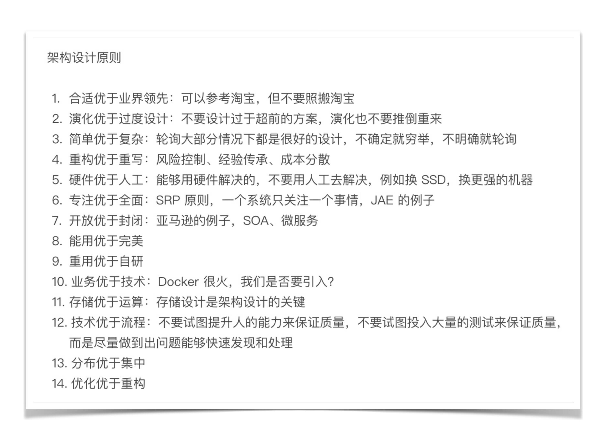

各位同学，晚上好，我是架构专栏的编辑 Shawn。今天又到周五啦，没错，我又出来送福利了\[捂脸\]。

[“华仔，放学别走”第 1 期](https://time.geekbang.org/column/article/7647)不知道你看了没有，华仔回答了关于知识分享、理论与实践、专栏学习方法、推荐的参考书等几个问题，希望你从中能够有所收获。今天是“华仔，放学别走”第 2 期，继续回答你所关注的问题，然后展示出 08 ~ 13 期被选中的精选留言，并给留言被选中的同学送出价值 68 元的专栏阅码。话不多说，开始今天的问答环节。

Shawn：有做公司架构 / 网站架构 /App 架构的同学，这个专栏能帮助到他们吗？

华仔：有的同学在学习了一段时间后跟我留言交流，说感觉专栏的内容好像比较适合做互联网后台架构，不太适合企业应用、客户端这类系统。其实这是一个误解，我之所以在前面花费很大篇幅来讲架构设计的目的、架构设计原则、架构设计流程等看起来比较偏理论的内容，而没有一上来就讲异地多活、高性能架构之类的怎么做，原因就在于**这是一套完整的架构设计理论体系**，不管是企业应用，还是客户端应用，都可以按照这个设计理论体系去操作。我以手机 App 为例，首先，我们分析一下 App 的复杂度主要来源是什么？通常情况下，App 的主要复杂度就是可扩展，因为要不断地开发新的需求；高性能和高可用也涉及，高性能主要和用户体验有关；高可用主要是减少崩溃。其次，再看 App 的架构需要遵循架构设计原则么？答案是肯定需要。刚开始为了业务快速开发，可能用“原生 +H5”混合架构；后来业务发展，功能更复杂了，H5 可能难以满足体验，架构又需要演进到“纯原生”；如果业务再发展，规模太庞大，则架构又可能需要演进到“组件化、容器化”。以上通过手机 App 的为例说明这套架构设计理论是通用的，有兴趣的同学可以按照这种方式分析一下企业应用，会发现这套理论也是适应的。

Shawn：讲讲你总结“架构设计三原则”的过程吧？

华仔：“架构设计三原则”是综合各方面的信息和思考得来的。首先是我自己的经验，包括成功的经验和失败的教训；其次是分析了很多业界的架构演讲和技术发展历史；第三是看了一些关于技术本质的书籍而受到的启发，例如《技术的本质》《系统之美》等。其实最初整理的架构设计原则有 10 多条，但我觉得 10 多条太多了，不聚焦也不利于理解，因此去芜存菁，最终得到了“架构设计三原则”，这三个原则是最重要也是最核心的。

如下是我原来整理的设计原则，可以看到一共有 14 条：

Shawn：“PPT 架构师”的口头禅是“细节不讨论”，一个优秀的架构师，需要对细节有多少考虑呢？

华仔：这是一个非常好的问题，也是很多同学困惑的问题，我分享一下我的做法，以我学习 Elasticsearch 为例，具体的做法是：

1\. 搭建一个单机伪集群，搭建完成后看看安装路径下的文件和目录，看看配置文件有哪些配置项，不同的配置项会有什么样的影响。

2\. 执行常用的操作，例如创建索引，插入、删除、查询文档，查看一下各种输出。

3\. 研究其**基本原理**，例如索引、分片、副本等，研究的时候要多思考，例如索引应该如何建，分片数量和副本数量对系统有什么影响等。

4\. 和其他类似系统对比，例如 Solr、Sphinx，研究其**优点、缺点、适用场景**。

5\. 模拟一个案例看看怎么应用。例如，假设我用 Elasticsearch 来存储淘宝的商品信息，我应该如何设计索引和分片。

6\. 查看业界使用的案例，思考一下别人为何这么用；看看别人测试的结果，大概了解性能范围。

7\. 如果某部分特别有兴趣或者很关键，可能去看源码，例如 Elasticsearch 的选举算法（我目前还没看 ^\_^）。

8\. 这样一套组合拳下来，基本上能够满足在架构设计时进行选型判断，而且花费的时间也不多。我并不建议拿到一个系统一开始就去读源码，效率太低，而且效果也不好。

Shawn：谈谈架构师沟通能力的重要性吧？

华仔：架构师是业务和技术之间的桥梁，同时通常情况下还会确定整体项目的步骤。因此，架构师的沟通能力非常重要，既要说得动老板，让老板支持自己的设计决定；又要镇得住技术人员，让技术人员信服自己的设计选择；同时还要能够理解业务，结合业务不同发展阶段设计合适的架构，所以也要参与产品和项目决策。由于架构设计过程中存在很多判断和选择，而且不一定都有明确量化的标准，因此不同的人有不同的看法是普遍情况。这种情况下架构师既需要专业能力过硬，又需要具备良好的沟通技巧，才能促使业务、项目、技术三方达成一致。

当然，**架构师的核心能力还是技术能力，过硬的技术才是良好沟通的基础**，否则单纯靠沟通技巧甚至花言巧语，一次两次可能奏效，但后面被打脸打多了，也就没人信任了。

Shawn：有同学留言说，给企业做项目，甲方会不顾业务需要，只要是业界流行的技术就要求在项目中采用，这种情况下怎样才能符合“架构设计三原则”？

华仔：首先，业务第一，先把订单签下来，才有后面的架构设计，如果硬要说甲方的要求不合理，不满足“架构设计三原则”，结果订单都拿不到，那是没有意义的。其次，这种情况我把它归为“架构约束”，即这不是架构师能够选择的，而是架构师必须遵守的，因此这里不需要使用“架构设计三原则”来判断。第三，这种情况下，架构师还是可以应用“架构设计三原则”来指导架构设计，比如说客户要求采用 Docker，Docker 的网络模式有 5 种，host 模式使用起来比 bridge 模式简单，那我们就用 host 模式；如果客户再要求需要对 Docker 进行统一管理，那我们是自己研发 Docker 管理平台，还是直接用 Kubernetes 呢？按照简单原则来说，肯定用 Kubernetes 了。

通过这个示例也可以看出，“架构设计三原则”主要是指架构师在选择和判断时采取的指导原则；但如果是架构的基本需求或者约束必须被满足时，架构师此时的选择是采取什么样的方案能够更好的满足这些需求和约束。