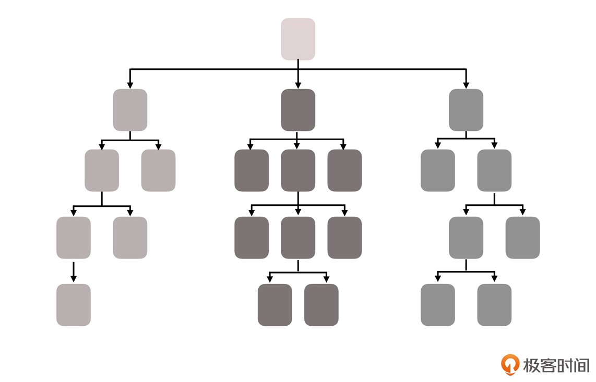

你好，我是周志明。

SOA 架构是第一次被广泛使用过的、通过分布式服务来构建信息系统的工程实践。它有完善的理论和工具，可以说，它解决了分布式系统中，几乎所有主要的技术问题。

但遗憾的是，虽然 SOA 架构曾经被视为更大规模的软件发展的方向，但它最终还是没能成为一种普适的软件架构。

所以今天，我们就来探索一下 SOA 架构，一起来找找，它没能成为普适的软件架构的原因。通过这一讲，你能从中体会到 SOA 的设计思想与原则，理解它为什么不能成功。

## 三种代表性的服务拆分架构模式

在上一讲，我曾经提到过，为了对大型的单体系统进行拆分，让每一个子系统都能独立地部署、运行、更新，开发者们尝试了很多种方案。

所以，在介绍 SOA 架构模式之前，我还要先带你学习三种比较有代表性的服务拆分的架构模式。这些架构是 SOA 演化过程的中间产物，你也可以理解为，它们是 SOA 架构出现的必要前提。

### 烟囱式架构（Information Silo Architecture）

第一种架构模式是[烟囱式架构](https://en.wikipedia.org/wiki/Information_silo)。

信息烟囱也被叫做信息孤岛（Information Island），使用这种架构的系统呢，也被称为孤岛式信息系统或者烟囱式信息系统。这种信息系统，完全不会跟其他相关的信息系统之间进行互操作，或者是进行协调工作。

那你就会发现，这样的系统其实并没有什么“架构设计”可言。你还记不记得，我在上一讲中举的那个“企业与部门”的例子？如果两个部门真的完全不会发生任何交互，那我们就并没有什么理由，一定要强迫他们必须在一栋楼里办公。

所以，两个不发生交互的信息系统，让它们使用独立的数据库、服务器，就可以完成拆分了。

而唯一的问题，也是这个架构模式的致命问题，那就是：**企业中真的存在完全不发生交互的部门吗？**

烟囱式架构模式示意图

对于两个信息系统来说，哪怕真的毫无业务往来关系，但系统的人员、组织、权限等主数据，会是完全独立、没有任何重叠的吗？这样“独立拆分”“老死不相往来”的系统，显然不可能是企业所希望见到的。

### 微内核架构（Microkernel Architecture）

第二种是[微内核架构](https://en.wikipedia.org/wiki/Microkernel)，它也被称为插件式架构（Plug-in Architecture）。

既然在烟囱式架构中，我们说两个没有业务往来关系的系统，也可能需要共享人员、组织、权限等一些公共的主数据，那就不妨把这些主数据，连同其他可能被各个子系统使用到的公共服务、数据、资源，都集中到一块，成为一个被所有业务系统共同依赖的**核心系统**（Kernel，也称为 Core System）。

这样的话，具体的业务系统就能以**插件模块**（Plug-in Modules）的形式存在了，就可以为整个系统提供可扩展的、灵活的、天然隔离的功能特性。

微内核架构模式示意图

（来自 O'Reilly 的开放文档《[Software Architecture Patterns](https://www.oreilly.com/programming/free/files/software-architecture-patterns.pdf)》）

以更高层次的抽象程度来看，任何计算机系统都是由各种架构的软件互相配合来实现各种功能的，这一讲我介绍的各种架构模式，一般都可以看作是整个系统的一种插件。对于产品型应用程序来说，如果我们想将新特性或者功能及时加入系统，微内核架构会是一个不错的选择。

微内核架构也可以嵌入到其它架构模式之中，通过插件的方式，来提供逐步演化的功能和增量开发。所以，如果你准备实现一个能够支持二次开发的软件系统，微内核就是一种良好的架构模式。

不过，微内核架构也有它的局限和使用前提，它会假设系统中各个插件模块之间是互不认识的（不可预知系统会安装哪些模块），这些插件会访问内核中一些公共的资源，但不会发生直接交互。

可是，无论是在企业信息系统还是在互联网，在许多场景中这一假设都不成立。比如说，你要建设一个购物网站，支付子系统和用户子系统是独立的，但当交易发生时，支付子系统可能需要从用户子系统中得到是否是 VIP、银行账号等信息，而用户子系统也可能要从支付子系统中获取交易金额等数据，来维护用户积分。

所以，我们必须找到一个办法，它既能拆分出独立的系统，也能让拆分后的子系统之间可以顺畅地互相调用通讯。

### 事件驱动架构（Event-Driven Architecture）

那么，为了能让子系统之间互相通讯，[事件驱动架构https://en.wikipedia.org/wiki/Event-driven_architecture]()就应运而生了。

**这种架构模式的运作方案是**，在子系统之间建立一套事件队列管道（Event Queues），来自系统外部的消息将以事件的形式发送到管道中，各个子系统可以从管道里获取自己感兴趣、可以处理的事件消息，也可以为事件新增或者是修改其中的附加信息，甚至还可以自己发布一些新的事件到管道队列中去。

这样一来，每一个消息的处理者都是独立的、高度解耦的，但它又能与其他处理者（如果存在该消息处理者的话）通过事件管道来进行互动。

事件驱动架构模式示意图

（来自 O'Reilly 的开放文档《[Software Architecture Patterns](https://www.oreilly.com/programming/free/files/software-architecture-patterns.pdf)》）

那么，当系统演化至事件驱动架构的时候，我在原始分布式时代这一讲的结尾中，提到的第二条通往大规模软件的路径，也就是仍然在并行发展的远程服务调用，就迎来了 SOAP 协议的诞生（我在后面第 7~10 讲分享远程服务调用的时候，还会给你详细介绍它，你到时可以再次印证一下这一讲的内容）。

此时“面向服务的架构”（Service Oriented Architecture，SOA），就已经有了登上软件架构舞台所需要的全部前置条件了。

## SOA 架构时代的探索

SOA 的概念最早是由 Gartner 公司在 1994 年提出的。当时的 SOA 还不具备发展的条件，直到 2006 年情况才有所变化，IBM、Oracle、SAP 等公司，共同成立了 OSOA 联盟（Open Service Oriented Architecture），来联合制定和推进 SOA 相关行业标准。

到 2007 年，在[结构化资讯标准促进组织](https://en.wikipedia.org/wiki/OASIS_(organization))（Organization for the Advancement of Structured Information Standards，OASIS）的倡议与支持下，OSOA 就由一个软件厂商组成的松散联盟，转变为了一个制定行业标准的国际组织。它联合 OASIS 共同新成立了[Open CSA](http://www.oasis-opencsa.org/)组织（Open Composite Services Architecture），也就是 SOA 的“官方管理机构”。

当软件架构发展至 SOA 时代的时候，其中的许多概念、思想都已经能在今天的微服务中，找到对应的身影了。比如说，服务之间的松散耦合、注册、发现、治理、隔离、编排等等，都是微服务架构中耳熟能详的概念了，也大多是在分布式服务刚被提出的时候，就已经可以预见到的困难。

所以，SOA 就针对这些问题，乃至于针对“软件开发”这件事儿本身，进行了更具体、更系统的探索。

### 更具体

“更具体”体现在，尽管 SOA 本身还是属于一种抽象概念，而不是特指某一种具体的技术，但它比单体架构和烟囱式架构、微内核架构、事件驱动架构，都要更具可操作性，细节也充实了很多。所以，我们已经不能简单地把 SOA 看作是一种架构风格了，而是可以称之为一套软件架构的基础平台了。

那，我们怎么理解“基础平台”这个概念呢？在我看来，主要是下面几个方面：

* SOA 拥有领导制定技术标准的组织 Open CSA；

* SOA 具有清晰的软件设计的指导原则，比如服务的封装性、自治、松耦合、可重用、可组合、无状态，等等；

* SOA 架构明确了采用 SOAP 作为远程调用的协议，依靠 SOAP 协议族（WSDL、UDDI 和一大票 WS-\* 协议）来完成服务的发布、发现和治理；

* SOA 架构会利用一个被称为是[企业服务总线](https://zh.wikipedia.org/zh-hans/%E4%BC%81%E4%B8%9A%E6%9C%8D%E5%8A%A1%E6%80%BB%E7%BA%BF)（Enterprise Service Bus，ESB）的消息管道，来实现各个子系统之间的通讯交互，这就让各个服务间在 ESB 的调度下，不需要相互依赖就可以实现相互通讯，既带来了服务松耦合的好处，也为以后可以进一步实现[业务流程编排](https://zh.wikipedia.org/wiki/%E4%B8%9A%E5%8A%A1%E6%B5%81%E7%A8%8B%E7%AE%A1%E7%90%86)（Business Process Management，BPM）提供了基础；

* SOA 架构使用了[服务数据对象](https://zh.wikipedia.org/wiki/%E6%9C%8D%E5%8A%A1%E6%95%B0%E6%8D%AE%E5%AF%B9%E8%B1%A1)（Service Data Object，SDO）来访问和表示数据，使用[服务组件架构](https://zh.wikipedia.org/wiki/%E6%9C%8D%E5%8A%A1%E7%BB%84%E4%BB%B6%E6%9E%B6%E6%9E%84)（Service Component Architecture，SCA）来定义服务封装的形式和服务运行的容器；

* ……

在这一整套成体系、可以互相精密协作的技术组件的支持下，我们从技术可行性的角度来评判的话，SOA 实际上就可以算是成功地解决了分布式环境下，出现的诸如服务注册、发现、隔离、治理等主要技术问题了。

### 更系统

这里我说的“更系统”，指的是 SOA 的宏大理想。因为 SOA 最根本的目标，就是希望能够总结出一套自上而下的软件研发方法论，让企业只需要跟着它的思路，就能够一揽子解决掉软件开发过程中的全套问题。比如，如何挖掘需求、如何将需求分解为业务能力、如何编排已有服务、如何开发测试部署新的功能，等等。

如果这个目标真的能够达成，那么软件开发就有可能从此迈进工业化大生产的阶段。你可以试想一下，如果有一天，你在写符合客户需求的软件时，就像写八股文一样有迹可循、有法可依，那对你来说或许很无趣，但这肯定可以大幅提升整个社会实施信息化的效率。

SOA 在 21 世纪最初的十年里，曾经盛行一时，有 IBM 等一众巨头为其摇旗呐喊，吸引了不少软件开发商，尤其是企业级软件开发商的跟随，但最终却还是偃旗息鼓，沉寂了下去。

原因也很简单，开发信息系统毕竟不是写八股文，SOA 架构过于严谨精密的流程与理论，导致了软件开发的全过程，都需要有懂得复杂概念的专业人员才能够驾驭。从 SOA 诞生的那一天起，就已经注定了它只能是少数系统的阳春白雪式的精致奢侈品：它可以实现多个异构大型系统之间的复杂集成交互，却很难作为一种具有广泛普适性的软件架构风格来推广。

我在后面第 7~10 讲介绍远程服务调用时，我还会为你介绍 Web Service 的兴起与衰落。Web Service 之所以被逐渐边缘化，最本质的原因就是过于严格的规范定义，给架构带来了过度的复杂性。

而构建在 Web Service 基础之上的 ESB、BPM、SCA、SDO 等诸多的上层建筑，就进一步加剧了这种复杂性。

**SOA 最终没有获得成功的致命伤，其实跟当年的[EJB](https://zh.wikipedia.org/wiki/EJB)（Enterprise JavaBean，企业级 JavaBean）的失败如出一辙。**

尽管在当时，EJB 有 Sun Microsystems（被甲骨文收购）和 IBM 等一众巨头在背后力挺，希望能把它发展成一套面向信息系统的编程范式，但它仍然被以 Spring、Hibernate 为代表的“草根框架”给打败了。可见，任何事物一旦脱离了人民群众，最终都会淹没在群众的海洋之中，就连信息技术也不曾例外过。

最后，当你读到这一段的时候，你不妨再重新思考下我们这一讲的开头提到的，“如何使用多个独立的分布式服务共同构建一个更大型系统”这个问题，再回顾下“原始分布式时代”这一讲中，Unix DCE 提出的分布式服务的主旨：“让开发人员不必关心服务是远程还是本地，都能够透明地调用服务或者访问资源”。

经过了三十年的技术发展，信息系统经历了巨石、烟囱、微内核、事件驱动、SOA 等架构模式，应用受架构复杂度的牵绊却是越来越大，距离“透明”二字已经越来越远了。这是否算不自觉间忘记了当年的初心呢？

接下来我们要探索的微服务时代，似乎正是带着这样自省式的问句而开启的。

## 小结

这一讲，我带你学习了解了 SOA 架构，重点了解了从原始分布式架构、单体架构演进到 SOA 架构这段过程中的一些中间产物，如烟囱式架构、微内核架构、事件驱动架构等。

另外，我之所以带你解构 SOA 架构，就是要帮助你弄清楚它成功的部分，比如它是如何提出了哪些技术、解决问题的方法论是什么，它是如何看待分布式、乃至是如何看待软件开发的；你也要弄清楚它失败的部分，要清楚为什么 SOA 在众多软件业巨头的推动下，仍然没能成为软件开发者所普遍接受的普适的软件开发方法。这是你了解和掌握推动架构时代演进原因的重要方式。

## 一课一思

你是否使用过 SOA 的方法论来开发软件系统呢？无论有还是没有，作为一个软件开发者，你是否愿意软件开发向着工业化方向发展，让软件类似工业产品制造那样，可以在规范、理论、工具、技术的支持下，以流水线的方式生产出来？

欢迎在留言区分享你的见解。如果你身边的朋友，也对 SOA 架构的成功与失败感兴趣，希望你能把今天的内容分享给 TA。