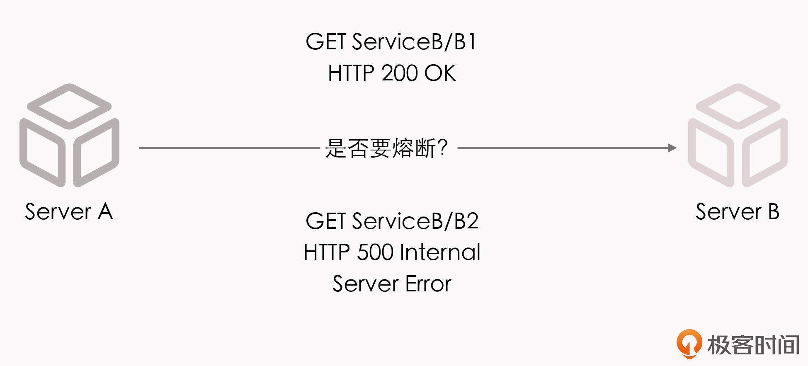

你好，我是周志明。今天，我们一起来探索后微服务时代。

在开始探讨这一讲的主题之前呢，我想先跟你讨论一个问题。我们都知道，在微服务架构中，会面临一些必须解决的问题，比如注册发现、跟踪治理、负载均衡、传输通讯等。但这些问题，其实在 SOA 时代甚至可以说自原始分布式时代，就一直存在了。既然只要是分布式系统，就没办法完全避免这些问题，那我们就回过头来想一下：这些问题一定要由分布式系统自己来解决吗？

既然这样，那我们就先不去纠结到底是用微服务还是什么别的架构，直接看看面对这些问题，现在最常见的解决方法是怎样的：

* 如果某个系统需要**伸缩扩容**，我们通常会购买新的服务器，多部署几套副本实例来分担压力；

* 如果某个系统需要解决**负载均衡**的问题，我们通常会布置负载均衡器，并选择恰当的均衡算法来分流；

* 如果需要解决**安全传输**的问题，我们通常会布置 TLS 传输链路，配置好 CA 证书，以保证通讯不被窃听篡改；

* 如果需要解决**服务发现**的问题，我们通常会设置 DNS 服务器，让服务访问依赖稳定的记录名而不是易变的 IP 地址，等等。

所以你会发现，计算机科学经过了这么多年的发展，这些问题已经大多都有了专职化的基础设施来帮助解决了。

那么，在微服务时代，我们之所以不得不在应用服务层面，而不是基础设施层面去解决这些分布式问题，**完全是因为由硬件构成的基础设施，跟不上由软件构成的应用服务的灵活性**。这其实是一种无奈之举。

软件可以做到只使用键盘就能拆分出不同的服务，只通过拷贝、启动就能够伸缩扩容服务。那么，硬件难道也可以通过敲键盘就变出相应的应用服务器、负载均衡器、DNS 服务器、网络链路等等的这些设施吗？嗯？好像也可以啊！

到这里，你是不是已经知道了，注册发现、跟踪治理等等问题的解决，依靠的就是[虚拟化](https://en.wikipedia.org/wiki/Virtualization)技术和[容器化](https://en.wikipedia.org/wiki/OS-level_virtualization)技术。我们也就明白了，**微服务时代所取得的成就，本身就离不开以 Docker 为代表的早期容器化技术的巨大贡献。**

不知道你注意到没有，在这之前，我从来没有提起过“容器”二字。其实，这并不是我想刻意冷落它，而是因为早期的容器只是被简单地视为一种可快速启动的服务运行环境，使用它的目的是方便程序的分发部署。所以，早期阶段针对单个服务的容器，并没有真正参与到分布式问题的解决之中。

尽管 2014 年，微服务真正崛起的时候，Docker Swarm（2013 年）和 Apache Mesos（2012 年）就已经存在了，更早之前也出现过[软件定义网络](https://en.wikipedia.org/wiki/Software-defined_networking)（Software-Defined Networking，SDN）、[软件定义存储](https://en.wikipedia.org/wiki/Software-defined_storage)（Software-Defined Storage，SDS）等技术，但是，被业界广泛认可、普遍采用的通过虚拟化的基础设施，去解决分布式架构问题的方案，应该要从 2017 年 Kubernetes 赢得容器战争的胜利开始算起。

**2017 年，可以说是容器生态发展历史中具有里程碑意义的一年。**

在这一年，长期作为 Docker 竞争对手的[RKT](https://www.redhat.com/en/technologies/cloud-computing/openshift) 容器一派的领导者 CoreOS，宣布放弃了自己的容器管理系统 Fleet，未来将会把所有容器管理功能，转移到 Kubernetes 之上去实现。

在这一年，容器管理领域的独角兽 Rancher Labs，宣布放弃其内置了数年的容器管理系统 Cattle，提出了“All-in-Kubernetes”战略，从 2.0 版本开始，把 1.x 版本能够支持多种容器管理工具的 Rancher，“升级”为只支持 Kubernetes 一种的容器管理系统。

在这一年，Kubernetes 的主要竞争者 Apache Mesos，在 9 月正式宣布了“[Kubernetes on Mesos](https://k8smeetup.github.io/docs/getting-started-guides/mesos/)”集成计划，开始由竞争关系，转为了对 Kubernetes 提供支持，使其能够与 Mesos 的其他一级框架（如[HDFS](https://docs.d2iq.com/latest/usage/service-guides/hdfs/index.html)、[Spark](https://docs.d2iq.com/latest/usage/service-guides/spark/index.html)和[Chros](https://mesos.github.io/chronos/docs/getting-started.html)等）进行集群资源动态共享、分配与隔离。

在这一年，Kubernetes 的最大竞争者，Docker Swarm 的母公司 Docker，终于在 10 月被迫宣布 Docker 要同时支持 Swarm 与 Kubernetes 两套容器管理系统，也就是承认了 Kubernetes 的统治地位。

至此，这场已经持续了三、四年时间，以 Docker Swarm、Apache Mesos 与 Kubernetes 为主要竞争者的“容器战争”，终于有了明确结果。可以说，Kubernetes 最后从众多的容器管理系统中脱颖而出、“登基加冕”，就代表了容器发展中一个时代的结束。而且我可以说，它带来的容器间网络、服务、负载均衡、配置等虚拟化基础设施，也将会是开启下一个软件架构发展新纪元的钥匙。

我为什么会这么肯定呢？

针对同一个分布式服务的问题，对比下 Spring Cloud 中提供的应用层面的解决方案，以及 Kubernetes 中提供的基础设施层面的解决方案，你就可以明白其中缘由了。

虽然 Spring Cloud 和 Kubernetes 的出发点不同，解决问题的方法和效果也不一样，但不容忽视的是，Kubernetes 的确提供了一条全新的、前途更加广阔的解题思路。

我说的“前途广阔”，不仅仅是一句恭维赞赏的客气话。当虚拟化的基础设施，开始从单个服务的容器发展到由多个容器构成的服务集群，以及集群所需的所有通讯、存储设施的时候，软件与硬件的界限就开始模糊了。

一旦硬件能够跟得上软件的灵活性，那么这些与业务无关的技术问题，便很可能从软件的层面剥离出来，在硬件的基础设施之内就被悄悄解决掉，让软件可以只专注于业务，真正“围绕业务能力构建”团队与产品。那么原来只能从软件层面解决的分布式架构问题，于是有了另外一种解法：应用代码与基础设施软硬一体，合力应对。

这样一来，在 DCE 中未能实现的“透明的分布式应用”就成为了可能，Martin Fowler 设想的“[凤凰服务器](https://martinfowler.com/bliki/PhoenixServer.html)”就成为了可能，Chad Fowler 提出的“[不可变基础设施](http://chadfowler.com/2013/06/23/immutable-deployments.html)”也会成为可能。

没错，我们借此就来到了现在媒体文章中常说的“云原生”时代。这样理解下来，“云原生”这个概念，是不是没那么抽象了。

云原生时代追求的目标，跟此前微服务时代中追求的目标相比，并没有什么本质的改变，它们都是通过一系列小型服务去构建大型系统。在服务架构演进的历史进程中，我更愿意把“云原生时代”称为“**后微服务时代**”。

**不过还有一点值得注意的是**，前面我说，Kubernetes 成为了容器战争的胜利者，标志着后微服务时代的开端，**但 Kubernetes 其实并没有完美地解决全部的分布式问题**。

这里所说的“不完美”的意思是，仅从功能灵活强大这点来看，Kubernetes 反而还不如之前的 Spring Cloud 方案。这是因为有一些问题处于应用系统与基础设施的边缘，我们很难能完全在基础设施的层面中，去精细化地解决掉它们。

给你举个例子，微服务 A 调用了微服务 B 中发布的两个服务，我们称之为 B1 和 B2，假设 B1 表现正常，但 B2 出现了持续的 500 错，那在达到一定的阈值之后，我们就应该对 B2 进行熔断，以避免产生[雪崩效应](https://en.wikipedia.org/wiki/Snowball_effect)。如果我们仅在基础设施的层面来做处理，这就会遇到一个两难问题，也就是切断 A 到 B 的网络通路，会影响到 B1 的正常调用，而不切断的话则会持续受到 B2 的错误影响。

是否要熔断对服务B的访问？

这种问题在通过 Spring Cloud 这类应用代码实现的微服务中，其实并不难处理，反正是使用代码（或者配置）来解决问题，只要合乎逻辑，我们想做什么功能都是可以的，只是会受限于开发人员的想象力与技术能力。但基础设施是针对整个容器来做整体管理的，它的粒度就相对粗犷。

实际上，类似的情况不仅仅会在断路器上出现，服务的监控、认证、授权、安全、负载均衡等功能，都有细化管理的需求。比如，服务调用时的负载均衡，往往需要根据流量特征，调整负载均衡的层次、算法等，而 DNS 尽管能实现一定程度的负载均衡，但它通常并不能满足这些额外的需求。

所以，为了解决这一类问题，微服务基础设施很快就进行了第二次进化，引入在今天被我们叫做是“[服务网格](https://en.wikipedia.org/wiki/Service_mesh)”（Service Mesh）的“**边车代理模式**”（Sidecar Proxy）。

所谓的“边车”，是指一种带挎斗的三轮摩托，我小时候还算常见，现在基本就只在抗日神剧中才会看到了。

边车（Sidecar）

具体到咱们现在的语境里，“边车”的意思是，微服务基础设施会由系统自动地在服务的资源容器（指 Kubernetes 的 Pod）中注入一个通讯代理服务器（相当于那个挎斗），用类似网络安全里中间人攻击的方式进行流量劫持，在应用毫无感知的情况下，悄悄接管掉应用的所有对外通讯。

这个代理除了会实现正常的服务调用以外（称为数据平面通讯），同时还接受来自控制器的指令（称为控制平面通讯），根据控制平面中的配置，分析数据平面通讯的内容，以实现熔断、认证、度量、监控、负载均衡等各种附加功能。

这样，就实现了既不需要在应用层面附带额外的代码，也提供了几乎不亚于应用代码的精细管理能力的目的。

边车代理流量

（来自 Istio 的[配置文档](https://istio.io/docs/reference/config/policy-and-telemetry/mixer-overview/)，图中的 Mixer 在 Istio 1.5 之后已经取消，这里仅作示意）

虽然，我们很难从概念上，来判定一个与应用系统运行于同一资源容器之内的代理服务，到底应该算是软件，还是算作基础设施，但只要它对应用是透明的，不需要改动任何软件代码就可以实现服务治理，这就足够了。

## 小结

今天，我带着你一起游览了后微服务时代，一起了解了容器化技术兴起对软件架构、软件开发的改变，并一起探讨了微服务如何通过虚拟化基础设施，来解决分布式问题的办法，即今天服务网格中的“边车代理模式”。

服务网格在 2018 年才火了起来，到今天它仍然是一个新潮的概念，Istio 和 Envoy 的发展时间还很短，仍然没有完全成熟，甚至连 Kubernetes 也还算是个新生事物（以它开源的日期来计算）。

但我相信，未来几年，Kubernetes 将会成为服务器端标准的运行环境，如同在此之前的 Linux 一样；服务网格将会成为微服务之间通讯交互的主流模式，它会把“选择什么通讯协议”“如何做认证授权”之类的技术问题隔离于应用软件之外，取代今天的 Spring Cloud 全家桶中的大部分组件的功能。这是最理想的[Smart Endpoints](https://martinfowler.com/articles/microservices.html#SmartEndpointsAndDumbPipes)解决方案，微服务只需要考虑业务本身的逻辑就行了。

上帝的归上帝，凯撒的归凯撒，业务与技术完全分离，远程与本地完全透明，我想也许这就是分布式架构最好的时代吧。

## 一课一思

分布式架构发展到服务网格后，真的是到达“最好的时代”了吗？软件架构的发展不太可能真的就此止步，你认为今天的云原生还有哪些主要矛盾，下一次软件架构的进化将会主要解决什么问题？

欢迎你在留言区分享你的看法。如果你觉得有收获，也欢迎你把今天的内容分享给更多的朋友。