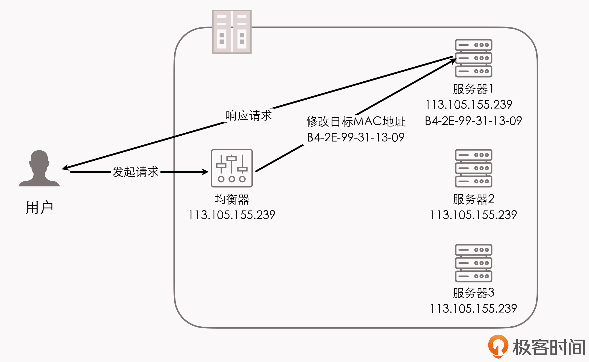
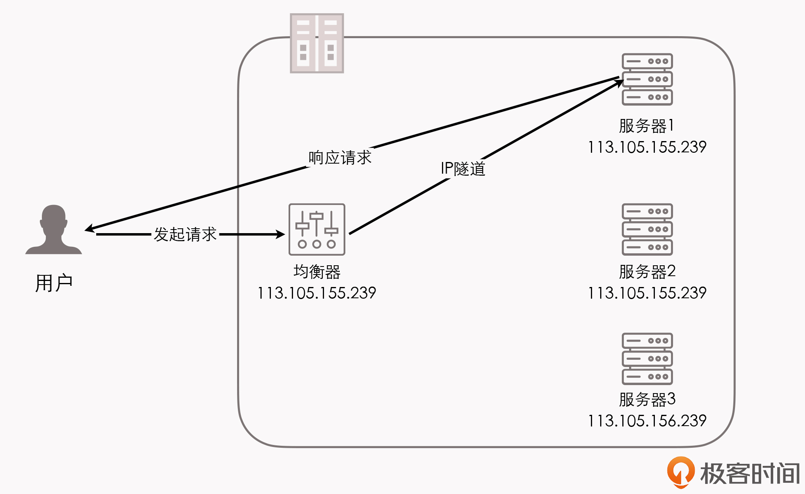
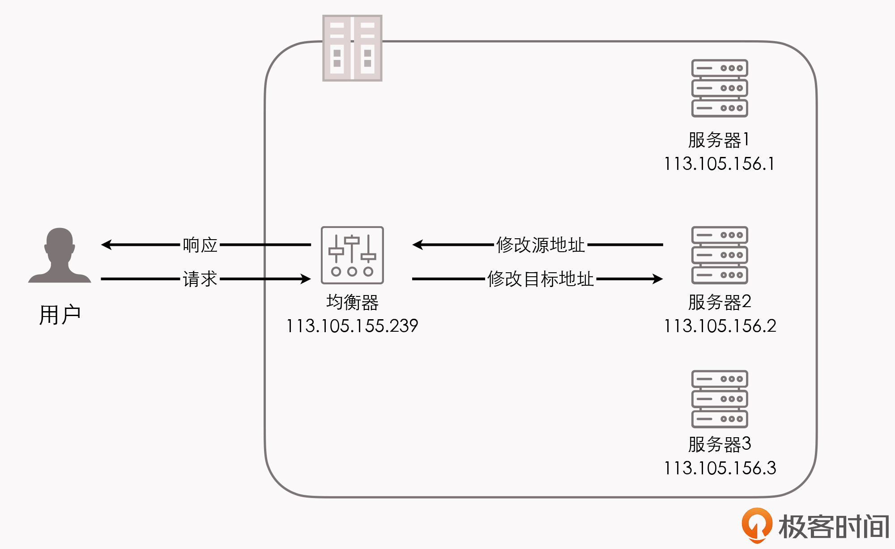

你好，我是周志明。

在上节课，我们学习了利用 CDN 来加速网络性能的工作内容，包括路由解析、内容分发、负载均衡和它所支持的应用。其中，负载均衡是相对独立的内容，它不仅在 CDN 方面有应用，在大量软件系统的生产部署中，也都离不开负载均衡器的支持。所以今天这节课，我们就一起来了解下负载均衡器的作用与原理。

在互联网时代的早期，网站流量还比较小，业务也比较简单，使用单台服务器基本就可以满足访问的需要了。但时至今日，互联网也好，企业级也好，一般实际用于生产的系统，几乎都离不开集群部署了。

一方面，不管是采用单体架构多副本部署还是微服务架构，也不管是为了实现高可用还是为了获得高性能，信息系统都需要利用多台机器来扩展服务能力，希望用户的请求不管连接到哪台机器上，都能得到相同的处理。

另一方面，如何构建和调度服务集群这件事情，又必须对用户一侧保持足够的透明，即使请求背后是由一千台、一万台机器来共同响应的，这也都不是用户会关心的事情，用户需要记住的只有一个域名地址而已。

那么，这里承担了调度后方的多台机器，以统一的接口对外提供服务的技术组件，就是“**负载均衡器**”（Load Balancer）了。

真正的大型系统的负载均衡过程往往是多级的。比如，在各地建有多个机房，或者是机房有不同网络链路入口的大型互联网站，然后它们会从 DNS 解析开始，通过“域名” → “CNAME” → “负载调度服务” → “就近的数据中心入口”的路径，先根据 IP 地址（或者其他条件）将来访地用户分配到一个合适的数据中心当中，然后才到了我们马上要讨论的各式负载均衡。

这里我先跟你说明一下：在 DNS 层面的负载均衡的工作模式，与我在前几讲中介绍的 DNS 智能线路、内容分发网络等的工作原理是类似的，它们之间的差别只是数据中心能提供的不仅是缓存，而是全方位的服务能力。所以这种负载均衡的工作模式我就不再重复介绍了，后面我们主要聚焦在讨论网络请求进入数据中心入口之后的其他级次的负载均衡。

好，那么接下来，我们就先从负载均衡的实现形式开始了解吧。

## 负载均衡的两种形式

实际上，无论我们在网关内部建立了多少级的负载均衡，从形式上来说都可以分为**两种**：四层负载均衡和七层负载均衡。

那么，在详细介绍它们是什么、如何工作之前，我们先来建立两个总体的、概念性的印象：

* 四层负载均衡的优势是性能高，七层负载均衡的优势是功能强。

* 做多级混合负载均衡，通常应该是低层的负载均衡在前，高层的负载均衡在后（你可以先想一想为什么？）。

这里，我们所说的“四层”“七层”，一般指的是经典的[OSI 七层模型](https://en.wikipedia.org/wiki/OSI_model)中，第四层传输层和第七层应用层。你可以参考下面表格中给出的维基百科上对 OSI 七层模型的介绍，我们在后面还会多次使用它。

另外我还想说明一点，就是现在人们所说的“四层负载均衡”，其实是多种均衡器工作模式的统称。**“四层”的意思是说，这些工作模式的共同特点是都维持着同一个 TCP 连接，而不是说它就只工作在第四层。**

事实上，这些模式主要都是工作在二层（数据链路层，可以改写 MAC 地址）和三层上（网络层，可以改写 IP 地址），单纯只处理第四层（传输层，可以改写 TCP、UDP 等协议的内容和端口）的数据无法做到负载均衡的转发，因为 OSI 的下面三层是媒体层（Media Layers），上面四层是主机层（Host Layers）。所以，既然流量都已经到达目标主机上了，也就谈不上什么流量转发，最多只能做代理了。

但出于习惯和方便，现在几乎所有的资料都把它们统称为四层负载均衡，这里我也就遵循习惯，同样称呼它为四层负载均衡。而如果你在某些资料上，看见“二层负载均衡”“三层负载均衡”的表述，这就真的是在描述它们工作的层次了，和我这里讲的“四层负载均衡”并不是同一类意思。

## 常见的四层负载均衡的工作模式

好，回到我们这一讲的重点上来，我们一起来看看几种常见的四层负载均衡的工作模式都是怎样的。

### 数据链路层负载均衡

这里你可以参考前面的 OSI 模型表格，数据链路层传输的内容是**数据帧（Frame）**，比如我们常见的以太网帧、ADSL 宽带的 PPP 帧等。当然了，在我们所讨论的具体上下文里，探究的目标必定就是以太网帧了。按照[IEEE 802.3](https://en.wikipedia.org/wiki/IEEE_802.3)标准，最典型的 1500 Bytes MTU 的以太网帧结构如下表所示：

>阅读链接补充：  
>[802.1Q](https://zh.wikipedia.org/wiki/IEEE_802.1Q) 标签  
>[以太类型](https://zh.wikipedia.org/wiki/%E4%BB%A5%E5%A4%AA%E7%B1%BB%E5%9E%8B)  
>[冗余校验](https://zh.wikipedia.org/wiki/%E5%86%97%E4%BD%99%E6%A0%A1%E9%AA%8C)  
>[帧间距](https://zh.wikipedia.org/wiki/%E5%B8%A7%E9%97%B4%E8%B7%9D)

在这个帧结构中，其他数据项的含义你可以暂时不去理会，只需要注意到“MAC 目标地址”和“MAC 源地址”两项即可。

我们知道，每一块网卡都有独立的 MAC 地址，而以太帧上的这两个地址告诉了交换机，此帧应该是从连接在交换机上的哪个端口的网卡发出，送至哪块网卡的。

数据链路层负载均衡所做的工作，是修改请求的数据帧中的 MAC 目标地址，让用户原本是发送给负载均衡器的请求的数据帧，被二层交换机根据新的 MAC 目标地址，转发到服务器集群中，对应的服务器（后面都叫做“真实服务器”，Real Server）的网卡上，这样真实服务器就获得了一个原本目标并不是发送给它的数据帧。

由于二层负载均衡器在转发请求过程中，只修改了帧的 MAC 目标地址，不涉及更上层协议（没有修改 Payload 的数据），所以在更上层（第三层）看来，所有数据都是没有被改变过的。

这是因为第三层的数据包，也就是 IP 数据包中，包含了源（客户端）和目标（均衡器）的 IP 地址，只有真实服务器保证自己的 IP 地址与数据包中的目标 IP 地址一致，这个数据包才能被正确处理。

所以，我们在使用这种负载均衡模式的时候，需要把真实物理服务器集群所有机器的[虚拟 IP 地址](https://en.wikipedia.org/wiki/Virtual_IP_address)（Virtual IP Address，VIP），配置成跟负载均衡器的虚拟 IP 一样，这样经均衡器转发后的数据包，就能在真实服务器中顺利地使用。

另外，也正是因为实际处理请求的真实物理服务器 IP 和数据请求中的目的 IP 是一致的，所以**响应结果就不再需要通过负载均衡服务器进行地址交换**，我们可以把响应结果的数据包直接从真实服务器返回给用户的客户端，避免负载均衡器网卡带宽成为瓶颈，**所以数据链路层的负载均衡效率是相当高的**。

整个请求到响应的过程如下图所示：

数据链路层负载均衡

那么这里你就可以发现，数据链路层负载均衡的工作模式是，只有请求会经过负载均衡器，而服务的响应不需要从负载均衡器原路返回，整个请求、转发、响应的链路形成了一个“三角关系”。所以，这种负载均衡模式也被很形象地称为“三角传输模式”（Direct Server Return，DSR），也有人叫它是“单臂模式”（Single Legged Mode）或者“直接路由”（Direct Routing）。

不过，虽然数据链路层负载均衡的效率很高，**但它并不适用于所有的场合**。除了那些需要感知应用层协议信息的负载均衡场景它无法胜任外（所有的四层负载均衡器都无法胜任，这个我后面介绍七层负载均衡器时会一并解释），在网络一侧受到的约束也很大。

原因是，二层负载均衡器直接改写目标 MAC 地址的工作原理，决定了它与真实服务器的通讯必须是二层可达的。通俗地说，就是它们必须位于同一个子网当中，无法跨 VLAN。

所以，这个优势（效率高）和劣势（不能跨子网）就共同决定了，**数据链路层负载均衡最适合用来做数据中心的第一级均衡设备，用来连接其他的下级负载均衡器**。

好，我们再来看看第二种常见的四层负载均衡工作模式：网络层负载均衡。

### 网络层负载均衡

根据 OSI 七层模型我们可以知道，在第三层网络层传输的单位是**分组数据包（Packets）**，这是一种在[分组交换网络](https://en.wikipedia.org/wiki/Packet_switching)（Packet Switching Network，PSN）中传输的结构化数据单位。

我拿 IP 协议来给你举个例子吧。一个 IP 数据包由 Headers 和 Payload 两部分组成，Headers 长度最大为 60 Bytes，它是由 20 Bytes 的固定数据和最长不超过 40 Bytes 的可选数据组成的。按照 IPv4 标准，一个典型的分组数据包的 Headers 部分的结构是这样的：

同样，我们也不需要过多关注表中的其他信息，只要知道在 IP 分组数据包的 Headers 带有源和目标的 IP 地址即可。

源和目标 IP 地址代表了“数据是从分组交换网络中的哪台机器发送到哪台机器的”，所以我们就可以沿用与二层改写 MAC 地址相似的思路，通过改变这里面的 IP 地址，来实现数据包的转发。

具体有两种常见的修改方式：

***第一种*是保持原来的数据包不变，新创建一个数据包，把原来数据包的 Headers 和 Payload 整体作为另一个新的数据包的 Payload，在这个新数据包的 Headers 中，写入真实服务器的 IP 作为目标地址，然后把它发送出去。**

如此经过三层交换机的转发，当真实服务器收到数据包后，就必须在接收入口处，设计一个针对性的拆包机制，把由负载均衡器自动添加的那层 Headers 扔掉，还原出原来的数据包来进行使用。

这样，真实服务器就同样拿到了一个原本不是发给它（目标 IP 不是它）的数据包，从而达到了流量转发的目的。

在那个时候，还没有流行起“禁止套娃”的梗，所以设计者给这种“套娃式”的传输起名为“[IP 隧道](https://en.wikipedia.org/wiki/IP_tunnel)”（IP Tunnel）传输，也是相当的形象了。

当然，尽管因为要封装新的数据包，IP 隧道的转发模式比起直接路由的模式，效率会有所下降，但**因为它并没有修改原有数据包中的任何信息，所以 IP 隧道的转发模式仍然具备三角传输的特性**，即负载均衡器转发来的请求，可以由真实服务器去直接应答，无需再经过均衡器原路返回。

而且因为 IP 隧道工作在网络层，所以**可以跨越 VLAN**，也就摆脱了我前面所讲的直接路由模式中网络侧的约束。现在，我们来看看这种转发模式从请求到响应的具体过程：

IP隧道模式的负载均衡

不过，**这种转发模式也有缺点**，就是它要求真实服务器必须得支持“[IP 隧道协议](https://en.wikipedia.org/wiki/Encapsulation_(networking))”（IP Encapsulation），也就是它得学会自己拆包扔掉一层 Headers。当然这个其实并不是什么大问题，现在几乎所有的 Linux 系统都支持 IP 隧道协议。

可另一个问题是，这种模式仍然必须通过专门的配置，必须保证所有的真实服务器与均衡器有着相同的虚拟 IP 地址。因为真实服务器器在回复该数据包的时候，需要使用这个虚拟 IP 作为响应数据包的源地址，这样客户端在收到这个数据包的时候才能正确解析。

这个限制就相对麻烦了一些，它跟“透明”的原则冲突了，需由系统管理员去专门介入。而且，并不是在任何情况下，我们都可以对服务器进行虚拟 IP 的配置的，尤其是当有好几个服务共用一台物理服务器的时候。

那么在这种情况下，我们就必须考虑***第二种*改变目标数据包的方式：直接把数据包 Headers 中的目标地址改掉，修改后原本由用户发给均衡器的数据包，也会被三层交换机转发送到真实服务器的网卡上，而且因为没有经过 IP 隧道的额外包装，也就无需再拆包了**。

但问题是，这种模式是修改了目标 IP 地址才到达真实服务器的，而如果真实服务器直接把应答包发回给客户端的话，这个应答数据包的源 IP 是真实服务器的 IP，也就是均衡器修改以后的 IP 地址，那么客户端就不可能认识该 IP，自然也就无法再正常处理这个应答了。

因此，我们只能让应答流量继续回到负载均衡，负载均衡把应答包的源 IP 改回自己的 IP，然后再发给客户端，这样才能保证客户端与真实服务器之间正常通信。

如果你对网络知识有些了解的话，肯定会觉得这种处理似曾相识：这不就是在家里、公司、学校上网的时候，由一台路由器带着一群内网机器上网的“[网络地址转换](https://en.wikipedia.org/wiki/Network_address_translation)”（Network Address Translation，NAT）操作吗？

这种负载均衡的模式的确就被称为 **NAT 模式**。此时，负载均衡器就是充当了家里、公司、学校的上网路由器的作用。

NAT 模式的负载均衡器运维起来也十分简单，只要机器把自己的网关地址设置为均衡器地址，就不需要再进行任何额外设置了。

我们来看看这种工作模式从请求到响应的过程：

NAT模式的负载均衡

不过这里，你还要知道的是，**在流量压力比较大的时候，NAT 模式的负载均衡会带来较大的性能损失，比起直接路由和 IP 隧道模式，甚至会出现数量级上的下降**。

这个问题也是显而易见的，因为由负载均衡器代表整个服务集群来进行应答，各个服务器的响应数据都会互相争抢均衡器的出口带宽。这就好比在家里用 NAT 上网的话，如果有人在下载，你打游戏可能就会觉得卡顿是一个道理，此时整个系统的瓶颈很容易就出现在负载均衡器上。

不过还有一种更加彻底的 NAT 模式，就是均衡器在转发时，不仅修改目标 IP 地址，连源 IP 地址也一起改了，这样源地址就改成了均衡器自己的 IP。这种方式被叫做 **Source NAT（SNAT）**。

这样做的**好处**是真实服务器连网关都不需要配置了，它能让应答流量经过正常的三层路由，回到负载均衡器上，做到了彻底的透明。

但它的缺点是由于做了 SNAT，真实服务器处理请求时就无法拿到客户端的 IP 地址了，在真实服务器的视角看来，所有的流量都来自于负载均衡器，这样有一些需要根据目标 IP 进行控制的业务逻辑就无法进行了。

### 应用层负载均衡

前面我介绍的两种四层负载均衡的工作模式都属于“转发”，即直接将承载着 TCP 报文的底层数据格式（IP 数据包或以太网帧），转发到真实服务器上，此时客户端到响应请求的真实服务器维持着同一条 TCP 通道。

但工作在四层之后的负载均衡模式就无法再进行转发了，只能进行代理。此时正式服务器、负载均衡器、客户端三者之间，是由两条独立的 TCP 通道来维持通讯的。

那么，转发与代理之间的具体区别是怎样的呢？我们来看一个图例：

转发与代理

首先，“代理”这个词，根据“哪一方能感知到”的原则，可以分为“正向代理”“反向代理”和“透明代理”三类。

* **正向代理**就是我们通常简称的代理，意思就是在客户端设置的、代表客户端与服务器通讯的代理服务。它是客户端可知，而对服务器是透明的。

* **反向代理**是指设置在服务器这一侧，代表真实服务器来与客户端通讯的代理服务。此时它对客户端来说是透明的。

* **透明代理**是指对双方都透明的，配置在网络中间设备上的代理服务。比如，架设在路由器上的透明翻墙代理。

那么根据这个定义，很显然，七层负载均衡器就属于反向代理中的一种，如果只论网络性能，七层负载均衡器肯定是无论如何比不过四层负载均衡器的。毕竟它比四层负载均衡器至少要多一轮 TCP 握手，还有着跟 NAT 转发模式一样的带宽问题，而且通常要耗费更多的 CPU，因为可用的解析规则远比四层丰富。

所以说，如果你要用七层负载均衡器去做下载站、视频站这种流量应用，一定是不合适的，起码它不能作为第一级均衡器。

但是，如果网站的性能瓶颈并不在于网络性能，而是要论整个服务集群对外所体现出来的**服务性能**，七层负载均衡器就有它的用武之地了。这里，七层负载均衡器的底气就来源于，**它是工作在应用层的，可以感知应用层通讯的具体内容，往往能够做出更明智的决策，玩出更多的花样来**。

我举个生活中的例子。

四层负载均衡器就像是银行的自助排号机，转发效率高且不知疲倦，每一个达到银行的客户都可以根据排号机的顺序，选择对应的窗口接受服务；而七层负载均衡器就像银行的大堂经理，他会先确认客户需要办理的业务，再安排排号。这样，办理理财、存取款等业务的客户，可以根据银行内部资源得到统一的协调处理，加快客户业务办理流程；而有些无需柜台办理的业务，由大堂经理直接就可以解决了。

比如说，反向代理的工作模式就能够实现静态资源缓存，对于静态资源的请求就可以在反向代理上直接返回，无需转发到真实服务器。

这里关于代理的工作模式，相信你应该是比较熟悉的，所以这里关于七层负载均衡器的具体工作过程我就不详细展开了。下面我来列举一些七层代理可以实现的功能，让你能对它“功能强大”有个直观的感受：

* 在上一讲我介绍 CDN 应用的时候就提到过，所有 CDN 可以做的**缓存方面的工作**（就是除去 CDN 根据物理位置就近返回这种优化链路的工作外），七层负载均衡器全都可以实现，比如静态资源缓存、协议升级、安全防护、访问控制，等等。

* 七层负载均衡器可以实现**更智能化的路由**。比如，根据 Session 路由，以实现亲和性的集群；根据 URL 路由，实现专职化服务（此时就相当于网关的职责）；甚至根据用户身份路由，实现对部分用户的特殊服务（如某些站点的贵宾服务器），等等。

* **某些安全攻击可以由七层负载均衡器来抵御**。比如，一种常见的 DDoS 手段是 SYN Flood 攻击，即攻击者控制众多客户端，使用虚假 IP 地址对同一目标大量发送 SYN 报文。从技术原理上看，因为四层负载均衡器无法感知上层协议的内容，这些 SYN 攻击都会被转发到后端的真实服务器上；而在七层负载均衡器下，这些 SYN 攻击自然就会在负载均衡设备上被过滤掉，不会影响到后面服务器的正常运行。类似地，我们也可以在七层负载均衡器上设定多种策略，比如过滤特定报文，以防御如 SQL 注入等应用层面的特定攻击手段。

* 很多微服务架构的系统中，**链路治理措施**都需要在七层中进行，比如服务降级、熔断、异常注入，等等。我举个例子，一台服务器只有出现物理层面或者系统层面的故障，导致无法应答 TCP 请求，才能被四层负载均衡器感知到，进而剔除出服务集群，而如果一台服务器能够应答，只是一直在报 500 错，那四层负载均衡器对此是完全无能为力的，只能由七层负载均衡器来解决。

## 均衡策略与实现

好，现在你应该也能知道，负载均衡的两大职责是“选择谁来处理用户请求”和“将用户请求转发过去”。那么到这里为止，我们只介绍了后者，即请求的转发或代理过程。

而“选择谁来处理用户请求”是指均衡器所采取的均衡策略，这一块因为涉及的均衡算法太多，我就不一一展开介绍了。所以接下来，我想从功能和应用的角度，来给你介绍一些常见的均衡策略，你可以在自己的实践当中根据实际需求去配置选择。

**轮循均衡（Round Robin）**

即每一次来自网络的请求，会轮流分配给内部中的服务器，从 1 到 N 然后重新开始。这种均衡算法适用于服务器组中的所有服务器都有相同的软硬件配置，并且平均服务请求相对均衡的情况。

**权重轮循均衡（Weighted Round Robin）**

即根据服务器的不同处理能力，给每个服务器分配不同的权值，使其能够接受相应权值数的服务请求。比如，服务器 A 的权值被设计成 1，B 的权值是 3，C 的权值是 6，则服务器 A、B、C 将分别接收到 10%、30％、60％的服务请求。这种均衡算法能确保高性能的服务器得到更多的使用率，避免低性能的服务器负载过重。

**随机均衡（Random）**

即把来自客户端的请求随机分配给内部中的多个服务器。这种均衡算法在数据足够大的场景下，能达到相对均衡的分布。

**权重随机均衡（Weighted Random）**

这种均衡算法类似于权重轮循算法，不过在处理请求分担的时候，它是个随机选择的过程。

**一致性哈希均衡（Consistency Hash）**

即根据请求中的某些数据（可以是 MAC、IP 地址，也可以是更上层协议中的某些参数信息）作为特征值，来计算需要落在哪些节点上，算法一般会保证同一个特征值，每次都一定落在相同的服务器上。这里一致性的意思就是，保证当服务集群的某个真实服务器出现故障的时候，只影响该服务器的哈希，而不会导致整个服务集群的哈希键值重新分布。

**响应速度均衡（Response Time）**

即负载均衡设备对内部各服务器发出一个探测请求（如 Ping），然后根据内部中各服务器对探测请求的最快响应时间，来决定哪一台服务器来响应客户端的服务请求。这种均衡算法能比较好地反映服务器的当前运行状态，**但要注意**，这里的最快响应时间，仅仅指的是负载均衡设备与服务器间的最快响应时间，而不是客户端与服务器间的最快响应时间。

**最少连接数均衡（Least Connection）**

客户端的每一次请求服务，在服务器停留的时间可能会有比较大的差异。那么随着工作时间加长，如果采用简单的轮循或者随机均衡算法，每一台服务器上的连接进程可能会产生极大的不平衡，并没有达到真正的负载均衡。所以，最少连接数均衡算法就会对内部中需要负载的每一台服务器，都有一个数据记录，也就是记录当前该服务器正在处理的连接数量，当有新的服务连接请求时，就把当前请求分配给连接数最少的服务器，使均衡更加符合实际情况，负载也能更加均衡。这种均衡算法适合长时间处理的请求服务，比如 FTP 传输。

**…………**

**另外，从实现角度来看，负载均衡器的实现有“软件均衡器”和“硬件均衡器”两类。**

在软件均衡器方面，又分为直接建设在操作系统内核的均衡器和应用程序形式的均衡器两种。前者的代表是 LVS（Linux Virtual Server），后者的代表有 Nginx、HAProxy、KeepAlived，等等；前者的性能会更好，因为它不需要在内核空间和应用空间中来回复制数据包；而后者的优势是选择广泛，使用方便，功能不受限于内核版本。

在硬件均衡器方面，往往会直接采用[应用专用集成电路](https://en.wikipedia.org/wiki/Application-specific_integrated_circuit)（Application Specific Integrated Circuit，ASIC）来实现。因为它有专用处理芯片的支持，可以避免操作系统层面的损耗，从而能够达到最高的性能。这类的代表就是著名的 F5 和 A10 公司的负载均衡产品。

## 小结

这节课，我给你介绍了数据链路层负载均衡和网络层负载均衡的基本原理。对于一个普通的开发人员来说，可能平常不太接触这些偏向底层网络的知识，但如果你要对软件系统工作有全局的把握，进阶成为一名架构人员，那么即使不会去实际参与网络拓扑设计与运维，至少也必须理解它们的工作原理，这是系统做流量和容量规划的必要基础。

## 一课一思

请你思考一下：为什么负载均衡不能只在某一个网络层次中完成，而是要进行多级混合的负载均衡？另外做多级混合负载均衡，为什么应该是低层的负载均衡在前，高层的负载均衡在后？

欢迎在留言区分享你的思考和见解。如果你觉得有收获，也欢迎把今天的内容分享给更多的朋友。感谢你的阅读，我们下一讲再见。