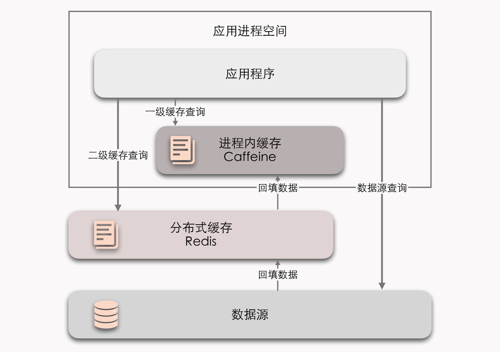

你好，我是周志明。

今天，我们接着上节课服务端缓存的话题，继续来学习下分布式缓存的实现形式、与本地缓存搭配使用的方法，以及一起来了解下，在实际使用缓存的过程中，可能会存在的各种风险和应对手段。

## 分布式缓存

首先通过上节课的学习，现在我们已经知道了，服务端缓存可以分为“进程内缓存”和“分布式缓存”两大类。相比缓存数据在进程内存中读写的速度，一旦涉及到了网络访问，那么由网络传输、数据复制、序列化和反序列化等操作所导致的延迟，就要比内存访问高得多。

所以，对于分布式缓存来说，处理与网络有关的操作是影响吞吐量的主要因素，这也是比淘汰策略、扩展功能更重要的关注点。

而这就决定了，尽管也有 Ehcache、Infinispan 这类能同时支持分布式部署和进程内嵌部署的缓存方案，但在通常情况下，进程内缓存和分布式缓存在选型时，会有完全不同的候选对象和考察点。

**所以说，我们在决定使用哪种分布式缓存之前，必须先确认好自己的需求是什么。**

那么接下来，我们就从两个不同的需求场景出发，看看都可以选择哪些分布式缓存方案。我们先从数据访问的需求场景开始了解吧。

### 复制式缓存与集中式缓存

**从访问的角度来说**，如果是频繁更新但很少读取的数据，正常是不会有人把它拿去做缓存的，因为这样做没有收益。

然后，对于很少更新但频繁读取的数据，理论上更适合做复制式缓存；而对于更新和读取都较为频繁的数据，理论上就更适合做集中式缓存。

所以在这里，我就针对这两种比较通用的缓存形式，给你介绍一下二者之间的差别，以及各自具有代表性的产品。

**复制式缓存**

对于复制式缓存，你可以看作是“**能够支持分布式的进程内缓存**”，它的工作原理与 Session 复制类似：缓存中的所有数据，在分布式集群的每个节点里面都存有一份副本，当读取数据时，无需网络访问，直接从当前节点的进程内存中返回，因此理论上可以做到与进程内缓存一样高的读取性能；而当数据发生变化的时候，就必须遵循复制协议，将变更同步到集群的每个节点中，这时，复制性能会随着节点的增加呈现平方级下降，变更数据的代价就会变得十分高昂。

**复制式缓存的代表是[JBossCache](https://jbosscache.jboss.org/)**，这是 JBoss 针对企业级集群设计的缓存方案，它可以支持 JTA 事务，依靠 JGroup 进行集群节点间数据同步。

以 JBossCache 为典型的复制式缓存，曾经有过一段短暂的兴盛期，但是在今天，我们基本上已经很难再见到使用这种缓存形式的大型信息系统了。

为什么今天 JBossCache 会被淘汰掉呢？

主要是因为 JBossCache 的写入性能实在是差到了不堪入目的程度，它在小规模集群中同步数据还算是差强人意，但在大规模集群下，动辄就会因为网络同步的速度跟不上写入速度，进而导致在内存中累计大量待重发对象，最终引发 OutOfMemory 崩溃。如果我们对 JBossCache 没有足够了解的话，稍有不慎就会被埋进坑里。

后来，为了缓解复制式同步的写入效率问题，JBossCache 的继任者[Infinispan](https://infinispan.org/)提供了另一种分布式同步模式。它允许用户配置数据需要复制的副本数量，比如集群中有八个节点，我们可以要求每个数据只保存四份副本，这样就降低了复制数据时的网络负担。

此时，缓存的总容量就相当于是传统复制模式的一倍，如果要访问的数据在本地缓存中没有存储，Infinispan 完全有能力感知网络的拓扑结构，知道应该到哪些节点中寻找数据。

**集中式缓存**

集中式缓存是目前分布式缓存的**主流形式**。集中式缓存的读、写都需要网络访问，它的好处是不会随着集群节点数量的增加而产生额外的负担，而坏处自然是读、写都不可能再达到进程内缓存那样的高性能。

**集中式缓存还有一个必须提到的关键特点，那就是它与使用缓存的应用分处在独立的进程空间中。**

这样做的**好处**是它能够为异构语言提供服务，比如用 C 语言编写的[Memcached](https://memcached.org/)完全可以毫无障碍地为 Java 语言编写的应用提供缓存服务；但**坏处**是如果要缓存像对象这种复杂类型的话，基本上就只能靠序列化来支撑具体语言的类型系统了（支持 Hash 类型的缓存，可以部分模拟对象类型）。这样就不仅产生了序列化的成本，还很容易导致传输成本的大幅增加。

我举个例子，假设某个有 100 个字段的大对象变更了其中 1 个字段的值，通常缓存也不得不把整个对象的所有内容重新序列化传输出去，才能实现更新。所以，一般集中式缓存更提倡直接缓存原始数据类型，而不是对象。

相比之下，JBossCache 则通过它的**字节码自审**（Introspection）功能和**树状存储结构**（TreeCache），做到了自动跟踪、处理对象的部分变动。如果用户修改了对象中某些字段的数据，缓存就只会同步对象中真正变更的那部分数据。

不过现在，因为[Redis](https://redis.io/)在集中式缓存中处于统治地位，已经打败了 Memcached 和其他集中式缓存框架，成为了集中式缓存的首选，甚至可以说成为了分布式缓存的首选，几乎到了不用管读取、写入哪种操作更频繁，都可以无脑上 Redis 的程度。

也正是因为如此，前面我在说到哪些数据适合用复制式缓存、哪些数据适合用集中式缓存的时候，我都加了个拗口的“理论上”。尽管 Redis 最初设计的本意是 NoSQL 数据库，而不是专门用来做缓存的，可今天它确实已经成为许多分布式系统中不可或缺的基础设施，被广泛用作缓存的实现方案。

而另一方面，访问缓存不仅仅要考虑如何快速取到数据，还需要考虑取到的是否是正确的数据，缓存的数据质量是另一个重要的考量因素。

**从数据一致性的角度来说**，缓存本身也有集群部署的需求。所以在理论上，我们需要好好考虑一下，如果不同的节点取到的缓存数据不一样，我们是否可以接受。比如说，我们刚刚放入缓存中的数据，另外一个节点马上访问发现未能读到；或者刚刚更新缓存中的数据，另外一个节点访问时，在短时间内读取到的仍是旧的数据，等等。

那么，根据分布式缓存集群是否能保证数据一致性，我们可以将它分为 AP 和 CP 两种类型（在[“分布式事务”](https://time.geekbang.org/column/article/322287)中已经介绍过 CAP 各自的含义）。

你可以发现，这里我又说的是“理论上”，这是因为我们在实际开发中，通常不太会使用缓存来处理追求强一致性的数据。当然我们是可以这样做，但其实没必要（可类比 MESI 等缓存一致性协议）。

给你举个例子。Redis 集群就是典型的 AP 式，它具有高性能、高可用等特点，但它却并不保证强一致性。而能够保证强一致性的 ZooKeeper、Doozerd、Etcd 等分布式协调框架，我们可通常不会把它们当作“缓存框架”来使用，这些分布式协调框架的吞吐量相对 Redis 来说，是非常有限的。不过，ZooKeeper、Doozerd、Etcd 倒是常跟 Redis 和其他分布式缓存搭配工作，用来实现其中的通知、协调、队列、分布式锁等功能。

### 透明多级缓存

那到这里，你也能发现，分布式缓存与进程内缓存各有所长，也有各有局限，它们是互补的，而不是竞争的关系。所以如果你有需要，完全可以同时互相搭配进程内缓存和分布式缓存，来构成**透明多级缓存**（Transparent Multilevel Cache，TMC）。

这里，我们先不去考虑“透明”这个词的定义是啥，单看“多级缓存”的话，倒还很好理解。

它的意思就是，使用进程内缓存做一级缓存，分布式缓存做二级缓存，如果能在一级缓存中查询到结果就直接返回，否则就到二级缓存中去查询；再将二级缓存中的结果回填到一级缓存，以后再访问该数据就没有网络请求了。

而如果二级缓存也查询不到，就发起对最终数据源的查询，将结果回填到一、二级缓存中去。

多级缓存

不过，尽管多级缓存结合了进程内缓存和分布式缓存的优点，但它的代码侵入性较大，需要由开发者承担多次查询、多次回填的工作，也不便于管理，像是超时、刷新等策略，都要设置多遍，数据更新更是麻烦，很容易会出现各个节点的一级缓存、二级缓存里的数据互相不一致的问题。

所以，我们必须“**透明**”地解决这些问题，多级缓存才具有实用的价值。

一种常见的设计原则，就是**变更以分布式缓存中的数据为准，访问以进程内缓存的数据优先**。

大致做法是当数据发生变动时，在集群内发送推送通知（简单点的话可以采用 Redis 的 PUB/SUB，求严谨的话可以引入 ZooKeeper 或 Etcd 来处理），让各个节点的一级缓存自动失效掉相应数据。

然后，当访问缓存时，缓存框架提供统一封装好的一、二级缓存联合查询接口，接口外部只查询一次，接口内部自动实现优先查询一级缓存。如果没有获取到数据，就再自动查询二级缓存。

## 缓存风险

OK，现在，你也对不同需求场景下的不同分布式缓存实现方案有大概的了解了。而在上一节课开头，我提到过缓存并不是多多益善，它有利也有弊，是要真正到必要的时候才去考虑的解决方案。因此接下来，我就带你详细了解一下使用缓存的各种常见风险和注意事项，以及应对风险的方法。

### 缓存穿透

我们知道，引入缓存的目的是为了缓解 CPU 或者 I/O 的压力，比如对数据库做缓存，大部分流量都从缓存中直接返回，只有缓存未能命中的数据请求才会流到数据库中，数据库压力自然就减小了。

但是如果查询的数据在数据库中根本不存在的话，缓存里自然也不会有。这样，这类请求的流量每次都不会命中，每次都会触及到末端的数据库，缓存自然也就起不到缓解压力的作用了。那么，这种查询不存在数据的现象，就被称为**缓存穿透**。

缓存穿透有可能是业务逻辑本身就存在的固有问题，也有可能是被恶意攻击的所导致的。所以，为了解决缓存穿透，我们一般会采取下面两种办法：

**对于业务逻辑本身就不能避免的缓存穿透**

我们可以约定在一定时间内，对返回为空的 Key 值依然进行缓存（注意是正常返回但是结果为空，不要把抛异常的也当作空值来缓存了），这样在一段时间内，缓存就最多被穿透一次。

如果后续业务在数据库中对该 Key 值插入了新记录，那我们就应当在插入之后主动清理掉缓存的 Key 值。如果业务时效性允许的话，也可以设置一个较短的超时时间来自动处理缓存。

**对于恶意攻击导致的缓存穿透**

针对这种原因，我们通常会在缓存之前设置一个布隆过滤器来解决。所谓的恶意攻击是指，请求者刻意构造数据库中肯定不存在的 Key 值，然后发送大量请求进行查询。而布隆过滤器是用最小的代价，来判断某个元素是否存在于某个集合的办法。

如果布隆过滤器给出的判定结果是请求的数据不存在，那就直接返回即可，连缓存都不必去查。虽然维护布隆过滤器本身需要一定的成本，但比起攻击造成的资源损耗，还是比较值得的。

### 缓存击穿

我们都知道，缓存的基本工作原理是首次从真实数据源加载数据，完成加载后回填入缓存，以后其他相同的请求就从缓存中获取数据，缓解数据源的压力。

但是，如果缓存中的某些热点数据忽然因为某种原因失效了，比如典型地由于超期而失效，而此时又有多个针对该数据的请求同时发送过来，那么这些请求就会全部未能命中缓存，都到达真实数据源中去，导致其压力剧增。这种现象，就被称为**缓存击穿**。

所以，要如何避免缓存击穿问题呢？我们通常可以采取这样两种办法：

1. **加锁同步**。以请求该数据的 Key 值为锁，这样就只有第一个请求可以流入到真实的数据源中，其他线程采取阻塞或重试策略。如果是进程内缓存出现了问题，施加普通互斥锁就可以了；如果是分布式缓存中出现的问题，就施加分布式锁，这样数据源就不会同时收到大量针对同一个数据的请求了。

2. **热点数据由代码来手动管理**。缓存击穿是只针对热点数据被自动失效才引发的问题，所以对于这类数据，我们可以直接通过代码来有计划地完成更新、失效，避免由缓存的策略自动管理。

### 缓存雪崩

现在我们了解了，缓存击穿是针对单个热点数据失效，由大量请求击穿缓存而给真实数据源带来了压力。

而另一种可能更普遍的情况，是不需要针对单个热点数据的大量请求，而是由于大批不同的数据在短时间内一起失效，导致了这些数据的请求都击穿了缓存，到达数据源，这同样也会令数据源在短时间内压力剧增。

那么，之所以会出现这种情况，往往是因为系统有专门的缓存预热功能，也可能是因为，大量的公共数据都是由某一次冷操作加载的，这样都可能会出现由此载入缓存的大批数据具有相同的过期时间，在同一时刻一起失效。

还有一种情况是缓存服务由于某些原因崩溃后重启，此时也会造成大量数据同时失效。那么以上出现的这种现象，就被称为**缓存雪崩**。

而要避免缓存雪崩的问题，我们通常可以采取这三种办法：

1. 提升缓存系统可用性，建设分布式缓存的集群。

2. 启用透明多级缓存，各个服务节点的一级缓存中的数据，通常会具有不一样的加载时间，这样做也就分散了它们的过期时间。

3. 将缓存的生存期从固定时间改为一个时间段内的随机时间，比如原本是一个小时过期，那可以在缓存不同数据时，设置生存期为 55 分钟到 65 分钟之间的某个随机时间。

### 缓存污染

所谓的缓存污染是指，缓存中的数据与真实数据源中的数据不一致的现象。尽管我在前面有说过，缓存通常不追求强一致性，但这显然不能等同于，缓存和数据源间连最终的一致性都可以不要求了。

**缓存污染多数是因为开发者更新缓存不规范造成的**。比如说，你从缓存中获得了某个对象，更新了对象的属性，但最后因为某些原因，比如后续业务发生异常回滚了，最终没有成功写入到数据库，此时缓存的数据是新的，而数据库中的数据是旧的。

所以，为了尽可能地提高使用缓存时的一致性，人们已经总结了不少更新缓存时可以遵循的设计模式，比如 Cache Aside、Read/Write Through、Write Behind Caching，等等。

这里，我想给你介绍下 Cache Aside 模式，因为这种设计模式最简单，成本也最低。它的主要内容只有两条：

* 读数据时，先读缓存，缓存没有的话，再读数据源，然后将数据放入缓存，再响应请求。

* 写数据时，先写数据源，然后失效（而不是更新）掉缓存。

在读数据方面，一般不会有什么出错的余地。但是写数据时，我有必要专门给你强调两点。

**一个是先后顺序一定要先数据源后缓存**。你试想一下，如果采用先失效缓存后写数据源的顺序，那一定会存在一段时间内缓存已经删除完毕，但数据源还未修改完成的情况。此时新的查询请求到来，缓存未能命中，就会直接流到真实数据源中。

这样，请求读到的数据依然是旧数据，随后又重新回填到缓存中。而当数据源修改完成后，结果就成了数据在数据源中是新的，在缓存中是老的，两者就会有不一致的情况。

**二个是应当失效缓存，而不是尝试去更新缓存**。这很容易理解，如果去更新缓存，更新过程中数据源又被其他请求再次修改的话，缓存又要面临处理多次赋值的复杂时序问题。所以直接失效缓存，等下次用到该数据时自动回填，期间数据源中的值无论被改了多少次，都不会造成任何影响。

不过，Cache Aside 模式依然也不能保证在一致性上绝对不出问题，否则我们就不需要设计出[Paxos](http://localhost:8080/distribution/consensus/paxos.html)这样复杂的共识算法了。采用 Cache Aside 模式典型的出错场景，就是如果某个数据是从未被缓存过的，请求会直接流到真实数据源中，如果数据源中的写操作发生在查询请求之后，结果回填到缓存之前，也会出现缓存中回填的内容与数据库的实际数据不一致的情况。

但是，出现这种情况的概率实际上是很低的，Cache Aside 模式仍然是以低成本更新缓存，并且获得相对可靠结果的解决方案。

## 小结

今天这一讲，我着重给你介绍了两种主要的分布式缓存形式，分别是复制式缓存和集中式缓存。其中我强调了，在选择使用不同缓存方案的时候，你需要注意对读效率和写效率，以及对访问效率和数据质量之间的权衡。而在实际的应用场景中，你其实可以考虑选择将两种缓存结合使用，构成透明多级缓存，以此达到各取所长的目的。

最后，在为系统引入缓存的时候，你还要特别注意可能会出现的风险问题，比如说缓存穿透、缓存击穿、缓存雪崩、缓存污染，等等。如果你对这些可能出现的风险问题有了一定的准备和应对方案，那么可以说，你基本上算是对服务端缓存建立了基本的整体认知了。

## 一课一思

不知道你还记不记得，在[第 16 讲](https://time.geekbang.org/column/article/324213)中，我提出过一个观点“能满足需求的前提下，最简单的系统就是最好的系统”。现在，你已经学完了“透明多级分流系统”这个小章节的所有内容，那么你对这个判定有什么新的看法吗?

欢迎在留言区分享你的思考和见解。如果你觉得有收获，也欢迎把今天的内容分享给更多的朋友。