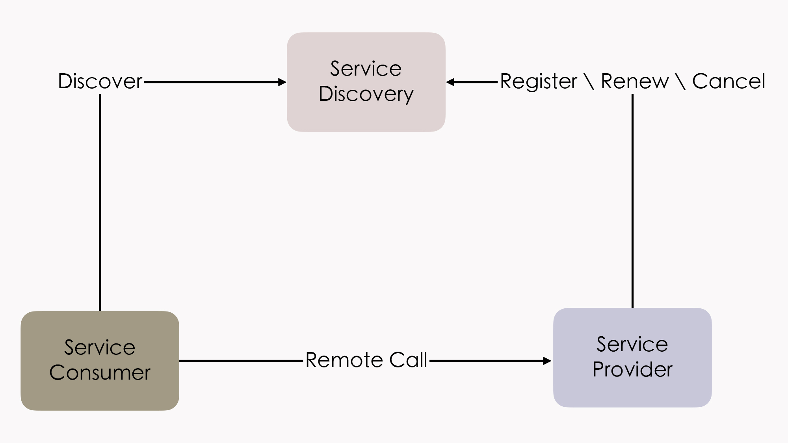

你好，我是周志明。

前面的两节课，我们已经学习了与分布式相关的算法和理论，掌握了一致性、共识、Paxos 等共识算法，为了解分布式环境中的操作共享数据打好了理论基础。那么从这一讲开始，我们就来一起了解下，在使用分布式服务构造大型系统的过程中，都可能会遇到哪些问题，以及针对这些问题，都可以选择哪些解决方案。

好，那在正式开始学习之前呢，让我们先来思考一个问题：为什么在微服务应用中，需要引入服务发现呢？它的意义是什么？

## 服务发现解耦对位置的依赖

事实上，服务发现的意义是解耦程序对服务具体位置的依赖，对于分布式应用来说，服务发现不是可选项，而是必须的。

要理解分布式中的服务发现，那不妨先以单机程序中的类库来类比，因为类库概念的普及，让计算机实现了通过位于不同模块的方法调用，来组装复用指令序列的目的，打开了软件达到更大规模的一扇大门。无论是编译期链接的 C/CPP，还是运行期链接的 Java，都要通过[链接器](https://en.wikipedia.org/wiki/Linker_(computing))（Linker），把代码里的[符号引用](https://en.wikipedia.org/wiki/Debug_symbol)转换为模块入口或进程内存地址的直接引用。

而服务概念的普及，让计算机可以通过分布于网络中的不同机器互相协作来复用功能，这是软件发展规模的第二次飞跃。此时，**如何确定目标方法的确切位置，便是与编译链接有着等同意义的问题，解决该问题的过程，就被叫做“[服务发现](https://en.wikipedia.org/wiki/Service_discovery)”（Service Discovery）**。

>**通过服务来实现组件**
>
>Microservice architectures will use libraries, but their primary way of componentizing their own software is by breaking down into services.
>
>微服务架构也会使用到类库，但构成软件系统组件的主要方式是将其拆分为一个个服务。
>
>—— [Martin Fowler](https://martinfowler.com/) / [James Lewis](https://x.com/boicy?mx=2), [Microservices](https://martinfowler.com/articles/microservices.html), 2014

所有的远程服务调用都是使用“[全限定名](https://en.wikipedia.org/wiki/Fully_qualified_domain_name)（Fully Qualified Domain Name，FQDN）、端口号、服务标识”构成的三元组，来确定一个远程服务的精确坐标的。全限定名代表了网络中某台主机的精确位置，端口代表了主机上某一个提供服务的程序，服务标识则代表了该程序所提供的一个方法接口。

其中，“全限定名、端口号”的含义在各种远程服务中都一致，而“服务标识”则与具体的应用层协议相关，它可以是多样的，比如 HTTP 的远程服务，标识是 URL 地址；RMI 的远程服务，标识是 Stub 类中的方法；SOAP 的远程服务，标识是 WSDL 中的定义，等等。

也正是因为远程服务的多样性，导致了“服务发现”也会有两种不同的理解。

**一种是以 UDDI 为代表的“百科全书式”的服务发现**。上到提供服务的企业信息（企业实体、联系地址、分类目录等），下到服务的程序接口细节（方法名称、参数、返回值、技术规范等），它们都在服务发现的管辖范围之内。

**另一种是类似于 DNS 这样的“门牌号码式”的服务发现**。这种服务发现只满足从某个代表服务提供者的全限定名，到服务实际主机 IP 地址的翻译转换。它并不关心服务具体是哪个厂家提供的，也不关心服务有几个方法，各自都由什么参数所构成，它默认这些细节信息服务消费者本身就是了解的。此时，服务坐标就可以退化为简单的“全限定名 + 端口号”。

现如今，主要是后一种服务发现占主流地位，所以咱们这节课要探讨的服务发现，如无说明，都是指的后者。

在前面讲“透明多级分流系统”这个小章节的时候，我提到过，原本程序只依赖 DNS 把一个全限定名翻译为一个或者多个 IP 地址（或者 SRV 等其他记录），就可以实现服务发现了，后来的负载均衡器实质上也承担了一部分服务发现的职责（指外部 IP 地址到各个服务内部实际 IP 的转换）。我们也已经详细解析过，这种方式在软件追求不间断长时间运行的时代是很合适的。

但随着微服务的逐渐流行，服务的非正常宕机重启和正常的上下线操作变得更加频繁，仅靠着 DNS 服务器和负载均衡器等基础设施，就显得逐渐有些疲于应对，无法跟上服务变动的步伐了。

因此，人们开始尝试使用 ZooKeeper 这样的分布式 K/V 框架，通过软件自身来完成服务注册与发现。ZooKeeper 曾短暂统治过远程服务发现，是微服务早期对服务发现的主流选择，但毕竟 ZooKeeper 是很底层的分布式工具，用户自己还需要做相当多的工作，才能满足服务发现的需求。

那到了 2014 年，在 Netflix 内部经受过长时间实际考验的、专门用于服务发现的 Eureka，宣布了开源，并很快被纳入 Spring Cloud，成为 Spring 默认的远程服务发现的解决方案。从此，Java 程序员就无需再在服务注册这件事情上花费太多的力气。

然后到 2018 年，Spring Cloud Eureka 进入维护模式以后，HashiCorp 的 Consul 和阿里巴巴的 Nacos 就很快从 Eureka 手上接过传承的衣钵。此时的服务发现框架已经发展得相当成熟，考虑到了几乎方方面面的问题，比如可以支持通过 DNS 或者 HTTP 请求，进行符号与实际地址的转换，支持各种各样的服务健康检查方式，支持集中配置、K/V 存储、跨数据中心的数据交换等多种功能，可以说是以应用自身去解决服务发现的一个顶峰。

而如今，云原生时代来临，基础设施的灵活性得到了大幅度地增强，最初使用基础设施来透明化地做服务发现的方式，又重新被人们所重视了，如何在基础设施和网络协议层面，对应用尽可能无感知、尽可能方便地实现服务发现，便是目前一个主要的发展方向。

接下来，我们就具体来看看服务发现的三个关键的子问题，并一起探讨、对比下最常见的用作服务发现的几种形式，以此让你了解服务发现中，可用性与可靠性之间的关系和权衡。

## 服务发现要解决注册、维护和发现三大功能问题

那么，第一个问题就是，**“服务发现”具体是指进行过什么操作呢**？我认为，这里面其实包含了三个必须的过程：

**服务的注册（Service Registration）**

当服务启动的时候，它应该通过某些形式（比如调用 API、产生事件消息、在 ZooKeeper/Etcd 的指定位置记录、存入数据库，等等）把自己的坐标信息通知给服务注册中心，这个过程可能由应用程序来完成（比如 Spring Cloud 的 @EnableDiscoveryClient 注解），也可能是由容器框架（比如 Kubernetes）来完成。

**服务的维护（Service Maintaining）**

尽管服务发现框架通常都有提供下线机制，但并没有什么办法保证每次服务都能[优雅地下线](https://www.techtarget.com/whatis/definition/graceful-shutdown-and-hard-shutdown)（Graceful Shutdown），而不是由于宕机、断网等原因突然失联。所以，服务发现框架就必须要自己去保证所维护的服务列表的正确性，以避免告知消费者服务的坐标后，得到的服务却不能使用的尴尬情况。

现在的服务发现框架，一般都可以支持多种协议（HTTP、TCP 等）、多种方式（长连接、心跳、探针、进程状态等）来监控服务是否健康存活，然后把不健康的服务自动下线。

**服务的发现（Service Discovery）**

这里所说的发现是狭义的，它特指消费者从服务发现框架中，把一个符号（比如 Eureka 中的 ServiceID、Nacos 中的服务名、或者通用的[FDQN](https://en.wikipedia.org/wiki/Fully_qualified_domain_name)）转换为服务实际坐标的过程，这个过程现在一般是通过 HTTP API 请求，或者是通过 DNS Lookup 操作来完成的（还有一些相对少用的方式，如 Kubernetes 也支持注入环境变量）。

当然，我提到的这三点只是列举了服务发现中必须要进行的过程，除此之外它还是会有一些可选的功能的，比如在服务发现时，进行的负载均衡、流量管控、K/V 存储、元数据管理、业务分组，等等，这些功能都属于具体服务发现框架的功能细节，这里就不再展开了。

下面我们来讨论另一个很常见的问题。

不知道你有没有观察过，很多谈论服务发现的文章，总是无可避免地会先扯到“CP”还是“AP”的问题上。那么，**为什么服务发现对 CAP 如此关注、如此敏感呢？**

其实，我们可以从服务发现在整个系统中所处的角色，来着手分析这个问题。

在概念模型中，服务中心所处的地位是这样的：提供者在服务发现中注册、续约和下线自己的真实坐标，消费者根据某种符号从服务发现中获取到真实坐标，它们都可以看作是系统中平等的微服务。我们来看看这个概念模型示意图：

概念模型

不过，在真实的系统中，服务发现的地位还是有一些特殊，我们还不能把它完全看作是一个普通的服务。为啥呢？

这是因为，**服务发现是整个系统中，其他所有服务都直接依赖的最基础的服务**（类似相同待遇的大概就数配置中心了，现在服务发现框架也开始同时提供配置中心的功能，以避免配置中心又去专门搞出一集群的节点来），**几乎没有办法在业务层面进行容错处理**。而服务注册中心一旦崩溃，整个系统都会受到波及和影响，因此我们必须尽最大可能，在技术层面上保证系统的可用性。

所以，在分布式系统中，服务注册中心一般会**以内部小集群的方式进行部署**，提供三个或者五个节点（通常最多七个，一般也不会更多了，否则日志复制的开销太高）来保证高可用性。你可以看看下面给出的这个例子：

真实系统

另外，这里你还要注意一点，就是这个图例中各服务发现节点之间的“**Replicate**”字样。

作为用户，我们当然希望服务注册一直可用、永远健康的同时，也能够在访问每一个节点中都取到一致的数据，而这两个需求就构成了 CAP 矛盾。

我拿前面提到的最有代表性的 Eureka 和 Consul 来举个例子。

这里，我以 AP、CP 两种取舍作为选择维度，Consul 采用的是[Raft 协议](https://icyfenix.cn/distribution/consensus/raft.html)，要求多数派节点写入成功后，服务的注册或变动才算完成，这就严格地保证了在集群外部读取到的服务发现结果一定是一致的；Eureka 的各个节点间采用异步复制来交换服务注册信息，服务注册或变动时，并不需要等待信息在其他节点复制完成，而是马上在该服务发现节点就宣告可见（但其他节点是否可见并不保证）。

实际上，这两点差异带来的影响并不在于服务注册的快慢（当然，快慢确实是有差别），而在于你如何看待以下这件事情：

>假设系统形成了 A、B 两个网络分区后，A 区的服务只能从区域内的服务发现节点获取到 A 区的服务坐标，B 区的服务只能取到在 B 区的服务坐标，这对你的系统会有什么影响？

* 如果这件事情对你并没有什么影响，甚至有可能还是有益的，那你就应该倾向于选择 AP 的服务发现。比如假设 A、B 就是不同的机房，是机房间的网络交换机导致服务发现集群出现的分区问题，但每个分区中的服务仍然能独立提供完整且正确的服务能力，此时尽管不是有意而为，但网络分区在事实上避免了跨机房的服务请求，反而还带来了服务调用链路优化的效果。

* 如果这件事情可能对你影响非常大，甚至可能带来比整个系统宕机更坏的结果，那你就应该倾向于选择 CP 的服务发现。比如系统中大量依赖了集中式缓存、消息总线、或者其他有状态的服务，一旦这些服务全部或者部分被分隔到某一个分区中，会对整个系统的操作正确性产生直接影响的话，那与其搞出一堆数据错误，还不如停机来得痛快。

除此之外，在服务发现的过程中，对系统的可用性和可靠性的取舍不同，对服务发现框架的具体实现也有着决定性的影响。接下来，我们就具体来了解下几类不同的服务发现的实现形式。

## 服务发现需要有效权衡一致性与可用性的矛盾

数据一致性与服务可用性之间的矛盾是分布式系统永恒的话题。而在服务发现这个场景里，权衡的主要关注点是一旦出现分区所带来的后果，其他在系统正常运行过程中，出现的速度问题都是次要的。

所以最后，我们再来讨论一个很“务实”的话题：现在那么多的服务发现框架，哪一款最好呢？或者说我们应该如何挑选最适合的呢？

实际上，现在直接以服务发现、服务注册中心为目标，或者间接用来实现这个目标的方式主要有以下三类：

**第一类：在分布式 K/V 存储框架上自己实现的服务发现**

这类的代表是 ZooKeeper、Doozerd、Etcd。这些 K/V 框架提供了分布式环境下**读写操作的共识保证**，Etcd 采用的是我们学习过的 Raft 算法，ZooKeeper 采用的是 ZAB 算法（一种 Multi Paxos 的派生算法），所以采用这种方案，就不必纠结 CP 还是 AP 的问题了，它们都是 CP 的。

这类框架的宣传语中往往会主动提及“高可用性”，它们的潜台词其实是“在保证一致性和分区容错性的前提下，尽最大努力实现最高的可用性”，比如 Etcd 的宣传语就是“高可用的集中配置和服务发现”（Highly-Available Key Value Store for Shared Configuration and Service Discovery）。

这些 K/V 框架的另一个共同特点是在整体较高复杂度的架构和算法的外部，**维持着极为简单的应用接口**，只有基本的 CRUD 和 Watch 等少量 API，所以我们如果要在上面完成功能齐全的服务发现，有很多基础的能力，比如服务如何注册、如何做健康检查等等，都必须自己实现，因此现在一般也只有“大厂”才会直接基于这些框架去做服务发现了。

**第二类：以基础设施（主要是指 DNS 服务器）来实现服务发现**

这类的代表是 SkyDNS、CoreDNS。在 Kubernetes 1.3 之前的版本，是使用 SkyDNS 作为默认的 DNS 服务，它的工作原理是从 API Server 中监听集群服务的变化，然后根据服务生成 NS、SRV 等 DNS 记录存放到 Etcd 中，kubelet 会在每个 Pod 内部设置 DNS 服务的地址，作为 SkyDNS 的地址，在需要调用服务时，只需查询 DNS，把域名转换成 IP 列表便可实现分布式的服务发现。

而在 Kubernetes 1.3 之后，SkyDNS 不再是默认的 DNS 服务器，也不再使用 Etcd 存储记录，而是只将 DNS 记录存储在内存中的 KubeDNS 代替；到了 1.11 版，就更推荐采用扩展性很强的 CoreDNS，此时我们可以通过各种插件来决定是否要采用 Etcd 存储、重定向、定制 DNS 记录、记录日志，等等。

那么采用这种方案的话，是 CP 还是 AP 就取决于后端采用何种存储，如果是基于 Etcd 实现的，那自然是 CP 的；如果是基于内存异步复制的方案实现的，那就是 AP 的。

也就是说，以基础设施来做服务发现，**好处是对应用透明**，任何语言、框架、工具都肯定是支持 HTTP、DNS 的，所以完全不受程序技术选型的约束。但它的**坏处是透明的并不一定简单**，你必须自己考虑如何去做客户端负载均衡、如何调用远程方法等这些问题，而且必须遵循或者说受限于这些基础设施本身所采用的实现机制。

比如在服务健康检查里，服务的缓存期限就必须采用 TTL（Time to Live）来决定，这是 DNS 协议所规定的，如果想改用 KeepAlive 长连接来实时判断服务是否存活就很麻烦。

**第三类：专门用于服务发现的框架和工具**

这类的代表是 Eureka、Consul 和 Nacos。

这一类框架中，你可以自己决定是 CP 还是 AP 的问题，比如 CP 的 Consul、AP 的 Eureka，还有同时支持 CP 和 AP 的 Nacos（Nacos 采用类 Raft 协议做的 CP，采用自研的 Distro 协议做的 AP，注意这里的“同时”是“都支持”的意思，它们必须二取其一，不是说 CAP 全能满足）。

另外，**还有很重要一点是，它们对应用并不是透明的**。尽管 Consul、Nacos 也支持基于 DNS 的服务发现，尽管这些框架都基本上做到了以声明代替编码（比如在 Spring Cloud 中只改动 pom.xml、配置文件和注解即可实现），但它们依然是应用程序有感知的。所以或多或少还需要考虑你所用的程序语言、技术框架的集成问题。

但这一点其实并不见得就是坏处，比如采用 Eureka 做服务注册，那在远程调用服务时，你就可以用 OpenFeign 做客户端，写个声明式接口就能跑，相当能偷懒；在做负载均衡时，你就可以采用 Ribbon 做客户端，要想换均衡算法的话，改个配置就成，这些“不透明”实际上都为编码开发带来了一定的便捷，而前提是你选用的语言和框架要支持。如果你的老板提出要在 Rust 上用 Eureka，那你就只能无奈叹息了（原本这里我写的是 Node、Go、Python 等，查了一下这些居然都有非官方的 Eureka 客户端，用的人多就是有好处啊）。

## 小结

微服务架构中的一个重要设计原则是“通过服务来实现独立自治的组件”（Componentization via Services），微服务强调通过“服务”（Service）而不是“类库”（Library）来构建组件，这是因为两者具有很大的差别：类库是在编译期静态链接到程序中的，通过本地调用来提供功能；而服务是进程外组件，通过远程调用来提供功能。

在这节课中，我们共同了解了服务发现在微服务架构中的意义，它是将固定的代表服务的标识符转化为动态的真实服务地址，并持续维护这些地址在动态运维过程中的时效性。因此，为了完成这个目标，服务发现需要解决注册、维护和发现三大功能问题，并且需要妥善权衡分布式环境下一致性与可用性之间的矛盾，由此便派生出了以 DNS、专有服务等不同形式，AP 和 CP 两种不同权衡取向的实现方案。

而且，基于服务来构建程序，这也迫使微服务在复杂性与执行性能方面作出了极大的让步，而换来的收益就是软件系统“整体”与“部分”的物理层面的真正的隔离。

## 一课一思

使用 DNS 来做服务发现是最符合传统的做法，这也是现代虚拟化容器编排系统（如 Kubernetes）所提供的方案。

那么请你思考一下，为何有了 DNS，还会出现 Eureka、Consul 这些专有的服务发现框架？后者有哪些能力是前者无法提供的呢？你是否有办法在以 DNS 为代表的虚拟化基础设施中，解决服务发现问题，而无需使用在应用层面提供的框架、类库呢？

欢迎在留言区分享你的思考和见解。如果你觉得有收获，也欢迎把今天的内容分享给更多的朋友。感谢你的阅读，我们下一讲再见。