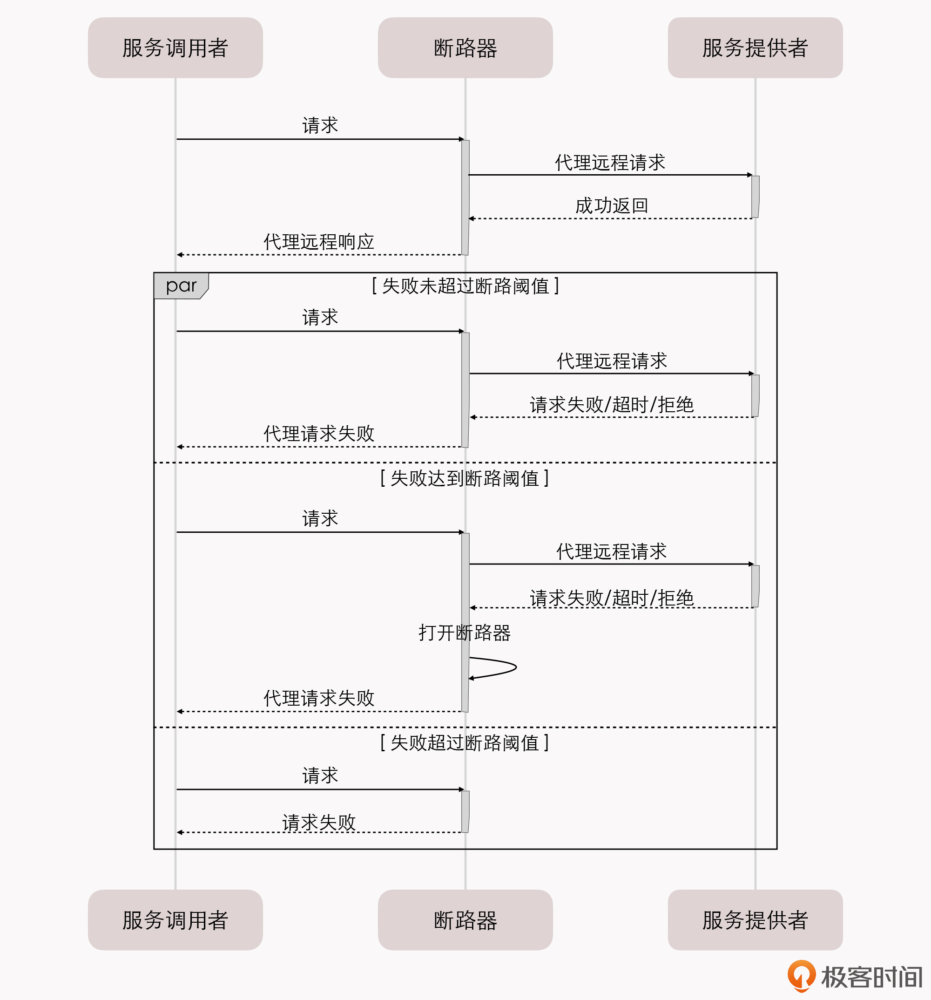
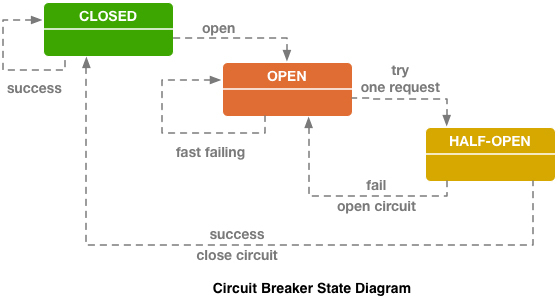
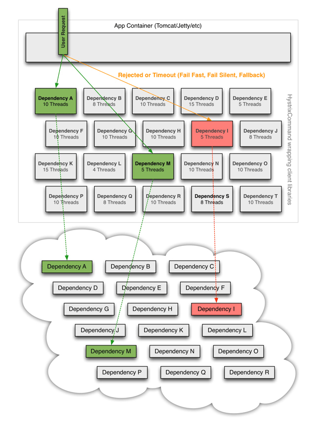

你好，我是周志明。今天，我们继续学习服务容错的实现方法。

在上一讲，我们首先界定了容错策略和容错设计模式这两个概念：**容错策略，指的是“面对故障，我们该做些什么”；而容错设计模式，指的是“要实现某种容错策略，我们该如何去做”**。

然后，我们讲了 **7 种常见的容错策略**，包括故障转移、快速失败、安全失败、沉默失败、故障恢复、并行调用和广播调用。

那么为了实现各种各样的容错策略，开发人员总结出了一些被实践证明有效的服务容错设计模式。这些设计模式，包括了这一讲我们要学习的，微服务中常见的断路器模式、舱壁隔离模式和超时重试模式等，以及我们下一讲要学习的流量控制模式，比如滑动时间窗模式、漏桶模式、令牌桶模式，等等。

我们先来学习断路器模式。

## 断路器模式

断路器模式是微服务架构中最基础的容错设计模式，以至于像 Hystrix 这种服务治理工具，我们往往会忽略了它的服务隔离、请求合并、请求缓存等其他服务治理职能，直接把它叫做微服务断路器或者熔断器。这下你明白断路器模式为啥是“最基础”的容错设计模式了吧，也明白为啥我们要首先学习这种模式了吧。

断路器模式最开始是由迈克尔 · 尼加德（Michael Nygard）在“[Release It!](https://book.douban.com/subject/2065284/)”这本书中提出来的，后来又因为马丁 · 福勒（Martin Fowler）的文章“[Circuit Breaker](https://martinfowler.com/bliki/CircuitBreaker.html)”而广为人知。

其实，**断路器的思路很简单**，就是通过代理（断路器对象）来一对一（一个远程服务对应一个断路器对象）地接管服务调用者的远程请求。那怎么实现的呢？

断路器会持续监控并统计服务返回的成功、失败、超时、拒绝等各种结果，当出现故障（失败、超时、拒绝）的次数达到断路器的阈值时，它的状态就自动变为“OPEN”。之后这个断路器代理的远程访问都将直接返回调用失败，而不会发出真正的远程服务请求。

通过断路器对远程服务进行熔断，就可以避免因为持续的失败或拒绝而消耗资源，因为持续的超时而堆积请求，最终可以避免雪崩效应的出现。由此可见，**断路器本质上是快速失败策略的一种实现方式**。

断路器模式的工作过程，可以用下面的序列图来表示：

从调用序列来看，断路器就是一种有限状态机，断路器模式就是根据自身的状态变化，自动调整代理请求策略的过程。

断路器一般可以设置为 CLOSED、OPEN 和 HALF OPEN 三种状态。

* CLOSED：表示断路器关闭，此时的远程请求会真正发送给服务提供者。断路器刚刚建立时默认处于这种状态，此后将持续监视远程请求的数量和执行结果，决定是否要进入 OPEN 状态。

* OPEN：表示断路器开启，此时不会进行远程请求，直接给服务调用者返回调用失败的信息，以实现快速失败策略。

* HALF OPEN：是一种中间状态。断路器必须带有自动的故障恢复能力，当进入 OPEN 状态一段时间以后，将“自动”（一般是由下一次请求而不是计时器触发的，所以这里的自动是带引号的）切换到 HALF OPEN 状态。在中间状态下，会放行一次远程调用，然后根据这次调用的结果成功与否，转换为 CLOSED 或者 OPEN 状态，来实现断路器的弹性恢复。

CLOSED、OPEN 和 HALF OPEN 这三种状态的转换逻辑和条件，如下图所示：

断路器的状态转换逻辑（图片引自“[Application Resiliency Using Netflix Hystrix](https://innovation.ebayinc.com/tech/engineering/application-resiliency-using-netflix-hystrix/)”）

OPEN 和 CLOSED 状态的含义是十分清晰的，和我们日常生活中电路的断路器并没有什么差别，值得讨论的是这两种状态的转换条件是什么？

最简单直接的方案是，只要遇到一次调用失败，那就默认以后所有的调用都会接着失败，断路器直接进入 OPEN 状态。但这样做的效果非常差，虽然避免了故障扩散和请求堆积，却使得在外部看来系统表现的极其不稳定。

那怎么解决这个问题呢？一个可行的办法是，当一次调用失败后，如果还同时满足下面两个条件，断路器的状态就变为 OPEN：

* 一段时间（比如 10 秒以内）内，请求数量达到一定阈值（比如 20 个请求）。这个条件的意思是，如果请求本身就很少，那就用不着断路器介入。

* 一段时间（比如 10 秒以内）内，请求的故障率（发生失败、超时、拒绝的统计比例）到达一定阈值（比如 50%）。这个条件的意思是，如果请求本身都能正确返回，也用不着断路器介入。

括号中举例的数值，10 秒、20 个请求、50%，是 Netflix Hystrix 的默认值。其他服务治理的工具，比如 Resilience4j、Envoy 等也有类似的设置，你可以在它们的帮助文档中找到对应的默认值。

借着断路器的上下文，我再顺带讲一下服务治理中两个常见的易混淆概念：服务熔断和服务降级之间的联系与差别。

断路器做的事情是自动进行服务熔断，属于一种快速失败的容错策略的实现方法。在快速失败策略明确反馈了故障信息给上游服务以后，上游服务必须能够主动处理调用失败的后果，而不是坐视故障扩散。这里的“处理”，指的就是一种典型的服务降级逻辑，降级逻辑可以是，但不应该只是，把异常信息抛到用户界面去，而应该尽力想办法通过其他路径解决问题，比如把原本要处理的业务记录下来，留待以后重新处理是最低限度的通用降级逻辑。

举个例子：你女朋友有事儿想召唤你，打你手机没人接，响了几声气冲冲地挂断后（快速失败），又打了你另外三个不同朋友的手机号（故障转移），都还是没能找到你（重试超过阈值）。这时候她生气地在微信上给你留言“三分钟不回电话就分手”，以此来与你取得联系。在这个不是太吉利的故事里，女朋友给你留言这个行为便是服务降级逻辑。

服务降级不一定是在出现错误后才被动执行的，我们在很多场景中谈论的降级更可能是指，需要主动迫使服务进入降级逻辑的情况。比如，出于应对可预见的峰值流量，或者是系统检修等原因，要关闭系统部分功能或关闭部分旁路服务，这时候就有可能会主动迫使这些服务降级。当然，此时服务降级就不一定是出于服务容错的目的了，更可能是属于下一讲我们要学习的流量控制的范畴。

## 舱壁隔离模式

了解了服务熔断和服务降级以后，我们再来看看微服务治理中常听见的另一概念：服务隔离。

舱壁隔离模式，是常用的实现服务隔离的设计模式。“舱壁”这个词来自造船业，它原本的意思是设计舰船时，要在每个区域设计独立的水密舱室，一旦某个舱室进水，也只会影响到这个舱室中的货物，而不至于让整艘舰艇沉没。

那对应到分布式系统中，服务隔离，就是避免某一个远程服务的局部失败影响到全局，而设置的一种止损方案。这种思想，对应的就是容错策略中的失败静默策略。那为什么会有一个服务失败会影响全局的事情发生呢？

咱们在刚刚学习断路器模式时，把调用外部服务的故障分为了失败、拒绝和超时三大类。

其中，“超时”引起的故障，尤其容易给调用者带来全局性的风险。这是因为，目前主流的网络访问大多是基于 TPR 并发模型（Thread per Request）来实现的，只要请求一直不结束（无论是以成功结束还是以失败结束），就要一直占用着某个线程不能释放。而线程是典型的整个系统的全局性资源，尤其是在 Java 这类将线程映射为操作系统内核线程来实现的语言环境中。

我们来看一个更具体的场景。

当分布式系统依赖的某个服务，比如“服务 I”发生了超时，那在高流量的访问下，或者更具体点，假设平均 1 秒钟内会调用这个服务 50 次，就意味着该服务如果长时间不结束的话，每秒会有 50 条用户线程被阻塞。

如果这样的访问量一直持续，按照 Tomcat 默认的 HTTP 超时时间 20 秒来计算的话，20 秒内将会阻塞掉 1000 条用户线程。此后才陆续会有用户线程因超时被释放出来，回归 Tomcat 的全局线程池中。

通常情况下，Java 应用的线程池最大只会设置为 200~400，这就意味着从外部来看，此时系统的所有服务已经全面瘫痪，而不仅仅是只有涉及到“服务 I”的功能不可用。因为 Tomcat 已经没有任何空余的线程来为其他请求提供服务了。

要解决这类问题，本质上就是要控制单个服务的最大连接数。一种可行的解决办法是**为每个服务单独设立线程池**，这些线程池默认不预置活动线程，只用来控制单个服务的最大连接数。

比如，对出问题的“服务 I”设置了一个最大线程数为 5 的线程池，这时候它的超时故障就只会最多阻塞 5 条用户线程，而不至于影响全局。此时，其他不依赖“服务 I”的用户线程，依然能够正常对外提供服务，如下图所示。

通过线程池将阻塞限制在一定范围内（图片来自[Hystrix 使用文档](https://github.com/Netflix/Hystrix/wiki)）

使用局部的线程池来控制服务的最大连接数，有很多好处，比如当服务出问题时能够隔离影响，当服务恢复后，还可以通过清理掉局部线程池，瞬间恢复该服务的调用。而如果是 Tomcat 的全局线程池被占满，再恢复就会非常麻烦。

但是，局部线程池有一个显著的弱点，那就是它额外增加了 CPU 的开销，每个独立的线程池都要进行排队、调度和下文切换工作。根据 Netflix 官方给出的数据，一旦启用 Hystrix 线程池来进行服务隔离，每次服务调用大概会增加 3~10 毫秒的延时。如果调用链中有 20 次远程服务调用的话，那每次请求就要多付出 60 毫秒至 200 毫秒的代价，来换取服务隔离的安全保障。

为应对这种情况，还有一种更轻量的控制服务最大连接数的办法，那就是**信号量机制（Semaphore）**。

如果不考虑清理线程池、客户端主动中断线程这些额外的功能，仅仅是为了控制单个服务并发调用的最大次数的话，我们可以只为每个远程服务维护一个线程安全的计数器，并不需要建立局部线程池。

具体做法是，当服务开始调用时计数器加 1，服务返回结果后计数器减 1；一旦计数器的值超过设置的阈值就立即开始限流，在回落到阈值范围之前都不再允许请求了。因为不需要承担线程的排队、调度和切换工作，所以单纯维护一个作为计数器的信号量的性能损耗，相对于局部线程池来说，几乎可以忽略不计。

以上介绍的是从微观的、服务调用的角度应用舱壁隔离设计模式，实际上舱壁隔离模式还可以在更高层、更宏观的场景中使用，不按调用线程，而是按功能、按子系统、按用户类型等条件来隔离资源都是可以的。比如，根据用户等级、用户是否是 VIP、用户来访的地域等各种因素，将请求分流到独立的服务实例去，这样即使某一个实例完全崩溃了，也只是影响到其中某一部分的用户，把波及范围尽可能控制住。

一般来说，我们会选择将服务层面的隔离实现在服务调用端或者边车代理上，将系统层面的隔离实现在 DNS 或者网关处。

到这里，我们回顾下已经学习了哪几种安全策略的实现方式：

* 使用断路器模式实现快速失败策略；

* 使用舱壁隔离模式实现静默失败策略；

* 在断路器中的案例中提到的主动对非关键的旁路服务进行降级，也可以算作是安全失败策略的一种体现。

再对照着我们上一讲学习的 7 种常见安全策略来说，我们还剩下故障转移和故障恢复两种策略的实现没有学习。接下来，我就以重试模式和你介绍这两种容错策略的主流实现方案。

## 重试模式

故障转移和故障恢复这两种策略都需要对服务进行重复调用，差别就在于这些重复调用有可能是同步的，也可能是后台异步进行；有可能会重复调用同一个服务，也可能会调用服务的其他副本。但是，无论具体是通过怎样的方式调用、调用的服务实例是否相同，都可以归结为重试设计模式的应用范畴。

重试模式适合解决系统中的瞬时故障，简单地说就是有可能自己恢复（Resilient，称为自愈，也叫做回弹性）的临时性失灵，比如网络抖动、服务的临时过载（比如返回了 503 Bad Gateway 错误）这些都属于瞬时故障。

重试模式实现起来并不难，即使完全不考虑框架的支持，程序员自己编写十几行代码也能完成。也正因为实现起来简单，使用重试模式面临的最大风险就是滥用。那怎么避免滥用呢？在实践中，**我们判断是否应该且是否能够对一个服务进行重试时，要看是否同时满足下面 4 个条件**。

第一，仅在主路逻辑的关键服务上进行同步的重试。也就是说，如果不是关键的服务，一般不要把重试作为首选的容错方案，尤其不应该进行同步重试。

第二，仅对由瞬时故障导致的失败进行重试。尽管要做到精确判定一个故障是否属于可自愈的瞬时故障并不容易，但我们至少可以从 HTTP 的状态码上获得一些初步的结论。比如，当发出的请求收到了 401 Unauthorized 响应时，说明服务本身是可用的，只是你没有权限调用，这时候再去重试就没有什么意义。

功能完善的服务治理工具会提供具体的重试策略配置（如 Envoy 的[Retry Policy](https://www.envoyproxy.io/learn/automatic-retries)），可以根据包括 HTTP 响应码在内的各种具体条件来设置不同的重试参数。

第三，仅对具备幂等性的服务进行重试。你可能会说了，如果服务调用者和提供者不属于同一个团队，那服务是否幂等，其实也是一个难以精确判断的问题。这个问题确实存在，但我们还是可以找到一些总体上通用的原则来帮助我们做判断。

比如，RESTful 服务中的 POST 请求是非幂等的；GET、HEAD、OPTIONS、TRACE 请求应该被设计成幂等的，因为它们不会改变资源状态；PUT 请求一般也是幂等的，因为 n 个 PUT 请求会覆盖相同的资源 n-1 次；DELETE 请求也可看作是幂等的，同一个资源首次删除会得到 200 OK 响应，此后应该得到 204 No Content 响应。

这些都是 HTTP 协议中定义的通用的指导原则，虽然对于具体服务如何实现并无强制约束力，但建设系统时遵循业界惯例本身就是一种良好的习惯。

第四，重试必须有明确的终止条件，常用的终止条件有超时终止和次数终止两种。

* 超时终止。其实，超时机制并不限于重试策略，所有涉及远程调用的服务都应该有超时机制来避免无限期的等待。这里我只是强调重试模式更应该配合超时机制来使用，否则重试对系统很可能是有害的。在介绍故障转移策略时，我已经举过类似的例子，你可以再去看一下。

* 次数终止。重试必须要有一定限度，不能无限制地做下去，通常是重试 2~5 次。因为重试不仅会给调用者带来负担，对服务提供者来说也同样是负担，所以我们要避免把重试次数设得太大。此外，如果服务提供者返回的响应头中带有[Retry-After](https://datatracker.ietf.org/doc/html/rfc7231#section-7.1.3)的话，尽管它没有强制约束力，我们也应该充分尊重服务端的要求，做个“有礼貌”的调用者。

另外，由于重试模式可以在网络链路的多个环节中去实现，比如在客户端发起调用时自动重试、网关中自动重试、负载均衡器中自动重试，等等，而且现在的微服务框架都足够便捷，只需设置一两个开关参数，就可以开启对某个服务、甚至是全部服务的重试机制了。

所以，如果你没有太多经验的话，可能根本就意识不到其中会带来多大的负担。

这里我给你举个具体的例子：一套基于 Netflix OSS 建设的微服务系统，如果同时在 Zuul、Feign 和 Ribbon 上都打开了重试功能，且不考虑重试被超时终止的话，那总重试次数就相当于它们的重试次数的乘积。假设按它们都重试 4 次，且 Ribbon 可以转移 4 个服务副本来计算的话，理论上最多会产生高达 4×4×4×4=256 次调用请求。

## 小结

熔断、隔离、重试、降级、超时等概念，都是建立具有韧性的微服务系统的必须的保障措施。那么就目前来说，这些措施的正确运作，主要还是依靠开发人员对服务逻辑的了解，以及根据运维人员的经验去静态地调整、配置参数和阈值。

但是，面对能够自动扩缩（Auto Scale）的大型分布式系统，静态的配置越来越难以起到良好的效果。

所以这就要求，系统不仅要有能力可以自动地根据服务负载来调整服务器的数量规模，同时还要有能力根据服务调用的统计结果，或者[启发式搜索](https://en.wikipedia.org/wiki/Heuristic_(computer_science))的结果来自动变更容错策略和参数。当然，目前这方面的研究，还处于各大厂商在内部分头摸索的初级阶段，不过这正是服务治理未来的重要发展方向之一。

这节课我给你介绍的容错策略和容错设计模式，最终目的都是为了避免服务集群中，某个节点的故障导致整个系统发生雪崩效应。

但我们要知道，仅仅做到容错，只让故障不扩散是远远不够的，我们还希望系统或者至少系统的核心功能能够表现出最佳的响应的能力，不受或少受硬件资源、网络带宽和系统中一两个缓慢服务的拖累。在下一节课，我们还将会面向如何解决集群中的短板效应，去讨论服务质量、流量管控等话题。

## 一课一思

服务容错一般由底层的服务治理框架来负责实现，你使用过哪些服务治理框架呢？能对比一下这些框架的优缺点吗？

欢迎在留言区分享你的答案。如果你觉得有收获，欢迎你把今天的内容分享给更多的朋友。感谢你的阅读，我们下一讲再见。