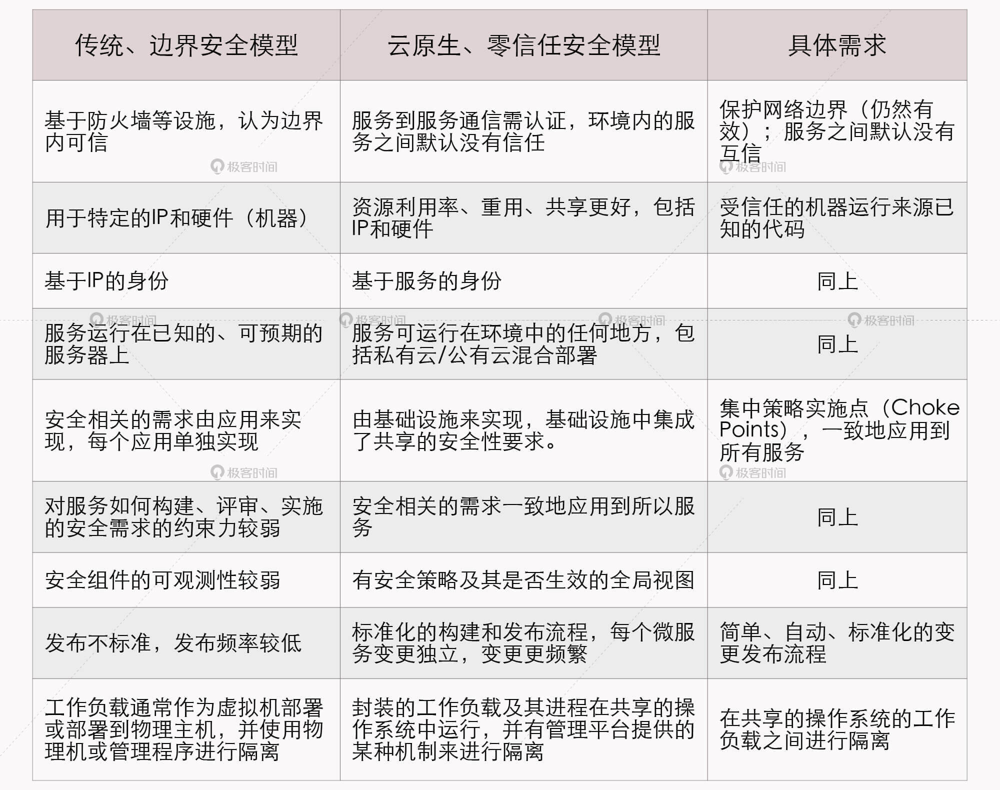

你好，我是周志明。

在学完[第 4 讲](https://time.geekbang.org/column/article/312390)的课程之后，现在我们知道了微服务的核心技术特征之一是**分散治理**（Decentralized Governance），这表明了微服务并不追求统一的技术平台，而是提倡让团队有自由选择的权利，不受制于语言和技术框架。

在开发阶段构建服务时，分散治理打破了由技术栈带来的约束，它带来的好处是不言自明的。但在运维阶段部署服务时，尤其是在考量起安全问题时，由 Java、Golang、Python、Node.js 等多种语言和框架共同组成的微服务系统，出现安全漏洞的概率肯定要比只采用其中某种语言、某种框架所构建的单体系统更高。

于是，为了避免由于单个服务节点出现漏洞被攻击者突破，进而导致整个系统和内网都遭到入侵，我们就必须打破一些传统的安全观念，以此来构筑更加可靠的服务间通讯机制。

## 基于边界的安全模型

长期以来，主流的网络安全观念都比较提倡根据某类与宿主机相关的特征，比如机器所处的位置，或者机器的 IP 地址、子网等等，把网络划分为不同的区域，不同的区域对应不同的风险级别和允许访问的网络资源权限，把安全防护措施集中部署在各个区域的边界之上，重点关注跨区域的网络流量。

现在我们所熟知的 VPN、DMZ、防火墙、内网、外网等概念，可以说都是因此而生的，这种安全模型今天也被叫做是**基于边界的安全模型**（Perimeter-Based Security Model，简称“边界安全”）。

边界安全是完全合情合理的做法，在“安全架构”这个小章节中，我就强调过**安全不可能是绝对的**，我们必须在可用性和安全性之间做好权衡和取舍。不然我们想想，把一台“服务器”的网线拔掉、电源关掉，不让它对外提供服务，那它肯定是最安全的。

另外，边界安全着重检查的是经过网络区域边界的流量，而对可信任区域（内网）内部机器之间的流量，会给予直接信任、或者至少是较为宽松的处理策略，这样就减小了安全设施对整个应用系统复杂度的影响，以及网络传输性能的额外损耗，所以它当然是很合理的。

可是，今天单纯的边界安全，已经不能满足大规模微服务系统技术异构和节点膨胀的发展需要了。

这是因为**边界安全的核心问题在于**，边界上的防御措施即使自身能做到永远滴水不漏、牢不可破，也很难保证内网中它所尽力保护的某一台服务器不会成为“猪队友”，一旦“可信的”网络区域中的某台服务器被攻陷，那边界安全措施就成了马其诺防线，攻击者很快就能以一台机器为跳板，侵入到整个内网。

实际上，这是边界安全的基因所决定的固有缺陷，从边界安全被提出的第一天起，这就已经是可以预料到的问题了。不过在微服务时代，我们已经转变了开发观念，承认服务了总是会出错的，那么现在我们也必须转变安全观念，承认一定会有被攻陷的服务。

为此，我们就需要寻找到与之匹配的新的网络安全模型。

## 零信任安全模型

2010 年，[Forrester Research](https://en.wikipedia.org/wiki/Forrester_Research)的首席分析师约翰 · 金德维格（John Kindervag）提出了零信任安全模型的概念（Zero-Trust Security Model，后面简称“零信任安全”），最初提出时它是叫“零信任架构”（Zero-Trust Architecture），这个概念在当时并没有引发太大的关注，但随着微服务架构的日渐兴盛，越来越多的开发和运维人员注意到零信任安全模型与微服务所追求的安全目标是高度吻合的。

零信任安全的中心思想是**不应当以某种固有特征来自动信任任何流量**，除非明确得到了能代表请求来源（不一定是人，更可能是另一台服务）的身份凭证，否则一律不会有默认的信任关系。

在 2019 年，Google 发表了一篇在安全与研发领域里都备受关注的论文《[BeyondProd: A New Approach to Cloud-Native Security](https://cloud.google.com/docs/security/beyondprod?hl=zh_cn)》（BeyondCorp 和 BeyondProd 是谷歌最新一代安全框架的名字），其中详细列举了传统的基于边界的网络安全模型，与云原生时代下基于零信任网络的安全模型之间的差异，并描述了要完成边界安全模型到零信任安全模型的迁移所要实现的具体需求点，这里我把它翻译、整理了出来，你可以参考下：

这个表格已经系统地阐述了零信任安全在微服务、云原生环境中的具体落地过程了，后续的整篇论文（除了介绍 Google 自己的实现框架外）就是以此为主线来展开论述的，但是这个表格还是过于简单，论文原文也写得比较分散晦涩，所以这里我就根据自己的理解，给你展开介绍一下其中的主要观点，以此让你进一步理解零信任安全的含义。

**零信任网络不等同于放弃在边界上的保护设施**

虽然像防火墙这样的位于网络边界的设施，是属于边界安全而不是零信任安全的概念，但它仍然是一种提升安全性的有效且必要的做法。在微服务集群的前端部署防火墙，把内部服务节点间的流量与来自互联网的流量隔离开，这种做法无论何时都是值得提倡的，因为这样至少能够让内部服务避开来自互联网未经授权流量的饱和攻击，比如最典型的[DDoS 拒绝服务攻击](https://en.wikipedia.org/wiki/Denial-of-service_attack)。

**身份只来源于服务**

我们知道，传统应用一般是部署在特定的服务器上的，这些机器的 IP、MAC 地址很少会发生变化，此时系统的拓扑状态是相对静态的。基于这个前提，安全策略才会使用 IP 地址、主机名等作为身份标识符（Identifiers），无条件信任具有特性身份表示的服务。

而如今的微服务系统，尤其是云原生环境中的微服务系统，其虚拟化基础设施已经得到了大范围的应用，这就会导致服务所部署的 IP 地址、服务实例的数量随时都可能发生变化。因此，身份只能来源于服务本身所能够出示的身份凭证（通常是数字证书），而不再是服务所在的 IP 地址、主机名或者其他特征。

**服务之间也没有固有的信任关系**

这点决定了只有已知的、明确授权的调用者才能访问服务，从而阻止攻击者通过某个服务节点中的代码漏洞来越权调用到其他服务。

另外，如果某个服务节点被成功入侵，这个原则也能阻止攻击者扩大其入侵范围。这个其实比较类似于微服务设计模式中，使用断路器、舱壁隔离实现容错来避免雪崩效应，在安全方面，我们也应当采用这种“互不信任”的模式来隔离入侵危害的影响范围。

**集中、共享的安全策略实施点**

这点与微服务的“分散治理”刚好相反，微服务提倡每个服务独立地负责自身所有的功能性与非功能性需求。而 Google 这个观点相当于为分散治理原则做了一个补充：分散治理，但涉及安全的非功能性需求（如身份管理、安全传输层、数据安全层）最好除外。

一方面，要写出高度安全的代码非常不容易，为此付出的精力甚至可能远高于业务逻辑本身。如果你有兴趣阅读[基于 Spring Cloud 的 Fenix's Bookstore 的源码](https://icyfenix.cn/exploration/projects/microservice_arch_springcloud.html)，很容易就会发现在 Security 工程中的代码量是该项目中，所有微服务中最多的。

更重要的是另一方面，也就是如果让服务各自处理安全问题，很容易会出现实现不一致、或者出现漏洞时要反复修改多处地方的情况，而且还有一些安全问题，如果不立足于全局是很难彻底解决的（在下节课面向具体操作实践的“服务安全”中我还会详细讲述）。

所以，Google 明确提出应该有集中式的“安全策略实施点”（原文中称为 Choke Points），安全需求应该从微服务的应用代码下沉至云原生的基础设施里，这也就契合了论文的标题“Cloud-Native Security”。

**受信的机器运行来源已知的代码**

这条原则就限制了服务只能使用认证过的代码和配置，并且只能运行在认证过的环境中。

分布式软件系统除了促使软件架构发生了重大变化之外，对软件的发布流程也有很大的改变，使其严重依赖[持续集成与持续部署](https://en.wikipedia.org/wiki/CI/CD)（Continuous Integration / Continuous Delivery，CI/CD）。从开发人员编写代码，到自动化测试，到自动集成，再到漏洞扫描，最后发布上线，这整套 CI/CD 流程被称作“软件供应链”（Software Supply Chain）。

可是安全问题并不仅仅局限于软件运行阶段。我举个例子，之前造成过很大影响的[XCodeGhost 风波](https://en.wikipedia.org/wiki/XcodeGhost)，就是针对软件供应链的攻击事件，它是在编译阶段把恶意代码嵌入到软件当中，只要安装了此软件的用户就可能触发恶意代码。

因此也是为了避免这样的事件再发生，零信任安全针对软件供应链的每一步，都加入了安全控制策略。

**自动化、标准化的变更管理**

这点也是提倡要通过基础设施，而不是应用代码去实现安全功能的另一个重要理由。如果将安全放在应用上，由于应用本身的分散治理，这决定了安全也必然是难以统一和标准化的，而做不到标准化就意味着做不到自动化。

相反，一套独立于应用的安全基础设施，就可以让运维人员轻松地了解基础设施变更对安全性的影响，并且可以在几乎不影响生产环境的情况下，发布安全补丁程序。

**强隔离性的工作负载**

“工作负载”的概念贯穿了 Google 内部的 Borg 系统与后来的 Kubernetes 系统，它是指在虚拟化技术支持下，运行的一组能够协同提供服务的镜像。下个模块我介绍云原生基础设施的时候，会详细介绍容器化，这里我先给你说明一个要点，就是容器化仅仅是虚拟化的一个子集。

实际上，容器比起传统虚拟机的隔离能力是有所降低的，这种设计对性能非常有利，却对安全相对不利，因此在强调安全性的应用里，会有专门关注强隔离性的容器运行工具出现。

## Google 的零信任安全实践

Google 认为，零信任安全模型的最终目标是实现整个基础设施之上的自动化安全控制，服务所需的安全能力可以与服务自身一起，以相同方式自动进行伸缩扩展。

对于程序来说，做到安全是日常，风险是例外（Secure by Default and Insecure by Exception）；对于人类来说，做到袖手旁观是日常，主动干预是例外（Human Actions Should Be by Exception, Not Routine）。

这的确是很美好的愿景，只是这种“喊口号”式的目标，在软件发展史上也提出过很多次，却一直难以真正达成，其中的原因我在开篇其实就提到过，**安全不可能是绝对的，而是有成本的**。

那么你其实也能很明显地发现，之所以在今天这节课，我们才真正严肃地讨论零信任网络模型，并不是因为它本身有多么巧妙、有什么此前没有想到的好办法，而是因为它受制于前面我提到的边界安全模型的“合理之处”，即“安全设施对整个应用系统复杂度的影响，以及网络传输性能的额外损耗”。

**那到底零信任安全要实现这个目标的代价是什么呢？会有多大？** 这里我根据 Google 论文的观点来回答下这个问题：为了保护服务集群内的代码与基础设施，Google 设计了一系列的内部工具，才最终得以实现前面所说的那些安全原则：

* **为了在网络边界上保护内部服务免受 DDoS 攻击**，设计了名为 Google Front End（名字意为“最终用户访问请求的终点”）的边缘代理，负责保证此后所有流量都在 TLS 之上传输，并自动将流量路由到适合的可用区域之中。

* **为了强制身份只来源于服务**，设计了名为 Application Layer Transport Security（应用层传输安全）的服务认证机制，这是一个用于双向认证和传输加密的系统，它可以自动把服务与它的身份标识符绑定，使得所有服务间流量都不必再使用服务名称、主机 IP 来判断对方的身份。

* **为了确保服务间不再有默认的信任关系**，设计了 Service Access Policy（服务访问策略），来管理一个服务向另一个服务发起请求时需要提供的认证、鉴权和审计策略，并支持全局视角的访问控制与分析，以达成“集中、共享的安全策略实施点”这条原则。

* **为了实现仅以受信的机器运行来源已知的代码**，设计了名为 Binary Authorization（二进制授权）的部署时检查机制，确保在软件供应链的每一个阶段，都符合内部安全检查策略，并对此进行授权与鉴权。同时谷歌设计了名为 Host Integrity（宿主机完整性）的机器安全启动程序，在创建宿主机时，自动验证包括 BIOS、BMC、Bootloader 和操作系统内核的数字签名。

* **为了工作负载能够具有强隔离性**，设计了名为[gVisor](https://en.wikipedia.org/wiki/GVisor)的轻量级虚拟化方案。这个方案与此前由 Intel 发起的[Kata Containers](https://katacontainers.io/)的思路异曲同工，目的都是解决容器共享操作系统内核而导致隔离性不足的安全缺陷，它们的做法也都是为每个容器提供了一个独立的虚拟 Linux 内核。比如，gVisor 是用 Golang 实现了一个名为[Sentry](https://github.com/google/gvisor/tree/master/pkg/sentry)的、能够提供传统操作系统内核能力的进程。严格来说，无论是 gVisor 还是 Kata Containers，尽管都披着容器运行时的外衣，但它们在本质上都是轻量级虚拟机。

到这里，作为一名普通的软件开发者，你在看完 Google 关于零信任安全的论文，或者学习完我这些简要的转述，了解到即使是 Google 也必须要花费如此庞大的精力，才能做到零信任安全，那你最有可能的感受，大概不是对零信任安全心生向往，而是准备对它挥手告别了。

其实哪怕不需要开发、不需要购买，免费把前面 Google 开发的安全组件赠送给我们，大多数的开发团队恐怕也没有足够的运维能力。

## 小结

在微服务时代以前，传统的软件系统与研发模式的确是很难承受零信任安全模型的代价的，只有到了云原生时代，虚拟化的基础设施长足发展，能将复杂性隐藏于基础设施之内，开发者不需要为了达成每一条安全原则，而专门开发或引入可感知的安全设施；只有容器与虚拟化网络的性能足够高，在可以弥补安全隔离与安全通讯的额外损耗的前提下，零信任网络的安全模型才有它生根发芽的土壤。

另外，零信任安全引入了比边界安全更细致、更复杂的安全措施的同时，也强调自动与透明的重要性。这既要保证系统各个微服务之间能安全通讯，同时也不削弱微服务架构本身的设计原则，比如集中式的安全并不抵触于分散治理原则，安全机制并不影响服务的自动伸缩和有效的封装，等等。

总而言之，只有零信任安全的成本在开发与运维上都是可接受的，它才不会变成仅仅具备理论可行性的“大饼”，不会给软件带来额外的负担。

当然，如何构建零信任网络安全是一个非常大而且比较前沿的话题，在下一节课，我会从实践的角度出发，更具体、更量化地给你展示零信任安全模型的价值与权衡。

## 一课一思

你认为零信任安全所付出的代价与收益是什么？在实践中，你应该如何权衡两者的权重呢？

欢迎在留言区分享你的思考和见解。如果你觉得有收获，也欢迎把今天的内容分享给更多的朋友。感谢你的阅读，我们下一讲再见。