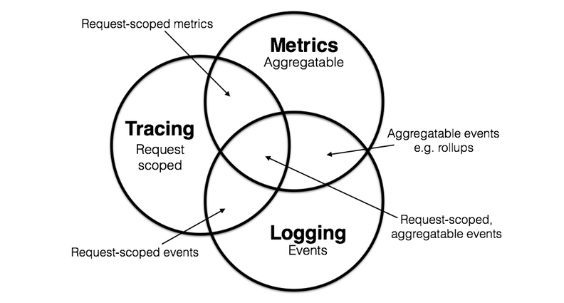

你好，我是周志明。从这节课开始，我们将会花四节课的时间去学习“可观测性”方面的知识。

在以前，可观测性并不是软件设计中要重点考虑的问题，甚至很长时间里，人们也并没有把这种属性与可并发性、可用性、安全性等并列，作为系统的非功能属性之一，直到微服务与云原生时代的来临。

对于单体系统来说，可观测性可能确实是附属的边缘属性，但对于分布式系统来说，可观测性就是不可或缺的了。为什么呢？别着急，接下来我就跟你详细说道说道。

## 可观测性的概念

好，首先呢，我们来了解下可观测性的含义和特点。

随着分布式架构逐渐成为了架构设计的主流，[可观测性](https://en.wikipedia.org/wiki/Observability)（Observability）一词也日益被人频繁地提起。

最初，它是与[可控制性](https://en.wikipedia.org/wiki/Controllability)（Controllability）一起，由匈牙利数学家鲁道夫 · 卡尔曼（Rudolf E. Kálmán）针对线性动态控制系统提出的一组对偶属性。可观测性原本的含义是“可以由系统的外部输出推断其内部状态的程度”。

在学术界，“可观测性”这个名词其实是最近几年才从控制理论中借用的舶来概念，不过实际上，计算机科学中关于可观测性的研究内容已经有了很多年的实践积累。通常，人们会把可观测性分解为三个更具体的方向进行研究，分别是：**日志收集、链路追踪和聚合度量**。

这三个方向各有侧重，但又不是完全独立的，因为它们天然就有重合或者可以结合的地方。

在 2017 年的分布式追踪峰会（2017 Distributed Tracing Summit）结束后，彼得 · 波本（Peter Bourgon）撰写了总结文章《[Metrics, Tracing, and Logging](https://peter.bourgon.org/blog/2017/02/21/metrics-tracing-and-logging.html)》，就系统地阐述了这三者的定义、特征，以及它们之间的关系与差异，受到了业界的广泛认可。

[日志、追踪、度量的目标与结合](https://peter.bourgon.org/blog/2017/02/21/metrics-tracing-and-logging.html)

假如你平时只开发单体系统，从来没有接触过分布式系统的观测工作，那你可能就只熟悉日志这一项工作，对追踪和度量会相对比较陌生。

然而按照彼得 · 波本（Peter Bourgon）给出的定义来看，尽管在分布式系统中，追踪和度量的必要性和复杂程度确实比单体系统时要更高，但是在单体时代，你肯定已经接触过这三项工作了，只是并没有意识到而已。

你可能会想进一步了解这三项工作的具体含义，想知道为什么要这样划分，下面我来给你简单介绍一下它们各自的特征，你就能明白其中的原因了：

**日志（Logging）**

我们都知道，日志的职责是记录离散事件，通过这些记录事后分析出程序的行为，比如曾经调用过什么方法、曾经操作过哪些数据，等等。通常，打印日志被认为是程序中最简单的工作之一，你在调试问题的时候，可能也经历过这样的情景“当初这里记得打点日志就好了”，可见这就是一项举手之劳的任务。

当然，输出日志的确很容易，但收集和分析日志却可能会很复杂，面对成千上万的集群节点、面对迅速滚动的事件信息、面对数以 TB 计算的文本，传输与归集都并不简单。对大多数程序员来说，分析日志也许就是最常遇见、也最有实践可行性的“大数据系统”了。

**追踪（Tracing）**

在单体系统时代，追踪的范畴基本只局限于[栈追踪](https://en.wikipedia.org/wiki/Stack_trace)（Stack Tracing）。比如说，你在调试程序的时候，在 IDE 打个断点，看到的 Call Stack 视图上的内容便是跟踪；在编写代码时，处理异常调用了 Exception::printStackTrace() 方法，它输出的堆栈信息也是追踪。

而在微服务时代，追踪就不只局限于调用栈了，一个外部请求需要内部若干服务的联动响应，这时候完整的调用轨迹就会跨越多个服务，会同时包括服务间的网络传输信息与各个服务内部的调用堆栈信息。因此，分布式系统中的追踪在国内通常被称为“**全链路追踪**”（后面我就直接称“链路追踪”了），许多资料中也把它叫做是“[分布式追踪](https://opentracing.io/docs/overview/what-is-tracing/)”（Distributed Tracing）。

**追踪的主要目的是排查故障**，比如分析调用链的哪一部分、哪个方法出现错误或阻塞，输入输出是否符合预期，等等。

**度量（Metrics）**

度量是指对系统中某一类信息的统计聚合。比如，证券市场的每一只股票都会定期公布财务报表，通过财报上的营收、净利、毛利、资产、负载等等一系列数据，来体现过去一个财务周期中公司的经营状况，这就是一种信息聚合。

Java 天生自带有一种基本的度量，就是由虚拟机直接提供的 JMX（Java Management eXtensions）度量，像是内存大小、各分代的用量、峰值的线程数、垃圾收集的吞吐量、频率，等等，这些数据信息都可以从 JMX 中获得。

**度量的主要目的是监控（Monitoring）和预警（Alert）**，比如说，当某些度量指标达到了风险阈值时就触发事件，以便自动处理或者提醒管理员介入。

那到这里，你应该也就知道为什么在单体系统中，除了接触过日志之外，其实也同样接触过其他两项工作了，因为追踪和度量本来就是我们调试和监控程序时的常用手段。

好，说完了学术界对于可观测性的定义和研究，下面我们来看看对于工业界，在云原生时代下，这三个方向都有哪些新的发展。

## 工业界的遥测产品

在工业界，目前针对可观测性的产品已经是一片红海，经过多年的角逐，日志、度量两个领域的胜利者算是基本尘埃落定了。

一方面，在日志领域，日志收集和分析大多被统一到了 Elastic Stack（ELK）技术栈上，如果说未来还能出现什么变化的话，也就是其中的 Logstash 能看到有被 Fluentd 取代的趋势，让 ELK 变成 EFK，但整套 Elastic Stack 技术栈的地位已经是相当稳固了。

而在度量方面，跟随着 Kubernetes 统一容器编排的步伐，Prometheus 也击败了度量领域里以 Zabbix 为代表的众多前辈，即将成为云原生时代度量监控的事实标准。虽然从市场角度来说，Prometheus 还没有达到 Kubernetes 那种“拔剑四顾，举世无敌”的程度，但是从社区活跃度上看，Prometheus 已经占有了绝对的优势，在 Google 和 CNCF 的推动下，未来前途可期。

>**额外知识：Kubernetes 与 Prometheus 的关系**
>
>Kubernetes 是 CNCF 第一个孵化成功的项目，Prometheus 是 CNCF 第二个孵化成功的项目。
>
>Kubernetes 起源于 Google 的编排系统 Borg，Prometheus 起源于 Google 为 Borg 做的度量监控系统 BorgMon。

不过，追踪方面的情况与日志、度量有所不同，追踪是与具体网络协议、程序语言密切相关的。

我们在收集日志时，不必关心这段日志是由 Java 程序输出的，还是由 Golang 程序输出的，对程序来说它们就只是一段非结构化文本而已；同理，度量对程序来说，也只是一个个聚合的数据指标而已。

但链路追踪就不一样了，各个服务之间是使用 HTTP 还是 gRPC 来进行通信，会直接影响到追踪的实现，各个服务是使用 Java、Golang 还是 Node.js 来编写，也会直接影响到进程内调用栈的追踪方式。

所以，这就决定了追踪工具本身有较强的侵入性，通常是以插件式的探针来实现的；这也决定了在追踪领域很难出现一家独大的情况，通常要有多种产品来针对不同的语言和网络。

最近几年，各种链路追踪产品层出不穷，市面上主流的工具，既有像 Datadog 这样的一揽子商业方案，也有像 AWS X-Ray 和 Google Stackdriver Trace 这样的云计算厂商产品，还有像 SkyWalking、Zipkin、Jaeger 这样来自开源社区的优秀产品。

[日志、追踪、度量的相关产品](https://landscape.cncf.io/)

这里我给出的示意图是[CNCF Interactive Landscape](https://landscape.cncf.io/)中列出的日志、追踪、度量领域的著名产品。其实这里很多不同领域的产品是跨界的，比如，ELK 可以通过 Metricbeat 来实现度量的功能；Apache SkyWalking 的探针就可以同时支持度量和追踪两方面的数据来源；由[OpenTracing](https://opentracing.io/)进化而来[OpenTelemetry](https://opentelemetry.io/)，更是融合了日志、追踪、度量三者所长，有望成为三者兼备的统一可观测性的解决方案。在后面关于可观测性的三节课里，我也会紧扣每个领域中最具统治性的产品，给你做一个详细的介绍。

## 小结

这节课，我们了解了可观测性的概念、特征与现状，并明确了在今天，可观测性一般会被分成事件日志、链路追踪和聚合度量三个主题方向进行探讨和研究。你可以记住以下几个核心要点：

* 事件日志的职责是记录离散事件，通过这些记录事后分析出程序的行为；

* 追踪的主要目的是排查故障，比如分析调用链的哪一部分、哪个方法出现错误或阻塞，输入输出是否符合预期；

* 度量是指对系统中某一类信息的统计聚合，主要目的是监控和预警，当某些度量指标达到风险阈值时就触发事件，以便自动处理或者提醒管理员介入。

另外，事件日志、链路追踪和聚合度量这三个主题也是未来三节课我们要学习的主角，到时你也可以与这节课的学习内容相互印证。

## 一课一思

尽管“可观测性”今天已经被提升到了与“可用性”“可并发性”等同等的高度，但实际是否如此呢？在你的公司设计软件系统的时候，可观测性的考虑权重有多大？

欢迎在留言区分享你的见解。好，感谢你的阅读，如果觉得有收获，也欢迎你把今天的内容分享给更多的朋友。就到这里，我们下一讲再见。