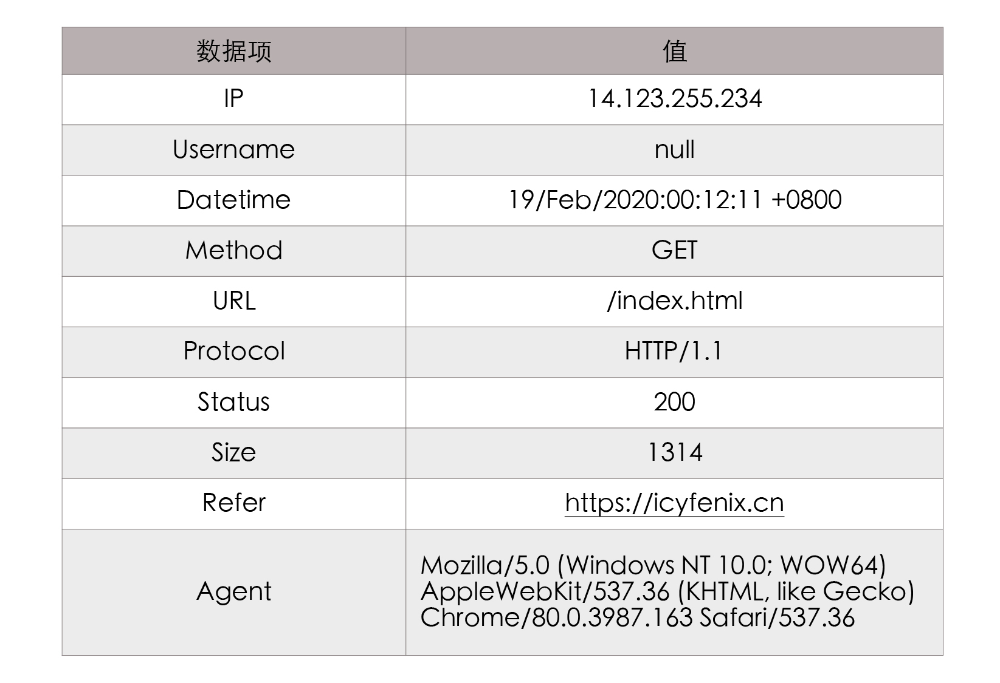
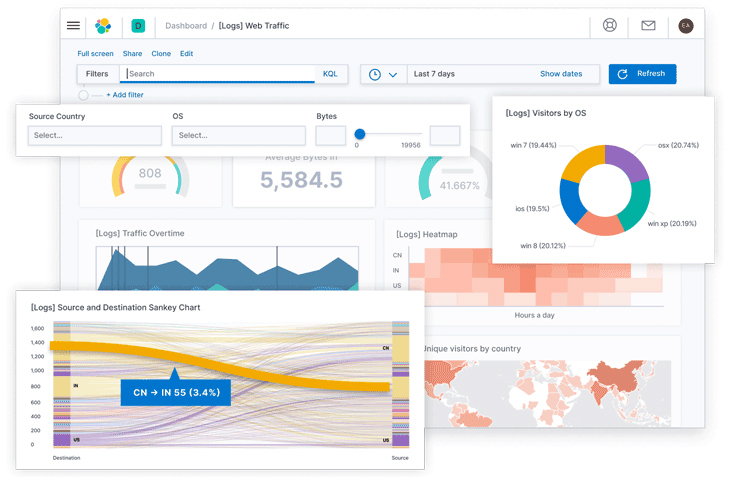

你好，我是周志明。

在上节课明确了可观测性的概念、特征与现状之后，我们知道了可观测性一般会被分成三种具体的表现形式，分别是日志、追踪和度量。那么这节课，我们就来讨论其中最普遍的形式：事件日志。

日志主要是用来记录系统运行期间发生过的离散事件。我想应该没有哪一个生产系统会缺少日志功能，不过我也相信，没有多少人会把日志看作是多关键的功能。它就像是阳光与空气，不可或缺但又不太被人重视。

除此之外，我想在座的很多人也都会说日志很简单，其实这是在说“打印日志”这个操作简单。打印日志的目的是为了日后能从中得到有价值的信息，而今天只要是稍微复杂点的系统，尤其是复杂的分布式系统，就很难只依靠 tail、grep、awk 来从日志中挖掘信息了，往往还要有专门的全局查询和可视化功能。

此时，从打印日志到分析查询之间，还隔着收集、缓冲、聚合、加工、索引、存储等若干个步骤，如下图所示：


日志处理过程

而这一整个链条中，会涉及到大量需要我们注意的细节，其复杂性并不亚于任何一项技术或业务功能的实现。所以接下来，我就以这个日志的处理过程为主线，以最成熟的 Elastic Stack 技术栈为例子，给你介绍该链条每个步骤的目的与方法。

好，下面我们就先来了解下日志处理中的输出工作。

## 输出

要是说好的日志能像文章一样，让人读起来身心舒畅，这话肯定有夸大的成分，不过好的日志应该能做到像“流水账”一样，可以毫无遗漏地记录信息，格式统一，内容恰当。其中，**“恰当”是一个难点，它要求日志不应该过多，也不应该过少**。

这里的“多与少”一般不针对输出的日志行数。尽管我听说过最夸张的系统，有单节点 INFO 级别下，每天的日志都能以 TB 计算（这样的是代码有问题的），给网络与磁盘 I/O 带来了不小的压力，但我通常不会用数量来衡量日志是否恰当。

我所说的“恰当”，是指**日志中不该出现的内容不要有，而该有的不要少**。具体是什么意思呢？下面我就分别给你举几个例子。

### 不该出现的内容不要有

首先，我们来看看有哪些常见的“不应该有”的日志内容：

* **避免打印敏感信息**

    不用专门去提醒，我们肯定都知道不该把密码、银行账号、身份证件等这些敏感信息打到日志里，但我就见过不止一个系统的日志中，能直接找到这些信息。一旦这些敏感信息随日志流到了后续的索引、存储、归档等步骤后，清理起来就会非常麻烦。

    不过，日志中应该要包含必要的非敏感信息，比如当前用户的 ID（最好是内部 ID，避免登录名或者用户名称），有些系统就直接用[MDC](https://logging.apache.org/log4j/1.x/apidocs/org/apache/log4j/MDC.html)（Mapped Diagnostic Context）把用户 ID 自动打印在 Pattern Layout 上。

* **避免引用慢操作**

    要知道，日志中打印的信息应该是在上下文中可以直接取到的，而如果当前的上下文中根本没有这项数据，需要专门调用远程服务或者从数据库中获取，又或者要通过大量计算才能取到的话，那我们就应该先考虑下，这项信息放到日志中是不是必要且恰当的。

    即日志中不要打印方法输入参数、输出结果、方法执行时长之类的调试信息。

    这个观点其实是反直觉的，不少公司甚至会提倡把这一点作为最佳实践，但是我仍然坚持把它归入反模式中。这是因为日志的职责是记录事件，而追踪诊断应该由追踪系统去处理，哪怕贵公司完全没有开发追踪诊断方面功能的打算，我也建议使用[BTrace](https://github.com/btraceio/btrace)或者[Arthas](https://github.com/alibaba/arthas)这类“On-The-Fly”的工具来解决。

    还有，我之所以将其归为反模式，也是因为前面所说的敏感信息、慢操作等主要源头，就是这些原本想用于调试的日志。

    比如，当前方法入口参数有个 User 对象，如果要输出这个对象的话，常见的做法是将它序列化成 JSON 字符串，然后打到日志里。那么这个时候，User 里面的 Password 字段、BankCard 字段就很容易被暴露出来。

    再比如，当前方法的返回值是个 Map，我们在开发期的调试数据只做了三五个 Entity，然后觉得遍历一下把具体内容打到日志里面没什么问题。而到了生产期，这个 Map 里面有可能存放了成千上万个 Entity，那么这时候打印日志就相当于引用慢操作了。

* **避免误导他人**

    你可能也知道，在日志中给以后调试除错的人挖坑是十分恶劣却又常见的行为。不过我觉得大部分人并不是专门要去误导别人，很可能只是无意识地这样做了。

    比如，明明已经在逻辑中妥善处理好了某个异常，只是偏习惯性地调用 printStackTrace() 方法，把堆栈打到日志中，那么一旦这个方法附近出现问题，由其他人来除错的话，就很容易会盯着这段堆栈去找线索，从而浪费大量时间。

* ……

### 该出现的内容不要少

然后，日志中不该缺少的内容也“不应该少”，这里我同样给你举几个建议应该输出到日志中的内容的例子：

* **处理请求时的 TraceID**

    当服务收到请求时，如果该请求没有附带 TraceID，就应该自动生成唯一的 TraceID 来对请求进行标记，并使用 MDC 自动输出到日志。TraceID 会贯穿整条调用链，目的是通过它把请求在分布式系统各个服务中的执行过程给串联起来。TraceID 通常也会随着请求的响应返回到客户端，如果响应内容出现了异常，用户就能通过此 ID 快速找到与问题相关的日志。

    这个 TraceID 其实是链路追踪里的概念，类似的还有用于标识进程内调用状况的 SpanID，在 Java 程序中，这些都可以用 Spring Cloud Sleuth 来自动生成（下一讲我还会提到）。

    另外，尽管 TraceID 在分布式追踪系统中会发挥最大的作用，但对单体系统来说，将 TraceID 记录到日志并返回给最终用户，对快速定位错误也仍然十分有价值。

* **系统运行过程中的关键事件**

    我们都知道，日志的职责就是记录事件，包括系统进行了哪些操作、发生了哪些与预期不符的情况、在运行期间出现了哪些未能处理的异常或警告、定期自动执行的各种任务，等等，这些都应该在日志中完整地记录下来。

    那么原则上，程序中发生的事件只要有价值，就应该去记录，但我们还是要判断清楚事件的重要程度，选定相匹配的日志的级别。至于如何快速处理大量日志，这是后面的步骤需要考虑的问题，如果输出日志实在太频繁，以至于影响到了性能，就应该由运维人员去调整全局或单个类的日志级别来解决。

* **启动时输出配置信息**

    与避免输出诊断信息不同，对于系统启动时或者检测到配置中心变化时更新的配置，就应该把非敏感的配置信息输出到日志中，比如连接的数据库、临时目录的路径等等，因为初始化配置的逻辑一般只会执行一次，不便于诊断时复现，所以应该输出到日志中。

* ……

总而言之，日志输出是程序中非常普遍的行为，我们要把握好“不应该有”和“不应该少”这两个关键点。接下来，我们继续学习日志处理分析链路中，关于收集和缓冲这两个步骤。

## 收集与缓冲

我们知道，写日志是在服务节点中进行的，但我们不可能在每个节点都单独建设日志查询功能。这不是资源或工作量的问题，而是分布式系统处理一个请求要跨越多个服务节点，因此为了能看到跨节点的全部日志，就要有**能覆盖整个链路的全局日志系统**。

那么这个需求就决定了，**当每个节点输出日志到文件后，就必须要把日志文件统一收集起来，集中存储、索引（这一步由 Elasticsearch 来负责）**，由此便催生出了专门的日志收集器。

最初，ELK（Elastic Stack）中的日志收集与下面要讲的加工聚合的职责，都是由 Logstash 来承担的。Logstash 既部署在各个节点中作为收集的客户端（Shipper），也同时有独立部署的节点，扮演归集转换日志的服务端（Master）。毕竟 Logstash 有良好的插件化设计，而收集、转换、输出都支持插件化定制，所以它应对多重角色本身并没有什么困难。

但问题是，Logstash 与它的插件是基于 JRuby 编写的，要跑在单独的 Java 虚拟机进程上，而且 Logstash 默认的堆大小就到了 1GB。对于归集部分（Master）来说，这种消耗当然不算什么问题，但作为每个节点都要部署的日志收集器，这样的消耗就显得太过负重了。

所以后来，Elastic.co 公司就**把所有需要在服务节点中处理的工作，整理成了以[Libbeat](https://github.com/elastic/beats/tree/master/libbeat)为核心的[Beats 框架](https://github.com/elastic/beats)**，并使用 Golang 重写了一个功能较少，却更轻量高效的日志收集器，这就是今天流行的[Filebeat](https://github.com/elastic/beats/tree/master/filebeat)。

现在的 Beats 已经是一个很大的家族了，除了 Filebeat 外，Elastic.co 还提供用于收集 Linux 审计数据的[Auditbeat](https://github.com/elastic/beats/tree/master/auditbeat)、用于无服务计算架构的[Functionbeat](https://github.com/elastic/beats/tree/master/x-pack/functionbeat)、用于心跳检测的[Heartbeat](https://github.com/elastic/beats/tree/master/heartbeat)、用于聚合度量的[Metricbeat](https://github.com/elastic/beats/tree/master/metricbeat)、用于收集 Linux Systemd Journald 日志的[Journalbeat](https://github.com/elastic/beats/tree/master/journalbeat)、用于收集 Windows 事件日志的[Winlogbeat](https://github.com/elastic/beats/tree/master/winlogbeat)，用于网络包嗅探的[Packetbeat](https://github.com/elastic/beats/tree/master/packetbeat)，等等。

而如果再算上大量由社区维护的[Community Beats](https://github.com/elastic/beats/blob/master/libbeat/docs/communitybeats.asciidoc)，那几乎是你能想象到的数据都可以被收集到，以至于 ELK 在一定程度上也可以代替度量和追踪系统，实现它们的部分职能。

这对于中小型分布式系统来说是很便利的，但对于大型系统，我建议还是**让专业的工具去做专业的事情**。

还有一点你要知道，**日志收集器不仅要保证能覆盖全部数据来源，还要尽力保证日志数据的连续性**，这其实是不太容易做到的。为啥呢？

我给你举个例子。像淘宝这类大型的互联网系统，每天的日志量超过了 10,000TB（10PB）量级，日志收集器的部署实例数能达到[百万量级](https://static001.geekbang.org/con/40/pdf/4272719453/file/%E5%AD%99%E5%BB%B7%E9%9F%AC-%E9%98%BF%E9%87%8C10PB%E5%A4%A9%E6%97%A5%E5%BF%97%E7%B3%BB%E7%BB%9F%E8%AE%BE%E8%AE%A1%E5%92%8C%E5%AE%9E%E7%8E%B0.pdf)，那么此时归集到系统中的日志，要想与实际产生的日志保持绝对的一致性，是非常困难的，我们也不应该为此付出过高的成本。

所以换言之，日志的处理分析其实并不追求绝对的完整精确，只追求在代价可承受的范围内，尽可能地保证较高的数据质量。

**一种最常用的缓解压力的做法，是将日志接收者从 Logstash 和 Elasticsearch 转移至抗压能力更强的队列缓存**。比如在 Logstash 之前，架设一个 Kafka 或者 Redis 作为缓冲层，当面对突发流量，Logstash 或 Elasticsearch 的处理能力出现瓶颈时，就自动削峰填谷，这样甚至当它们短时间停顿，也不会丢失日志数据。

## 加工与聚合

那么，在将日志集中收集之后，以及存入 Elasticsearch 之前，我们一般还要对它们进行加工转换和聚合处理，这一步通常就要使用到前面我提过的 Logstash。

这是因为**日志是非结构化数据**，一行日志中通常会包含多项信息，如果不做处理，那在 Elasticsearch 就只能以全文检索的原始方式去使用日志，这样既不利于统计对比，也不利于条件过滤。

举个具体例子，下面是一行 Nginx 服务器的 Access Log，代表了一次页面访问操作：

```
14.123.255.234 - - [19/Feb/2020:00:12:11 +0800] "GET /index.html HTTP/1.1" 200 1314 "https://icyfenix.cn" "Mozilla/5.0 (Windows NT 10.0; WOW64) AppleWebKit/537.36 (KHTML, like Gecko) Chrome/80.0.3987.163 Safari/537.36"
```

在这一行日志里面，包含了下表所列的 10 项独立数据项：



所以也就是说，**Logstash 的基本职能**是把日志行中的非结构化数据，通过 Grok 表达式语法转换为表格那样的结构化数据。而在进行结构化的同时，它还可能会根据需要，调用其他插件来完成时间处理（统一时间格式）、类型转换（如字符串、数值的转换）、查询归类（比如将 IP 地址根据地理信息库按省市归类）等各种额外处理的工作，然后以 JSON 格式输出到 Elasticsearch 中（这是最普遍的输出形式，Logstash 输出也有很多插件可以具体定制不同的格式）。

如此一来，有了这些经过 Logstash 转换，已经结构化了的日志，Elasticsearch 便可针对不同的数据项来建立索引，进行条件查询、统计、聚合等操作了。

而提到聚合，这也是 Logstash 的另一个常见职能。

我们已经知道，日志中存储的是离散事件，离散的意思就是每个事件都是相互独立的，比如有 10 个用户访问服务，他们操作所产生的事件都会在日志中分别记录。

那么，如果想从离散的日志中获得统计信息，比如想知道这些用户中正常返回（200 OK）的有多少、出现异常的（500 Internal Server Error）的有多少，再生成个可视化统计图表，**一种解决方案是通过 Elasticsearch 本身的处理能力做实时的聚合统计**。这是一种很便捷的方式，不过要消耗 Elasticsearch 服务器的运算资源。

**另一种解决方案是在收集日志后自动生成某些常用的、固定的聚合指标，这种聚合就会在 Logstash 中通过聚合插件来完成。**

这两种聚合方式都有不少的实际应用，前者一般用于应对即席查询，后者更多是用于应对固定查询。

## 存储与查询

OK，经过了前面收集、缓冲、加工、聚合之后的日志数据，现在就终于可以放入 Elasticsearch 中索引存储了。

可以说，Elasticsearch 是整个 Elastic Stack 技术栈的核心。其他步骤的工具，比如 Filebeat、Logstash、Kibana 等都有替代品，有自由选择的余地，唯独 Elasticsearch 在日志分析这方面，完全没有什么值得一提的竞争者，几乎就是解决这个问题的唯一答案。

这样的结果肯定与 Elasticsearch 本身就是一款优秀的产品有关，然而更关键的是，Elasticsearch 的优势正好与日志分析的需求完美契合，我们可以根据以下三个角度进行观察：

**从数据特征的角度看**

日志是典型的基于时间的数据流，但它与其他时间数据流，比如你的新浪微博、微信朋友圈这种社交网络数据又稍微有点儿区别：日志虽然增长速度很快，但已经写入的数据几乎没有再发生变动的可能。

由此可见，日志的数据特征就决定了所有用于日志分析的 Elasticsearch，都会使用时间范围作为索引，比如根据实际数据量的大小，可能是按月、按周或者按日、按时。

这里我以按日索引为例，因为你能准确地预知明天、后天的日期，所以全部索引都可以预先创建，这就免去了动态创建时的寻找节点、创建分片、在集群中广播变动信息等开销。而又因为所有新的日志都是“今天”的日志，所以你只要建立“logs\_current”这样的索引别名，来指向当前索引，就能避免代码因日期而变动。

**从数据价值的角度看**

日志基本上只会以最近的数据为检索目标，随着时间推移，早期的数据会逐渐失去价值。这点就决定了我们可以很容易地区出分冷数据和热数据，进而对不同数据采用不一样的硬件策略。

比如说，为热数据配备 SSD 磁盘和更好的处理器，为冷数据配备 HDD 磁盘和较弱的处理器，甚至可以放到更为廉价的[对象存储](https://en.wikipedia.org/wiki/Object_storage)（如阿里云的 OSS、腾讯云的 COS、AWS 的 S3）中归档。

不过这里我也想给你提个醒儿，咱们课程这部分的主题是日志在可观测性方面的作用，而还有一些基于日志的其他类型的应用，比如从日志记录的事件中去挖掘业务热点、分析用户习惯等等，这就属于大数据挖掘的范畴了，并不在我们讨论“价值”的范围之内，事实上它们更可能采用的技术栈是 HBase 与 Spark 的组合，而不是 Elastic Stack。

**从数据使用的角度看**

要知道，分析日志很依赖全文检索和即席查询，这对实时性的要求就是处于实时与离线两者之间的“近实时”，也就是并不强求日志产生后立刻能查到，但我们也不能接受日志产生之后按小时甚至按天的频率来更新，而这些检索能力和近实时性，也正好都是 Elasticsearch 的强项。

Elasticsearch 只提供了 API 层面的查询能力，它通常搭配同样出自 Elastic.co 公司的 Kibana 一起使用，我们可以把 Kibana 看作是 Elastic Stack 的 GUI 部分。

不过，尽管 Kibana 只负责图形界面和展示，但它提供的能力，远不止让你能在界面上执行 Elasticsearch 的查询那么简单。

Kibana 宣传的核心能力是“**探索数据并可视化**”，也就是把存储在 Elasticsearch 中的，被检索、聚合、统计后的数据，定制形成各种图形、表格、指标、统计，以此观察系统的运行状态，找出日志事件中潜藏的规律和隐患。按 Kibana 官方的宣传语来说，就是“一张图片胜过千万行日志”。



## 小结

这节课，我们学习了日志从输出、收集、缓冲、加工、聚合、存储、查询等这些步骤的职责与常见的解决方案。

由于日志是程序中最基础的功能之一，我们每个人一定都做过，所以我只花了一节课的时间去讲解，而我的重点并不在于介绍具体的步骤该如何操作，而在于向你呈现每个步骤需要注意的事项。你可以记住以下几个核心要点：

* 好的日志要能够毫无遗漏地记录信息、格式统一、内容恰当，而“恰当”的真正含义是指日志中不该出现的内容不要有，而该有的不要少。

* 分布式系统处理一个请求要跨越多个服务节点，因此当每个节点输出日志到文件后，就必须要把日志文件统一收集起来，集中存储、索引，而这正是日志收集器需要做的工作。此外，日志收集器还要尽力保证日志数据的连续性。

* 由于日志是非结构化数据，因此我们需要进行加工，把日志行中的非结构化数据转换为结构化数据，以便针对不同的数据项来建立索引，进行条件查询、统计、聚合等操作。

## 一课一思

这节课里，我把日志中“打印追踪诊断信息”作为一种反模式来进行说明，这点其实是有争议的，很多公司、程序员都提倡在日志中打印尽可能多的调试信息，以便跟踪解决问题。那你是如何看待这点的呢？

欢迎在留言区分享你的见解。如果你觉得有收获，也欢迎你把今天的内容分享给更多的朋友。好，感谢你的阅读，我们下一讲再见。