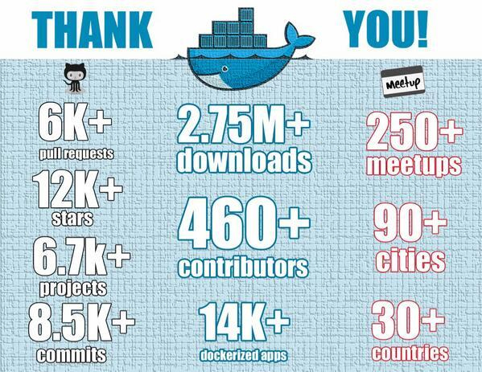
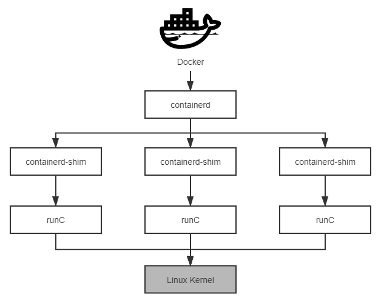
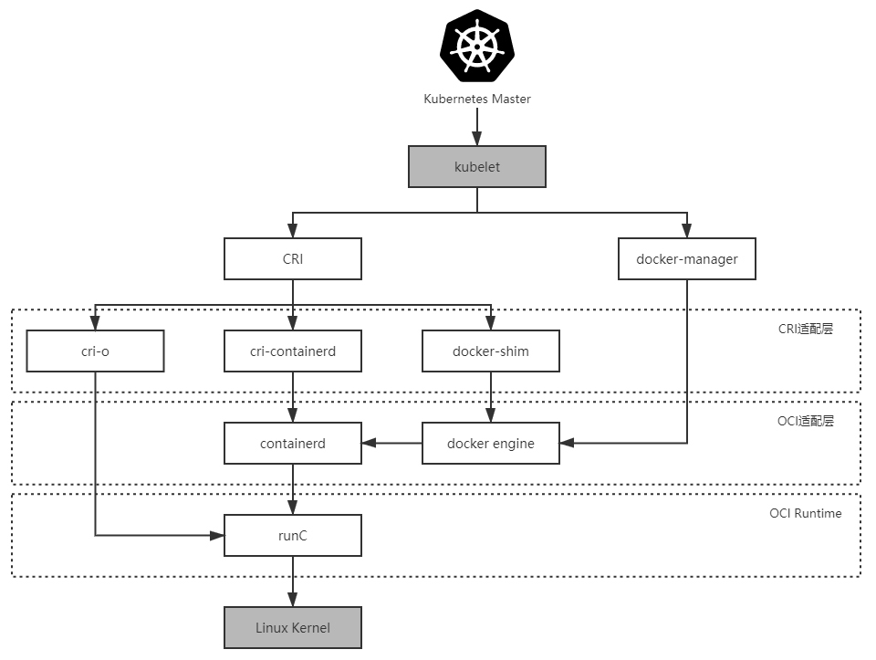

你好，我是周志明。在理解了从隔离角度出发的容器化技术的发展之后，这节课我们接着从封装的角度来学习容器应用的发展。

## 封装系统：LXC

当文件系统、访问、资源都可以被隔离后，容器就已经具备它降生所需要的全部前置支撑条件了，并且 Linux 的开发者们也已经明确地看到了这一点。

因此，为了降低普通用户综合使用 namespaces、cgroups 这些低级特性的门槛，2008 年 Linux Kernel 2.6.24 内核在刚刚开始提供 cgroups 的同一时间，就马上发布了名为[Linux 容器](https://en.wikipedia.org/wiki/LXC)（LinuX Containers，LXC）的系统级虚拟化功能。

当然在这之前，在 Linux 上并不是没有系统级虚拟化的解决方案，比如传统的[OpenVZ](https://zh.wikipedia.org/wiki/OpenVZ)和[Linux-VServer](https://en.wikipedia.org/wiki/Linux-VServer)都能够实现容器隔离，并且只会有很低的性能损失（按 OpenVZ 提供的数据，只会有 1~3% 的损失），**但它们都是非官方的技术，使用它们最大的阻碍是系统级虚拟化必须要有内核的支持**。为此，它们就只能通过非官方内核补丁的方式来修改标准内核，才能获得那些原本在内核中不存在的能力。

如此一来，LXC 就带着令人瞩目的光环登场，它的出现促使“容器”从一个阳春白雪的、只流传于开发人员口中的技术词汇，逐渐向整个软件业的公共概念、共同语言发展，就如同今天的“服务器”“客户端”和“互联网”一样。

不过，相信你现在肯定会好奇：为什么如今一提到容器，大家首先联想到的是 Docker 而不是 LXC？为什么去问 10 个开发人员，至少有 9 个听过 Docker，但如果问 LXC，可能只有 1 个人听说过？

那么，我们首先可以知道的是，LXC 的出现肯定是受到了 OpenVZ 和 Linux-VServer 的启发，摸着巨人的肩膀过河当然没有什么不对。但可惜的是，LXC 在设定自己的发展目标时，也被前辈们的影响所局限了。

其实，LXC 眼中的容器的定义与 OpenVZ 和 Linux-VServer 并没有什么差别，它们都是**一种封装系统的轻量级虚拟机**，而 Docker 眼中的容器的定义则是**一种封装应用的技术手段**。这两种封装理念在技术层面并没有什么本质区别，但在应用效果上差异可就相当大了。

我举个具体的例子，如果你要建设一个[LAMP](https://en.wikipedia.org/wiki/LAMP_(software_bundle))（Linux、Apache、MySQL、PHP）应用，按照 LXC 的思路，你应该先编写或者寻找到[LAMP 的 template](https://gist.github.com/ralt/492a09d9f9fea64fb28b)（可以暂且不准确地类比为 LXC 版本的 Dockerfile 吧），以此构造出一个安装了 LAMP 的虚拟系统。

如果按部署虚拟机的角度来看，这还算挺方便的，作为那个时代（距今也就十年）的系统管理员，所有软件、补丁、配置都是要自己搞定的，部署一台新虚拟机要花费一两天时间都很正常，而有了 LXC 的 template，一下子帮你把 LAMP 都安装好了，还想要啥自行车？

但是，作为一名现代的系统管理员，这里的问题就相当大了：如果我想把 LAMP 改为 LNMP（Linux、Nginx、MySQL、PHP）该怎么办？如果我想把 LAMP 里的 MySQL 5 调整为 MySQL 8 该怎么办？这些都得通过找到或者自己编写新的 template 来解决。

或者好吧，那这台机的软件、版本都配置对了，下一台机我要构建[LYME](https://en.wikipedia.org/wiki/LYME_(software_bundle))或者[MEAN](https://en.wikipedia.org/wiki/MEAN_(solution_stack))，又该怎么办呢？以封装系统为出发点，如果仍然是按照先装系统再装软件的思路，就永远无法做到一两分钟甚至十几秒钟就构造出一个合乎要求的软件运行环境，这也就决定了 LXC 不可能形成今天的容器生态。

所以，接下来舞台的聚光灯终于落到了 Docker 身上。

## 封装应用：Docker

在 2013 年宣布开源的 Docker，毫无疑问是容器发展历史上里程碑式的发明，然而 Docker 的成功似乎没有太多技术驱动的成分。至少对于开源早期的 Docker 而言，确实没有什么能构成壁垒的技术。

事实上，它的容器化能力直接来源于 LXC，它的镜像分层组合的文件系统直接来源于[AUFS](https://en.wikipedia.org/wiki/Aufs)，在 Docker 开源后不久，就有人仅用了一百多行的 Shell 脚本，便实现了 Docker 的核心功能（名为[Bocker](https://github.com/p8952/bocker)，提供了 docker bulid/pull/images/ps/run/exec/logs/commit/rm/rmi 等功能）。

那你可能就要问了：为何历史选择了 Docker，而不是 LXC 或者其他容器技术呢？对于这个问题，我想引用下（转述非直译，有所精简）DotCloud 公司（当年创造 Docker 的公司，已于 2016 年倒闭）创始人所罗门 · 海克斯（Solomon Hykes）在[Stackoverflow 上的一段问答](https://stackoverflow.com/questions/17989306/what-does-docker-add-to-lxc-tools-the-userspace-lxc-tools/)：

>**为什么要用 Docker 而不是 LXC？（Why would I use Docker over plain LXC？）**
>
>Docker 除了包装来自 Linux 内核的特性之外，它的价值还在于：
>
>**跨机器的绿色部署**：Docker 定义了一种将应用及其所有的环境依赖都打包到一起的格式，仿佛它原本就是[绿色软件](https://en.wikipedia.org/wiki/Portable_application)一样。而 LXC 并没有提供这样的能力，使用 LXC 部署的新机器很多细节都要依赖人的介入，虚拟机的环境基本上肯定会跟你原本部署程序的机器有所差别。
>
>**以应用为中心的封装**：Docker 封装应用而非封装机器的理念贯穿了它的设计、API、界面、文档等多个方面。相比之下，LXC 将容器视为对系统的封装，这局限了容器的发展。
>
>**自动构建**：Docker 提供了开发人员从在容器中构建产品的全部支持，开发人员无需关注目标机器的具体配置，就可以使用任意的构建工具链，在容器中自动构建出最终产品。
>
>**多版本支持**：Docker 支持像 Git 一样管理容器的连续版本，进行检查版本间差异、提交或者回滚等操作。从历史记录中，你可以查看到该容器是如何一步一步构建成的，并且只增量上传或下载新版本中变更的部分。
>
>**组件重用**：Docker 允许将任何现有容器作为基础镜像来使用，以此构建出更加专业的镜像。
>
>**共享**：Docker 拥有公共的镜像仓库，成千上万的 Docker 用户在上面上传了自己的镜像，同时也使用他人上传的镜像。
>
>**工具生态**：Docker 开放了一套可自动化和自行扩展的接口，在此之上用户可以实现很多工具来扩展其功能，比如容器编排、管理界面、持续集成，等等。
>
>—— Solomon Hykes，[Stackoverflow](https://stackoverflow.com/questions/17989306/what-does-docker-add-to-lxc-tools-the-userspace-lxc-tools/)，2013

这段回答也被收录到[了Docker 官网的 FAQ](https://docs.docker.com/engine/faq/)上，从 Docker 开源到今天从没有改变过。

其实，促使 Docker 一问世就惊艳世间的，并不是什么黑科技式的秘密武器，而是它符合历史潮流的创意与设计理念，还有充分开放的生态运营。由此可见，在正确的时候，正确的人手上有一个优秀的点子，确实有机会引爆一个时代。

受到广泛认可的Docker

这里我还想让你看一张图片，它是 Docker 开源一年后（截至 2014 年 12 月）获得的成绩。

我们可以发现，从开源到现在，只过了短短数年时间，Docker 就已经成为了软件开发、测试、分发、部署等各个环节都难以或缺的基础支撑，而它自身的架构也发生了相当大的改变：Docker 被分解为了几个子系统，包括 Docker Client、Docker Daemon、Docker Registry、Docker Container 等等，以及 Graph、Driver、libcontainer 等各司其职的模块。

所以此时，我们再说一百多行脚本就能实现 Docker 的核心功能，再说 Docker 没有太高的技术含量，就不太合适了。

2014 年，Docker 开源了自己用 Golang 开发的[libcontainer](https://github.com/opencontainers/runc/tree/main/libcontainer)，这是一个越过 LXC 直接操作 namespaces 和 cgroups 的核心模块，有了 libcontainer 以后，Docker 就能直接与系统内核打交道，不必依赖 LXC 来提供容器化隔离能力了。

到了 2015 年，在 Docker 的主导和倡议下，多家公司联合制定了“[开放容器交互标准](https://en.wikipedia.org/wiki/Open_Container_Initiative)”（Open Container Initiative，OCI），这是一个关于容器格式和运行时的规范文件，其中包含了运行时标准（[runtime-spec](https://github.com/opencontainers/runtime-spec/blob/main/spec.md) ）、容器镜像标准（[image-spec](https://github.com/opencontainers/image-spec/blob/main/spec.md)）和镜像分发标准（[distribution-spec](https://github.com/opencontainers/distribution-spec/blob/main/spec.md)，分发标准还未正式发布）。

* 运行时标准定义了应该如何运行一个容器、如何管理容器的状态和生命周期、如何使用操作系统的底层特性（namespaces、cgroup、pivot\_root 等）；

* 容器镜像标准规定了容器镜像的格式、配置、元数据的格式，你可以理解为对镜像的静态描述；

* 镜像分发标准则规定了镜像推送和拉取的网络交互过程。

由此，为了符合 OCI 标准，Docker 推动自身的架构继续向前演进。

首先，它是将 libcontainer 独立出来，封装重构成[runC 项目](https://github.com/opencontainers/runc)，并捐献给了 Linux 基金会管理。runC 是 OCI Runtime 的首个参考实现，它提出了“让标准容器无所不在”（Make Standard Containers Available Everywhere）的口号。

而为了能够兼容所有符合标准的 OCI Runtime 实现，Docker 进一步重构了 Docker Daemon 子系统，把其中与运行时交互的部分抽象为了[containerd 项目](https://containerd.io/)。

这是一个负责管理容器执行、分发、监控、网络、构建、日志等功能的核心模块，其内部会为每个容器运行时创建一个 containerd-shim 适配进程，默认与 runC 搭配工作，但也可以切换到其他 OCI Runtime 实现上（然而实际并没做到，最后 containerd 仍是紧密绑定于 runC）。

后来到了 2016 年，Docker 把 containerd 捐献给了 CNCF 管理。

可以说，runC 与 containerd 两个项目的捐赠托管，既带有 Docker 对开源信念的追求，也带有 Docker 在众多云计算大厂夹击下自救的无奈，这两个项目也将会成为未来 Docker 消亡和存续的伏笔（到这节课的末尾你就能理解这句矛盾的话了）。

Docker、containerd和runC的交互关系

以上我列举的这些 Docker 推动的开源与标准化工作，既是对 Docker 为开源乃至整个软件业做出贡献的赞赏，也是为后面给你介绍容器编排时，讲解当前容器引擎的混乱关系做的前置铺垫。

我们当然很清楚的一个事实就是，Docker 目前无疑在容器领域具有统治地位，但其统治的稳固程度不仅没到高枕无忧，说是危机四伏都不为过。

我之所以这么说的原因，是因为现在已经能隐隐看出足以威胁动摇 Docker 地位的潜在可能性，而引出这个风险的，就是 Docker 虽然赢得了容器战争的胜利，但 Docker Swarm 却输掉了容器编排战争。

实际上，从结果回望当初，Docker 能赢得容器战争是存在了一些偶然性的，而能确定的是 Docker Swarm 输掉编排战争是必然的。为什么这么说呢？下面我就来揭晓答案。

## 封装集群：Kubernetes

如果说**以 Docker 为代表的容器引擎**，是把软件的发布流程从分发二进制安装包，转变为了直接分发虚拟化后的整个运行环境，让应用得以实现跨机器的绿色部署；那**以 Kubernetes 为代表的容器编排框架**，就是把大型软件系统运行所依赖的集群环境也进行了虚拟化，让集群得以实现跨数据中心的绿色部署，并能够根据实际情况自动扩缩。

我们从上节课的容器崛起之路，讲到现在 Docker 和 Kubernetes 这个阶段，已经不再是介绍历史了，从这里开始发生的变化，都是近几年软件业界中的热点事件，也是“容器的崛起”这个小章节我们要讨论的主要话题。不过现在，我暂时不打算介绍 Kubernetes 的技术细节，在“容器间网络”“容器持久化存储”及“资源调度”这几个章节中，我还会进行更详细的解析。

在今天这节课里，我们就先从**宏观层面**去理解 Kubernetes 的诞生与演变的驱动力，这对正确理解未来云原生的发展方向是至关重要的。

### 从 Docker 到 Kubernetes

众所周知，Kubernetes 可谓是出身名门，它的前身是 Google 内部已经运行多年的集群管理系统 Borg，在 2014 年 6 月使用 Golang 完全重写后开源。自它诞生之日起，只要能与云计算稍微扯上关系的业界巨头，都对 Kubernetes 争相追捧，IBM、RedHat、Microsoft、VMware 和华为都是它最早期的代码贡献者。

此时，距离云计算从实验室到工业化应用已经有十个年头，不过大量应用使用云计算的方式，还是停滞在了传统的 IDC（Internet Data Center）时代，它们仅仅是用云端的虚拟机代替了传统的物理机而已。

尽管早在 2013 年，Pivotal（持有着 Spring Framework 和 Cloud Foundry 的公司）就提出了“云原生”的概念，但是要实现服务化、具备韧性（Resilience）、弹性（Elasticity）、可观测性（Observability）的软件系统依旧十分困难，在当时基本只能依靠架构师和程序员高超的个人能力，云计算本身还帮不上什么忙。

而在云的时代，不能充分利用云的强大能力，这让云计算厂商无比遗憾，也无比焦虑。

所以可以说，直到 Kubernetes 横空出世，大家才终于等到了破局的希望，认准了这就是云原生时代的操作系统，是让复杂软件在云计算下获得韧性、弹性、可观测性的最佳路径，也是为厂商们推动云计算时代加速到来的关键引擎之一。

2015 年 7 月，Kubernetes 发布了第一个正式版本 1.0 版，更重要的事件是 Google 宣布与 Linux 基金会共同筹建[云原生基金会](https://www.cncf.io/)（Cloud Native Computing Foundation，CNCF），并且把 Kubernetes 托管到 CNCF，成为其第一个项目。随后，Kubernetes 就以摧枯拉朽之势消灭了容器编排领域的其他竞争对手，哪怕 Docker Swarm 有着 Docker 在容器引擎方面的先天优势，DotCloud 后来甚至把 Swarm 直接内置入 Docker 之中，都不能稍稍阻挡 Kubernetes 前进的步伐。

但是我们也要清楚，**Kubernetes 的成功与 Docker 的成功并不一样**。

Docker 靠的是优秀的理念，它是以一个“好点子”引爆了一个时代。我相信就算没有 Docker，也会有 Cocker 或者 Eocker 的出现，但由成立仅三年的 DotCloud 公司（三年后又倒闭）做成了这样的产品，确实有一定的偶然性。

而 Kubernetes 的成功，不仅有 Google 深厚的技术功底作支撑、有领先时代的设计理念，更加关键的是 Kubernetes 的出现，符合所有云计算大厂的切身利益，有着业界巨头不遗余力地广泛支持，所以它的成功便是一种必然。

Kubernetes与容器引擎的调用关系

Kubernetes 与 Docker 两者的关系十分微妙，因此我们**把握住两者关系的变化过程，是理解 Kubernetes 架构演变与 CRI、OCI 规范的良好线索**。

### Kubernetes 是如何一步步与 Docker 解耦的？

在 Kubernetes 开源的早期，它是完全依赖且绑定 Docker 的，并没有过多地考虑日后有使用其他容器引擎的可能性。直到 Kubernetes 1.5 之前，Kubernetes 管理容器的方式都是通过内部的 DockerManager，向 Docker Engine 以 HTTP 方式发送指令，通过 Docker 来操作镜像的增删改查的，如上图最右边线路的箭头所示（图中的 kubelet 是集群节点中的代理程序，负责与管理集群的 Master 通信，其他节点的含义在下面介绍时都会有解释）。

现在，我们可以把这个阶段的 Kubernetes 与容器引擎的调用关系捋直，并结合前面提到的 Docker 捐献 containerd 与 runC 后重构的调用，一起来梳理下这个完整的调用链条：

>**Kubernetes Master → kubelet → DockerManager → Docker Engine → containerd → runC**

然后到了 2016 年，Kubernetes 1.5 版本开始引入“[容器运行时接口](https://kubernetes.io/blog/2016/12/container-runtime-interface-cri-in-kubernetes/)”（Container Runtime Interface，CRI），这是一个定义容器运行时应该如何接入到 kubelet 的规范标准，从此 Kubernetes 内部的 DockerManager，就被更为通用的 KubeGenericRuntimeManager 所替代了（实际上在 1.6.6 之前都仍然可以看到 DockerManager），kubelet 与 KubeGenericRuntimeManager 之间通过 gRPC 协议通信。

不过，由于 CRI 是在 Docker 之后才发布的规范，Docker 是肯定不支持 CRI 的，所以 Kubernetes 又提供了 DockerShim 服务作为 Docker 与 CRI 的适配层，由它与 Docker Engine 以 HTTP 形式通信，从而实现了原来 DockerManager 的全部功能。

此时，Docker 对 Kubernetes 来说就只是一项默认依赖，而非之前的不可或缺了，现在它们的调用链为：

> **Kubernetes Master → kubelet → KubeGenericRuntimeManager → DockerShim → Docker Engine → containerd → runC**

接着再到 2017 年，由 Google、RedHat、Intel、SUSE、IBM 联合发起的[CRI-O](https://github.com/cri-o/cri-o)（Container Runtime Interface Orchestrator）项目发布了首个正式版本。

一方面，我们从名字上就可以看出来，它肯定是完全遵循 CRI 规范来实现的；另一方面，它可以支持所有符合 OCI 运行时标准的容器引擎，默认仍然是与 runC 搭配工作的，如果要换成[Clear Containers](https://github.com/clearcontainers)、[Kata Containers](https://katacontainers.io/)等其他 OCI 运行时，也完全没有问题。

不过到这里，开源版的 Kubernetes 虽然完全支持用户去自由选择（根据用户宿主机的环境选择）是使用 CRI-O、cri-containerd，还是 DockerShim 来作为 CRI 实现，但在 RedHat 自己扩展定制的 Kubernetes 企业版，即[OpenShift 4](https://en.wikipedia.org/wiki/OpenShift)中，调用链已经没有了 Docker Engine 的身影：

>**Kubernetes Master → kubelet → KubeGenericRuntimeManager → CRI-O→ runC**

当然，因为此时 Docker 在容器引擎中的市场份额仍然占有绝对优势，对于普通用户来说，如果没有明确的收益，也并没有什么动力要把 Docker 换成别的引擎。所以 CRI-O 即使摆出了直接挖掉 Docker 根基的凶悍姿势，实际上也并没有给 Docker 带来太多即时可见的影响。不过，我们能够想像此时 Docker 心中肯定充斥了难以言喻的危机感。

时间继续来到了 2018 年，由 Docker 捐献给 CNCF 的 containerd，在 CNCF 的精心孵化下发布了 1.1 版，1.1 版与 1.0 版的最大区别是此时它已经完美地支持了 CRI 标准，这意味着原本用作 CRI 适配器的 cri-containerd 从此不再被需要。

此时，我们再观察 Kubernetes 到容器运行时的调用链，就会发现调用步骤会比通过 DockerShim、Docker Engine 与 containerd 交互的步骤要减少两步，这又意味着用户只要愿意抛弃掉 Docker 情怀的话，在容器编排上就可以至少省略一次 HTTP 调用，获得性能上的收益。而且根据 Kubernetes 官方给出的[测试数据](https://kubernetes.io/blog/2018/05/24/kubernetes-containerd-integration-goes-ga/)，这些免费的收益还相当地可观。

如此，Kubernetes 从 1.10 版本宣布开始支持 containerd 1.1，在调用链中就已经能够完全抹去 Docker Engine 的存在了：

>**Kubernetes Master → kubelet → KubeGenericRuntimeManager → containerd → runC**

而到了今天，要使用哪一种容器运行时，就取决于你安装 Kubernetes 时宿主机上的容器运行时环境，但对于云计算厂商来说，比如国内的[阿里云 ACK](https://www.aliyun.com/product/kubernetes)、[腾讯云 TKE](https://cloud.tencent.com/product/tke)等直接提供的 Kubernetes 容器环境，采用的容器运行时普遍都已经是 containerd 了，毕竟运行性能对它们来说就是核心生产力和竞争力。

## 小结

学完这节课，我们可以试着来做一个判断：在未来，随着 Kubernetes 的持续发展壮大，Docker Engine 经历从不可或缺、默认依赖、可选择、直到淘汰，会是大概率的事件。从表面上看，这件事情是 Google、RedHat 等云计算大厂联手所为，可实际淘汰它的还是技术发展的潮流趋势。这就如同 Docker 诞生时依赖 LXC，到最后用 libcontainer 取代掉 LXC 一样。

同时，我们也该看到事情的另一面：现在连 LXC 都还没有挂掉，反倒还发展出了更加专注于跟 OpenVZ 等系统级虚拟化竞争的[LXD](https://linuxcontainers.org/lxd/)，就可以相信 Docker 本身也是很难彻底消亡的，已经养成习惯的 CLI 界面，已经形成成熟生态的镜像仓库等，都应该会长期存在，只是在容器编排领域，未来的 Docker 很可能只会以 runC 和 containerd 的形式存续下去，毕竟它们最初都源于 Docker 的血脉。

## 一课一思

在 2021 年 1 月初，Kubernetes 宣布将会在 v1.23 版本中，把 Dockershim 从 Kubelet 中移除，那么你会如何看待容器化日后的发展呢？

欢迎在留言区分享你的思考和见解。如果你觉得有收获，也欢迎把今天的内容分享给更多的朋友。感谢你的阅读，我们下一讲再见。