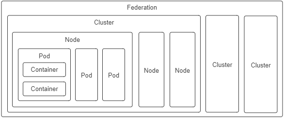

你好，我是周志明。从这节课开始，我们讨论的焦点会从容器本身，过渡到容器编排上。

我们知道，自从 Docker 提出“以封装应用为中心”的容器发展理念，成功取代了“以封装系统为中心”的 LXC 以后，一个容器封装一个单进程应用，已经成为了被广泛认可的最佳实践。

然而当单体时代过去之后，分布式系统里对于应用的概念已经不再等同于进程了，此时的应用需要多个进程共同协作，通过集群的形式对外提供服务，那么以虚拟化方法实现这个目标的过程，就被称为**容器编排（Container Orchestration）**。

而到今天，Kubernetes 已经成为了容器编排的代名词。不过在课程中，我并不打算过多介绍 Kubernetes 具体有哪些功能，也不会为你说明它由 Pod、Node、Deployment、ReplicaSet 等各种类型的资源组成可用的服务、集群管理平面与节点之间是如何工作的、每种资源该如何配置使用，等等，如果你想了解这方面信息，可以去查看 Kubernetes 官网的文档库或任何一本以 Kubernetes 为主题的使用手册。

在课程中，我真正希望能帮你搞清楚的问题是“**为什么 Kubernetes 会设计成现在这个样子？”“为什么以容器构建系统应该这样做？**”

而要寻找这些问题的答案，最好是从它们**设计的实现意图**出发。所以在接下来的两节课中，我虚构了一系列从简单到复杂的场景，带你来理解并解决这些场景中的问题。

这里我还想说明一点，学习这两节课的内容并不要求你对 Kubernetes 有过多深入的了解，但需要你至少使用过 Kubernetes 和 Docker，基本了解它的核心功能与命令；另外，课程中还会涉及到一点儿 Linux 系统内核资源隔离的基础知识，别担心，只要你仔细学习了“容器的崛起”这个小章节，就已经完全够用了。

## 构建容器编排系统时都会遇到什么问题？

好，现在我们来设想一下，如果让你来设计一套容器编排系统，协调各种容器来共同来完成一项工作，你可能会遇到什么问题？会如何着手解决呢？

我们先从最简单的场景开始吧：

>**场景一：假设你现在有两个应用，其中一个是 Nginx，另一个是为该 Nginx 收集日志的 Filebeat，你希望将它们封装为容器镜像，以方便日后分发。**

最直接的方案就将 Nginx 和 Filebeat 直接编译成同一个容器镜像，这是可以做到的，而且并不复杂。不过这样做其实会埋下很大的隐患：**它违背了 Docker 提倡的单个容器封装单进程应用的最佳实践**。

Docker 设计的 Dockerfile 只允许有一个 ENTRYPOINT，这并不是什么随便添加的人为限制，而是因为 Docker 只能通过监视 PID 为 1 的进程（即由 ENTRYPOINT 启动的进程）的运行状态，来判断容器的工作状态是否正常，像是容器退出执行清理、容器崩溃自动重启等操作，Docker 都必须先判断状态。

那么我们可以设想一下，即使我们使用了[supervisord](https://supervisord.org/)之类的进程控制器，来解决同时启动 Nginx 和 Filebeat 进程的问题，如果因为某种原因它们不停发生崩溃、重启，那 Docker 也无法察觉到，它只能观察到 supervisord 的运行状态。所以，场景一关于封装为容器镜像的需求会理所当然地演化成场景二。

>**场景二：假设你现在有两个 Docker 镜像，其中一个封装了 HTTP 服务，为便于称呼，叫它 Nginx 容器，另一个封装了日志收集服务，叫它 Filebeat 容器。现在你要求 Filebeat 容器能收集 Nginx 容器产生的日志信息。**

其实，场景二的需求依然不难解决，只要在 Nginx 容器和 Filebeat 容器启动时，分别把它们的日志目录和收集目录挂载为宿主机同一个磁盘位置的 Volume 即可，在 Docker 中，这种操作是十分常用的容器间信息交换手段。

不过，容器间信息交换不仅仅是文件系统。

假如此时我又引入了一个新的工具[confd](https://github.com/kelseyhightower/confd)，它是 Linux 下的一种配置管理工具，作用是根据配置中心（Etcd、ZooKeeper、Consul）的变化，自动更新 Nginx 的配置。那么这样的话，就又会遇到新的问题。

这是因为，confd 需要向 Nginx 发送 HUP 信号，才便于[通知 Nginx](http://nginx.org/en/docs/control.html)配置已经发生了变更，而发送 HUP 信号自然就要求 confd 与 Nginx 能够进行 IPC 通信才行。

当然，尽管共享 IPC 名称空间不如共享 Volume 常见，但 Docker 同样支持了这个功能，也就是通过 docker run 命令提供了 --ipc 参数，用来把多个容器挂载到同一个父容器的 IPC 名称空间之下，以实现容器间共享 IPC 名称空间的需求。类似地，如果要共享 UTS 名称空间，可以使用 --uts 参数；要共享网络名称空间的话，就使用 --net 参数。

这就是 Docker 针对场景二这种不跨机器的多容器协作，所给出的解决方案了。

实际上，**自动地为多个容器设置好共享名称空间，就是[Docker Compose](https://docs.docker.com/compose/)提供的核心能力**。

不过，这种针对具体应用需求来共享名称空间的方案，确实可以工作，但并不够优雅，也谈不上有什么扩展性。要知道，容器的本质是对 cgroups 和 namespaces 所提供的隔离能力的一种封装，在 Docker 提倡的单进程封装的理念影响下，容器蕴含的隔离性也多了仅针对于单个进程的额外局限。

然而 Linux 的 cgroups 和 namespaces，原本都是针对进程组而不只是单个进程来设计的，同一个进程组中的多个进程，天然就可以共享相同的访问权限与资源配额。

所以，如果现在我们把容器与进程在概念上对应起来，那**容器编排的第一个扩展点，就是要找到容器领域中与“进程组”相对应的概念，这是实现容器从隔离到协作的第一步。在 Kubernetes 的设计里，这个对应物叫做Pod**。

>**额外知识：Pod 名字的由来与含义**
>
>在容器正式出现之前的 Borg 系统中，Pod 的概念就已经存在了，从 Google 的发表的《[Large-Scale Cluster Management at Google with Borg](https://pdos.csail.mit.edu/6.824/papers/borg.pdf)》里可以看出，Kubernetes 时代的 Pod 整合了 Borg 时代的“Prod”（Production Task 的缩写）与“Non-Prod”的职能。由于 Pod 一直没有权威的中文翻译，我在后面课程中会尽量用英文指代，偶尔需要中文的场合就使用 Borg 中 Prod 的译法，即“生产任务”来指代。

这样，有了“容器组”的概念，只需要把多个容器放到同一个 Pod 中，场景二的问题就可以解决了。

## Pod 的含义与职责

事实上，**扮演容器组的角色，满足容器共享名称空间的需求，是 Pod 两大最基本的职责之一**，同处于一个 Pod 内的多个容器，相互之间会以超亲密的方式协作。请注意，“超亲密”在这里的用法不是什么某种带强烈感情色彩的形容词，而是代表了一种有具体定义的协作程度。

具体是什么意思呢？

对于普通非亲密的容器来说，它们一般以网络交互方式（其他的如共享分布式存储来交换信息，也算跨网络）协作；对于亲密协作的容器来说，是指它们被调度到同一个集群节点上，可以通过共享本地磁盘等方式协作；而超亲密的协作，是特指多个容器位于同一个 Pod 这种特殊关系，它们将默认共享以下名称空间：

* **UTS 名称空间**：所有容器都有相同的主机名和域名。

* **网络名称空间**：所有容器都共享一样的网卡、网络栈、IP 地址，等等。因此，同一个 Pod 中不同容器占用的端口不能冲突。

* **IPC 名称空间**：所有容器都可以通过信号量或者 POSIX 共享内存等方式通信。

* **时间名称空间**：所有容器都共享相同的系统时间。

也就是说，同一个 Pod 的容器，只有 **PID 名称空间**和**文件名称空间**默认是隔离的。

PID 的隔离让开发者的每个容器都有独立的进程 ID 编号，它们封装的应用进程就是 PID 为 1 的进程，开发人员可以通过 Pod 元数据定义中的 spec.shareProcessNamespace，来改变这点。而一旦要求共享 PID 名称空间，容器封装的应用进程就不再具有 PID 为 1 的特征了，这就有可能导致部分依赖该特征的应用出现异常。

而在文件名称空间方面，容器要求文件名称空间的隔离是很理所应当的需求，因为容器需要相互独立的文件系统以避免冲突。但容器间可以**共享存储卷**，这是通过 Kubernetes 的 Volume 来实现的。

>**额外知识：Kubernetes 中 Pod 名称空间共享的实现细节**
>
>Pod 内部多个容器共享 UTS、IPC、网络等名称空间，是通过一个名为 Infra Container 的容器来实现的，这个容器是整个 Pod 中第一个启动的容器，只有几百 KB 大小（代码只有很短的几十行，见[这里](https://github.com/kubernetes/kubernetes/tree/master/build/pause)），Pod 中的其他容器都会以 Infra Container 作为父容器，UTS、IPC、网络等名称空间，实质上都是来自 Infra Container 容器。
>
>如果容器设置为共享 PID 名称空间的话，Infra Container 中的进程将作为 PID 1 进程，其他容器的进程将以它的子进程的方式存在，此时就会由 Infra Container 来负责进程管理（比如清理[僵尸进程](https://en.wikipedia.org/wiki/Zombie_process)）、感知状态和传递状态。
>
>由于 Infra Container 的代码除了注册 SIGINT、SIGTERM、SIGCHLD 等信号的处理器外，就只是一个以 pause() 方法为循环体的无限循环，永远处于 Pause 状态，所以它也常被称为“Pause Container”。

好，除此之外，Pod 的另一个基本职责是**实现原子性调度**。这里我们可以先明确一点，就是如果容器编排不跨越集群节点，那是否具有原子性其实都不影响大局。

但是在集群环境中，容器可能会跨机器调度时，这个特性就变得非常重要了。

如果以容器为单位来调度的话，不同容器就有可能被分配到不同机器上。而两台机器之间本来就是物理隔离，依靠网络连接的，所以这时候谈什么名称空间共享、cgroups 配额共享都没有意义了，由此我们就从场景二又演化出了场景三。

>**场景三：假设你现在有 Filebeat、Nginx 两个 Docker 镜像，在一个具有多个节点的集群环境下，要求每次调度都必须让 Filebeat 和 Nginx 容器运行于同一个节点上。**

其实，两个关联的协作任务必须一起调度的需求，在容器出现之前很久就有了。

我举个简单的例子。在传统的多线程（或多进程）[并发调度](https://en.wikipedia.org/wiki/Concurrency_(computer_science))中，如果两个线程（或进程）的工作是强依赖的，单独给谁分配处理时间而让另一个被挂起，都会导致某一个线程无法工作，所以也就有了 **[协同调度](https://en.wikipedia.org/wiki/Coscheduling)**（Coscheduling）的概念，它主要用来保证一组紧密联系的任务能够被同时分配资源。

这样来看的话，如果我们在容器编排中，仍然坚持**把容器看作是调度的最小粒度，那针对容器运行所需资源的需求声明，就只能设定在容器上**。如此一来，集群每个节点的剩余资源越紧张，单个节点无法容纳全部协同容器的概率就越大，协同的容器被分配到不同节点的可能性就越高。

说实话，协同调度是很麻烦的，实现起来要么很低效，比如 Apache Mesos 的 Resource Hoarding 调度策略，就要等所有需要调度的任务都完备后，才会开始分配资源；要么就是很复杂，比如 Google 就曾针对 Borg 的下一代 Omega 系统，发表过论文《[Omega: Flexible, Scalable Schedulers for Large Compute Clusters](https://static.googleusercontent.com/media/research.google.com/zh-CN//pubs/archive/41684.pdf)》，其中介绍了它是如何通过乐观并发（Optimistic Concurrency）、冲突回滚的方式，做到高效率且高度复杂的协同调度。

而**如果我们将运行资源的需求声明定义在 Pod 上**，直接以 Pod 为最小的原子单位来实现调度的话，由于多个 Pod 之间一定不存在超亲密的协同关系，只会通过网络非亲密地协作，那就根本**没有协同**的说法，自然也不需要考虑复杂的调度了（关于 Kubernetes 的具体调度实现，我会在“资源与调度”这个小章节中展开讲解）。

**Pod 是隔离与调度的基本单位，也是我们接触的第一种 Kubernetes 资源**。Kubernetes 把一切都看作是资源，不同资源之间依靠层级关系相互组合协作，这个思想是贯穿 Kubernetes 整个系统的两大核心设计理念之一，不仅在容器、Pod、主机、集群等计算资源上是这样，在工作负载、持久存储、网络策略、身份权限等其他领域中，也都有着一致的体现。

Kubernetes的计算资源

另外我想说的是，因为 Pod 是 Kubernetes 中最重要的资源，又是资源模型中一种仅在逻辑上存在、没有物理对应的概念（因为对应的“进程组”也只是个逻辑概念），也是其他编排系统没有的概念，所以我这节课专门给你介绍了下它的设计意图，而不是像帮助手册那样直接给出它的作用和特性。

对于 Kubernetes 中的其他计算资源，像 Node、Cluster 等都有切实的物理对应物，很容易就能形成共同的认知，我就不一一介绍了，这里你只需要了解下它们的设计意图就行：

* **容器（Container）**：延续了自 Docker 以来一个容器封装一个应用进程的理念，是镜像管理的最小单位。

* **生产任务（Pod）**：补充了容器化后缺失的与进程组对应的“容器组”的概念，Pod 中的容器共享 UTS、IPC、网络等名称空间，是资源调度的最小单位。

* **节点（Node）**：对应于集群中的单台机器，这里的机器既可以是生产环境中的物理机，也可以是云计算环境中的虚拟节点，节点是处理器和内存等资源的资源池，是硬件单元的最小单位。

* **集群（Cluster）**：对应于整个集群，Kubernetes 提倡的理念是面向集群来管理应用。当你要部署应用的时候，只需要通过声明式 API 将你的意图写成一份元数据（Manifests），把它提交给集群即可，而无需关心它具体分配到哪个节点（尽管通过标签选择器完全可以控制它分配到哪个节点，但一般不需要这样做）、如何实现 Pod 间通信、如何保证韧性与弹性，等等，所以集群是处理元数据的最小单位。

* **集群联邦（Federation）**：对应于多个集群，通过联邦可以统一管理多个 Kubernetes 集群，联邦的一种常见应用是支持跨可用区域多活、跨地域容灾的需求。

## 小结

学完了这节课，我们要知道，容器之间顺畅地交互通信是协作的核心需求，但容器协作并不只是通过高速网络来互相连接容器而已。如何调度容器，如何分配资源，如何扩缩规模，如何最大限度地接管系统中的非功能特性，让业务系统尽可能地免受分布式复杂性的困扰，都是容器编排框架必须考虑的问题，只有恰当解决了这一系列问题，云原生应用才有可能获得比传统应用更高的生产力。

## 一课一思

现在，我们能够明确隔离与协作的含义，也就是容器要让它管理的进程相互隔离，使用独立的资源与配额；容器编排系统要让它管理的各个容器相互协作，共同维持一个分布式系统的运作。但除了协作之外，你认为容器编排系统是否还有其他必须考虑的需求目标呢？

欢迎在留言区分享你的见解。如果你觉得有收获，也欢迎把今天的内容分享给更多的朋友。感谢你的阅读，我们下一讲再见。