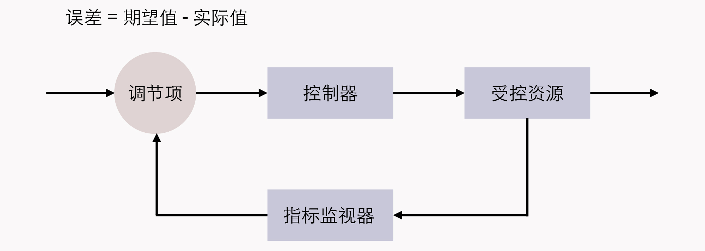
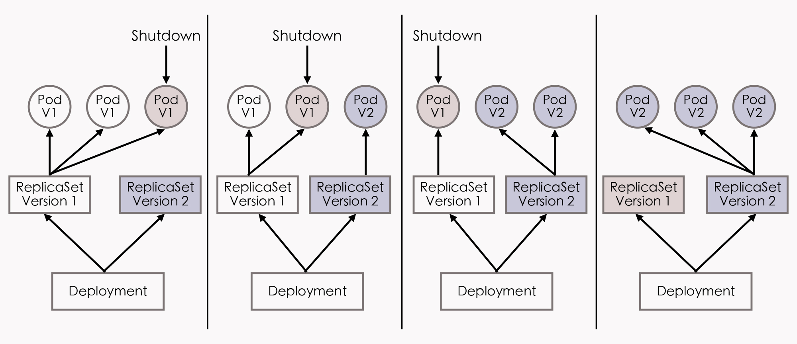

你好，我是周志明。今天，我们接着上节课“隔离与协作”的话题，继续来讨论容器编排的另一个目标：韧性与弹性。

我曾经看过一部电影，叫做《[Bubble Boy](https://movie.douban.com/subject/1296612/)》，主要讲了一个体内没有任何免疫系统的小男孩，每天只能生活在无菌的圆形气球里，对常人来说不值一提的细菌，都会直接威胁到他的性命。小男孩尽管能够降生于世，但并不能真正地与世界交流，这种生命是极度脆弱的。

真实世界的软件系统，跟电影世界中的小男孩所面临的处境其实差不多。

要知道，让容器能够相互连通、相互协作，仅仅是以容器构建系统的第一步，我们不仅希望得到一个能够运行起来的系统，而且还希望得到一个能够健壮运行的系统、能够抵御意外与风险的系统。

当然，在 Kubernetes 的支持下，你确实可以直接创建 Pod 将应用运行起来，但这样的应用就像是电影中只能存活在气球中的小男孩一样脆弱，无论是软件缺陷、意外操作或者硬件故障，都可能导致在复杂协作的过程中某个容器出现异常，进而出现系统性的崩溃。

为了解决这个问题，架构师专门设计了服务容错的策略和模式（你可以回顾复习第[36](https://time.geekbang.org/column/article/341636)、[37](https://time.geekbang.org/column/article/342445)讲）。而 Kubernetes 作为云原生时代的基础设施，也尽力帮助我们以最小的代价来实现容错，为系统健壮运行提供底层支持。

那么，Kubernetes 所提供的帮助，就是指除资源模型之外的另一个核心设计理念：控制器设计模式。它的其中一种重要应用，就是这节课我们要探讨的主题，实现具有韧性与弹性的系统。

接下来，我们就从如何解决场景四的问题开始，一起来探讨下为什么 Kubernetes 要设计这些控制器，以及为什么这些控制器会被设计成现在这种样子。

## 编排系统如何快速调整出错的服务？

我们先来看看场景四的问题：

>**场景四：假设有个由数十个 Node、数百个 Pod、近千个 Container 所组成的分布式系统，作为管理员，你想要避免该系统因为外部流量压力、代码缺陷、软件更新、硬件升级、资源分配等各种原因而出现中断的状况，那么你希望编排系统能为你提供何种支持？**

作为用户，我们当然最希望容器编排系统能自动地把所有意外因素都消灭掉，让每一个服务都永远健康，永不出错。但**永不出错的服务是不切实际的**，只有凑齐七颗龙珠才可能办得到。

所以我们就只能退而求其次，让编排系统在这些服务出现问题、运行状态不正确的时候，能自动将它们调整成正确的状态。

这种需求听起来其实也挺贪心的，但已经具备足够的可行性了。而且我们可以采取的应对办法在[工业控制系统](https://en.wikipedia.org/wiki/Industrial_control_system)里，已经有了非常成熟的应用，它叫做 **[控制回路](https://en.wikipedia.org/wiki/Control_loop)（Control Loop）**。

关于控制回路的一般工作过程，在[Kubernetes 官方文档](https://kubernetes.io/zh-cn/docs/concepts/architecture/controller/)中，是以“房间里空调自动调节温度”为例来具体介绍的：当你设置好了温度，就是告诉空调你对温度的“期望状态”（Desired State），而传感器测量出的房间实际温度是“当前状态”（Current State）。

那么，根据当前状态与期望状态的差距，控制器对空调制冷的开关进行调节控制，就能让其当前状态逐渐接近期望状态。

控制回路

由此，我们把这种控制回路的思想迁移应用到容器编排上，自然会为 Kubernetes 中的资源附加上了期望状态与实际状态两项属性。

不管是已经出现在上节课的资源模型中，用于抽象容器运行环境的计算资源，还是没有登场的对应于安全、服务、令牌、网络等功能的资源（[第 40 讲](https://time.geekbang.org/column/article/345593)中曾提及过），如果用户想使用这些资源来实现某种需求，并不能像平常编程那样，去调用某个或某一组方法来达成目的。而是要通过描述清楚这些资源的期望状态，由 Kubernetes 中对应监视这些资源的控制器，来驱动资源的实际状态逐渐向期望状态靠拢，才能够达成自己的目的。

而这种交互风格就被叫做 **Kubernetes 的声明式 API**，如果你之前有过实际操作 Kubernetes 的经验，那你日常在元数据文件中的 spec 字段所描述的就是资源的期望状态。

>**额外知识：Kubernetes 的资源对象与控制器**
>
>目前，Kubernetes 已内置支持相当多的资源对象，并且还可以使用[CRD](https://icyfenix.cn/immutable-infrastructure/extension/crd.html)（Custom Resource Definition）来自定义扩充，你可以使用 kubectl api-resources 来查看它们。下面我根据用途分类，给你列举了一些常见的资源：
>
>* 用于描述如何创建、销毁、更新、扩缩 Pod，包括：Autoscaling（HPA）、CronJob、DaemonSet、Deployment、Job、Pod、ReplicaSet、StatefulSet
>
>* 用于配置信息的设置与更新，包括：ConfigMap、Secret
>
>* 用于持久性地存储文件或者 Pod 之间的文件共享，包括：Volume、LocalVolume、PersistentVolume、PersistentVolumeClaim、StorageClass
>
>* 用于维护网络通信和服务访问的安全，包括：SecurityContext、ServiceAccount、Endpoint、NetworkPolicy
>
>* 用于定义服务与访问，包括：Ingress、Service、EndpointSlice
>
>* 用于划分虚拟集群、节点和资源配额，包括：Namespace、Node、ResourceQuota
>
>这些资源在控制器管理框架中，一般都会有相应的控制器来管理，这里我也列举了一些常见的控制器，按照它们的启动情况进行了分类，如下：
>
>* 必须启用的控制器：EndpointController、ReplicationController、PodGCController、ResourceQuotaController、NamespaceController、ServiceAccountController、GarbageCollectorController、DaemonSetController、JobController、DeploymentController、ReplicaSetController、HPAController、DisruptionController、StatefulSetController、CronJobController、CSRSigningController、CSRApprovingController、TTLController
>
>* 默认启用的可选控制器，可通过选项禁止：TokenController、NodeController、ServiceController、RouteController、PVBinderController、AttachDetachController
>
>* 默认禁止的可选控制器，可通过选项启用：BootstrapSignerController、TokenCleanerController

那么，与资源相对应的，只要是实际状态有可能发生变化的资源对象，就通常都会**由对应的控制器进行追踪，每个控制器至少会追踪一种类型的资源**。

因此，为了管理众多资源控制器，Kubernetes 设计了**统一的控制器管理框架**（[kube-controller-manager](https://kubernetes.io/zh-cn/docs/reference/command-line-tools-reference/kube-controller-manager/)）来维护这些控制器的正常运作，并设计了**统一的指标监视器**（[kube-apiserver](https://kubernetes.io/zh-cn/docs/reference/command-line-tools-reference/kube-apiserver/)），用于在控制器工作时，为它提供追踪资源的度量数据。

## Kubernetes 控制器模式的工作原理

那么 Kubernetes 具体是怎么做的呢？在回答之前，我想先解释下，毕竟我们不是在写 Kubernetes 的操作手册，没办法展开和详解每个控制器，所以下面我就以两三种资源和控制器为代表，来举例说明一下。

OK，回到问题上。这里我们只要把场景四进一步具体化，转换成下面的场景五，就可以得到一个很好的例子了。

比如说，我们就以部署控制器（Deployment Controller）、副本集控制器（ReplicaSet Controller）和自动扩缩控制器（HPA Controller）为例，来看看 Kubernetes 控制器模式的工作原理。

>**场景五：通过服务编排，我们让任何分布式系统自动实现以下三种通用的能力：**
>
>* **Pod 出现故障时，能够自动恢复，不中断服务；**
>
>* **Pod 更新程序时，能够滚动更新，不中断服务；**
>
>* **Pod 遇到压力时，能够水平扩展，不中断服务。**

在这节课的一开始我提到过，虽然 Pod 本身也是资源，完全可以直接创建，但由 Pod 直接构成的系统是十分脆弱的，就像是那个气球中的小男孩，所以在实际生产中并不提倡。

正确的做法是**通过副本集（ReplicaSet）来创建 Pod**。

ReplicaSet 也是一种资源，它是属于工作负荷一类的资源，代表了一个或多个 Pod 副本的集合，你可以在 ReplicaSet 资源的元数据中，描述你期望 Pod 副本的数量（即 spec.replicas 的值）。

当 ReplicaSet 成功创建之后，副本集控制器就会持续跟踪该资源，一旦有 Pod 发生崩溃退出，或者状态异常（默认是靠进程返回值，你还可以在 Pod 中设置探针，以自定义的方式告诉 Kubernetes 出现何种情况 Pod 才算状态异常），ReplicaSet 都会自动创建新的 Pod 来替代异常的 Pod；如果因异常情况出现了额外数量的 Pod，也会被 ReplicaSet 自动回收掉。

总之就是确保在任何时候，集群中这个 Pod 副本的数量都会向期望状态靠拢。

另外，我们还要清楚一点，就是 ReplicaSet 本身就能满足场景五中的第一项能力，可以保证 Pod 出现故障时自动恢复。但是在升级程序版本时，ReplicaSet 就不得不主动中断旧 Pod 的运行，重新创建新版的 Pod 了，而这会造成**服务中断**。

因此，对于那些不允许中断的业务，以前的 Kubernetes 曾经提供过 kubectl rolling-update 命令，来辅助实现**滚动更新**。

所谓的**滚动更新**（Rolling Updates），是指先停止少量旧副本，维持大量旧副本继续提供服务，当停止的旧副本更新成功，新副本可以提供服务以后，再重复以上操作，直至所有的副本都更新成功。我们把这个过程放到 ReplicaSet 上，就是先创建新版本的 ReplicaSet，然后一边让新 ReplicaSet 逐步创建新版 Pod 的副本，一边让旧的 ReplicaSet 逐渐减少旧版 Pod 的副本。

而到了现在，之所以 kubectl rolling-update 命令会被淘汰，其实是因为这样的命令式交互，完全不符合 Kubernetes 的设计理念（这是台面上的说法，我觉得淘汰的根本原因主要是因为它不够好用）。如果你希望改变某个资源的某种状态，就应该将期望状态告诉 Kubernetes，而不是去教 Kubernetes 具体该如何操作。

所以，现在新的部署资源（Deployment）与部署控制器就被设计出来了。具体的实现步骤是这样的：我们可以由 Deployment 来创建 ReplicaSet，再由 ReplicaSet 来创建 Pod，当我们更新了 Deployment 中的信息以后（比如更新了镜像的版本），部署控制器就会跟踪到新的期望状态，自动地创建新 ReplicaSet，并逐渐缩减旧的 ReplicaSet 的副本数，直到升级完成后，彻底删除掉旧 ReplicaSet。这个工作过程如下图所示：

Deployment滚动更新过程

好，我们再来看看场景五中的最后一种情况。

你可能会知道，在遇到流量压力时，管理员完全可以手动修改 Deployment 中的副本数量，或者通过 kubectl scale 命令指定副本数量，促使 Kubernetes 部署更多的 Pod 副本来应对压力。然而这种扩容方式不仅需要人工参与，而且只靠人类经验来判断需要扩容的副本数量，也不容易做到精确与及时。

为此，Kubernetes 又提供了 Autoscaling 资源和自动扩缩控制器，它们能够自动地根据度量指标，如处理器、内存占用率、用户自定义的度量值等，来设置 Deployment（或者 ReplicaSet）的期望状态，实现当度量指标出现变化时，系统自动按照“Autoscaling→Deployment→ReplicaSet→Pod”这样的顺序层层变更，最终实现根据度量指标自动扩容缩容。

## 小结

故障恢复、滚动更新、自动扩缩这些特性，在云原生时代中常常被概括成服务的弹性（Elasticity）与韧性（Resilience），ReplicaSet、Deployment、Autoscaling 的用法，也是所有 Kubernetes 教材资料中都会讲到的“基础必修课”。

学完了这两节课，我还想再说明一点：如果你准备学习 Kubernetes 或者其他云原生的相关技术，我建议你最好不要死记硬背地学习每个资源的元数据文件该如何编写、有哪些指令、有哪些功能，更好的方式是站在解决问题的角度，去理解为什么 Kubernetes 要设计这些资源和控制器，理解为什么这些资源和控制器会被设计成现在这种样子。

## 一课一思

如果你觉得已经理解了前面几种资源和控制器的例子，那不妨思考几个问题：

* 假设我想限制某个 Pod 持有的最大存储卷数量，应该如何设计？

* 假设集群中某个 Node 发生硬件故障，Kubernetes 要让调度任务避开这个 Node，应该如何设计？

* 假设一旦这个 Node 重新恢复，Kubernetes 要能尽快利用上面的资源，又该如何去设计？

其实，只要你真正接受了资源与控制器是贯穿整个 Kubernetes 的两大设计理念，即便不去查文档手册，也应该能推想出个大概轮廓，你在这个基础上再去看手册或者源码的时候，想必就能够事半功倍。

好，欢迎给我留言，分享你的答案。如果你觉得有收获，也欢迎把今天的内容分享给更多的朋友。感谢你的阅读，我们下一讲再见。