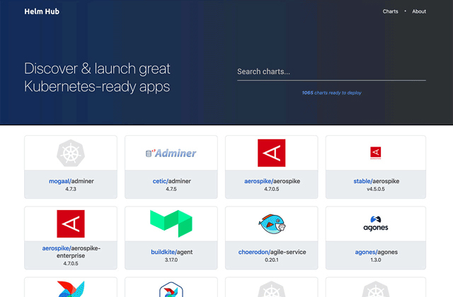

你好，我是周志明。

在理解了前面几节课所讲的容器技术发展的历程之后，不知你会不会有种“套娃式”的迷惑感？

* 现在你已经知道，容器的崛起缘于 chroot、namespaces、cgroups 等内核提供的隔离能力，而系统级的虚拟化技术，使得同一台机器上互不干扰地运行多个服务成为了可能；

* 为了降低用户使用内核隔离能力的门槛，随后出现了 LXC，它是 namespaces、cgroups 特性的上层封装，这就让“容器”一词真正走出了实验室，开始走入工业界进行实际应用；

* 然后，为了实现跨机器的软件绿色部署，出现了 Docker，它（最初）是 LXC 的上层封装，彻底改变了软件打包分发的方式，迅速被大量企业广泛采用；

* 而为了满足大型系统对服务集群化的需要，又出现了 Kubernetes，它（最初）是 Docker 的上层封装，从而使得以多个容器共同协作构建出健壮的分布式系统，成为了今天云原生时代的技术基础设施。

那这样你的疑惑可能也就出现了：Kubernetes 会是容器化崛起之路的终点线吗？它达到了人们对云原生时代技术基础设施的期望了吗？

首先，**从能力角度来看**，可以说是的。Kubernetes 被誉为云原生时代的操作系统，自诞生之日起它就因为出色的管理能力、扩展性和以声明代替命令的交互理念，收获了无数喝彩声。

但是，**从易用角度来看**，坦白说差距还非常大。云原生基础设施的其中一个重要目标，是接管掉业务系统复杂的非功能特性，这会让业务研发与运维工作变得足够简单，不受分布式的牵绊。然而，Kubernetes 被诟病得最多的就是复杂，它从诞生之日起，就因为陡峭的学习曲线而出名。

我举个具体例子吧。如果要用 Kubernetes 部署一套[Spring Cloud 版的 Fenix's Bookstore](https://icyfenix.cn/exploration/projects/microservice_arch_springcloud.html)，你需要分别部署一个到多个的配置中心、注册中心、服务网关、安全认证、用户服务、商品服务、交易服务，然后要对每个微服务都配置好相应的 Kubernetes 工作负载与服务访问，为每一个微服务的 Deployment、ConfigMap、StatefulSet、HPA、Service、ServiceAccount、Ingress 等资源都编写好元数据配置。

这个过程最难的地方不仅在于繁琐，还在于要想写出合适的元数据描述文件，你既需要懂开发（网关中服务调用关系、使用容器的镜像版本、运行依赖的环境变量等等这些参数，只有开发最清楚），又需要懂运维（要部署多少个服务、配置何种扩容缩容策略、数据库的密钥文件地址等等，只有运维最清楚），有时候还需要懂平台（需要什么样的调度策略、如何管理集群资源，通常只有平台组、中间件组或者核心系统组的同学才会关心），一般企业根本找不到合适的角色来为它管理、部署和维护应用。

这个事儿 Kubernetes 心里其实也挺委屈，因为以上提到的复杂性不能说是 Kubernetes 带来的，而是**分布式架构本身的原罪**。

对于大规模的分布式集群来说，无论是最终用户部署应用，还是软件公司管理应用，都存在着像前面提到的这诸多痛点。这些困难的实质是源于 Docker 容器镜像封装了单个服务，而 Kubernetes 通过资源封装了服务集群，却没有一个载体真正封装整个应用，这就使得它会把原本属于应用内部的技术细节给圈禁起来，不暴露给最终用户、系统管理员和平台维护者，而让使用者去埋单。

那么如此所造成的应用难以管理的矛盾，就在于**封装应用的方法没能将开发、运维、平台等各种角色的关注点恰当地分离**。

但是，既然在微服务时代，应用的形式已经不再局限于单个进程，那就也该到了重新定义“以应用为中心的封装”这句话的时候了。至于具体怎样的封装才算是正确的，其实到今天也还没有特别权威的结论，不过经过人们的尝试探索，已经能够窥见未来容器应用的一些雏形了。

所以接下来，我会花两节课的时间，给你介绍一下最近几年容器封装的两种主流思路，你可以从中理解容器“以应用为中心的封装”这个理念在不同阶段的内涵变化，这也是对“应用”这个概念的不断扩展升华的过程。

今天这节课呢，我们就先来了解下 Kustomize 和 Helm，它们是封装“无状态应用”的典型代表。

>**额外知识：无状态应用与有状态应用的区别**
>
>无状态应用（Stateless Application）与有状态应用（Stateful Application）说的是应用程序是否要自己持有其运行所需的数据，如果程序每次运行都跟首次运行一样，不依赖之前任何操作所遗留下来的痕迹，那它就是无状态的；反之，如果程序推倒重来之后，用户能察觉到该应用已经发生变化，那它就是有状态的。

下一讲要介绍的 Operator 与 OAM 就是支持有状态应用的封装方式，这里你可以先了解一下。

## Kustomize

最初，由 Kubernetes 官方给出的“如何封装应用”的解决方案是“**用配置文件来配置文件**”，这不是绕口令，你可以把它理解为是一种针对 YAML 的模版引擎的变体。

Kubernetes 官方认为，应用就是一组具有相同目标的 Kubernetes 资源的集合，如果逐一管理、部署每项资源元数据太麻烦啰嗦的话，那就提供一种便捷的方式，把应用中不变的信息与易变的信息分离开，以此解决管理问题；把应用所有涉及的资源自动生成一个多合一（All-in-One）的整合包，以此解决部署问题。

而完成这项工作的工具就叫做[Kustomize](https://github.com/kubernetes-sigs/kustomize)，它原本只是一个独立的小程序，从 Kubernetes 1.14 起，被纳入了 kubectl 命令之中，成为随着 Kubernetes 提供的内置功能。Kustomize 使用[Kustomization 文件](https://kubernetes-sigs.github.io/kustomize/api-reference/glossary/)来组织与应用相关的所有资源，Kustomization 本身也是一个以 YAML 格式编写的配置文件，里面定义了构成应用的全部资源，以及资源中需根据情况被覆盖的变量值。

Kustomize 的主要价值是根据环境来生成不同的部署配置。只要建立多个 Kustomization 文件，开发人员就能以[基于基准进行派生](https://kubernetes.io/zh-cn/docs/tasks/manage-kubernetes-objects/kustomization/)（Base and Overlay）的方式，对不同的模式（比如生产模式、调试模式）、不同的项目（同一个产品对不同客户的客制化）定制出不同的资源整合包。

在配置文件里，无论是开发关心的信息，还是运维关心的信息，只要是在元数据中有描述的内容，最初都是由开发人员来编写的，然后在编译期间由负责 CI/CD 的产品人员针对项目进行定制。最后在部署期间，由运维人员通过 kubectl 的**补丁（Patch）机制**更改其中需要运维去关注的属性，比如构造一个补丁来增加 Deployment 的副本个数，构造另外一个补丁来设置 Pod 的内存限制，等等。

```
k8s
 ├── base
 │     ├── deployment.yaml
 │     ├── kustomization.yaml
 │     └── service.yaml
 └── overlays
       └── prod
       │     ├── load-loadbalancer-service.yaml
       │     └── kustomization.yaml
       └── debug
             └── kustomization.yaml
```

从上面这段目录结构中，我们可以观察到一个由 kustomize 管理的应用结构，它主要由 base 和 overlays 组成。Kustomize 使用 Base、Overlay 和 Patch 生成最终配置文件的思路，与 Docker 中分层镜像的思路有些相似，这样的方式既规避了以“字符替换”对资源元数据文件的入侵，也不需要用户学习额外的 DSL 语法（比如 Lua）。

从效果来看，使用由 Kustomize 编译生成的 All-in-One 整合包来部署应用是相当方便的，只要一行命令就能够把应用涉及的所有服务一次安装好，在“探索与实践”小章节中会介绍的[Kubernetes 版本](https://icyfenix.cn/exploration/projects/microservice_arch_kubernetes.html)和[Istio 版本](https://icyfenix.cn/exploration/projects/servicemesh_arch_istio.html)的 Fenix's Booktstore，都使用了这种方式来发布应用，你也不妨实际体验一下。

但是，毕竟 Kustomize 只是一个“小工具”性质的辅助功能，对于开发人员来说，Kustomize 只能简化产品针对不同情况的重复配置，它其实并没有真正解决应用管理复杂的问题，要做的事、要写的配置，最终都没有减少，只是不用反复去写罢了；而对于运维人员来说，应用维护不仅仅只是部署那一下，应用的整个生命周期，除了安装外还有更新、回滚、卸载、多版本、多实例、依赖项维护等诸多问题，都很麻烦。

所以说，要想真正解决这些问题，还需要更加强大的管理工具，比如下面我要介绍的主角 Helm。不过 Kustomize 能够以极小的成本，在一定程度上分离了开发和运维的工作，不用像 Helm 那样需要一套独立的体系来管理应用，这种轻量便捷，本身也是一种可贵的价值。

OK，下面我们就来具体讲讲 Helm。

## Helm 与 Chart

[Helm](https://helm.sh/)是由[Deis 公司](https://deis.com/)开发的一种更具系统性的管理和封装应用的解决方案，它参考了各大 Linux 发行版管理应用的思路，应用格式是 Chart。

Helm 一开始的目标就很明确：**如果说 Kubernetes 是云原生操作系统的话，那 Helm 就要成为这个操作系统上面的应用商店与包管理工具。**

我相信，Linux 下的包管理工具和封装格式，如 Debian 系的 apt-get 命令与 dpkg 格式、RHEL 系的 yum 命令与 rpm 格式，你肯定不会陌生。有了包管理工具，你只要知道应用的名称，就可以很方便地从应用仓库中下载、安装、升级、部署、卸载、回滚程序，而且包管理工具掌握着应用的依赖信息和版本变更情况，具备完整的自管理能力，每个应用需要依赖哪些前置的第三方库，在安装的时候都会一并处理好。

Helm 模拟的就是这种做法，它提出了与 Linux 包管理直接对应的 **Chart 格式**和 **Repository 应用仓库**，另外针对 Kubernetes 中特有的一个应用经常要部署多个版本的特点，也提出了 **Release** 的专有概念。

Chart 用于封装 Kubernetes 应用涉及到的所有资源，通常是以目录内的文件集合的形式存在的。目录名称就是 Chart 的名称（没有版本信息），比如官方仓库中 WordPress Chart 的目录结构是这样的：

```
WordPress
 ├── templates
 │     ├── NOTES.txt
 │     ├── deployment.yaml
 │     ├── externaldb-secrets.yaml
 │     └── 版面原因省略其他资源文件
 │     └── ingress.yaml
 └── Chart.yaml
 └── requirements.yaml
 └── values.yaml
```

其中有几个固定的配置文件：Chart.yaml 给出了应用自身的详细信息（名称、版本、许可证、自述、说明、图标，等等），requirements.yaml 给出了应用的依赖关系，依赖项指向的是另一个应用的坐标（名称、版本、Repository 地址），values.yaml 给出了所有可配置项目的预定义值。

**可配置项**就是指需要部署期间由运维人员调整的那些参数，它们以花括号包裹在 templates 目录下的资源文件中。当部署应用时，Helm 会先将管理员设置的值覆盖到 values.yaml 的默认值上，然后以字符串替换的形式，传递给 templates 目录的资源模版，最后生成要部署到 Kubernetes 的资源文件。

由于 Chart 封装了足够丰富的信息，所以 Helm 除了支持命令行操作外，也能很容易地根据这些信息自动生成图形化的应用安装、参数设置界面。

我们再来说说 Repository 仓库。它主要是用于实现 Chart 的搜索与下载服务，Helm 社区维护了公开的 Stable 和 Incubator 的中央仓库（界面如下图所示），也支持其他人或组织搭建私有仓库和公共仓库，并能够通过 Hub 服务，把不同个人或组织搭建的公共仓库聚合起来，形成更大型的分布式应用仓库，这也有利于 Chart 的查找与共享。



[Helm Hub 商店](https://helm.sh/)

所以整体来说，Helm 提供了应用全生命周期、版本、依赖项的管理能力，同时，Helm 还支持额外的扩展插件，能够加入 CI/CD 或者其他方面的辅助功能。

如此一来，它的定位就已经从单纯的工具升级到应用管理平台了，强大的功能让 Helm 收到了不少支持，有很多应用主动入驻到官方的仓库中。而从 2018 年起，Helm 项目被托管到 CNFC，成为其中的一个孵化项目。

总而言之，Helm 通过模仿 Linux 包管理器的思路去管理 Kubernetes 应用，在一定程度上确实是可行的。不过，在 Linux 与 Kubernetes 中部署应用还是存在一些差别，最重要的一点是在 Linux 中 99% 的应用都只会安装一份，而 Kubernetes 里为了保证可用性，同一个应用部署多份副本才是常规操作。

所以，Helm 为了支持对同一个 Chart 包进行多次部署，每次安装应用都会产生一个 Release，Release 就相当于该 Chart 的安装实例。对于无状态的服务来说，靠着不同的 Release 就已经足够支持多个服务并行工作了，但对于有状态的服务来说，服务会与特定资源或者服务产生依赖关系，比如要部署数据库，通常要依赖特定的存储来保存持久化数据，这样事情就变得复杂起来了。

既然 Helm 无法很好地管理这种有状态的依赖关系，那么这一类问题就是 Operator 要解决的痛点了。这也是我在下一节课要给你重点介绍的工具。

## 小结

今天，我给你介绍了两种比较常用，也较为具体的应用封装方式，分别是 Kubernetes 官方推出的 Kustomize，以及目前在 Kubernetes 上较为主流的“应用商店”格式 Helm 与 Chart。这样的封装对于无状态应用已经足够了，但对于有状态应用来说，仍然不能满足需要。

在下节课，我们将继续应用封装这个话题，一起来探讨如何为有状态应用提供支持。

## 一课一思

你是否尝试过在 Kubernetes 中部署一些需共享状态的集群应用？比如 Etcd、Easticsearch 等等？你是自己编写 YAML，定义它们所需的各种资源的吗？

欢迎在留言区分享你的答案。如果你觉得有收获，也欢迎把今天的内容分享给更多的朋友。感谢你的阅读，我们下一讲再见。