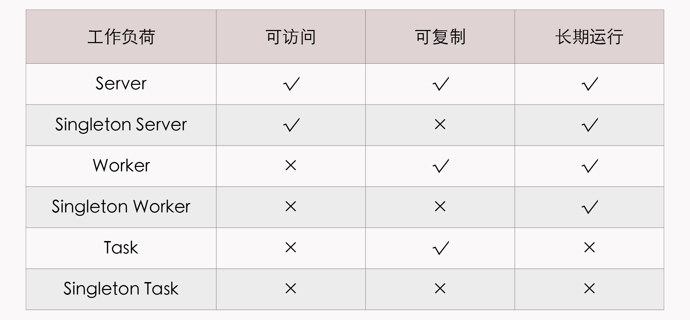
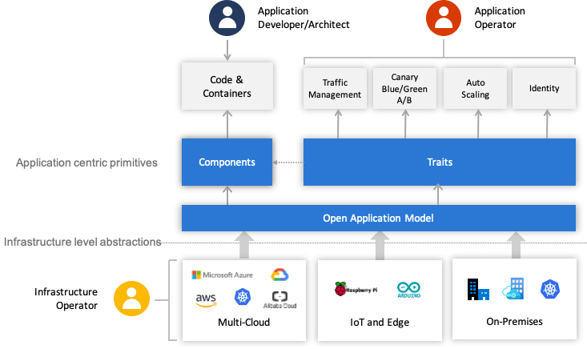

你好，我是周志明。上节课我们了解了无状态应用的两种主流封装方式，分别是 Kustomize 和 Helm。那么今天这节课，我们继续来学习有状态应用的两种封装方法，包括 Operator 和开放应用模型。

## Operator

与 Kustomize 和 Helm 不同的是，[Operator](https://www.redhat.com/zh/topics/containers/what-is-a-kubernetes-operator)不应当被称作是一种工具或者系统，它应该算是一种封装、部署和管理 Kubernetes 应用的方法，尤其是针对最复杂的有状态应用去封装运维能力的解决方案，最早是由 CoreOS 公司（于 2018 年被 RedHat 收购）的华人程序员邓洪超提出的。

简单来说，Operator 是通过 Kubernetes 1.7 开始支持的自定义资源（Custom Resource Definitions，CRD，此前曾经以 TPR，即 Third Party Resource 的形式提供过类似的能力），把应用封装为另一种更高层次的资源，再把 Kubernetes 的控制器模式从面向内置资源，扩展到了面向所有自定义资源，以此来完成对复杂应用的管理。

具体怎么理解呢？我们来看一下 RedHat 官方对 Operator 设计理念的阐述：

>Operator 设计理念
>
>Operator 是使用自定义资源（CR，本人注：CR 即 Custom Resource，是 CRD 的实例）管理应用及其组件的自定义 Kubernetes 控制器。高级配置和设置由用户在 CR 中提供。Kubernetes Operator 基于嵌入在 Operator 逻辑中的最佳实践，将高级指令转换为低级操作。Kubernetes Operator 监视 CR 类型并采取特定于应用的操作，确保当前状态与该资源的理想状态相符。
>
>—— [什么是 Kubernetes Operator](https://www.redhat.com/zh/topics/containers/what-is-a-kubernetes-operator)，RedHat

这段文字是直接由 RedHat 官方撰写并翻译成中文的，准确严谨，但比较拗口，对于没接触过 Operator 的人来说并不友好，比如，你可能就会问，什么叫做“高级指令”？什么叫做“低级操作”？它们之间具体如何转换呢？等等。

其实要理解这些问题，你必须先弄清楚有状态和无状态应用的含义及影响，然后再来理解 Operator 所做的工作。在上节课，我给你补充了一个“额外知识”，已经介绍过了二者之间的区别，现在我们再来看看：

>有状态应用（Stateful Application）与无状态应用（Stateless Application）说的是应用程序是否要自己持有其运行所需的数据，如果程序每次运行都跟首次运行一样，不依赖之前任何操作所遗留下来的痕迹，那它就是无状态的；反之，如果程序推倒重来之后，用户能察觉到该应用已经发生变化，那它就是有状态的。

无状态应用在分布式系统中具有非常巨大的价值，我们都知道分布式中的 CAP 不兼容原理，如果无状态，那就不必考虑状态一致性，没有了 C，那 A 和 P 就可以兼得。换句话说，只要资源足够，无状态应用天生就是高可用的。但不幸的是，现在的分布式系统中，多数关键的基础服务都是有状态的，比如缓存、数据库、对象存储、消息队列，等等，只有 Web 服务器这类服务属于无状态。

站在 Kubernetes 的角度看，是否有状态的本质差异在于，**有状态应用会对某些外部资源有绑定性的直接依赖**，比如说，Elasticsearch 在建立实例时，必须依赖特定的存储位置，只有重启后仍然指向同一个数据文件的实例，才能被认为是相同的实例。另外，有状态应用的多个应用实例之间，往往有着特定的拓扑关系与顺序关系，比如 etcd 的节点间选主和投票，节点们都需要得知彼此的存在，明确每一个节点的网络地址和网络拓扑关系。

为了管理好那些与应用实例密切相关的状态信息，Kubernetes 从 1.9 版本开始正式发布了 StatefulSet 及对应的 StatefulSetController。与普通 ReplicaSet 中的 Pod 相比，由 StatefulSet 管理的 Pod 具备几项额外特性。

* **Pod 会按顺序创建和按顺序销毁**：StatefulSet 中的各个 Pod 会按顺序地创建出来，而且，再创建后面的 Pod 之前，必须要保证前面的 Pod 已经转入就绪状态。如果要销毁 StatefulSet 中的 Pod，就会按照与创建顺序的逆序来执行。

* **Pod 具有稳定的网络名称**：Kubernetes 中的 Pod 都具有唯一的名称，在普通的副本集中，这是靠随机字符产生的，而在 StatefulSet 中管理的 Pod，会以带有顺序的编号作为名称，而且能够在重启后依然保持不变。

* **Pod 具有稳定的持久存储**：StatefulSet 中的每个 Pod 都可以拥有自己独立的 PersistentVolumeClaim 资源。即使 Pod 被重新调度到其他节点上，它所拥有的持久磁盘也依然会被挂载到该 Pod，这点会在“容器持久化”这个小章节中进一步介绍。

看到这些特性以后，你可能还会说，我还是不太理解 StatefulSet 的设计意图呀。没关系，我来举个例子，你一看就理解了。

如果把 ReplicaSet 中的 Pod 比喻为养殖场中的“肉猪”，那 StatefulSet 就是被当作宠物圈养的“荷兰猪”，不同的肉猪在食用功能上并没有什么区别，但每只宠物猪都是独一无二的，有专属于自己的名字、习性与记忆。事实上，早期的 StatefulSet 就曾经使用过 PetSet 这个名字。

StatefulSet 出现以后，Kubernetes 就能满足 Pod 重新创建后，仍然保留上一次运行状态的需求了。不过，有状态应用的维护并不仅限于此。比如说，对于一套 Elasticsearch 集群来说，通过 StatefulSet，最多只能做到创建集群、删除集群、扩容缩容等最基本的操作，并不支持常见的运维操作，比如备份和恢复数据、创建和删除索引、调整平衡策略，等等。

我再举个实际例子，来说明一下，Operator 是如何解决那些 StatefulSet 覆盖不到的有状态服务管理需求的。

假设我们要部署一套 Elasticsearch 集群，通常要在 StatefulSet 中定义相当多的细节，比如服务的端口、Elasticsearch 的配置、更新策略、内存大小、虚拟机参数、环境变量、数据文件位置，等等。

这里我直接把满足这个需求的 YAML 全部贴出来，让你对咱们前面反复提到的 Kubernetes 的复杂性有更加直观的理解。

```yaml
apiVersion: v1
kind: Service
metadata:
  name: elasticsearch-cluster
spec:
  clusterIP: None
  selector:
    app: es-cluster
  ports:
  - name: transport
    port: 9300
---
apiVersion: v1
kind: Service
metadata:
  name: elasticsearch-loadbalancer
spec:
  selector:
    app: es-cluster
  ports:
  - name: http
    port: 80
    targetPort: 9200
  type: LoadBalancer
---
apiVersion: v1
kind: ConfigMap
metadata:
  name: es-config
data:
  elasticsearch.yml: |
    cluster.name: my-elastic-cluster
    network.host: "0.0.0.0"
    bootstrap.memory_lock: false
    discovery.zen.ping.unicast.hosts: elasticsearch-cluster
    discovery.zen.minimum_master_nodes: 1
    xpack.security.enabled: false
    xpack.monitoring.enabled: false
  ES_JAVA_OPTS: -Xms512m -Xmx512m
---
apiVersion: apps/v1beta1
kind: StatefulSet
metadata:
  name: esnode
spec:
  serviceName: elasticsearch
  replicas: 3
  updateStrategy:
    type: RollingUpdate
  template:
    metadata:
      labels:
        app: es-cluster
    spec:
      securityContext:
        fsGroup: 1000
      initContainers:
      - name: init-sysctl
        image: busybox
        imagePullPolicy: IfNotPresent
        securityContext:
          privileged: true
        command: ["sysctl", "-w", "vm.max_map_count=262144"]
      containers:
      - name: elasticsearch
        resources:
            requests:
                memory: 1Gi
        securityContext:
          privileged: true
          runAsUser: 1000
          capabilities:
            add:
            - IPC_LOCK
            - SYS_RESOURCE
        image: docker.elastic.co/elasticsearch/elasticsearch:7.9.1
        env:
        - name: ES_JAVA_OPTS
          valueFrom:
              configMapKeyRef:
                  name: es-config
                  key: ES_JAVA_OPTS
        readinessProbe:
          httpGet:
            scheme: HTTP
            path: /_cluster/health?local=true
            port: 9200
          initialDelaySeconds: 5
        ports:
        - containerPort: 9200
          name: es-http
        - containerPort: 9300
          name: es-transport
        volumeMounts:
        - name: es-data
          mountPath: /usr/share/elasticsearch/data
        - name: elasticsearch-config
          mountPath: /usr/share/elasticsearch/config/elasticsearch.yml
          subPath: elasticsearch.yml
      volumes:
        - name: elasticsearch-config
          configMap:
            name: es-config
            items:
              - key: elasticsearch.yml
                path: elasticsearch.yml
  volumeClaimTemplates:
  - metadata:
      name: es-data
    spec:
      accessModes: [ "ReadWriteOnce" ]
      resources:
        requests:
          storage: 5Gi
```

可以看到，这里面的细节配置非常多。其实，之所以会这样，根本原因在于 Kubernetes 完全不知道 Elasticsearch 是个什么东西。所有 Kubernetes 不知道的信息、不能[启发式推断https://en.wikipedia.org/wiki/Heuristic_(computer_science)]()出来的信息，都必须由用户在资源的元数据定义中明确列出，必须一步一步手把手地“教会”Kubernetes 部署 Elasticsearch，这种形式就属于咱们刚刚提到的“低级操作”。

如果我们使用[Elastic.co 官方提供的 Operator](https://github.com/elastic/cloud-on-k8s)，那就会简单多了。Elasticsearch Operator 提供了一种kind: Elasticsearch的自定义资源，在它的帮助下，只需要十行代码，将用户的意图是“部署三个版本为 7.9.1 的 ES 集群节点”说清楚，就能实现跟前面 StatefulSet 那一大堆配置相同甚至是更强大的效果，如下面代码所示：

```yaml
apiVersion: elasticsearch.k8s.elastic.co/v1
kind: Elasticsearch
metadata:
  name: elasticsearch-cluster
spec:
  version: 7.9.1
  nodeSets:
  - name: default
    count: 3
    config:
      node.master: true
      node.data: true
      node.ingest: true
      node.store.allow_mmap: false
```

有了 Elasticsearch Operator 的自定义资源，就相当于 Kubernetes 已经学会怎样操作 Elasticsearch 了。知道了所有它相关的参数含义与默认值，就不需要用户再手把手地教了，这种就是所谓的“高级指令”。

Operator 将简洁的高级指令转化为 Kubernetes 中具体操作的方法，跟 Helm 或 Kustomize 的思路并不一样：

* Helm 和 Kustomize 最终仍然是依靠 Kubernetes 的内置资源，来跟 Kubernetes 打交道的；

* Operator 则是要求开发者自己实现一个专门针对该自定义资源的控制器，在控制器中维护自定义资源的期望状态。

通过程序编码来扩展 Kubernetes，比只通过内置资源来与 Kubernetes 打交道要灵活得多。比如，在需要更新集群中某个 Pod 对象的时候，由 Operator 开发者自己编码实现的控制器，完全可以在原地对 Pod 进行重启，不需要像 Deployment 那样，必须先删除旧 Pod，然后再创建新 Pod。

使用 CRD 定义高层次资源、使用配套的控制器来维护期望状态，带来的好处不仅仅是“高级指令”的便捷，更重要的是，可以在遵循 Kubernetes 的一贯基于资源与控制器的设计原则的同时，又不必受制于 Kubernetes 内置资源的表达能力。只要 Operator 的开发者愿意编写代码，前面提到的那些 StatfulSet 不能支持的能力，如备份恢复数据、创建删除索引、调整平衡策略等操作，都完全可以实现出来。

把运维的操作封装在程序代码上，从表面上看，最大的受益者是运维人员，开发人员要为此付出更多劳动。然而，Operator 并没有被开发者抵制，相反，因为用代码来描述复杂状态往往反而比配置文件更加容易，开发与运维之间的协作成本降低了，还受到了开发者的一致好评。

因为 Operator 的各种优势，它变成了近两、三年容器封装应用的一股新潮流，现在很多复杂分布式系统都有了官方或者第三方提供的 Operator（[这里收集了一部分](https://github.com/operator-framework/awesome-operators)）。RedHat 公司也持续在 Operator 上面进行了大量投入，推出了简化开发人员编写 Operator 的[Operator Framework/SDK](https://github.com/operator-framework/operator-sdk)。

目前看来，应对有状态应用的封装运维，Operator 也许是最有可行性的方案，但这依然不是一项轻松的工作。以[etcd 的 Operator](https://github.com/coreos/etcd-operator)为例，etcd 本身不算什么特别复杂的应用，Operator 实现的功能看起来也相当基础，主要有创建集群、删除集群、扩容缩容、故障转移、滚动更新、备份恢复等功能，但是代码就已经超过一万行了。

现在，开发 Operator 的确还是有着相对较高的门槛，通常由专业的平台开发者而非业务开发或者运维人员去完成。但是，Operator 非常符合技术潮流，顺应了软件业界所提倡的 DevOps 一体化理念，等 Operator 的支持和生态进一步成熟之后，开发和运维都能从中受益，未来应该能成长为一种应用封装的主流形式。

## OAM

我要给你介绍的最后一种应用封装的方案，是阿里云和微软在 2019 年 10 月上海 QCon 大会上联合发布的[开放应用模型](https://oam.dev/)（Open Application Model，OAM），它不仅是中国云计算企业参与制定，甚至是主导发起的国际技术规范，也是业界首个云原生应用标准定义与架构模型。

OAM 思想的核心是将开发人员、运维人员与平台人员的关注点分离，开发人员关注业务逻辑的实现，运维人员关注程序的平稳运行，平台人员关注基础设施的能力与稳定性。毕竟，长期让几个角色厮混在同一个 All-in-One 资源文件里，并不能擦出什么火花，反而会将配置工作弄得越来越复杂，把“[YAML Engineer](https://www.stackery.io/blog/stop-yaml-engineering/)”弄成容器界的嘲讽梗。

OAM 对云原生应用的定义是：“由一组相互关联但又离散独立的组件构成，这些组件实例化在合适的运行时上，由配置来控制行为并共同协作提供统一的功能”。你可能看不懂是啥意思，没有关系，为了方便跟后面的概念对应，我先把这句话拆解一下：

>**OAM 定义的应用**
>
>一个Application由一组Components构成，每个Component的运行状态由Workload描述，每个Component可以施加Traits来获取额外的运维能力，同时，我们可以使用Application Scopes将Components划分到一或者多个应用边界中，便于统一做配置、限制、管理。把Components、Traits和Scopes组合在一起实例化部署，形成具体的Application Configuration，以便解决应用的多实例部署与升级。

然后，我来具体解释一下上面列出来的核心概念，来帮助你理解 OAM 对应用的定义。在这句话里面，每一个用英文标注出来的技术名词，都是 OAM 在 Kubernetes 的基础上扩展而来的概念，每一个名词都有相对应的自定义资源。换句话说，它们并不是单纯的抽象概念，而是可以被实际使用的自定义资源。

我们来看一下这些概念的具体含义。

* Components（服务组件）：自 SOA 时代以来，由 Component 构成应用的思想就屡见不鲜，然而，OAM 的 Component 不仅仅是特指构成应用“整体”的一个“部分”，它还有一个重要的职责，那就是抽象出那些应该由开发人员去关注的元素。比如应用的名字、自述、容器镜像、运行所需的参数，等等。

* Workload（工作负荷）：Workload 决定了应用的运行模式，每个 Component 都要设定自己的 Workload 类型，OAM 按照“是否可访问、是否可复制、是否长期运行”预定义了六种 Workload 类型，如下表所示。如果有必要，使用者还可以通过 CRD 与 Operator 去扩展。

    

* Traits（运维特征）：开发活动有大量复用功能的技巧，但运维活动却很缺少这样的技巧，平时能为运维写个 Shell 脚本或简单工具，就已经算是个高级的运维人员了。Traits 就可以用来封装模块化后的运维能力，它可以针对运维中的可重复操作预先设定好一些具体的 Traits，比如日志收集 Trait、负载均衡 Trait、水平扩缩容 Trait，等等。这些预定义的 Traits 定义里，会注明它们可以作用于哪种类型的工作负荷，还包括能填哪些参数、哪些必填选填项、参数的作用描述是什么，等等。

* Application Scopes（应用边界）：多个 Component 共同组成一个 Scope，你可以根据 Component 的特性或作用域来划分 Scope。比如，具有相同网络策略的 Component 放在同一个 Scope 中，具有相同健康度量策略的 Component 放到另一个 Scope 中。同时，一个 Component 也可能属于多个 Scope，比如，一个 Component 完全可能既需要配置网络策略，也需要配置健康度量策略。

* Application Configuration（应用配置）：将 Component（必须）、Trait（必须）、Scope（非必须）组合到一起进行实例化，就形成了一个完整的应用配置。

OAM 使用咱们刚刚所说的这些自定义资源，对原先 All-in-One 的复杂配置做了一定层次的解耦：

* 开发人员负责管理 Component；

* 运维人员将 Component 组合并绑定 Trait，把它变成 Application Configuration；

* 平台人员或基础设施提供方负责提供 OAM 的解释能力，将这些自定义资源映射到实际的基础设施。

这样，不同角色分工协作，就整体简化了单个角色关注的内容，让不同角色可以更聚焦、更专业地做好本角色的工作，整个过程如下图所示：



OAM 角色关系图（图片来自[OAM 规范 GitHub](https://github.com/oam-dev/spec/)）

事实上，OAM 未来能否成功，很大程度上取决于云计算厂商的支持力度，因为 OAM 的自定义资源一般是由云计算基础设施负责解释和驱动的，比如阿里云的[EDAS](https://help.aliyun.com/zh/edas/)就已内置了 OAM 的支持。

如果你希望能够应用在私有 Kubernetes 环境中，目前，OAM 的主要参考实现是[Rudr](https://github.com/oam-dev/rudr)（已声明废弃）和[Crossplane](https://www.crossplane.io/)。Crossplane 是一个仅发起一年多的 CNCF 沙箱项目，主要参与者包括阿里云、微软、Google、RedHat 等工程师。Crossplane 提供了 OAM 中全部的自定义资源和控制器，安装以后，就可以用 OAM 定义的资源来描述应用了。

## 小结

今天，容器圈的发展是一日千里，各种新规范、新技术层出不穷。在这两节课里，我特意挑选了非常流行，而且有代表性的四种，分别是“无状态应用”的典型代表 Kustomize 和 Helm，和“有状态应用”的典型代表 Operator 和 OAM。

其他我没有提到的应用封装技术，还有[CNAB](https://cnab.io/)、[Armada](https://github.com/airshipit/armada)、[Pulumi](https://www.pulumi.com/)，等等。这些封装技术会有一定的重叠之处，但并非都是重复的轮子，在实际应用的时候，往往会联合其中多个工具一起使用。而至于怎么封装应用才是最佳的实践，目前也还没有定论，但可以肯定的是，以应用为中心的理念已经成为了明确的共识。

## 一课一思

在“虚拟化容器”这个小章节中，我安排了五节课来介绍虚拟化容器的原理和应用，不知道经过这几节课的学习后，你对容器是否有更新的认识？可以在留言区说说你对容器现状和未来的看法，我们一起交流讨论。

如果你觉得有收获，欢迎把今天的内容分享给更多的朋友。感谢你的阅读，我们下一讲再见。