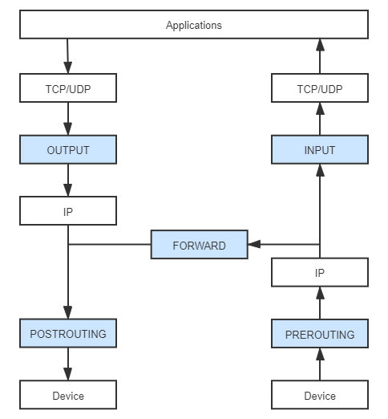
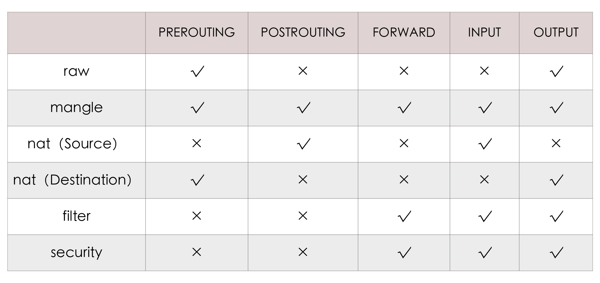

你好，我是周志明。从这节课开始，我会用两讲的时间带你学习[虚拟化网络](https://en.wikipedia.org/wiki/Network_virtualization)方面的知识点。

如果不加任何限定，“虚拟化网络”其实是一项内容十分丰富，研究历史十分悠久的计算机技术，它完全不依附于虚拟化容器，而是作为计算机科学中一门独立的分支。像是网络运营商经常提起的“[网络功能虚拟化](https://en.wikipedia.org/wiki/Network_function_virtualization)”（Network Function Virtualization，NFV），还有网络设备商和网络管理软件提供商经常提起的“[软件定义网络](https://en.wikipedia.org/wiki/Software-defined_networking)”（Software Defined Networking，SDN）等等，这些都属于虚拟化网络的范畴。

不过，对于我们这样普通的软件开发者来说，一般没有什么必要去完全理解和掌握虚拟化网络，因为这需要储备大量开发中不常用到的专业知识，而且还会消耗大量的时间成本。

所以在课程里，我们讨论的虚拟化网络是狭义的，它特指“如何基于 Linux 系统的网络虚拟化技术来实现的容器间网络通信”，更通俗一点说，就是只关注那些为了相互隔离的 Linux 网络名称空间可以相互通信，而设计出来的虚拟化网络设施。

另外我还要说明的是，在这个语境中的“虚拟化网络”就是直接为容器服务的，说它是依附于容器而存在的也完全可行。所以为了避免混淆，我在课程中会尽量回避“虚拟化网络”这个范畴过大的概念，而是会以“容器间网络”和“Linux 网络虚拟化”为题来展开讲解。

好了，下面我们就从 Linux 下网络通信的协议栈模型，以及程序如何干涉在协议栈中流动的信息来开始了解吧。

## Linux 系统下的网络通信模型

如果抛开虚拟化，只谈网络的话，那我认为首先应该了解的知识，就是 Linux 系统的网络通信模型，即**信息是如何从程序中发出，通过网络传输，再被另一个程序接收到的**。

从整体上看，Linux 系统的通信过程无论是按理论上的 OSI 七层模型，还是以实际上的 TCP/IP 四层模型来解构，都明显地呈现出“逐层调用，逐层封装”的特点，这种逐层处理的方式与栈结构，比如程序执行时的方法栈很类似，所以它通常被称为“[Linux 网络协议栈](https://en.wikipedia.org/wiki/Protocol_stack)”，简称“网络栈”，有时也称“协议栈”。

下图就体现了 Linux 网络通信过程与 OSI 或者 TCP/IP 模型的对应关系，也展示了网络栈中的数据流动的路径，你可以看一下：

Linux系统下的网络通信模型

在图中传输模型的左侧，我特别标示出了网络栈在用户与内核空间的部分，也就是说几乎整个网络栈（应用层以下）都位于系统内核空间之中，而 Linux 系统之所以采用这种设计，主要是从数据安全隔离的角度出发来考虑的。

由内核去处理网络报文的收发，无疑会有更高的执行开销，比如数据在内核态和用户态之间来回拷贝的额外成本，所以就会损失一些性能，但是这样能够保证应用程序无法窃听到或者去伪造另一个应用程序的通信内容。当然，针对特别关注收发性能的应用场景，也有直接在用户空间中实现全套协议栈的旁路方案，比如开源的[Netmap](https://github.com/luigirizzo/netmap)以及 Intel 的[DPDK](https://en.wikipedia.org/wiki/Data_Plane_Development_Kit)，都能做到零拷贝收发网络数据包。

另外，图中传输模型的箭头展示的是数据流动的方向，它体现了信息从程序中发出以后，到被另一个程序接收到之前经历的几个阶段，下面我来给你一一分析下。

**Socket**

应用层的程序是通过 Socket 编程接口，来和内核空间的网络协议栈通信的。Linux Socket 是从 BSD Socket 发展而来的，现在的 Socket 已经不局限于作为某个操作系统的专属功能，而是成为了各大主流操作系统共同支持的通用网络编程接口，是网络应用程序实际上的交互基础。

在这里，应用程序通过读写收、发缓冲区（Receive/Send Buffer）来与 Socket 进行交互，在 Unix 和 Linux 系统中，出于“一切皆是文件”的设计哲学，对 Socket 的操作被实现为了对文件系统（socketfs）的读写访问操作，通过文件描述符（File Descriptor）来进行。

**TCP/UDP**

传输层协议族里，最重要的协议无疑就是[传输控制协议](https://en.wikipedia.org/wiki/Transmission_Control_Protocol)（Transmission Control Protocol，TCP）和[用户数据报协议](https://en.wikipedia.org/wiki/User_Datagram_Protocol)（User Datagram Protocol，UDP）两种，它们也是在 Linux 内核中被直接支持的协议。此外还有[流控制传输协议](https://en.wikipedia.org/wiki/Stream_Control_Transmission_Protocol)（Stream Control Transmission Protocol，SCTP）、[数据报拥塞控制协议](https://en.wikipedia.org/wiki/Datagram_Congestion_Control_Protocol)（Datagram Congestion Control Protocol，DCCP），等等。当然了，不同的协议处理流程大致都是一样的，只是封装的报文和头、尾部信息会有些不一样。

这里我以 TCP 协议为例，内核发现 Socket 的发送缓冲区中，有新的数据被拷贝进来后，会把数据封装为 TCP Segment 报文，常见的网络协议的报文基本上都是由报文头（Header）和报文体（Body，也叫荷载“Payload”）两部分组成。

接着，系统内核将缓冲区中用户要发送出去的数据作为报文体，然后把传输层中的必要控制信息，比如代表哪个程序发、由哪个程序收的源、目标端口号，用于保证可靠通信（重发与控制顺序）的序列号、用于校验信息是否在传输中出现损失的校验和（Check Sum）等信息，封装入报文头中。

**IP**

网络层协议最主要的就是[网际协议](https://en.wikipedia.org/wiki/Internet_Protocol)（Internet Protocol，IP），其他的还会有[因特网组管理协议](https://en.wikipedia.org/wiki/Internet_Group_Management_Protocol)（Internet Group Management Protocol，IGMP）、大量的路由协议（EGP、NHRP、OSPF、IGRP、……），等等。

这里我就以 IP 协议为例，它会把来自上一层（即前面例子中的 TCP 报文）的数据包作为报文体，然后再次加入到自己的报文头中，比如指明数据应该发到哪里的路由地址、数据包的长度、协议的版本号，等等，这样封装成 IP 数据包后再发往下一层。关于 TCP 和 IP 协议报文的内容，我曾在“[负载均衡](https://time.geekbang.org/column/article/327417)”这节课中详细讲解过，你可以去回顾复习下。

**Device**

Device 即网络设备，它是网络访问层中面向系统一侧的接口。不过这里所说的设备，跟物理硬件设备并不是同一个概念，Device 只是一种向操作系统端开放的接口，它的背后既可能代表着真实的物理硬件，也可能是某段具有特定功能的程序代码，比如即使不存在物理网卡，也依然可以存在回环设备（Loopback Device）。

许多网络抓包工具，比如[tcpdump](https://en.wikipedia.org/wiki/Tcpdump)、[Wirshark](https://en.wikipedia.org/wiki/Wireshark)就是在此处工作的，我在前面[第 38 讲](https://time.geekbang.org/column/article/343561)介绍微服务流量控制的时候，曾提到过的网络流量整形，通常也是在这里完成的。

Device 主要的作用是抽象出统一的界面，让程序代码去选择或影响收发包出入口，比如决定数据应该从哪块网卡设备发送出去；还有就是准备好网卡驱动工作所需的数据，比如来自上一层的 IP 数据包、[下一跳](https://en.wikipedia.org/wiki/Hop_(networking))（Next Hop）的 MAC 地址（这个地址是通过[ARP Request](https://en.wikipedia.org/wiki/Address_Resolution_Protocol)得到的），等等。

**Driver**

网卡驱动程序（Driver）是网络访问层中面向硬件一侧的接口，网卡驱动程序会通过[DMA](https://en.wikipedia.org/wiki/Direct_memory_access)把主存中的待发送的数据包，复制到驱动内部的缓冲区之中。数据被复制的同时，也会把上层提供的 IP 数据包、下一跳的 MAC 地址这些信息，加上网卡的 MAC 地址、VLAN Tag 等信息，一并封装成为[以太帧](https://en.wikipedia.org/wiki/Ethernet_frame)（Ethernet Frame），并自动计算校验和。而对于需要确认重发的信息，如果没有收到接收者的确认（ACK）响应，那重发的处理也是在这里自动完成的。

好了，上面这些阶段就是信息从程序中对外发出时，经过协议栈的过程了，而接收过程则是从相反方向进行的逆操作。

这里你需要记住，**程序发送数据做的是层层封包，加入协议头，传给下一层；而接受数据则是层层解包，提取协议体，传给上一层**。你可以通过类比来理解数据包的接收过程，我就不再啰嗦一遍数据接收的步骤了。

## 干预网络通信的 Netfilter 框架

到这里，我们似乎可以发现，网络协议栈的处理是一套相对固定和封闭的流程，在整套处理过程中，除了在网络设备这层，我们能看到一点点程序以设备的形式介入处理的空间以外，其他过程似乎就没有什么可供程序插手的余地了。

然而事实并非如此，**从 Linux Kernel 2.4 版开始，内核开放了一套通用的、可供代码干预数据在协议栈中流转的过滤器框架，这就是 Netfilter 框架**。

Netfilter 框架是 Linux 防火墙和网络的主要维护者罗斯迪·鲁塞尔（Rusty Russell）提出并主导设计的，它围绕网络层（IP 协议）的周围，埋下了五个[钩子](https://en.wikipedia.org/wiki/Hooking)（Hooks），每当有数据包流到网络层，经过这些钩子时，就会自动触发由内核模块注册在这里的回调函数，程序代码就能够通过回调来干预 Linux 的网络通信。

下面我给你介绍一下这五个钩子分别都是什么：

* **PREROUTING**：来自设备的数据包进入协议栈后，就会立即触发这个钩子。注意，如果 PREROUTING 钩子在进入 IP 路由之前触发了，就意味着只要接收到的数据包，无论是否真的发往本机，也都会触发这个钩子。它一般是用于目标网络地址转换（Destination NAT，DNAT）。

* **INPUT**：报文经过 IP 路由后，如果确定是发往本机的，将会触发这个钩子，它一般用于加工发往本地进程的数据包。

* **FORWARD**：报文经过 IP 路由后，如果确定不是发往本机的，将会触发这个钩子，它一般用于处理转发到其他机器的数据包。

* **OUTPUT**：从本机程序发出的数据包，在经过 IP 路由前，将会触发这个钩子，它一般用于加工本地进程的输出数据包。

* **POSTROUTING**：从本机网卡出去的数据包，无论是本机的程序所发出的，还是由本机转发给其他机器的，都会触发这个钩子，它一般是用于源网络地址转换（Source NAT，SNAT）。

应用收、发数据包所经过的Netfilter钩子

Netfilter 允许在同一个钩子处注册多个回调函数，所以数据包在向钩子注册回调函数时，必须提供明确的优先级，以便触发时能按照优先级从高到低进行激活。而因为回调函数会有很多个，看起来就像是挂在同一个钩子上的一串链条，所以钩子触发的回调函数集合，就被称为“**回调链**”（Chained Callbacks），这个名字也导致了后续基于 Netfilter 设计的 Xtables 系工具，比如下面我要介绍的 iptables，都使用到了“链”（Chain）的概念。

那么，虽然现在看来，Netfilter 只是一些简单的事件回调机制而已，但这样一套简单的设计，却**成为了整座 Linux 网络大厦的核心基石**，Linux 系统提供的许多网络能力，比如数据包过滤、封包处理（设置标志位、修改 TTL 等）、地址伪装、网络地址转换、透明代理、访问控制、基于协议类型的连接跟踪、带宽限速，等等，它们都是在 Netfilter 的基础之上实现的。

而且，以 Netfilter 为基础的应用也有很多，其中使用最广泛的毫无疑问要数 Xtables 系列工具，比如[iptables](https://en.wikipedia.org/wiki/Iptables)、ebtables、arptables、ip6tables，等等。如果你用过 Linux 系统来做过开发的话，那我估计至少这里面的 iptables 工具，你会或多或少地使用过，它常被称为是 Linux 系统“自带的防火墙”。

但其实，iptables 实际能做的事情已经远远超出了防火墙的范畴，严谨地讲，iptables 比较贴切的定位应该是能够代替 Netfilter 多数常规功能的 IP 包过滤工具。

要知道，iptables 的设计意图是因为 Netfilter 的钩子回调虽然很强大，但毕竟要通过程序编码才够能使用，并不适合系统管理员用来日常运维，而它的价值就是**以配置去实现原本用 Netfilter 编码才能做到的事情**。

一般来说，iptables 会先把用户常用的管理意图总结成具体的行为，预先准备好，然后就会在满足条件的时候自动激活行为，比如以下几种常见的 iptables 预置的行为：

* DROP：直接将数据包丢弃。

* REJECT：给客户端返回 Connection Refused 或 Destination Unreachable 报文。

* QUEUE：将数据包放入用户空间的队列，供用户空间的程序处理。

* RETURN：跳出当前链，该链里后续的规则不再执行。

* ACCEPT：同意数据包通过，继续执行后续的规则。

* JUMP：跳转到其他用户自定义的链继续执行。

* REDIRECT：在本机做端口映射。

* MASQUERADE：地址伪装，自动用修改源或目标的 IP 地址来做 NAT

* LOG：在 /var/log/messages 文件中记录日志信息。

* ……

当然，这些行为本来能够被挂载到 Netfilter 钩子的回调链上，但 iptables 又进行了一层额外抽象，它不是把行为与链直接挂钩，而是会根据这些底层操作的目的，先总结为更高层次的规则。

我举个例子，假设你挂载规则的目的是为了实现网络地址转换（NAT），那就应该对符合某种特征的流量（比如来源于某个网段、从某张网卡发送出去）、在某个钩子上（比如做 SNAT 通常在 POSTROUTING，做 DNAT 通常在 PREROUTING）进行 MASQUERADE 行为，这样具有相同目的的规则，就应该放到一起才便于管理，所以也就形成了“**规则表**”的概念。

iptables 内置了五张不可扩展的规则表（其中的 security 表并不常用，很多资料只计算了前四张表），我们来看看：

1. raw 表：用于去除数据包上的[连接追踪机制](https://en.wikipedia.org/wiki/Netfilter#Connection_tracking)（Connection Tracking）。

2. mangle 表：用于修改数据包的报文头信息，比如服务类型（Type Of Service，ToS）、生存周期（Time to Live，TTL），以及为数据包设置 Mark 标记，典型的应用是链路的服务质量管理（Quality Of Service，QoS）。

3. nat 表：用于修改数据包的源或者目的地址等信息，典型的应用是网络地址转换（Network Address Translation）。

4. filter 表：用于对数据包进行过滤，控制到达某条链上的数据包是继续放行、直接丢弃或拒绝（ACCEPT、DROP、REJECT），典型的应用是防火墙。

5. security 表：用于在数据包上应用[SELinux](https://en.wikipedia.org/wiki/Security-Enhanced_Linux)，这张表并不常用。

这五张规则表是有优先级的：raw→mangle→nat→filter→security，也就是前面我列举出的顺序。这里你要注意，在 iptables 中新增规则时，需要按照规则的意图指定要存入到哪张表中，如果没有指定，就默认会存入 filter 表。此外，每张表能够使用到的链也有所不同，具体表与链的对应关系如下所示：

那么，你从名字上其实就能看出，预置的五条链是直接源自于 Netfilter 的钩子，它们与五张规则表的对应关系是固定的，用户不能增加自定义的表，或者修改已有表与链的关系，但可以增加自定义的链。

新增的自定义链与 Netfilter 的钩子没有天然的对应关系，换句话说就是不会被自动触发，只有显式地使用 JUMP 行为，从默认的五条链中跳转过去，才能被执行。

可以说，iptables 不仅仅是 Linux 系统自带的一个网络工具，它在容器间通信中也扮演着相当重要的角色。比如，Kubernetes 用来管理 Sevice 的 Endpoints 的核心组件 kube-proxy，就依赖 iptables 来完成 ClusterIP 到 Pod 的通信（也可以采用 IPVS，IPVS 同样是基于 Netfilter 的），这种通信的本质就是一种 NAT 访问。

当然，对于 Linux 用户来说，前面提到的内容可能都是相当基础的网络常识，但如果你平常比较少在 Linux 系统下工作，就可能需要一些用 iptables 充当防火墙过滤数据、充当作路由器转发数据、充当作网关做 NAT 转换的实际例子，来帮助理解了，这些操作在网上也很容易就能找到，这里我就不专门去举例说明了。

## 小结

Linux 目前提供的八种名称空间里，网络名称空间无疑是隔离内容最多的一种，它为名称空间内的所有进程提供了全套的网络设施，包括独立的设备界面、路由表、ARP 表，IP 地址表、iptables/ebtables 规则、协议栈，等等。

虚拟化容器是以 Linux 名称空间的隔离性为基础来实现的，那解决隔离的容器之间、容器与宿主机之间，乃至跨物理网络的不同容器间通信问题的责任，就很自然地落在了 Linux 网络虚拟化技术的肩上。这节课里，我们暂时放下了容器编排、云原生、微服务等等这些上层概念，走进 Linux 网络的底层世界，去学习了一些与设备、协议、通信相关的基础网络知识。

最后我想说的是，到目前为止，我给你介绍的 Linux 下网络通信的协议栈模型，以及程序如何干涉在协议栈中流动的信息，它们与虚拟化都没有产生什么直接联系，而是整个 Linux 网络通信的必要基础。在下节课，我们就要开始专注于跟网络虚拟化密切相关的内容了。

## 一课一思

说实话，今天的内容其实很适合以实现业务功能为主、平常并不直接接触网络设备的普通开发人员，而如果你是做平台基础设施开发或者运维的，那学习这节课可能就会觉得有点太基础或啰嗦了，因为这些都是基本的工作技能。

所以在最后，我想来了解一下，如果你是一名程序员，那你是否经常有机会接触这些网络方面的知识呢？如果有，你都用它们来做什么？欢迎给我留言。

另外，如果你觉得有收获，也欢迎把今天的内容分享给更多的朋友。感谢你的阅读，我们下一讲再见。