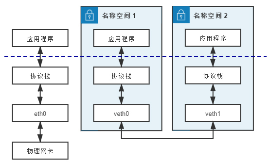
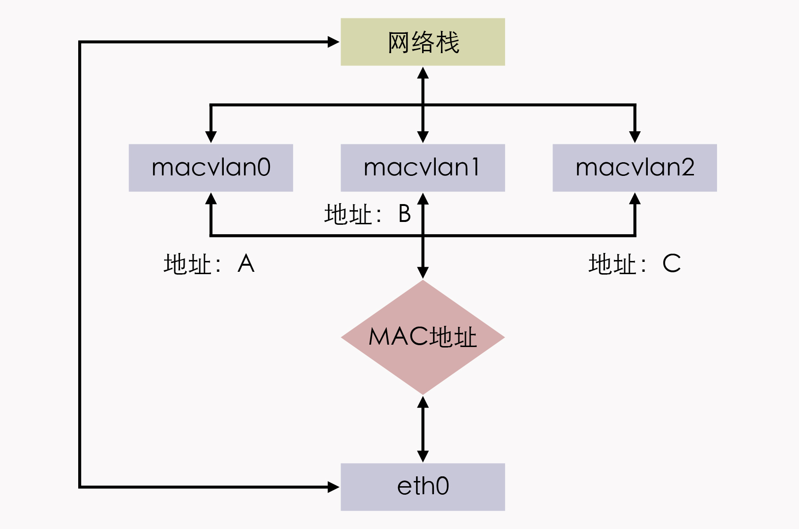

你好，我是周志明。今天我们接着上节课介绍的 Linux 网络知识，继续来学习它们在虚拟化网络方面的应用，从而为后续学习容器编排系统、理解各个容器是如何通过虚拟化网络来协同工作打好基础。

## 虚拟化网络设备

首先我们要知道，虚拟化网络并不需要完全遵照物理网络的样子来设计。不过，由于现在大量现成的代码，原来就是面向于物理存在的网络设备来编码实现的，另外也有出于方便理解和知识继承方面的考虑，因此虚拟化网络与物理网络中的设备还是具有相当高的相似性。

所以接下来，我就会从网络中那些与网卡、交换机、路由器等对应的虚拟设施，以及如何使用这些虚拟设施来组成网络入手，给你介绍容器间网络的通信基础设施。

好了，我们开始吧。

### 网卡：tun/tap、veth

首先是虚拟网卡设备。

目前主流的虚拟网卡方案有[tun/tap](https://www.kernel.org/doc/Documentation/networking/tuntap.txt)和[veth](https://man7.org/linux/man-pages/man4/veth.4.html)两种，其中 tun/tap 出现得时间更早，它是一组通用的虚拟驱动程序包，里面包含了两个设备，分别是用于网络数据包处理的虚拟网卡驱动，以及用于内核空间与用户空间交互的[字符设备](https://en.wikipedia.org/wiki/Device_file#Character_devices)（Character Devices，这里具体指/dev/net/tun）驱动。

大概在 2000 年左右，Solaris 系统为了实现[隧道协议](https://en.wikipedia.org/wiki/Tunneling_protocol)（Tunneling Protocol）开发了这套驱动，从 Linux Kernel 2.1 版开始，tun/tap 移植到了 Linux 内核中，当时它是作为源码中的可选模块，而在 2.4 版之后发布的内核，都会默认编译 tun/tap 的驱动。tun 和 tap 是两个相对独立的虚拟网络设备，其中 tap 模拟了以太网设备，操作二层数据包（以太帧），tun 则是模拟了网络层设备，操作三层数据包（IP 报文）。

那么，使用 tun/tap 设备的目的，其实是为了把来自协议栈的数据包，先交给某个打开了/dev/net/tun字符设备的用户进程处理后，再把数据包重新发回到链路中。这里你可以通俗地理解为，这块虚拟化网卡驱动一端连接着网络协议栈，另一端连接着用户态程序，而普通的网卡驱动则是一端连接着网络协议栈，另一端连接着物理网卡。

如此一来，只要协议栈中的数据包能被用户态程序截获并加工处理，程序员就有足够的舞台空间去玩出各种花样，比如数据压缩、流量加密、透明代理等功能，都能够在此基础上实现。

这里我就以最典型的 VPN 应用程序为例，程序发送给 tun 设备的数据包，会经过如下所示的顺序流进 VPN 程序：


VPN中数据流动示意图

应用程序通过 tun 设备对外发送数据包后，tun 设备如果发现另一端的字符设备已经被 VPN 程序打开（这就是一端连接着网络协议栈，另一端连接着用户态程序），就会把数据包通过字符设备发送给 VPN 程序，VPN 收到数据包，会修改后再重新封装成新报文，比如数据包原本是发送给 A 地址的，VPN 把整个包进行加密，然后作为报文体，封装到另一个发送给 B 地址的新数据包当中。

这种把一个数据包套进另一个数据包中的处理方式，就被形象地形容为“**隧道**”（Tunneling），隧道技术是在物理网络中构筑逻辑网络的经典做法。而其中提到的加密，实际上也有标准的协议可以遵循，比如[IPSec](https://en.wikipedia.org/wiki/IPsec)协议。

不过，使用 tun/tap 设备来传输数据需要经过两次协议栈，所以会不可避免地产生一定的性能损耗，因而如果条件允许，**容器对容器的直接通信并不会把 tun/tap 作为首选方案，而是一般基于 veth 来实现的**。

但 tun/tap 并没有像 veth 那样，有要求设备成对出现、数据要原样传输的限制，数据包到了用户态程序后，我们就有完全掌控的权力，要进行哪些修改、要发送到什么地方，都可以通过编写代码去实现，所以 **tun/tap 方案比起 veth 方案有更广泛的适用范围**。

那么这里我提到的 veth，就是另一种主流的虚拟网卡方案了，在 Linux Kernel 2.6 版本，Linux 开始支持网络名空间隔离的同时，也提供了专门的**虚拟以太网**（Virtual Ethernet，习惯简写为 veth），让两个隔离的网络名称空间之间可以互相通信。

其实，直接把 veth 比喻成虚拟网卡并不是很准确，如果要和物理设备类比，它应该相当于由[交叉网线](https://en.wikipedia.org/wiki/Ethernet_over_twisted_pair)连接的一对物理网卡。

>**额外知识：直连线序、交叉线序**
>
>交叉网线是指一头是 T568A 标准，另外一头是 T568B 标准的网线。直连网线则是两头采用同一种标准的网线。
>
>网卡对网卡这样的同类设备，需要使用交叉线序的网线来连接，网卡到交换机、路由器就采用直连线序的网线，不过现在的网卡大多带有线序翻转功能，直连线也可以网卡对网卡地连通了。

veth 实际上也不是一个设备，而是一对设备，因而它也常被称作 veth pair。我们要使用 veth，就必须在两个独立的网络名称空间中进行才有意义，因为 veth pair 是一端连着协议栈，另一端彼此相连的，在 veth 设备的其中一端输入数据，这些数据就会从设备的另一端原样不动地流出，它在工作时的数据流动如下图所示：



veth pair工作示意图

由于两个容器之间采用 veth 通信，不需要反复多次经过网络协议栈，这就让 veth 比起 tap/tun 来说，具备了更好的性能，也让 veth pair 的实现变得十分简单，内核中只用几十行代码实现一个数据复制函数，就可以完成 veth 的主体功能。

不过 veth 其实也存在局限性。

虽然 veth 以模拟网卡直连的方式，很好地解决了两个容器之间的通信问题，然而对多个容器间通信，如果仍然单纯只用 veth pair 的话，事情就会变得非常麻烦，毕竟，让每个容器都为与它通信的其他容器建立一对专用的 veth pair，根本就不实际，真正做起来成本会很高。

因此这时，就迫切需要有一台虚拟化的交换机，来解决多容器之间的通信问题了。

### 交换机：Linux Bridge

既然有了虚拟网卡，我们很自然就会联想到让网卡接入到交换机里，来实现多个容器间的相互连接。而[Linux Bridge](https://www.kernel.org/doc/html/latest/networking/bridge.html)就是 Linux 系统下的虚拟化交换机，虽然它是以“网桥”（Bridge）而不是“交换机”（Switch）为名，但在使用过程中，你会发现 Linux Bridge 看起来像交换机，功能使用起来像交换机、程序实现起来也像交换机，所以它实际就是一台虚拟交换机。

Linux Bridge 是在 Linux Kernel 2.2 版本开始提供的二层转发工具，由brctl命令创建和管理。Linux Bridge 创建以后，就能够接入任何位于二层的网络设备，无论是真实的物理设备（比如 eth0），还是虚拟的设备（比如 veth 或者 tap），都能与 Linux Bridge 配合工作。当有二层数据包（以太帧）从网卡进入 Linux Bridge，它就会根据数据包的类型和目标 MAC 地址，按照如下规则转发处理：

* 如果数据包是广播帧，转发给所有接入网桥的设备。

* 如果数据包是单播帧，且 MAC 地址在地址转发表中不存在，则[洪泛](https://en.wikipedia.org/wiki/Flooding_(computer_networking))（Flooding）给所有接入网桥的设备，并把响应设备的接口与 MAC 地址学习（MAC Learning）到自己的 MAC 地址转发表中。

* 如果数据包是单播帧，且 MAC 地址在地址转发表中已存在，则直接转发到地址表中指定的设备。

* 如果数据包是此前转发过的，又重新发回到此 Bridge，说明冗余链路产生了环路。由于以太帧不像 IP 报文那样有 TTL 来约束，所以一旦出现环路，如果没有额外措施来处理的话，就会永不停歇地转发下去。那么对于这种数据包，就需要交换机实现[生成树协议](https://en.wikipedia.org/wiki/Spanning_Tree_Protocol)（Spanning Tree Protocol，STP）来交换拓扑信息，生成唯一拓扑链路以切断环路。

刚刚提到的这些名词，比如二层转发、泛洪、STP、MAC 学习、地址转发表，等等，都是物理交换机中已经非常成熟的概念了，它们在 Linux Bridge 中都有对应的实现，所以我才说，Linux Bridge 不仅用起来像交换机，实现起来也像交换机。

不过，它与普通的物理交换机也还是有一点差别的，普通交换机只会单纯地做二层转发，**Linux Bridge 却还支持把发给它自身的数据包，接入到主机的三层协议栈中**。

对于通过brctl命令显式接入网桥的设备，Linux Bridge 与物理交换机的转发行为是完全一致的，它也不允许给接入的设备设置 IP 地址，因为网桥是根据 MAC 地址做二层转发的，就算设置了三层的 IP 地址也没有意义。

然而，Linux Bridge 与普通交换机的区别是，除了显式接入的设备外，它自己也无可分割地连接着一台有着完整网络协议栈的 Linux 主机，因为 Linux Bridge 本身肯定是在某台 Linux 主机上创建的，我们可以看作是 Linux Bridge 有一个与自己名字相同的隐藏端口，隐式地连接了创建它的那台 Linux 主机。

因此，Linux Bridge 允许给自己设置 IP 地址，这样就比普通交换机多出了一种特殊的转发情况：如果数据包的目的 MAC 地址为网桥本身，并且网桥设置了 IP 地址的话，那该数据包就会被认为是收到发往创建网桥那台主机的数据包，这个数据包将不会转发到任何设备，而是直接交给上层（三层）协议栈去处理。

这时，网桥就取代了物理网卡 eth0 设备来对接协议栈，进行三层协议的处理。

那么设置这条特殊转发规则的好处是什么呢？就是**只要通过简单的 NAT 转换，就可以实现一个最原始的单 IP 容器网络。这种组网是最基本的容器间通信形式**，下面我举个具体例子来帮助你理解。

假设现在有以下几个设备，它们的连接情况如图所示，具体配置是这样的：

* 网桥 br0：分配 IP 地址 192.168.31.1。

* 容器：三个网络名称空间（容器），分别编号为 1、2、3，均使用 veth pair 接入网桥，且有如下配置：

    * 在容器一端的网卡名为 veth0，在网桥一端网卡名为 veth1、veth2、veth3；

    * 三个容器中的 veth0 网卡分配 IP 地址：192.168.1.10、192.168.1.11、192.168.1.12；

    * 三个容器中的 veth0 网卡设置网关为网桥，即 192.168.31.1；

    * 网桥中的 veth1、veth2、veth3 无 IP 地址。

* 物理网卡 eth0：分配的 IP 地址 14.123.254.86。

* 外部网络：外部网络中有一台服务器，地址为 122.246.6.183。


Linux Bridge构建单IP容器网络

这样一来，如果名称空间 1 中的应用程序想访问外网地址为 122.246.6.183 的服务器，由于容器没有自己的公网 IP 地址，程序发出的数据包必须经过处理之后，才能最终到达外网服务器。

我们来具体分析下这个处理步骤：

1\. 应用程序调用 Socket API 发送数据，此时生成的原始数据包为：

a. 源 MAC：veth0 的 MAC

b. 目标 MAC：网关的 MAC（即网桥的 MAC）

c. 源 IP：veth0 的 IP，即 192.168.31.1

d. 目标 IP：外网的 IP，即 122.246.6.183

2\. 从 veth0 发送的数据，会在 veth1 中原样出来，网桥将会从 veth1 中接收到一个目标 MAC 为自己的数据包，并且网桥有配置 IP 地址，这样就触发了 Linux Bridge 的特殊转发规则。这个数据包也就不会转发给任何设备，而是转交给主机的协议栈处理。

>注意，从这步以后就是三层路由了，已经不在网桥的工作范围之内，而是由 Linux 主机依靠 Netfilter 进行 IP 转发（IP Forward）去实现的。

3\. 数据包经过主机协议栈，Netfilter 的钩子被激活，预置好的 iptables NAT 规则会修改数据包的源 IP 地址，把它改为物理网卡 eth0 的 IP 地址，并在映射表中记录设备端口和两个 IP 地址之间的对应关系，经过 SNAT 之后的数据包，最终会从 eth0 出去，此时报文头中的地址为：

a. 源 MAC：eth0 的 MAC

b. 目标 MAC：下一跳（Hop）的 MAC

c. 源 IP：eth0 的 IP，即 14.123.254.86

d. 目标 IP：外网的 IP，即 122.246.6.183

4\. 可见，经过主机协议栈后，数据包的源和目标 IP 地址均为公网的 IP，这个数据包在外部网络中，可以根据 IP 正确路由到目标服务器手上。这样，当目标服务器处理完毕，对该请求发出响应后，返回数据包的目标地址也是公网 IP。当返回的数据包经过链路上所有跳点，由 eth0 达到网桥时，报文头中的地址为：

a. 源 MAC：eth0 的 MAC

b. 目标 MAC：网桥的 MAC

c. 源 IP：外网的 IP，即 122.246.6.183

d. 目标 IP：eth0 的 IP，即 14.123.254.86

5\. 可见，这同样是一个以网桥 MAC 地址为目标的数据包，同样会触发特殊转发规则，然后交给协议栈处理。这时，Linux 会根据映射表中的转换关系做 DNAT 转换，把目标 IP 地址从 eth0 替换回 veth0 的 IP，最终 veth0 收到的响应数据包为：

a. 源 MAC：网桥的 MAC

b. 目标 MAC：veth0 的 MAC

c. 源 IP：外网的 IP，即 122.246.6.183

d. 目标 IP：veth0 的 IP，即 192.168.31.1

好了，这就是程序发出的数据包到达外网服务器之前的所有处理步骤。

在这个处理过程中，Linux 主机独立承担了三层路由的职责，一定程度上扮演了路由器的角色。而且由于有 Netfilter 的存在，对网络层的路由转发，就不需要像 Linux Bridge 一样，专门提供brctl这样的命令去创建一个虚拟设备了。

通过 Netfilter，很容易就能在 Linux 内核完成根据 IP 地址进行路由的功能。你也可以把 Linux Bridge 理解为是一个人工创建的虚拟交换机，而 Linux 内核是一个天然的虚拟路由器。

当然，除了我介绍的 Linux Bridge 这一种虚拟交换机的方案，还有 OVS（Open vSwitch）等同样常见，而且更强大、更复杂的方案，这里我就不讨论了，感兴趣的话你可以去参考[这个链接](https://en.wikipedia.org/wiki/Open_vSwitch)。

### 网络：VXLAN

那么，有了虚拟化网络设备后，下一步就是要使用这些设备组成网络了。

我们知道，容器分布在不同的物理主机上，每一台物理主机都有物理网络相互联通，然而这种网络的物理拓扑结构是相对固定的，很难跟上云原生时代下，分布式系统的逻辑拓扑结构变动频率，比如服务的扩缩、断路、限流，等等，都可能要求网络跟随做出相应的变化。

也正因为如此，软件定义网络（Software Defined Network，SDN）的需求在云计算和分布式时代，就变得前所未有地迫切。**SDN 的核心思路**是在物理的网络之上，再构造一层虚拟化的网络，把控制平面和数据平面分离开来，实现流量的灵活控制，为核心网络及应用的创新提供良好的平台。

**SDN 里，位于下层的物理网络被称为 Underlay，它着重解决网络的连通性与可管理性；位于上层的逻辑网络被称为 Overlay，它着重为应用提供与软件需求相符的传输服务和网络拓扑。**

事实上，SDN 已经发展了十几年的时间，比云原生、微服务这些概念出现得要早得多。网络设备商基于硬件设备开发出了 EVI（Ethernet Virtualization Interconnect）、TRILL（Transparent Interconnection of Lots of Links)、SPB（Shortest Path Bridging）等大二层网络技术；软件厂商也提出了 VXLAN（Virtual eXtensible LAN）、NVGRE（Network Virtualization Using Generic Routing Encapsulation）、STT（A Stateless Transport Tunneling Protocol for Network Virtualization）等一系列基于虚拟交换机实现的 Overlay 网络。

不过，由于跨主机的容器间通信用的大多是 Overlay 网络，所以接下来，我会以 VXLAN 为例，给你介绍 Overlay 网络的原理。

VXLAN 你可能没怎么听说过，但[VLAN](https://en.wikipedia.org/wiki/VLAN)相信只要从事计算机专业的人都会有所了解。VLAN 的全称是“虚拟局域网”（Virtual Local Area Network），从名称来看，它也算是网络虚拟化技术的早期成果之一了。

由于二层网络本身的工作特性，决定了 VLAN 非常依赖于广播，无论是广播帧（如 ARP 请求、DHCP、RIP 都会产生广播帧），还是泛洪路由，它的执行成本会随着接入二层网络设备数量的增长而等比例地增加，当设备太多，广播又频繁的时候，很容易就会形成[广播风暴](https://en.wikipedia.org/wiki/Broadcast_storm)（Broadcast Radiation）。

因此，**VLAN 的首要职责就是划分广播域**，把连接在同一个物理网络上的设备区分开来。

划分的具体方法是在以太帧的报文头中加入 VLAN Tag，让所有广播只针对具有相同 VLAN Tag 的设备生效。这样既缩小了广播域，也附带提高了安全性和可管理性，因为**两个 VLAN 之间不能直接通信**。如果确实有通信的需要，就必须通过三层设备来进行，比如使用[单臂路由](https://en.wikipedia.org/wiki/Router_on_a_stick)（Router on a Stick）或者三层交换机。

可是，VLAN 有两个明显的缺陷，**第一个缺陷在于 VLAN Tag 的设计**。定义 VLAN 的[802.1Q 规范](https://en.wikipedia.org/wiki/IEEE_802.1Q)是在 1998 年提出的，当时的网络工程师完全不可能预料到在未来云计算会如此地普及，因而就只给 VLAN Tag 预留了 32 Bits 的存储空间，其中还要分出 16 Bits 存储标签协议识别符（Tag Protocol Identifier）、3 Bits 存储优先权代码点（Priority Code Point）、1 Bits 存储标准格式指示（Canonical Format Indicator），剩下的 12 Bits 才能用来存储 VLAN ID（Virtualization Network Identifier，VNI）。

所以换句话说，VLAN ID 最多只能有 \=4096 种取值。当云计算数据中心出现后，即使不考虑虚拟化的需求，单是需要分配 IP 的物理设备，都有可能数以万计、甚至数以十万计，这样的话，4096 个 VLAN 肯定是不够用的。

后来，IEEE 的工程师们又提出[802.1AQ 规范](https://zh.wikipedia.org/wiki/IEEE_802.1ad)力图补救这个缺陷，大致思路是给以太帧连续打上两个 VLAN Tag，每个 Tag 里仍然只有 12 Bits 的 VLAN ID，但两个加起来就可以存储 \=16,777,216 个不同的 VLAN ID 了，由于两个 VLAN Tag 并排放在报文头上，802.1AQ 规范还有了个 QinQ（802.1Q in 802.1Q）的昵称别名。

QinQ 是 2011 年推出的规范，但是直到现在其实都没有特别普及，这是因为除了需要设备支持外，它还解决不了 **VLAN 的第二个缺陷：跨数据中心传递**。

VLAN 本身是为二层网络所设计的，但是在两个独立数据中心之间，信息只能跨三层传递。而由于云计算的灵活性，大型分布式系统完全有跨数据中心运作的可能性，所以此时如何让 VLAN Tag 在两个数据中心间传递，又成了不得不考虑的麻烦事。

由此，为了统一解决以上两个问题，IETF 定义了 **VXLAN 规范**，这是[三层虚拟化网络](https://datatracker.ietf.org/wg/nvo3/about/)（Network Virtualization over Layer 3，NVO3）的标准技术规范之一，**是一种典型的 Overlay 网络**。

VXLAN 采用 L2 over L4 （MAC in UDP）的报文封装模式，把原本在二层传输的以太帧，放到了四层 UDP 协议的报文体内，同时加入了自己定义的 VXLAN Header。在 VXLAN Header 里直接就有 24 Bits 的 VLAN ID，同样可以存储 1677 万个不同的取值。

如此一来，VXLAN 就可以让二层网络在三层范围内进行扩展，不再受数据中心间传输的限制了。VXLAN 的整个报文结构如下图所示：


VXLAN报文结构

（图片来源：[Orchestrating EVPN VXLAN Services with Cisco NSO](https://www.ciscolive.com/c/dam/r/ciscolive/emea/docs/2019/pdf/DEVWKS-1445.pdf)）

VXLAN 对网络基础设施的要求很低，不需要专门的硬件提供特别支持，只要三层可达的网络就能部署 VXLAN。

VXLAN 网络的每个边缘入口上，布置有一个 VTEP（VXLAN Tunnel Endpoints）设备，它既可以是物理设备，也可以是虚拟化设备，主要负责 VXLAN 协议报文的封包和解包。[互联网号码分配局](https://en.wikipedia.org/wiki/Internet_Assigned_Numbers_Authority)（Internet Assigned Numbers Authority，IANA）也专门分配了 4789 作为 VTEP 设备的 UDP 端口（以前 Linux VXLAN 用的默认端口是 8472，目前这两个端口在许多场景中仍有并存的情况）。

从 Linux Kernel 3.7 版本起，Linux 系统就开始支持 VXLAN。到了 3.12 版本，Linux 对 VXLAN 的支持已经达到了完全完备的程度，能够处理单播和组播，能够运行于 IPv4 和 IPv6 之上，一台 Linux 主机经过简单配置之后，就可以把 Linux Bridge 作为 VTEP 设备来使用。

**VXLAN 带来了很高的灵活性、扩展性和可管理性**，同一套物理网络中可以任意创建多个 VXLAN 网络，每个 VXLAN 中接入的设备，都像是在一个完全独立的二层局域网中一样，不会受到外部广播的干扰，也很难遭受外部的攻击，这就让 VXLAN 能够良好地匹配分布式系统的弹性需求。

不过，**VXLAN也带来了额外的复杂度和性能开销**，具体表现为以下两点：

* **传输效率的下降**，如果你仔细数过前面 VXLAN 报文结构中 UDP、IP、以太帧报文头的字节数，你就会发现经过 VXLAN 封装后的报文，新增加的报文头部分就整整占了 50 Bytes（VXLAN 报文头占 8 Bytes，UDP 报文头占 8 Bytes，IP 报文头占 20 Bytes，以太帧的 MAC 头占 14 Bytes），而原本只需要 14 Bytes 而已，而且现在这 14 Bytes 的消耗也还在，只是被封到了最里面的以太帧中。以太网的[MTU](https://en.wikipedia.org/wiki/Maximum_transmission_unit)是 1500 Bytes，如果是传输大量数据，额外损耗 50 Bytes 并不算很高的成本，但如果传输的数据本来就只有几个 Bytes 的话，那传输消耗在报文头上的成本就很高昂了。

* **传输性能的下降**，每个 VXLAN 报文的封包和解包操作都属于额外的处理过程，尤其是用软件来实现的 VTEP，要知道额外的运算资源消耗，有时候会成为不可忽略的性能影响因素。

### 副本网卡：MACVLAN

现在，理解了 VLAN 和 VXLAN 的原理后，我们就有足够的前置知识，去了解[MACVLAN](https://github.com/moby/libnetwork/blob/master/docs/macvlan.md)这最后一种网络设备虚拟化的方式了。

前面我提到，两个 VLAN 之间位于独立的广播域，是完全二层隔离的，要通信就只能通过三层设备。而最简单的三层通信就是靠**单臂路由**了。

接下来，我就以这里的示意图中给出的网络拓扑结构为例，来给你介绍下单臂路由是如何工作的。


VLAN单臂路由原理

假设位于 VLAN-A 中的主机 A1，希望把数据包发送给 VLAN-B 中的主机 B2，由于 A、B 两个 VLAN 之间二层链路不通，因此引入了单臂路由。单臂路由不属于任何 VLAN，它与交换机之间的链路允许任何 VLAN ID 的数据包通过，这种接口被称为 **TRUNK**。

这样，A1 要和 B2 通信，A1 就把数据包先发送给路由（只需把路由设置为网关即可做到），然后路由根据数据包上的 IP 地址得知 B2 的位置，去掉 VLAN-A 的 VLAN Tag，改用 VLAN-B 的 VLAN Tag 重新封装数据包后，发回给交换机，交换机收到后就可以顺利转发给 B2 了。

这个过程并没什么复杂的地方，但不知道你有没有注意到一个问题：**路由器应该设置怎样的 IP 地址呢？**

由于 A1、B2 各自处于独立的网段上，它们又各自要把同一个路由作为网关使用，这就要求路由器必须同时具备 192.168.1.0/24 和 192.168.2.0/24 的 IP 地址。当然，如果真的就只有 VLAN-A、VLAN-B 两个 VLAN，那把路由器上的两个接口分别设置不同的 IP 地址，然后用两条网线分别连接到交换机上，也勉强算是一个解决办法。

但要知道，VLAN 最多可以支持 4096 个 VLAN，那如果要接四千多条网线就太离谱了。因此为了解决这个问题，802.1Q 规范中专门定义了**子接口**（Sub-Interface）的概念，它的作用是允许在同一张物理网卡上，针对不同的 VLAN 绑定不同的 IP 地址。

所以，**MACVLAN** 就借用了 VLAN 子接口的思路，并且在这个基础上更进一步，**不仅允许对同一个网卡设置多个 IP 地址，还允许对同一张网卡上设置多个 MAC 地址**，这也是 MACVLAN 名字的由来。

原本 MAC 地址是网卡接口的“身份证”，应该是严格的一对一关系，而 MACVLAN 打破了这层关系。方法就是在物理设备之上、网络栈之下生成多个虚拟的 Device，每个 Device 都有一个 MAC 地址，新增 Device 的操作本质上相当于在系统内核中，注册了一个收发特定数据包的回调函数，每个回调函数都能对一个 MAC 地址的数据包进行响应，当物理设备收到数据包时，会先根据 MAC 地址进行一次判断，确定交给哪个 Device 来处理，如下图所示。

这样，我们以交换机一侧的视角来看，这个端口后面就像是另一台已经连接了多个设备的交换机一样。



MACVLAN原理

用 MACVLAN 技术虚拟出来的副本网卡，在功能上和真实的网卡是完全对等的，此时真正的物理网卡实际上也确实承担着类似交换机的职责。

在收到数据包后，物理网卡会根据目标 MAC 地址，判断这个包应该转发给哪块副本网卡处理，由同一块物理网卡虚拟出来的副本网卡，天然处于同一个 VLAN 之中，因此可以直接二层通信，不需要将流量转发到外部网络。

那么，与 Linux Bridge 相比，这种以网卡模拟交换机的方法在目标上其实没有什么本质上的不同，但 MACVLAN 在内部实现上，则要比 Linux Bridge 轻量得多。

从数据流来看，副本网卡的通信只比物理网卡多了一次判断而已，就能获得很高的网络通信性能；从操作步骤来看，由于 MAC 地址是静态的，所以 MACVLAN 不需要像 Linux Bridge 那样，要考虑 MAC 地址学习、STP 协议等复杂的算法，这也进一步突出了 MACVLAN 的性能优势。

而除了模拟交换机的 Bridge 模式外，MACVLAN 还支持虚拟以太网端口聚合模式（Virtual Ethernet Port Aggregator，VEPA）、Private 模式、Passthru 模式、Source 模式等另外几种工作模式，有兴趣的话你可以去参考下相关资料，我就不再逐一介绍了。

## 容器间通信

好了，前面我们通过对虚拟化网络基础知识的一番铺垫后，现在，我们就可以尝试使用这些知识去解构容器间的通信原理了，毕竟运用知识去解决问题，才是学习网络虚拟化的根本目的。

在这节课里，我们先以 Docker 为目标，谈一谈[Docker 所提供的容器通信方案](https://docs.docker.com/engine/network/)。当下节课介绍过 CNI 下的 Kubernetes 网络插件生态后，你也许会觉得 Docker 的网络通信相对简单，对于某些分布式系统的需求来说，甚至是过于简陋了。不过，虽然容器间的网络方案多种多样，但通信主体都是固定的，不外乎没有物理设备的虚拟主体（容器、Pod、Service、Endpoints 等等）、不需要跨网络的本地主机、以及通过网络连接的外部主机三种层次。

所有的容器网络通信问题，其实都可以归结为本地主机内部的多个容器之间、本地主机与内部容器之间，以及跨越不同主机的多个容器之间的通信问题，其中的许多原理都是相通的，所以我认为 Docker 网络的简单，在作为检验前面网络知识有没有理解到位时，倒不失为一种优势。

好，下面我们就具体来看看吧。

Docker 的网络方案在操作层面上，是指能够直接通过docker run --network参数指定的网络，或者是先被docker network create创建后再被容器使用的网络。安装 Docker 的过程中，会自动在宿主机上创建一个名为 docker0 的网桥，以及三种不同的 Docker 网络，分别是 bridge、host 和 none，你可以通过docker network ls命令查看到这三种网络，具体如下所示：

```shell
$ docker network ls
NETWORK ID          NAME                                    DRIVER              SCOPE
2a25170d4064        bridge                                  bridge              local
a6867d58bd14        host                                    host                local
aeb4f8df39b1        none                                    null                local
```

事实上，这三种网络，对应着 Docker 提供的三种开箱即用的网络方案，它们分别为：

* **桥接模式**，使用\--network=bridge指定，这种也是未指定网络参数时的默认网络。桥接模式下，Docker 会为新容器分配独立的网络名称空间，创建好 veth pair，一端接入容器，另一端接入到 docker0 网桥上。Docker 会为每个容器自动分配好 IP 地址，默认配置下的地址范围是 172.17.0.0/24，docker0 的地址默认是 172.17.0.1，并且会设置所有容器的网关均为 docker0，这样所有接入同一个网桥内的容器，可以直接依靠二层网络来通信，在此范围之外的容器、主机就必须通过网关来访问（具体过程我在前面介绍 Linux Bridge 时已经举例讲解过了，这里不再啰嗦）。

* **主机模式**，使用\--network=host指定。主机模式下，Docker 不会为新容器创建独立的网络名称空间，这样容器一切的网络设施，比如网卡、网络栈等，都会直接使用宿主机上的，容器也就不会拥有自己独立的 IP 地址。在这个模式下与外界通信，也不需要进行 NAT 转换，没有性能损耗，但它的缺点也十分明显，因为没有隔离，就无法避免网络资源的冲突，比如端口号就不允许重复。

* **空置模式**，使用\--network=none指定。空置模式下，Docker 会给新容器创建独立的网络名称空间，但是不会创建任何虚拟的网络设备，此时容器能看到的只有一个回环设备（Loopback Device）而已。提供这种方式是为了方便用户去做自定义的网络配置，比如自己增加网络设备、自己管理 IP 地址，等等。

而除了前面三种开箱即用的网络方案以外，Docker 还支持由用户自行创建的网络，比如说：

* **容器模式**，创建容器后使用\--network=container:容器名称指定。容器模式下，新创建的容器将会加入指定的容器的网络名称空间，共享一切的网络资源，但其他资源，比如文件、PID 等默认仍然是隔离的。两个容器间可以直接使用回环地址（localhost）通信，端口号等网络资源不能有冲突。

* **MACVLAN 模式**，使用docker network create -d macvlan创建。这种网络模式允许为容器指定一个副本网卡，容器通过副本网卡的 MAC 地址来使用宿主机上的物理设备，所以在追求通信性能的场合，这种网络是最好的选择。这里要注意，Docker 的 MACVLAN 只支持 Bridge 通信模式，所以在功能表现上跟桥接模式是类似的。

* **Overlay 模式**，使用docker network create -d overlay创建。Docker 说的 Overlay 网络，实际上就是特指 VXLAN，这种网络模式主要用于 Docker Swarm 服务之间进行通信。然而由于 Docker Swarm 败给了 Kubernetes，并没有成为主流，所以这种网络模式实际上很少被人使用。

## 小结

这节课我从模拟网卡、交换机这些网络设备开始，给你介绍了如何在 Linux 网络名称空间的支持下，模拟出一个物理上实际并不存在，但可以像物理网络一样，让程序可以进行通讯的虚拟化网路。

虚拟化网络是容器编排必不可少的功能，网络的功能和性能，对应用程序各个服务间通讯都有非常密切的关联，这一点你要重点关注。在实际生产中，容器编排系统就是由一批容器通过网络交互来共同对外提供服务的，其中的开发、除错、效率优化等工作，都离不开这些基础的网络知识。

## 一课一思

你在使用 Docker 时，有没有关注或者调整过它的容器通讯网络？在哪些需求场景下你做出过调整呢？

欢迎在留言区分享你的答案。如果觉得有收获，也欢迎你把今天的内容分享给其他的朋友。感谢你的阅读，我们下一讲再见。