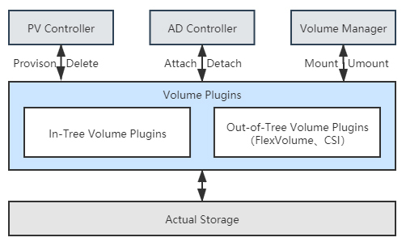
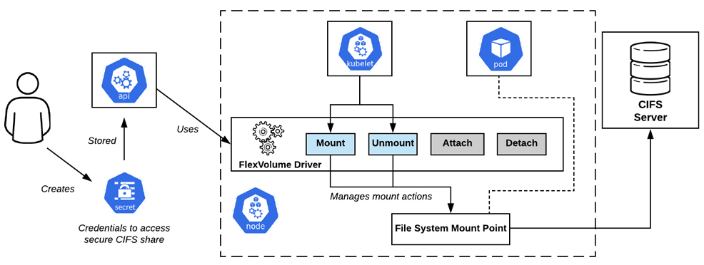
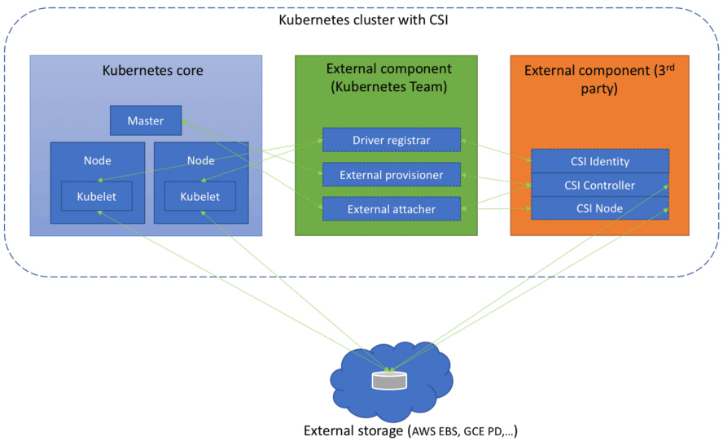

你好，我是周志明。

我们知道，容器存储具有很强的多样性，如何对接后端实际的存储系统，并且完全发挥出它所有的性能与功能，并不是 Kubernetes 团队所擅长的工作，这件事情只有存储提供商才能做到最好。所以，我们其实可以理解容器编排系统为什么会有很强烈的意愿，想把存储功能独立到外部去实现。

在[上节课](https://time.geekbang.org/column/article/357689)我已经反复提到过多次 In-Tree、Out-of-Tree 插件，那么今天这节课，我就会以存储插件的接口与实现为中心，带你去解析 Kubernetes 的容器存储生态。

## Kubernetes 存储架构

在正式开始讲解 Kubernetes 的 In-Tree、Out-of-Tree 存储插件前，我们有必要先去了解一点 Kubernetes 存储架构的知识。了解一个真实的存储系统是如何接入到新创建的 Pod 中，成为可以读写访问的 Volume，以及当 Pod 被销毁时，Volume 如何被回收，回归到存储系统之中的。

那么，对于刚刚所说的这几点，Kubernetes 其实是参考了传统操作系统接入或移除新存储设备的做法，把接入或移除外部存储这件事情，分解为了以下三个操作：

* **决定应准备（Provision）何种存储**：Provision 可类比为给操作系统扩容而购买了新的存储设备。这步确定了接入存储的来源、容量、性能以及其他技术参数，它的逆操作是移除（Delete）存储。

* **将准备好的存储附加（Attach）到系统中**：Attach 可类比为将存储设备接入操作系统，此时尽管设备还不能使用，但你已经可以用操作系统的fdisk -l命令查看到设备。这步确定了存储的设备名称、驱动方式等面向系统侧的信息，它的逆操作是分离（Detach）存储设备。

* **将附加好的存储挂载（Mount）到系统中**：Mount 可类比为将设备挂载到系统的指定位置，也就是操作系统中mount命令的作用。这步确定了存储的访问目录、文件系统格式等面向应用侧的信息，它的逆操作是卸载（Unmount）存储设备。

实际上，前面步骤中提到的 Provision、Delete、Attach、Detach、Mount、Unmount 六种操作，并不是直接由 Kubernetes 来实现，而是在存储插件中完成的。它们会分别被 Kubernetes 通过两个控制器及一个管理器来进行调用，这些控制器、管理器的作用如下：

**PV 控制器（PersistentVolume Controller）**

“以容器构建系统”这个小章节中我介绍过，Kubernetes 里所有的控制器都遵循着相同的工作模式，即让实际状态尽可能接近期望状态。PV 控制器的期望状态有两个，分别是“所有未绑定的 PersistentVolume 都能处于可用状态”以及“所有处于等待状态的 PersistentVolumeClaim 都能配对到与之绑定的 PersistentVolume”。

它内部也有两个相对独立的核心逻辑（ClaimWorker 和 VolumeWorker）来分别跟踪这两种期望状态。可以简单地理解为 PV 控制器实现了 PersistentVolume 和 PersistentVolumeClaim 的生命周期管理职能。在这个过程中，它会根据需要调用存储驱动插件的 Provision/Delete 操作。

**AD 控制器（Attach/Detach Controller）**

AD 控制器的期望状态是“所有被调度到准备新创建 Pod 的节点，都附加好了要使用的存储；当 Pod 被销毁后，原本运行 Pod 的节点都分离了不再被使用的存储”。如果实际状态不符合该期望，会根据需要调用存储驱动插件的 Attach/Detach 操作。

**Volume 管理器（Volume Manager）**

Volume 管理器实际上是 kubelet 众多管理器的其中一个，它主要作用是支持本节点中 Volume 执行 Attach/Detach/Mount/Unmount 操作。你可能注意到这里不仅有 Mount/Unmount 操作，也出现了 Attach/Detach 操作。

这是历史原因导致的，因为最初版本的 Kubernetes 中并没有 AD 控制器，Attach/Detach 的职责也在 kubelet 中完成。而现在 kubelet 默认情况下已经不再会执行 Attach/Detach 了，但有少量旧程序已经依赖了由 kubelet 来实现 Attach/Detach 的内部逻辑，所以 kubelet 不得不设计一个\--enable-controller-attach-detach参数，如果将其设置为false的话，就会重新回到旧的兼容模式上，由 kubelet 代替 AD 控制器来完成 Attach/Detach。



Kubernetes存储架构

这样一来，后端的真实存储经过 Provision、Attach、Mount 操作之后，就形成了可以在容器中挂载的 Volume。当存储的生命周期完结，经过 Unmount、Detach、Delete 操作之后，Volume 便能够被存储系统回收。而对于某些存储来说，其中有一些操作可能是无效的，比如 NFS，实际使用并不需要 Attach，此时存储插件只需将 Attach 实现为空操作即可。

## FlexVolume 与 CSI

Kubernetes 目前同时支持[FlexVolume](https://github.com/kubernetes/community/blob/master/contributors/devel/sig-storage/flexvolume.md)与[CSI](https://github.com/container-storage-interface/spec/blob/master/spec.md)（Container Storage Interface）两套独立的存储扩展机制。FlexVolume 是 Kubernetes 早期版本（1.2 版开始提供，1.8 版达到 GA 状态）就开始支持的扩展机制，它是只针对 Kubernetes 的私有的存储扩展，目前已经处于冻结状态，可以正常使用但不再发展新功能了。

CSI 则是从 Kubernetes 1.9 开始加入（1.13 版本达到 GA 状态）的扩展机制，如同之前我介绍过的 CRI 和 CNI 那样，CSI 是公开的技术规范。任何容器运行时、容器编排引擎只要愿意支持，都可以使用 CSI 规范去扩展自己的存储能力，这是目前 Kubernetes 重点发展的扩展机制。

由于是专门为 Kubernetes 量身订造的，所以 FlexVolume 的实现逻辑与上节课我介绍的 Kubernetes 存储架构高度一致。FlexVolume 驱动其实就是一个实现了 Attach、Detach、Mount、Unmount 操作的可执行文件（甚至可以仅仅是个 Shell 脚本）而已。该可执行文件应该存放在集群每个节点的`/usr/libexec/kubernetes/kubelet-plugins/volume/exec`目录里，其工作过程也就是，当 AD 控制器和 Volume 管理器需要进行 Attach、Detach、Mount、Unmount 操作时，自动调用它的对应方法接口，如下图所示。



[FlexVolume Driver 工作过程](https://laptrinhx.com/kubernetes-volume-plugins-evolution-from-flexvolume-to-csi-2724482856/)

如果仅仅考虑支持最基本的 Static Provisioning，那实现一个 FlexVolume Driver 确实是非常简单的。然而也是由于 FlexVolume 过于简单了，导致它应用起来会有诸多不便之处，比如说：

* **FlexVolume 并不是全功能的驱动**：FlexVolume 不包含 Provision 和 Delete 操作，也就无法直接用于 Dynamic Provisioning，想要实现这个功能，除非你愿意再单独编写一个 External Provisioner。

* **FlexVolume 部署维护都相对繁琐**：FlexVolume 是独立于 Kubernetes 的可执行文件，当集群节点增加时，需要由管理员在新节点上部署 FlexVolume Driver。为了避免耗费过多人力，有经验的系统管理员通常会专门编写一个 DaemonSet 来代替人工来完成这项任务。

* **FlexVolume 实现复杂交互也相对繁琐**：FlexVolume 的每一次操作，都是对插件可执行文件的一次独立调用，这种插件实现方式在各种操作需要相互通讯时会很别扭。比如你希望在执行 Mount 操作的时候，生成一些额外的状态信息，并在后面执行 Unmount 操作时去使用这些信息时，却只能把信息记录在某个约定好的临时文件中，这样的做法对于一个面向生产的容器编排系统来说，实在是过于简陋了。

相比起 FlexVolume 的种种不足，CSI 可算是一个十分完善的存储扩展规范。这里“十分完善”可不是客套话，根据 GitHub 的自动代码行统计，FlexVolume 的规范文档仅有 155 行，而 CSI 则长达 2704 行。

那么从总体上看，CSI 规范可以分为需要容器系统去实现的组件，以及需要存储提供商去实现的组件两大部分。前者包括了存储整体架构、Volume 的生命周期模型、驱动注册、Volume 创建、挂载、扩容、快照、度量等内容，这些 Kubernetes 都已经完整地实现了，大体上包括以下几个组件：

* [Driver Register](https://github.com/kubernetes-csi/driver-registrar)：负责注册第三方插件，CSI 0.3 版本之后已经处于 Deprecated 状态，将会被[Node Driver Register](https://kubernetes-csi.github.io/docs/node-driver-registrar.html)所取代。
* [External Provisioner](https://github.com/kubernetes-csi/external-provisioner)：调用第三方插件的接口来完成数据卷的创建与删除功能。
* [External Attacher](https://github.com/kubernetes-csi/external-attacher)：调用第三方插件的接口来完成数据卷的挂载和操作。
* [External Resizer](https://github.com/kubernetes-csi/external-resizer)：调用第三方插件的接口来完成数据卷的扩容操作。
* [External Snapshotter](https://github.com/kubernetes-csi/external-snapshotter)：调用第三方插件的接口来完成快照的创建和删除。
* [External Health Monitor](https://github.com/kubernetes-csi/external-health-monitor)：调用第三方插件的接口来提供度量监控数据。

但是，需要存储提供商去实现的组件才是 CSI 的主体部分，也就是我在前面多次提到的“第三方插件”。这部分着重定义了外部存储挂载到容器过程中所涉及操作的抽象接口和具体的通讯方式，主要包括以下三个 gRPC 接口：

* **CSI Identity 接口**：用于描述插件的基本信息，比如插件版本号、插件所支持的 CSI 规范版本、插件是否支持存储卷创建、删除功能、是否支持存储卷挂载功能等等。此外 Identity 接口还用于检查插件的健康状态，开发者可以通过 Probe 接口对外提供存储的健康度量信息。

* **CSI Controller 接口**：用于从存储系统的角度对存储资源进行管理，比如准备和移除存储（Provision、Delete 操作）、附加与分离存储（Attach、Detach 操作）、对存储进行快照等等。存储插件并不一定要实现这个接口的所有方法，对于存储本身就不支持的功能，可以在 CSI Identity 接口中声明为不提供。

* **CSI Node 接口**：用于从集群节点的角度对存储资源进行操作，比如存储卷的分区和格式化、将存储卷挂载到指定目录上，或者将存储卷从指定目录上卸载，等等。



[CSI 组件架构](https://medium.com/google-cloud/understanding-the-container-storage-interface-csi-ddbeb966a3b)

与 FlexVolume 以单独的可执行程序的存在形式不同，CSI 插件本身是由一组标准的 Kubernetes 资源所构成，CSI Controller 接口是一个以 StatefulSet 方式部署的 gRPC 服务，CSI Node 接口则是基于 DaemonSet 方式部署的 gRPC 服务。

这意味着虽然 CSI 实现起来要比 FlexVolume 复杂得多，但是却很容易安装——如同安装 CNI 插件及其它应用那样，直接载入 Manifest 文件即可，也不会遇到 FlexVolume 那样需要人工运维，或者自己编写 DaemonSet 来维护集群节点变更的问题。

此外，通过 gRPC 协议传递参数比通过命令行参数传递参数更加严谨，灵活和可靠，最起码不会出现多个接口之间协作只能写临时文件这样的尴尬状况。

## 从 In-Tree 到 Out-of-Tree

Kubernetes 原本曾内置了相当多的 In-Tree 的存储驱动，甚至还早于 Docker 宣布支持卷驱动功能，这种策略使得 Kubernetes 能够在云存储提供商发布官方驱动之前就将其纳入到支持范围中，同时也减轻了管理员维护的工作量，为它在诞生初期快速占领市场做出了一定的贡献。

但是，这种策略也让 Kubernetes 丧失了随时添加或修改存储驱动的灵活性，只能在更新大版本时才能加入或者修改驱动，导致云存储提供商被迫要与 Kubernetes 的发版节奏保持一致。此外，这个策略还涉及到第三方存储代码混杂在 Kubernetes 二进制文件中可能引起的可靠性及安全性问题。

因此，当 Kubernetes 成为市场主流以后——准确的时间点是从 1.14 版本开始，Kubernetes 启动了 In-Tree 存储驱动的 CSI 外置迁移工作，按照计划，在 1.21 到 1.22 版本（大约在 2021 年中期）时，Kubernetes 中主要的存储驱动，如 AWS EBS、GCE PD、vSphere 等都会迁移至符合 CSI 规范的 Out-of-Tree 实现，不再提供 In-Tree 的支持。

这种做法在设计上无疑是正确的，但是，这又会导致 Kubernetes 面临此前提过的该如何兼容旧功能的策略问题，我举个例子，下面 YAML 定义了一个 Pod：

```yaml
apiVersion: v1
kind: Pod
metadata:
  name: nginx-pod-example
spec:
  containers:
  - name: nginx
    image: nginx:latest
    volumeMounts:
    - name: html-pages-volume
      mountPath: /usr/share/nginx/html
    - name: config-volume
      mountPath: /etc/nginx
    volumes:
    - name: html-pages-volume
      hostPath:                 # 来自本地的存储
        path: /srv/nginx/html
        type: Directory
    - name: config-volume
      awsElasticBlockStore:     # 来自AWS ESB的存储
        volumeID: vol-0b39e0b08745caef4
        fsType: ext4
```

可以发现，其中用到了类型为 hostPath 的 Volume，这相当于 Docker 中驱动类型为 local 的 Volume，不需要专门的驱动；而类型为 awsElasticBlockStore 的 Volume，从名字上就能看出是指存储驱动为 AWS EBS 的 Volume，当 CSI 迁移完成，awsElasticBlockStore 从 In-Tree 卷驱动中移除掉之后，它就应该按照 CSI 的写法改写成如下形式：

```yaml
    - name: config-volume
      csi:
        driver: ebs.csi.aws.com
        volumeAttributes: 
          - volumeID: vol-0b39e0b08745caef4
          - fsType: ext4
```

这样的要求有悖于“升级版本不应影响还在大范围使用的已有功能”这条原则，所以 Kubernetes 1.17 中又提出了称为[CSIMigration](https://kubernetes.io/blog/2019/12/09/kubernetes-1-17-feature-csi-migration-beta/)的解决方案，让 Out-of-Tree 的驱动能够自动伪装成 In-Tree 的接口来提供服务。

这里我想说明的是，我之所以专门来给你介绍 Volume 的 CSI 迁移，倒不是由于它算是多么重要的特性，而是这种兼容性设计本身就是 Kubernetes 设计理念的一个缩影，在 Kubernetes 的代码与功能中随处可见。好的设计需要权衡多个方面的利益，很多时候都得顾及现实的影响，要求设计向现实妥协，而不能仅仅考虑理论最优的方案。

## 小结

这节课，我们学习了 Kubernetes 的存储扩展架构，知道了一个真实的存储系统是如何接入到新创建的 Pod 中，成为可以读写访问的 Volume，以及当 Pod 被销毁时，Volume 如何被回收，回归到存储系统之中的。

此外我们还要明确的是，目前的 Kubernetes 系统中存在两种存储扩展接口，分别是 FlexVolume 与 CSI，我们要知道这两种插件的相似与差异之处，以及这两种接口的大致的结构。

## 一课一思

你使用过哪些类型的存储？你了解过块存储、文件存储、对象存储等不同的存储系统之间的差异吗？可以在留言区说说你的看法，下节课我们就会来学习这部分的知识。

如果你觉得有收获，欢迎把今天的内容分享给更多的朋友。感谢你的阅读，我们下一讲再见。