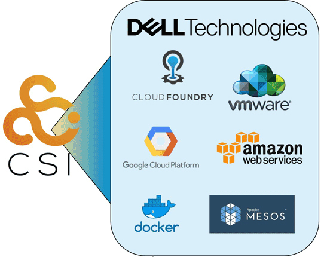
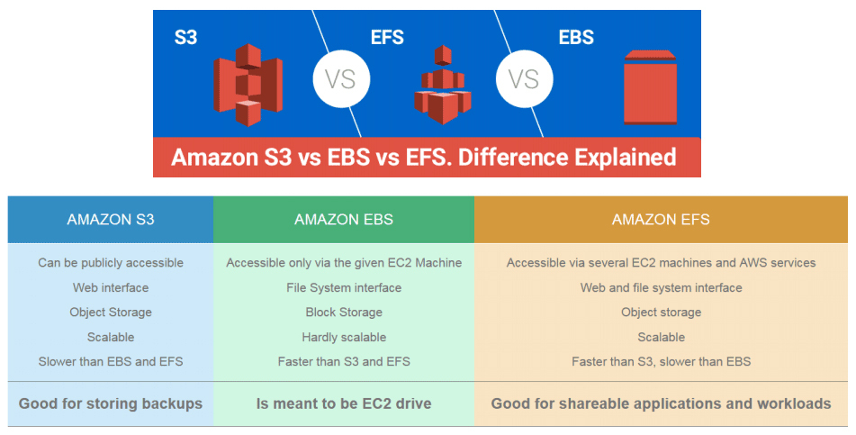

你好，我是周志明。

随着 Kubernetes 的 CSI 规范成为容器业界统一的存储接入标准，现在几乎所有的云计算厂商都支持自家的容器通过 CSI 规范去接入外部存储，能够应用于 CSI 与 FlexVolume 的存储插件更是多达数十上百款，下图就展示了部分容器存储提供商，可以说，容器存储已经算是形成了初步的生态环境。

不过在咱们的课程里，我并不会去展开讨论各种 CSI 存储插件的细节，我会采取跟 CNI 网络插件类似的讲述方式，以不同的存储类型为线索，介绍其中有代表性的实现。

[部分容器存储提供商](https://www.dell.com/en-us/blog/kubernetes-data-protection-hits-mainstream-with-container-storage-interface-csi-117/)

实际上，目前出现过的存储系统和设备，我们都可以划分到块存储、文件存储和对象存储这三种存储类型之中，其划分的根本依据并不是各种存储是如何储存数据的，因为那完全是存储系统私有的事情。

我认为更合理的划分依据是，各种存储会提供什么形式的接口来供外部访问数据，而不同的外部访问接口会如何反过来影响存储的内部结构、性能与功能表现。虽然块存储、文件存储和对象存储可以彼此协同工作，但它们各自都有自己明确的擅长领域与优缺点。所以，只有理解它们的工作原理，因地制宜地选择最适合的存储，才能让系统达到最佳的工作状态。

那么接下来，我就按照它们出现的时间顺序来给你一一介绍下。

## 块存储

**块存储是数据存储最古老的形式**，它把数据都储存在一个或多个固定长度的[块](https://en.wikipedia.org/wiki/Block_(data_storage))（Block）中，想要读写访问数据，就必须使用与存储相匹配的协议（SCSI、SATA、SAS、FCP、FCoE、iSCSI……）。

这里你可以类比一下前面[第 52 讲](https://time.geekbang.org/column/article/355325)提到的，网络通讯中网络栈的数据流动过程，你可以把存储设备中由块构成的信息流，与网络设备中由数据包构成的信息流进行对比。事实上，像 iSCSI 这种协议真的就是建设在 TCP/IP 网络之上，让上层以 SCSI 作为应用层协议对外提供服务的。

我们熟悉的硬盘就是最经典的块存储设备，以机械硬盘为例，一个块就是一个扇区，大小通常在 512 Bytes 至 4096 Bytes 之间。老式机械硬盘用[柱面 - 磁头 - 扇区号](https://en.wikipedia.org/wiki/Cylinder-head-sector)（Cylinder-Head-Sector，CHS）组成的编号进行寻址，现代机械硬盘只用一个[逻辑块编号](https://en.wikipedia.org/wiki/Logical_block_addressing)（Logical Block Addressing，LBA）进行寻址。

为了便于管理，硬盘通常会以多个块（这些块甚至可以来自不同的物理设备，比如磁盘阵列的情况）来组成一个逻辑分区（Partition），将分区进行[高级格式化](https://en.wikipedia.org/wiki/Disk_formatting#High-level_formatting)之后就形成了卷（Volume），这就与[第 55 讲](https://time.geekbang.org/column/article/357689)中提到“Volume 是源于操作系统的概念”衔接了起来。

**块存储由于贴近底层硬件，没有文件、目录、访问权限等的牵绊，所以性能通常都是最优秀的（吞吐量高，延迟低）。**

另外，尽管人类作为信息系统的最终用户，并不会直接面对块来操作数据，多数应用程序也是基于文件而不是块来读写数据的，但是操作系统内核中，许多地方就是直接通过[块设备](https://en.wikipedia.org/wiki/Device_file#BLOCKDEV)（Block Device）接口来访问硬盘，一些追求 I/O 性能的软件，比如高性能的数据库也会支持直接读写块设备以提升磁盘 I/O。

而且因为块存储的特点是**具有排它性**，一旦块设备被某个客户端挂载后，其他客户端就无法再访问上面的数据了。因此，Kubernetes 中挂载的块存储，大多的访问模式都要求必须是 RWO（ReadWriteOnce）的。

## 文件存储

好，下面我们接着来说说文件存储。

**文件存储是最贴近人类用户的数据存储形式**，数据存储在长度不固定的文件之中，用户可以针对文件进行新增、写入、追加、移动、复制、删除、重命名等各种操作，通常文件存储还会提供有文件查找、目录管理、权限控制等额外的高级功能。

文件存储的访问不像块存储那样有五花八门的协议，其[POSIX](https://en.wikipedia.org/wiki/POSIX)接口（Portable Operating System Interface，POSIX）已经成为了事实标准，被各种商用的存储系统和操作系统共同支持。具体 POSIX 的文件操作接口我就不去举例罗列了，你可以类比 Linux 下的各种文件管理命令来自行想象一下。

绝大多数传统的文件存储都是基于块存储之上去实现的，“文件”这个概念的出现是因为“块”对人类用户来说实在是过于难以使用、难以管理了。我们可以近似地认为文件是由块所组成的更高级存储单位，对于固定不会发生变动的文件，直接让每个文件连续占用若干个块，在文件头尾加入标志区分即可，就比如像磁带、CD-ROM、DVD-ROM，就采用了由连续块来构成文件的存储方案。

不过，对于可能发生变动的场景，我们就必须考虑如何跨多个不连续的块来构成为文件。这种需求从数据结构的角度看，只需要在每个块中记录好下一个块的地址，形成链表结构就能满足。但是链表的缺点是只能依次顺序访问，这样访问文件中的任何内容都要从头读取多个块，这显然过于低效了。

事实上，真正被广泛运用的解决方案是把形成链表的指针整合起来统一存放，这就是[文件分配表](https://en.wikipedia.org/wiki/File_Allocation_Table)（File Allocation Table，FAT）。既然已经有了专门组织块结构来构成文件的分配表，那在表中再加入其他控制信息，就能很方便地扩展出更多的高级功能。

比如除了文件占用的块地址信息外，在表中再加上文件的逻辑位置就形成了目录，加上文件的访问标志就形成了权限，我们还可以再加上文件的名称、创建时间、所有者、修改者等一系列的元数据信息，来构成其他应用形式。

人们把定义文件分配表应该如何实现、储存哪些信息、提供什么功能的标准称为[文件系统](https://en.wikipedia.org/wiki/File_system)（File System），FAT32、NTFS、exFAT、ext2/3/4、XFS、BTRFS 等都是很常用的文件系统。而前面介绍存储插件接口时，我提到的对分区进行高级格式化操作，实际上就是在初始化一套空白的文件系统，供后续用户与应用程序访问。

文件存储相对于块存储来说是更高层次的存储类型，加入目录、权限等元素后形成的树状结构以及路径访问的方式，方便了人们对它的理解、记忆和访问；文件系统能够提供进程正在打开或正在读写某个文件的信息，这也有利于文件的共享处理。

但在另一方面，计算机需要把路径进行分解，然后逐级向下查找，最后才能查找到需要的文件。而要从文件分配表中确定具体数据存储的位置，就要判断文件的访问权限，并要记录每次修改文件的用户与时间，这些额外操作对于性能产生的负面影响也是无可避免的。因此，如果一个系统选择不采用文件存储的话，那磁盘 I/O 性能一般就是最主要的原因。

## 对象存储

**[对象存储](https://en.wikipedia.org/wiki/Object_storage)是相对较新的数据存储形式，它是一种随着云数据中心的兴起而发展起来的存储，是以非结构化数据为目标的存储方案。**

这里的“对象”可以理解为一个元数据及与其配对的一个逻辑数据块的组合，元数据提供了对象所包含的上下文信息，比如数据的类型、大小、权限、创建人、创建时间，等等，数据块则存储了对象的具体内容。你也可以简单地理解为数据和元数据这两样东西共同构成了一个对象。

每个对象都有属于自己的全局唯一标识，这个标识会直接开放给最终用户使用，作为访问该对象的主要凭据，通常会是以 UUID 的形式呈现。对象存储的访问接口就是根据该唯一标识，对逻辑数据块进行的读写删除操作的，通常接口都会十分简单，甚至连修改操作权限都不会提供。

对象存储基本上只会在分布式存储系统之上去实现，由于对象存储天生就有明确的“元数据”概念，不必依靠文件系统来提供数据的描述信息，因此，完全可以将一大批对象的元数据集中存放在某一台（组）服务器上，再辅以多台 OSD（Object Storage Device）服务器来存储对象的数据块部分。

当外部要访问对象时，多台 OSD 能够同时对外发送数据，因此**对象存储不仅易于共享、拥有庞大的容量，还能提供非常高的吞吐量**。不过，由于需要先经过元数据查询确定 OSD 存放对象的确切位置，这个过程可能涉及多次网络传输，所以在延迟方面就会表现得相对较差。

由于对象的元数据仅描述对象本身的信息，与其他对象都没有关联，换而言之每个对象都是相互独立的，自然也就不存在目录的概念，可见对象存储天然就是扁平化的，与软件系统中很常见的 K/V 访问相类似。

不过许多对象存储会提供 Bucket 的概念，用户可以在逻辑上把它看作是“单层的目录”来使用。由于对象存储天生的分布式特性，以及极其低廉的扩展成本，使它很适合于[CDN](https://icyfenix.cn/architect-perspective/general-architecture/diversion-system/cdn.html)一类的应用，拿来存放图片、音视频等媒体内容，以及网页、脚本等静态资源。

## 选择合适的存储

那么，在理解了三种存储类型的基本原理后，接下来又到了治疗选择困难症的环节。主流的云计算厂商，比如国内的阿里云、腾讯云、华为云，都有自己专门的块存储、文件存储和对象存储服务，关于选择服务提供商的问题，我就不作建议了，你可以根据价格、合作关系、技术和品牌知名度等因素自行去处理。

而关于应该选择三种存储类型中哪一种的问题，这里我就以世界云计算市场占有率第一的亚马逊为例，给你简要对比介绍下它的不同存储类型产品的差异。

亚马逊的块存储服务是[Amazon Elastic Block Store](https://aws.amazon.com/cn/ebs/)（AWS EBS），你购买 EBS 之后，在 EC2（亚马逊的云计算主机）里看见的是一块原始的、未格式化的块设备。这点就决定了 EBS 并不能做为一个独立存储而存在，它总是和 EC2 同时被创建的，EC2 的操作系统也只能安装在 EBS 之上。

EBS 的大小理论上取决于建立的分区方案，也就是块大小乘以块数量。MBR 分区的块数量是 232，块大小通常是 512 Bytes，总容量为 2 TB；GPT 分区的块数量是 264，块大小通常是 4096 Bytes，总容量 64 ZB。当然这是理论值，64 ZB 已经超过了世界上所有信息的总和，不会有操作系统支持这种离谱的容量，AWS 也设置了上限是 16 TB，在此范围内的实际值就只取决于你的预算额度；EBS 的性能取决于你选择的存储介质类型（SSD、HDD），还有优化类型（通用性、预置型、吞吐量优化、冷存储优化等），这也会直接影响存储的费用成本。

EBS 适合作为系统引导卷，适合追求磁盘 I/O 的大型工作负载以及追求低时延的应用，比如 Oracle 等可以直接访问块设备的大型数据库。**但 EBS 只允许被单个节点挂载**，难以共享，这点在单机时代虽然是天经地义的，但在云计算和分布式时代就成为了很要命的缺陷。除了少数特殊的工作负载外（如前面说的 Oracle 数据库），我并不建议将它作为容器编排系统的主要外置存储来使用。

亚马逊的文件存储服务是[Amazon Elastic File System](https://aws.amazon.com/cn/efs/)（AWS EFS），你购买 EFS 之后，只要在 EFS 控制台上创建好文件系统，并且管理好网络信息（如 IP 地址、子网）就可以直接使用，无需依附于任何 EC2 云主机。

EFS 的本质是完全托管在云端的[网络文件系统](https://en.wikipedia.org/wiki/Network_File_System)（Network File System，NFS），你可以在任何兼容 POSIX 的操作系统中直接挂载它，而不会在/dev中看到新设备的存在。按照前面开头我提到的 Kubernetes 存储架构中的操作来说，就是你只需要考虑 Mount，无需考虑 Attach 了。

这样，得益于 NFS 的天然特性，EFS 的扩缩可以是完全自动、实时的，创建新文件时无需预置存储，删除已有文件时也不必手动缩容以节省费用。在高性能网络的支持下，EFS 的性能已经能够达到相当高的水平，尽管由于网络访问的限制，性能最高的 EFS 依然比不过最高水平的 EBS，但仍然能充分满足绝大多数应用运行的需要。

还有最重要的一点优势是由于脱离了块设备的束缚，EFS 能够轻易地被成百上千个 EC2 实例共享。**考虑到 EFS 的性能、动态弹性、可共享这些因素，我给出的明确建议是它可以作为大部分容器工作负载的首选存储**。

亚马逊的对象存储服务是[Amazon Simple Storage Service](https://aws.amazon.com/cn/s3/)（AWS S3），S3 通常是以 REST Endpoint 的形式对外部提供文件访问服务的，这种方式下你应该直接使用程序代码来访问 S3，而不是靠操作系统或者容器编排系统去挂载它。

如果你真的希望这样做，也可以通过存储网关（如[AWS Storage Gateway](https://aws.amazon.com/cn/storagegateway/)）将 S3 的存储能力转换为 NFS、SMB、iSCSI 等访问协议。经过转换后，操作系统或者容器就能够将其作为 Volume 来挂载了。

S3 也许是 AWS 最出名、使用面最广的存储服务，这个结果并不是由于它的性能优异，事实上 S3 的性能比起 EBS 和 EFS 来说是相对最差的，但它的优势在于它名字中“Simple”所标榜的**简单**。

我们挂载外部存储的目的，十有八九就是为了给程序提供存储服务，而使用 S3 就不必写一行代码，就能直接通过 HTTP Endpoint 进行读写访问，而且完全不需要考虑容量、维护和数据丢失的风险，这就是简单的价值。

除此之外，S3 的另一大优势就是它的价格相对于 EBS 和 EFS 来说，往往要低一至两个数量级，因此程序的备份还原、数据归档、灾难恢复、静态页面的托管、多媒体分发等功能，就非常适合使用 S3 来完成。

## 小结

这节课我们了解学习了块存储、文件存储和对象存储这三种存储类型的基本原理，而关于应该选择这三种存储类型中哪一种的问题，我以亚马逊为例，给你简要对比了下它的不同存储类型产品的差异。

最后我还想补充一点，你可以来看看下面的图例，这是截取自亚马逊销售材料中三种存储的对比。说实话，从目前的存储技术发展来看，其实不会有哪一种存储方案能够包打天下。你要知道，不同业务系统的场景需求不同，对存储的诉求就会不同，那么选择自然也会不同。

AWS的S3、EFS、EBS对比

（图片来自 AWS 的[销售材料](https://www.dell.com/en-us/blog/kubernetes-data-protection-hits-mainstream-with-container-storage-interface-csi-117/)）

## 一课一思

计算机进入云计算时代已经有十年了，你是否在生产系统中使用过云存储？如果有，你用过哪些？如果没有，你认为障碍是什么呢？

欢迎在留言区分享你的答案。如果觉得有收获，也欢迎你把今天的内容分享给其他的朋友。感谢你的阅读，我们下一讲再见。