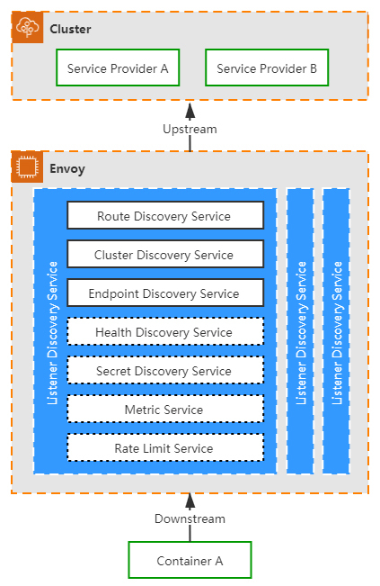
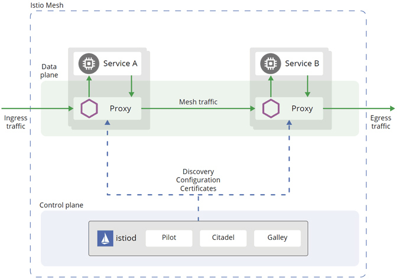

你好，我是周志明。这节课，我会延续服务网格将“程序”与“网络”解耦的思路，通过介绍几个数据平面通信与控制平面通信中的核心问题的解决方案，帮助你更好地理解这两个概念。

在开始之前我想先说明一点，就是我们知道在工业界，数据平面领域已经有了 Linkerd、Nginx、Envoy 等产品，在控制平面领域也有 Istio、Open Service Mesh、Consul 等产品。不过今天我主要讲解的是目前市场占有率最高的 Istio 与 Envoy，因为我的目的是要让你理解两种平面通信的技术原理，而非介绍 Istio 和 Envoy 的功能与用法，这节课中涉及到的原理在各种服务网格产品中一般都是通用的，并不局限于哪一种具体实现。

好，接下来我们就从数据平面通信开始，来了解一下它的工作内容。

## 数据平面

首先，数据平面由一系列边车代理所构成，它的核心职责是转发应用的入站（Inbound）和出站（Outbound）数据包，因此数据平面也有个别名叫[转发平面](https://en.wikipedia.org/wiki/Data_plane)（Forwarding Plane）。

同时，为了在不可靠的物理网络中保证程序间通信最大的可靠性，数据平面必须根据控制平面下发策略的指导，在应用无感知的情况下自动完成服务路由、健康检查、负载均衡、认证鉴权、产生监控数据等一系列工作。

那么，为了顺利完成以上所说的工作目标，数据平面至少需要妥善解决三个关键问题：

* 代理注入：边车代理是如何注入到应用程序中的？

* 流量劫持：边车代理是如何劫持应用程序的通信流量的？

* 可靠通信：边车代理是如何保证应用程序的通信可靠性的？

好，下面我们就具体来看看吧。

### 代理注入

从职责上说，注入边车代理是控制平面的工作，但从叙述逻辑上，将其放在数据平面中介绍更合适。因为把边车代理注入到应用的过程并不一定全都是透明的，所以现在的服务网格产品产生了以下三种将边车代理接入到应用程序中的方式。

* **基座模式（Chassis）**：这种方式接入的边车代理对程序就是不透明的，它至少会包括一个轻量级的 SDK，让通信由 SDK 中的接口去处理。基座模式的好处是在程序代码的帮助下，有可能达到更好的性能，功能也相对更容易实现。但坏处是对代码有侵入性，对编程语言有依赖性。这种模式的典型产品是由华为开源后捐献给 Apache 基金会的[ServiceComb Mesher](https://github.com/apache/servicecomb-mesher)。基座模式的接入方式目前并不属于主流方式，我也就不展开介绍了。

* **注入模式（Injector）**：根据注入方式不同，又可以分为：

    * **手动注入模式**：这种接入方式对使用者来说不透明，但对程序来说是透明的。由于边车代理的定义就是一个与应用共享网络名称空间的辅助容器，这天然就契合了 Pod 的设定。因此在 Kubernetes 中要进行手动注入是十分简单的——就只是为 Pod 增加一个额外容器而已，即使没有工具帮助，自己修改 Pod 的 Manifest 也能轻易办到。如果你以前未曾尝试过，不妨找一个 Pod 的配置文件，用istioctl kube-inject -f YOUR\_POD.YAML命令来查看一下手动注入会对原有的 Pod 产生什么变化。

    * **自动注入模式**：这种接入方式对使用者和程序都是透明的，也是 Istio 推荐的代理注入方式。在 Kubernetes 中，服务网格一般是依靠“[动态准入控制](https://kubernetes.io/zh-cn/docs/reference/access-authn-authz/extensible-admission-controllers/)”（Dynamic Admission Control）中的[Mutating Webhook](https://kubernetes.io/zh-cn/docs/reference/access-authn-authz/admission-controllers/#mutatingadmissionwebhook)控制器来实现自动注入的。

        >额外知识
        >
        >[istio-proxy](https://github.com/istio/proxy)是 Istio 对 Envoy 代理的包装容器，其中包含用 Golang 编写的pilot-agent和用 C++ 编写的envoy两个进程。[pilot-agent](https://istio.io/v1.6/docs/reference/commands/pilot-agent/)进程负责 Envoy 的生命周期管理，比如启动、重启、优雅退出等，并维护 Envoy 所需的配置信息，比如初始化配置、随时根据控制平面的指令热更新 Envoy 的配置等。

这里我以 Istio 自动注入边车代理（istio-proxy 容器）的过程为例，给你介绍一下自动注入的具体的流程。只要你对 Istio 有基本的了解，你应该就能都知道，对任何设置了istio-injection=enabled标签的名称空间，Istio 都会自动为其中新创建的 Pod，注入一个名为 istio-proxy 的容器。之所以能做到自动这一点，是因为 Istio 预先在 Kubernetes 中注册了一个类型为MutatingWebhookConfiguration的资源，它的主要内容如下所示：

```yaml
apiVersion: admissionregistration.k8s.io/v1beta1
kind: MutatingWebhookConfiguration
metadata:
  name: istio-sidecar-injector
  .....
webhooks:
- clientConfig:
    service:
      name: istio-sidecar-injector
      namespace: istio-system
      path: /inject
  name: sidecar-injector.istio.io
  namespaceSelector:
    matchLabels:
      istio-injection: enabled
  rules:
  - apiGroups:
    - ""
    apiVersions:
    - v1
    operations:
    - CREATE
    resources:
    - pods
```

以上配置其实就告诉了 Kubernetes，对于符合标签`istio-injection: enabled`的名称空间，在 Pod 资源进行 CREATE 操作时，应该先自动触发一次 Webhook 调用，调用的位置是`istio-system`名称空间中的服务`istio-sidecar-injector`，调用具体的 URL 路径是`/inject`。

在这次调用中，Kubernetes 会把拟新建 Pod 的元数据定义作为参数发送给此 HTTP Endpoint，然后从服务返回结果中得到注入了边车代理的新 Pod 定义，以此自动完成注入。

### 流量劫持

边车代理做流量劫持最典型的方式是基于 iptables 进行的数据转发，我曾在“Linux 网络虚拟化”这个小章节中介绍过 Netfilter 与 iptables 的工作原理。这里我仍然以 Istio 为例，它在注入边车代理后，除了生成封装 Envoy 的 istio-proxy 容器外，还会生成一个 initContainer，这个 initContainer 的作用就是自动修改容器的 iptables，具体内容如下所示：

```yaml
initContainers:
  image: docker.io/istio/proxyv2:1.5.1
  name: istio-init
- command:
  - istio-iptables -p "15001" -z "15006"-u "1337" -m REDIRECT -i '*' -x "" -b '*' -d 15090,15020
```

以上命令行中的[istio-iptables](https://github.com/istio/cni/blob/master/tools/packaging/common/istio-iptables.sh)是 Istio 提供的用于配置 iptables 的 Shell 脚本，这行命令的意思是让边车代理拦截所有的进出 Pod 的流量，包括拦截除 15090、15020 端口（这两个分别是 Mixer 和 Ingress Gateway 的端口，关于 Istio 占用的固定端口你可以参考[官方文档](https://istio.io/latest/zh/docs/ops/deployment/requirements/)所列的信息）外的所有入站流量，全部转发至 15006 端口（Envoy 入站端口），经 Envoy 处理后，再从 15001 端口（Envoy 出站端口）发送出去。

这个命令会在 iptables 中的 PREROUTING 和 OUTPUT 链中，挂载相应的转发规则，使用`iptables -t nat -L -v`命令，你可以查看到如下所示配置信息：

```
Chain PREROUTING
 pkts bytes target        prot opt in     out     source               destination
 2701  162K ISTIO_INBOUND    tcp  --  any    any     anywhere             anywhere

Chain OUTPUT
 pkts bytes target        prot opt in     out     source               destination
   15   900 ISTIO_OUTPUT    tcp  --  any    any     anywhere             anywhere

Chain ISTIO_INBOUND (1 references)
 pkts bytes target        prot opt in     out     source               destination
    0     0 RETURN        tcp  --  any    any     anywhere             anywhere             tcp dpt:ssh
    2   120 RETURN        tcp  --  any    any     anywhere             anywhere             tcp dpt:15090
 2699  162K RETURN        tcp  --  any    any     anywhere             anywhere             tcp dpt:15020
    0     0 ISTIO_IN_REDIRECT  tcp  --  any    any     anywhere             anywhere

Chain ISTIO_IN_REDIRECT (3 references)
 pkts bytes target        prot opt in     out     source               destination
    0     0 REDIRECT      tcp  --  any    any     anywhere             anywhere             redir ports 15006

Chain ISTIO_OUTPUT (1 references)
 pkts bytes target        prot opt in     out     source               destination
    0     0 RETURN        all  --  any    lo      127.0.0.6            anywhere
    0     0 ISTIO_IN_REDIRECT  all  --  any    lo      anywhere            !localhost            owner UID match 1337
    0     0 RETURN        all  --  any    lo      anywhere             anywhere             ! owner UID match 1337
   15   900 RETURN        all  --  any    any     anywhere             anywhere             owner UID match 1337
    0     0 ISTIO_IN_REDIRECT  all  --  any    lo      anywhere            !localhost            owner GID match 1337
    0     0 RETURN        all  --  any    lo      anywhere             anywhere             ! owner GID match 1337
    0     0 RETURN        all  --  any    any     anywhere             anywhere             owner GID match 1337
    0     0 RETURN        all  --  any    any     anywhere             localhost
    0     0 ISTIO_REDIRECT    all  --  any    any     anywhere             anywhere

Chain ISTIO_REDIRECT (1 references)
 pkts bytes target        prot opt in     out     source               destination
    0     0 REDIRECT      tcp  --  any    any     anywhere             anywhere             redir ports 1
```

实际上，用 iptables 进行流量劫持是最经典、最通用的手段。不过，iptables 重定向流量必须通过[回环设备](https://en.wikipedia.org/wiki/Loopback)（Loopback）交换数据，流量不得不多穿越一次协议栈，如下图所示。


经过iptables转发的通信

其实，这种方案在网络 I/O 不构成主要瓶颈的系统中并没有什么不妥，但在网络敏感的大并发场景下会因转发而损失一定的性能。因而目前，如何实现更优化的数据平面流量劫持，仍然是服务网格发展的前沿研究课题之一。

其中一种可行的优化方案，是使用[eBPF](https://en.wikipedia.org/wiki/Berkeley_Packet_Filter)（Extended Berkeley Packet Filter）技术，在 Socket 层面直接完成数据转发，而不需要再往下经过更底层的 TCP/IP 协议栈的处理，从而减少它数据在通信链路的路径长度。


经过eBPF直接转发的通信

另一种可以考虑的方案，是让服务网格与 CNI 插件配合来实现流量劫持，比如 Istio 就有提供[自己实现的 CNI 插件](https://github.com/istio/istio/tree/master/cni)。只要安装了这个 CNI 插件，整个虚拟化网络都由 Istio 自己来控制，那自然就无需再依赖 iptables，也不必存在 initContainers 配置和 istio-init 容器了。

这种方案有很高的上限与自由度，不过，要实现一个功能全面、管理灵活、性能优秀、表现稳定的 CNI 网络插件决非易事，连 Kubernetes 自己都迫不及待想从网络插件中脱坑，其麻烦程度可想而知，因此目前这种方案使用并不广泛。

流量劫持技术的发展与服务网格的落地效果密切相关，有一些服务网格通过基座模式中的 SDK 也能达到很好的转发性能，但考虑到应用程序通用性和环境迁移等问题，无侵入式的低时延、低管理成本的流量劫持方案仍然是研究的主流方向。

### 可靠通信

注入边车代理、劫持应用流量，最终的目的都是为了代理能够接管应用程序的通信，然而，在代理接管了应用的通信之后，它会做什么呢？这个问题的答案是：不确定。

代理的行为需要根据控制平面提供的策略来决定，传统的代理程序，比如 HAProxy、Nginx 是使用静态配置文件来描述转发策略的，而这种静态配置很难跟得上应用需求的变化与服务扩缩时网络拓扑结构的变动。

因此针对这个问题，Envoy 在这方面进行了创新，它将代理的转发的行为规则抽象成 Listener、Router、Cluster 三种资源。以此为基础，它又定义了应该如何发现和访问这些资源的一系列 API，现在这些资源和 API 被统称为“xDS 协议族”。自此以后，数据平面就有了如何描述各种配置和策略的事实标准，控制平面也有了与控制平面交互的标准接口，目前 xDS v3.0 协议族已经包含有以下具体协议：


这里我就不逐一介绍这些协议了，但我要给你说明清楚它们一致的运作原理。其中的关键是解释清楚这些协议的共同基础，即 Listener、Router、Cluster 三种资源的具体含义。

**Listener**

Listener 可以简单理解为 Envoy 的一个监听端口，用于接收来自下游应用程序（Downstream）的数据。Envoy 能够同时支持多个 Listener，且不同的 Listener 之间的策略配置是相互隔离的。

自动发现 Listener 的服务被称为 LDS（Listener Discovery Service），它是所有其他 xDS 协议的基础，如果没有 LDS（也没有在 Envoy 启动时静态配置 Listener 的话），其他所有 xDS 服务也就失去了意义，因为没有监听端口的 Envoy 不能为任何应用提供服务。

**Cluster**

Cluster 是 Envoy 能够连接到的一组逻辑上提供相同服务的上游（Upstream）主机。Cluster 包含该服务的连接池、超时时间、Endpoints 地址、端口、类型等信息。具体到 Kubernetes 环境下，可以认为 Cluster 与 Service 是对等的概念，但是 Cluster 实际上还承担了[服务发现](https://time.geekbang.org/column/article/339395)的职责。

自动发现 Cluster 的服务被称为 CDS（Cluster Discovery Service），通常情况下，控制平面会将它从外部环境中获取的所有可访问服务全量推送给 Envoy。与 CDS 紧密相关的另一种服务是 EDS（Endpoint Discovery Service）。当 Cluster 的类型被标识为需要 EDS 时，则说明该 Cluster 的所有 Endpoints 地址应该由 xDS 服务下发，而不是依靠 DNS 服务去解析。

**Router**

Listener 负责接收来自下游的数据，Cluster 负责将数据转发送给上游的服务，而 Router 则决定 Listener 在接收到下游的数据之后，具体应该将数据交给哪一个 Cluster 处理。由此定义可知，Router 实际上是承担了[服务网关](https://time.geekbang.org/column/article/340106)的职责。

自动发现 Router 的服务被称为 RDS（Router Discovery Service），Router 中最核心的信息是目标 Cluster 及其匹配规则，即实现网关的路由职能。此外，根据 Envoy 中的插件配置情况，也可能包含重试、分流、限流等动作，实现网关的过滤器职能。



xDS协议运作模型

Envoy 的另外一个设计重点是它的 Filter 机制，Filter 通俗地讲就是 Envoy 的插件，通过 Filter 机制，Envoy 就可以提供强大的可扩展能力。插件不仅是无关重要的外围功能，很多 Envoy 的核心功能都是用 Filter 来实现的，比如对 HTTP 流量的治理、Tracing 机制、多协议支持，等等。

另外，利用 Filter 机制，Envoy 理论上还可以实现任意协议的支持以及协议之间的转换，也可以在实现对请求流量进行全方位的修改和定制的同时，还保持较高的可维护性。

## 控制平面

如果说数据平面是行驶中的车辆，那控制平面就是车辆上的导航系统；如果说数据平面是城市的交通道路，那控制平面就是路口的指示牌与交通信号灯。控制平面的特点是不直接参与程序间通信，只会与数据平面中的代理通信。在程序不可见的背后，默默地完成下发配置和策略，指导数据平面工作。

由于服务网格（暂时）没有大规模引入计算机网络中[管理平面](https://en.wikipedia.org/wiki/Management_plane)（Management Plane）等其他概念，所以控制平面通常也会附带地实现诸如网络行为的可视化、配置传输等一系列管理职能（其实还是有专门的管理平面工具的，比如[Meshery](https://github.com/meshery/meshery)、[ServiceMeshHub](https://github.com/solo-io/gloo-mesh)）。这里我仍然以 Istio 为例具体介绍一下控制平面的主要功能。

Istio 在 1.5 版本之前，Istio 自身也是采用微服务架构开发的，它把控制平面的职责分解为 Mixer、Pilot、Galley、Citadel 四个模块去实现，其中 Mixer 负责鉴权策略与遥测；Pilot 负责对接 Envoy 的数据平面，遵循 xDS 协议进行策略分发；Galley 负责配置管理，为服务网格提供外部配置感知能力；Citadel 负责安全加密，提供服务和用户层面的认证和鉴权、管理凭据和 RBAC 等安全相关能力。

不过，经过两、三年的实践应用，很多用户都在反馈 Istio 的微服务架构有过度设计的嫌疑。lstio 在定义项目目标时，曾非常理想化地提出控制平面的各个组件都应可以独立部署，然而在实际的应用场景里却并不是这样，独立的组件反而带来了部署复杂、职责划分不清晰等问题。



Istio 1.5版本之后的架构

（图片来自[Istio 官方文档](https://istio.io/latest/docs/ops/deployment/architecture/)）

因此，从 1.5 版本起，Istio 重新回归单体架构，把 Pilot、Galley、Citadel 的功能全部集成到新的 Istiod 之中。当然，这也并不是说完全推翻之前的设计，只是将原有的多进程形态优化成单进程的形态，让之前各个独立组件变成了 Istiod 的内部逻辑上的子模块而已。

单体化之后出现的新进程 Istiod 就承担所有的控制平面职责，具体包括以下几种。

**1\. 数据平面交互：这是部分是满足服务网格正常工作所需的必要工作。**

具体包括以下几个方面：

* **边车注入**：在 Kubernetes 中注册 Mutating Webhook 控制器，实现代理容器的自动注入，并生成 Envoy 的启动配置信息。

* **策略分发**：接手了原来 Pilot 的核心工作，为所有的 Envoy 代理提供符合 xDS 协议的策略分发的服务。

* **配置分发**：接手了原来 Galley 的核心工作，负责监听来自多种支持配置源的数据，比如 kube-apiserver，本地配置文件，或者定义为[网格配置协议](https://github.com/istio/api/tree/master/mcp)（Mesh Configuration Protocol，MCP）的配置信息。原来 Galley 需要处理的 API 校验和配置转发功能也包含在内。

**2\. 流量控制：这通常是用户使用服务网格的最主要目的。**

具体包括以下几个方面：

* **请求路由**：通过[VirtualService](https://istio.io/latest/docs/reference/config/networking/virtual-service/)、[DestinationRule](https://istio.io/latest/docs/reference/config/networking/destination-rule/) 等 Kubernetes CRD 资源实现了灵活的服务版本切分与规则路由。比如根据服务的迭代版本号（如 v1.0 版、v2.0 版）、根据部署环境（如 Development 版、Production 版）作为路由规则来控制流量，实现诸如金丝雀发布这类应用需求。

* **流量治理**：包括熔断、超时、重试等功能，比如通过修改 Envoy 的最大连接数，实现对请求的流量控制；通过修改负载均衡策略，在轮询、随机、最少访问等方式间进行切换；通过设置异常探测策略，将满足异常条件的实例从负载均衡池中摘除，以保证服务的稳定性等等。

* **调试能力**：包括故障注入和流量镜像等功能，比如在系统中人为设置一些故障，来测试系统的容错稳定性和系统恢复的能力。又比如通过复制一份请求流量，把它发送到镜像服务，从而满足 [A/B 验证](https://en.wikipedia.org/wiki/A/B_testing)的需要。

**3\. 通信安全：包括通信中的加密、凭证、认证、授权等功能。**

具体包括以下几个方面：

* **生成 CA 证书**：接手了原来 Galley 的核心工作，负责生成通信加密所需私钥和 CA 证书。

* **SDS 服务代理**：最初 Istio 是通过 Kubernetes 的 Secret 卷的方式将证书分发到 Pod 中的，从 Istio 1.1 之后改为通过 SDS 服务代理来解决。这种方式保证了私钥证书不会在网络中传输，仅存在于 SDS 代理和 Envoy 的内存中，证书刷新轮换也不需要重启 Envoy。

* **认证**：提供基于节点的服务认证和基于请求的用户认证，这项功能我曾在服务安全的“[认证](https://time.geekbang.org/column/article/329954)”中详细介绍过。

* **授权**：提供不同级别的访问控制，这项功能我也曾在服务安全的“[授权](https://time.geekbang.org/column/article/331411)”中详细介绍过。

**4\. 可观测性：包括日志、追踪、度量三大块能力。**

具体包括以下几个方面：

* **日志收集**：程序日志的收集并不属于服务网格的处理范畴，通常会使用 ELK Stack 去完成，这里是指远程服务的访问日志的收集，对等的类比目标应该是以前 Nginx、Tomcat 的访问日志。

* **链路追踪**：为请求途经的所有服务生成分布式追踪数据并自动上报，运维人员可以通过 Zipkin 等追踪系统从数据中重建服务调用链，开发人员可以借此了解网格内服务的依赖和调用流程。

* **指标度量**：基于四类不同的监控标识（响应延迟、流量大小、错误数量、饱和度）生成一系列观测不同服务的监控指标，用于记录和展示网格中服务状态。

## 小结

容器编排系统管理的最细粒度只能到达容器层次，在此粒度之下的技术细节，仍然只能依赖程序员自己来管理，编排系统很难提供有效的支持。

2016 年，原 Twitter 基础设施工程师威廉·摩根（William Morgan）和奥利弗·古尔德（Oliver Gould）在 GitHub 上发布了第一代的服务网格产品 Linkerd，并在很短的时间内围绕着 Linkered 组建了 Buoyant 公司。而后担任 CEO 的威廉·摩根在发表的文章《[What's A Service Mesh? And Why Do I Need One?](https://buoyant.io/2017/04/25/whats-a-service-mesh-and-why-do-i-need-one)》中，首次正式地定义了“服务网格”（Service Mesh）一词。

此后，服务网格作为一种新兴通信理念开始迅速传播，越来越频繁地出现在各个公司以及技术社区的视野中。之所以服务网格能够获得企业与社区的重视，就是因为它很好地弥补了容器编排系统对分布式应用细粒度管控能力高不足的缺憾。

说实话，服务网格并不是什么神秘难以理解的黑科技，它只是一种处理程序间通信的基础设施，典型的存在形式是部署在应用旁边，一对一为应用提供服务的边车代理，以及管理这些边车代理的控制程序。

“[边车](https://en.wikipedia.org/wiki/Sidecar)”（Sidecar）本来就是一种常见的[容器设计模式](https://www.usenix.org/sites/default/files/conference/protected-files/hotcloud16_slides_burns.pdf)，用来形容外挂在容器身上的辅助程序。早在容器盛行以前，边车代理就就已经有了成功的应用案例。

比如 2014 年开始的[Netflix Prana 项目](https://github.com/Netflix/Prana)，由于 Netfilix OSS 套件是用 Java 语言开发的，为了让非 JVM 语言的微服务（比如以 Python、Node.js 编写的程序）也同样能接入 Netfilix OSS 生态，享受到 Eureka、Ribbon、Hystrix 等框架的支持，Netflix 建立了 Prana 项目，它的作用是为每个服务都提供一个专门的 HTTP Endpoint，以此让非 JVM 语言的程序能通过访问该 Endpoint，来获取系统中所有服务的实例、相关路由节点、系统配置参数等在 Netfilix 组件中管理的信息。

Netflix Prana 的代理需要由应用程序主动去访问才能发挥作用，但在容器的刻意支持下，服务网格不需要应用程序的任何配合，就能强制性地对应用通信进行管理。

它使用了类似网络攻击里中间人流量劫持的手段，完全透明（既无需程序主动访问，也不会被程序感知到）地接管容器与外界的通信，把管理的粒度从容器级别细化到了每个单独的远程服务级别，这就让基础设施干涉应用程序、介入程序行为的能力大为增强。

如此一来，云原生希望用基础设施接管应用程序非功能性需求的目标，就能更进一步。从容器粒度延伸到远程访问，分布式系统继容器和容器编排之后，又发掘到了另一块更广袤的舞台空间。

## 一课一思

服务网格中，数据平面、控制平面的概念是从计算机网络中的 SDN（软件定义网络）借用过来的，在此之前，你是否有接触过 SDN 方面的知识呢？它与今天的服务网格有哪些联系与差异？

欢迎在留言区分享你的答案和见解。如果你觉得有收获，也欢迎把今天的内容分享给更多的朋友。感谢你的阅读，我们下一讲再见。