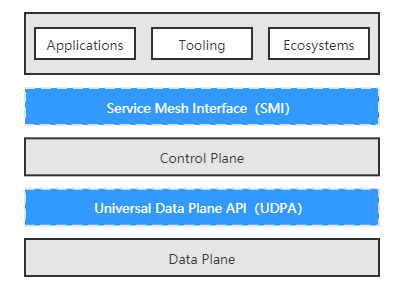
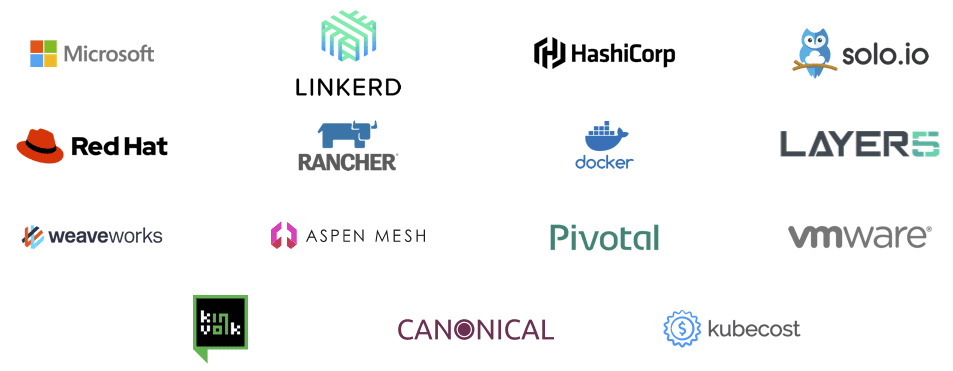
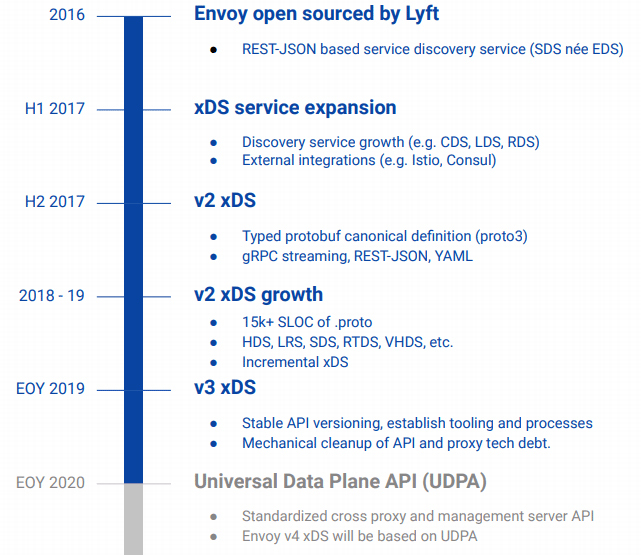

你好，我是周志明。这节课，我们来了解服务网格的主要规范与主流产品。

服务网格目前仍然处于技术浪潮的早期，不过现在业界早已普遍认可它的价值，基本上所有希望能影响云原生发展方向的企业都已经参与了进来。从最早 2016 年的[Linkerd](https://linkerd.io/) 和 [Envoy](https://www.envoyproxy.io/)，到 2017 年 Google、IBM 和 Lyft 共同发布的 Istio，再到后来 CNCF 把 Buoyant 的 [Conduit](https://conduit.io/) 改名为 [Linkerd2](https://linkerd.io/2.17/overview/)，再度参与 Istio 竞争。

而到了 2018 年后，服务网格的话语权争夺战已经全面升级到由云计算巨头直接主导，比如 Google 把 Istio 搬上 Google Cloud Platform，推出了 Istio 的公有云托管版本 Google Cloud Service Mesh；亚马逊推出了用于 AWS 的 App Mesh；微软推出了 Azure 完全托管版本的 Service Fabric Mesh，发布了自家的控制平面 [Open Service Mesh](https://openservicemesh.io/)；国内的阿里巴巴也推出了基于 Istio 的修改版 [SOFAMesh](https://github.com/sofastack/sofa-mesh)，并开源了自己研发的 [MOSN](https://mosn.io/) 代理。可以说，云计算的所有玩家都正在布局服务网格生态。

不过，市场繁荣的同时也带来了碎片化的问题。要知道，一个技术领域能够形成被业界普遍承认的规范标准，是这个领域从分头研究、各自开拓的萌芽状态，走向工业化生产应用的成熟状态的重要标志，标准的诞生可以说是每一项技术普及之路中都必须经历的“成人礼”。

在前面的课程中，我们接触过容器运行时领域的 [CRI 规范](https://time.geekbang.org/column/article/351014)、容器网络领域的 [CNI 规范](https://time.geekbang.org/column/article/356908)、容器存储领域的 [CSI 规范](https://time.geekbang.org/column/article/359363)，尽管服务网格诞生至今只有数年时间，但作为微服务、云原生的前沿热点，它也正在酝酿自己的标准规范，也就是这节课我们要讨论的主角：[服务网格接口](https://smi-spec.io/)（Service Mesh Interface，SMI）与[通用数据平面 API](https://github.com/cncf/udpa)（Universal Data Plane API，UDPA）。现在我们先来看下这两者之间的关系：

SMI 规范与 UDPA 规范

实际上，**服务网格是数据平面产品与控制平面产品的集合**，所以在规范制订方面，很自然地也分成了两类：

* SMI 规范提供了外部环境（实际上就是 Kubernetes）与控制平面交互的标准，使得 Kubernetes 及在其之上的应用，能够无缝地切换各种服务网格产品；

* UDPA 规范则提供了控制平面与数据平面交互的标准，使得服务网格产品能够灵活地搭配不同的边车代理，针对不同场景的需求，发挥各款边车代理的功能或者性能优势。

可以发现，这两个规范并没有重叠，它们的关系与我在[容器运行时](https://time.geekbang.org/column/article/351014)中介绍到的 CRI 和 OCI 规范之间的关系很相似。下面我们就从这两个规范的起源和支持者的背景入手，了解一下它们要解决的问题及目前的发展状况。

## 服务网格接口

在 2019 年 5 月的 KubeCon 大会上，微软联合 Linkerd、HashiCorp、Solo、Kinvolk 和 Weaveworks 等一批云原生服务商，共同宣布了 Service Mesh Interface 规范，希望能在各家的服务网格产品之上建立一个抽象的 API 层，然后通过这个抽象来解耦和屏蔽底层服务网格实现，让上层的应用、工具、生态系统可以建立在同一个业界标准之上，从而实现应用程序在不同服务网格产品之间的无缝移植与互通。

如果你更熟悉 Istio 的话，那你可以把 SMI 的作用理解为是给服务网格提供了一套 Istio 中，[VirtualService](https://istio.io/latest/zh/docs/reference/config/networking/virtual-service/#VirtualService)、[DestinationRule](https://istio.io/latest/zh/docs/concepts/traffic-management/#destination-rules)、[Gateway](https://istio.io/latest/zh/docs/reference/config/networking/gateway/)等私有概念对等的行业标准版本，只要使用 SMI 中定义的标准资源，应用程序就可以在不同的控制平面上灵活迁移，唯一的要求是这些控制平面都支持了 SMI 规范。

**SMI 与 Kubernetes 是彻底绑定的**，规范的落地执行完全依靠在 Kubernetes 中部署 SMI 定义的 CRD 来实现，这一点在 SMI 的目标中被形容为“**Kubernetes Native**”，也就说明了微软等云服务厂商已经认定容器编排领域不会有 Kubernetes 之外的候选项了，这也是微软选择在 KubeCon 大会上公布 SMI 规范的原因。

但是在另外一端 ，**SMI 并不与包括行业第一的 Istio，或者是微软自家的 Open Service Mesh 在内的任何控制平面所绑定**，这点在 SMI 的目标中被形容为“**Provider Agnostic**”，说明微软务实地看到了服务网格领域目前还处于群雄混战的现状。Provider Agnostic 对消费者有利，但对目前处于行业领先地位的 Istio 肯定是不利的，所以我们完全可以理解为什么 SMI 没有得到 Istio 及其背后的 Google、IBM 与 Lyft 的支持。

然而，在过去两年里，Istio 无论是发展策略上、还是设计上（过度设计）的风评都不算很好，业界一直在期待 Google 和 Istio 能做出改进，这种期待在持续两年的失望之后，已经有很多用户在考虑 Istio 以外的选择了。

所以，SMI 一经发布，就吸引了除 Istio 之外几乎所有的服务网格玩家的目光，大家全部参与了进来，这恐怕并不只是因为微软号召力巨大的缘故。而且为了对抗 Istio 的抵制，SMI 自己还提供了一个 [Istio 的适配器](https://github.com/servicemeshinterface/smi-adapter-istio)，以便使用 Istio 的程序能平滑地迁移到 SMI 之上，所以遗留代码并不能为 Istio 构建出特别坚固的壁垒。

到了 2020 年 4 月，SMI 被托管到 CNCF，成为其中的一个 Sandbox 项目（Sandbox 是最低级别的项目，CNCF 只提供有限度的背书），如果能够经过孵化、毕业阶段的话，SMI 就有望成为公认的行业标准，这也是开源技术社区里民主管理的一点好处。

SMI 规范的参与者

好了，到这里我们就了解了 SMI 的背景与价值，现在我们再来学习一下 SMI 的主要内容。目前（[v0.5 版本](https://github.com/servicemeshinterface/smi-spec/blob/main/SPEC_LATEST_STABLE.md)）的 SMI 规范包括四方面的 API 构成，下面我们就分别来看一下。

**流量规范（Traffic Specs）**

目标是定义流量的表示方式，比如 TCP 流量、HTTP/1 流量、HTTP/2 流量、gRPC 流量、WebSocket 流量等应该如何在配置中抽象和使用。目前 SMI 只提供了 TCP 和 HTTP 流量的直接支持，而且都比较简陋，比如 HTTP 流量的路由中，甚至连以 Header 作为判断条件都不支持。

当然，我们可以暂时自我安慰地解释为 SMI 在流量协议的扩展方面是完全开放的，没有功能也有可能自己扩充，哪怕不支持的或私有协议的流量，也有可能使用 SMI 来管理。而我们知道，流量表示是做路由和访问控制的必要基础，因为它必须要根据流量中的特征为条件，才能进行转发和控制，而流量规范中已经自带了路由能力，访问控制就被放到独立的规范中去实现了。

**流量拆分（Traffic Split）**

目标是定义不同版本服务之间的流量比例，提供流量治理的能力，比如限流、降级、容错，等等，以满足灰度发布、A/B 测试等场景。

SMI 的流量拆分是直接基于 Kubernetes 的 Service 资源来设置的，这样做的好处是使用者不需要去学习理解新的概念，而坏处是要拆分流量，就必须定义出具有层次结构的 Service，即 Service 后面不是 Pod，而是其他 Service。而 Istio 中则是设计了 VirtualService 这样的新概念来解决相同的问题，它是通过 Subset 来拆分流量。至于两者孰优孰劣，这就见仁见智了。

**流量度量（Traffic Metrics）**

目标是为资源提供通用集成点，度量工具可以通过访问这些集成点来抓取指标。这部分完全遵循了 Kubernetes 的[Metrics API](https://kubernetes.io/docs/tasks/debug/debug-cluster/resource-metrics-pipeline/)进行扩充。

**流量访问控制（Traffic Access Control）**

目标是根据客户端的身份配置，对特定的流量访问特定的服务提供简单的访问控制。SMI 绑定了 Kubernetes 的 ServiceAccount 来做服务身份访问控制，这里说的“简单”不是指它使用简单，而是说它只支持 ServiceAccount 一种身份机制，在正式使用中这恐怕是不足以应付所有场景的，日后应该还需要继续扩充。

以上这四种 API 目前暂时都是 Alpha 版本，也就是意味着它们还不够成熟，随时可能发生变动。从目前的版本来看，至少跟 Istio 的私有 API 相比，SMI 还没有看到明显的优势，不过考虑到 SMI 还处于项目早期阶段，不够强大也情有可原，希望未来 SMI 可以成长为一个足够坚实可用的技术规范，这也有助于避免数据平面出现一家独大的情况，有利于竞争与发展。

## 通用数据面 API

好，现在我们接着来了解一下通用数据面 API 的规范内容。同样是 2019 年 5 月，CNCF 创立了一个名为“通用数据平面 API 工作组”（Universal Data Plane API Working Group，UDPA-WG）的组织，其工作目标是制定类似于软件定义网络中，OpenFlow 协议的数据平面交互标准。可以说，工作组的名字被敲定的那一刻，就已经决定了它所产出的标准名字，必定是叫“通用数据平面 API”（Universal Data Plane API，UDPA）。

其实，如果不纠结于是否足够标准、是否是由足够权威的组织来制定的话，上节课我介绍数据平面时提到的 Envoy xDS 协议族，就已经完全满足了控制平面与数据平面交互的需要。

事实上，Envoy 正是 UDPA-WG 工作组的主要成员，在 2019 年 11 月的 EnvoyCon 大会上，Envoy 的核心开发者、UDPA 的负责人之一，来自 Google 公司的哈维 · 图奇（Harvey Tuch）做了一场以“[The Universal Dataplane API：Envoy’s Next Generation APIs](https://envoycon2019.sched.com/event/UxwL/the-universal-dataplane-api-udpa-envoys-next-generation-apis-harvey-tuch-google)”为题的演讲，他详细而清晰地说明了 xDS 与 UDAP 之间的关系：UDAP 的研发就是基于 xDS 的经验为基础的，在未来 xDS 将逐渐向 UDPA 靠拢，最终将基于 UDPA 来实现。

[UDPA 规范与 xDS 协议融合时间表](https://envoycon2019.sched.com/event/UxwL/the-universal-dataplane-api-udpa-envoys-next-generation-apis-harvey-tuch-google)

上图是我在哈维 · 图奇的演讲 PPT 中，截取的 UDPA 与 xDS 的融合时间表，在演讲中，哈维 · 图奇还提到了 xDS 协议的演进节奏会定为，每年推出一个大版本、每个版本从发布到淘汰起要经历 Alpha、Stable、Deprecated、Removed 四个阶段、每个阶段持续一年时间，简单地说就是每个大版本 xDS 在被淘汰前，会有三年的固定生命周期。

基于 UDPA 的 xDS v4 API，原本计划会在 2020 年发布，进入 Alpha 阶段，不过，我写下这段文字的时间是 2020 年的 10 月中旬，已经可以肯定地说前面所列的这些计划一定会破产，因为从目前公开的资料看来，UDPA 仍然处于早期设计阶段，距离完备都还有一段很长的路程，所以基于 UDPA 的 xDS v4 在 2020 年是铁定出不来了。

另外，在规范内容方面，由于 UDPA 连 Alpha 状态都还没能达到，目前公开的资料还很少。从 GitHub 和 Google 文档上能找到的部分设计原型文件来看，UDAP 的主要内容会分为**传输协议**（UDPA-TP，TransPort）和**数据模型**（UDPA-DM，Data Model）两部分，这两个部分是独立设计的，也就是说，以后完全有可能会出现不同的数据模型共用同一套传输协议的可能性。

## 服务网格生态

OK，到这里，我们就基本理清了服务网格的主要规范。其实，从 2016 年“Service Mesh”一词诞生至今，不过短短四年时间，服务网格就已经从研究理论变成了在工业界中广泛采用的技术，用户的态度也从观望走向落地生产。

那么到目前，服务网格市场已经形成了初步的生态格局，尽管还没有决出最终的胜利者，但我们已经能基本看清这个领域里几个有望染指圣杯的玩家。下面，我就按照数据平面和控制平面，给你分别介绍一下目前服务网格产品的主要竞争者。

首先我们来看看在数据平面的主流产品，主要有 5 种：

**Linkerd**

2016 年 1 月发布的[Linkerd](https://github.com/linkerd/linkerd)是服务网格的鼻祖，使用 Scala 语言开发的 Linkerd-proxy 也就成为了业界第一款正式的边车代理。一年后的 2017 年 1 月，Linkerd 成功进入 CNCF，成为云原生基金会的孵化项目，但此时的 Linkerd 其实已经显露出了明显的颓势：由于 Linkerd-proxy 运行需要 Java 虚拟机的支持，启动时间、预热、内存消耗等方面，相比起晚它半年发布的挑战者 Envoy，均处于全面劣势，因而 Linkerd 很快就被 Istio 和 Envoy 的组合所击败，结束了它短暂的统治期。

**Envoy**

2016 年 9 月开源的[Envoy](https://github.com/envoyproxy/envoy)是目前边车代理产品中，市场占有率最高的一款，已经在很多个企业的生产环境里经受过大量检验。Envoy 最初由 Lyft 公司开发，后来 Lyft 与 Google 和 IBM 三方达成合作协议，Envoy 就成了 Istio 的默认数据平面。Envoy 使用 C++ 语言实现，比起 Linkerd 在资源消耗方面有了明显的改善。

此外，由于采用了公开的 xDS 协议进行控制，Envoy 并不只为 Istio 所私有，这个特性也让 Envoy 被很多其他的管理平面选用，为它夺得市场占有率桂冠做出了重要贡献。2017 年 9 月，Envoy 加入 CNCF，成为 CNCF 继 Linkerd 之后的第二个数据平面项目。

**nginMesh**

2017 年 9 月，在 NGINX Conf 2017 大会上，Nginx 官方公布了基于著名服务器产品 Nginx 实现的边车代理[nginMesh](https://github.com/nginxinc/nginmesh)。nginMesh 使用 C 语言开发（有部分模块用了 Golang 和 Rust），是 Nginx 从网络通信踏入程序通信的一次重要尝试。

而我们知道，Nginx 在网络通信和流量转发方面拥有其他厂商难以匹敌的成熟经验，因此本该成为数据平面的有力竞争者才对。然而结果却是 Nginix 在这方面投入资源有限，方向摇摆，让 nginMesh 的发展一直都不温不火，到了 2020 年，nginMesh 终于宣告失败，项目转入“非活跃”（No Longer Under Active）状态。

**Conduit/Linkerd 2**

2017 年 12 月，在 KubeCon 大会上，Buoyant 公司发布了 Conduit 的 0.1 版本，这是 Linkerd-proxy 被 Envoy 击败后，Buoyant 公司使用 Rust 语言重新开发的第二代的服务网格产品，最初是以 Conduit 命名，在 Conduit 加入 CNCF 后不久，Buoyant 公司宣布它与原有的 Linkerd 项目合并，被重新命名为[Linkerd 2](https://github.com/linkerd/linkerd2)（这样就只算一个项目了）。

使用 Rust 重写后，[Linkerd2-proxy](https://github.com/linkerd/linkerd2-proxy)的性能与资源消耗方面，都已经不输 Envoy 了，但它的定位通常是作为 Linkerd 2 的专有数据平面，所以成功与否，在很大程度上还是要取决于 Linkerd 2 的发展如何。

2018 年 6 月，来自蚂蚁金服的[MOSN](https://github.com/mosn/mosn)宣布开源，MOSN 是 SOFAStack 中的一部分，使用 Golang 语言实现，在阿里巴巴及蚂蚁金服中经受住了大规模的应用考验。由于 MOSN 是技术阿里生态的一部分，对于使用了 Dubbo 框架，或者 SOFABolt 这样的 RPC 协议的微服务应用，MOSN 往往能够提供些额外的便捷性。2019 年 12 月，MOSN 也加入了[CNCF Landscape](https://landscape.cncf.io/)。

然后，除了数据平面，服务网格中另外一条争夺激烈的战线是控制平面产品，主要包括了以下几种：

**Linkerd 2**

这是 Buoyant 公司的服务网格产品，可以发现无论是数据平面还是控制平面，他们都采用了“Linkerd”和“Linkerd 2”的名字。

现在 Linkerd 2 的身份，已经从领跑者变成了 Istio 的挑战者。不过虽然代理的性能已经赶上了 Envoy，但功能上 Linkerd 2 还是不能跟 Istio 相媲美，在 mTLS、多集群支持、支持流量拆分条件的丰富程度等方面，Istio 都比 Linkerd 2 要更有优势，毕竟两者背后的研发资源并不对等，一方是创业公司 Buoyant，而另一方是 Google、IBM 等巨头。

然而，相比起 Linkerd 2，Istio 的缺点很大程度上也是由于其功能丰富带来的，每个用户真的都需要支持非 Kubernetes 环境、支持多集群单控制平面、支持切换不同的数据平面等这类特性吗？其实我认为，**在满足需要的前提下，更小的功能集合往往意味着更高的性能与易用性**。

**Istio**

这是 Google、IBM 和 Lyft 公司联手打造的产品，它是以自己的 Envoy 为默认数据平面。Istio 是目前功能最强大的服务网格，如果你苦恼于这方面产品的选型，直接挑选 Istio 的话，不一定是最合适的，但起码能保证应该是不会有明显缺陷的选择；同时，Istio 也是市场占有率第一的控制平面，不少公司发布的服务网格产品都是在它的基础上派生增强而来的，比如蚂蚁金服的 SOFAMesh、Google Cloud Service Mesh 等。

不过，服务网格毕竟比容器运行时、容器编排要年轻，Istio 在服务网格领域尽管占有不小的优势，但统治力还远远不能与容器运行时领域的 Docker 和容器编排领域的 Kubernetes 相媲美。

**Consul Connect**

Consul Connect 是来自 HashiCorp 公司的服务网格，Consul Connect 的目标是把现有由 Consul 管理的集群，平滑升级为服务网格的解决方案。

就像 Connect 这个名字所预示的“链接”含义一样，Consul Connect 十分强调它整合集成的角色定位，它不跟具体的网络和运行平台绑定，可以切换多种数据平面（默认为 Envoy），支持多种运行平台，比如 Kubernetest、Nomad 或者标准的虚拟机环境。

**OSM**

Open Service Mesh（OSM）是微软公司在 2020 年 8 月开源的服务网格，它同样是以 Envoy 为数据平面。OSM 项目的其中一个主要目标，是作为 SMI 规范的参考实现。同时，为了跟强大却复杂的 Istio 进行差异化竞争，OSM 明确以“轻量简单”为卖点，通过减少边缘功能和对外暴露的 API 数量，降低服务网格的学习使用成本。

现在，服务网格正处于群雄争霸的战国时期，世界三大云计算厂商中，亚马逊的 AWS App Mesh 走的是专有闭源的发展路线，剩下就只有微软与 Google 具有相似的体量，能够对等地掰手腕了。

但是，它们又选择了截然不同的竞争策略：OSM 开源后，微软马上把它捐献给了 CNCF，成为开源社区的一部分；与此相对，尽管 CNCF 与 Istio 都有着 Google 的背景关系，但 Google 却不惜违反与 IBM、Lyft 之间的协议，拒绝将 Istio 托管至 CNCF，而是自建新组织转移了 Istio 的商标所有权。这种做法不出意外地遭到了开源界的抗议，让观众产生了一种微软与 Google 身份错位的感觉，在云计算的激烈竞争中，似乎已经再也分不清楚谁是恶龙、谁是屠龙少年了。

好，以上就是目前一些主流的控制平面的产品了，其他我没有提到的控制平面还有很多，比如[Traefik Mesh](https://traefik.io/traefik-mesh/)、[Kuma](https://github.com/kumahq/kuma)，等等，我就不再展开介绍了。如果你有兴趣的话，可以参考下我这里给出的链接。

## 小结

服务网格也许是未来的发展方向，但想要真正发展成熟并能大规模落地，还有很长的一段路要走。

一方面，相当多的程序员已经习惯了通过代码与组件库去进行微服务治理，并且已经积累了很多的经验，也能把产品做得足够成熟稳定，所以对服务网格的需求并不迫切；另一方面，目前服务网格产品的成熟度还有待提高，冒险迁移过于激进，也容易面临兼容性的问题。所以，也许我们要等到服务网格开始远离市场宣传的喧嚣，才会走向真正的落地。

## 一课一思

这节课已经是这门架构课程的最后一节了，希望这门课程能够对你有所启发，如果你学习完之后有什么感悟的话，希望你能留言与我分享。

不过接下来，我还会针对不同架构、技术方案（如单体架构、微服务、服务网格、无服务架构，等等），建立若干配套的代码工程，它们是整个课程中我所讲解的知识的实践示例。这些代码工程的内容就不需要录制音频了，你可以把它作为实际项目新创建时，可参考引用的基础代码。

好了，感谢你的阅读，如果你觉得有收获，把今天的内容分享给更多的朋友。