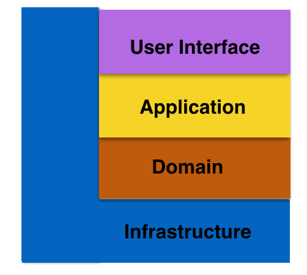

你好，我是周志明。

单体架构是 Fenix's Bookstore 服务端的起始版本，它与后面的基于微服务（Spring Cloud、Kubernetes）、服务网格（Istio）、无服务（Serverless）架构风格实现的其他版本，在业务功能上的表现是完全一致的。

所以，如果你不是针对性地带着解决某个具体问题、了解某项具体工具或技术的目的而来，而是有比较充裕的时间，希望了解软件架构的全貌与发展的话，我就推荐你从这个工程入手，来探索现代软件架构。因为单体架构的结构相对来说比较直观和易于理解，这对后面要接触的其他架构风格，也可以起到良好的铺垫作用。

## 运行程序

好，同样地，我们可以根据以下几种途径来运行程序，看看它的最终效果是怎么样的。

通过 Docker 容器的方式运行：

```shell
$ docker run -d -p 8080:8080 --name bookstore icyfenix/bookstore:monolithic
```

然后在浏览器访问：[http://localhost:8080](http://localhost:8080)，系统预置了一个用户（`user:icyfenix，pw:123456`），你也可以注册新用户来测试。

这里默认会使用 HSQLDB 的内存模式作为数据库，并在系统启动时自动初始化好了 Schema，完全开箱即用。但这同时也意味着当程序运行结束时，所有的数据都不会被保留。而如果你希望使用 HSQLDB 的文件模式，或者其他非嵌入式的独立的数据库支持的话，也是很简单的。

这里我以常用的 MySQL/MariaDB 为例，程序中也已经内置了 MySQL 的表结构初始化脚本，你可以使用环境变量PROFILES来激活 Spring Boot 中针对 MySQL 所提供的配置，命令如下所示：

```shell
$ docker run -d -p 8080:8080 --name bookstore icyfenix/bookstore:monolithic -e PROFILES=mysql
```

此时，你需要通过 Docker link、Docker Compose 或者直接在主机的 Host 文件中，提供一个名为mysql\_lan的 DNS 映射，使程序能顺利链接到数据库。关于数据库的更多配置，你可以参考源码中的[application-mysql.yml](https://github.com/fenixsoft/monolithic_arch_springboot/blob/70f435911b0e0753d7e4cee27cd96304dbef786d/src/main/resources/application-mysql.yml)。

通过 Git 上的源码，以 Maven 运行：

```shell
# 克隆获取源码
$ git clone https://github.com/fenixsoft/monolithic_arch_springboot.git

# 进入工程根目录
$ cd monolithic_arch_springboot

# 编译打包
# 采用Maven Wrapper，此方式只需要机器安装有JDK 8或以上版本即可，无需包括Maven在内的其他任何依赖
# 如在Windows下应使用mvnw.cmd package代替以下命令
$ ./mvnw package

# 运行程序，地址为localhost:8080
$ java -jar target/bookstore-1.0.0-Monolithic-SNAPSHOT.j
```

然后在浏览器访问：[http://localhost:8080](http://localhost:8080)，系统预置了一个用户（`user:icyfenix，pw:123456`），你也可以注册新用户来测试。

通过 Git 上的源码，在 IDE 环境中运行：

* 以 IntelliJ IDEA 为例，Git 克隆本项目后，在 File->Open 菜单选择本项目所在的目录，或者 pom.xml 文件，以 Maven 方式导入工程。

* IDEA 会自动识别出这是一个 Spring Boot 工程，并定位启动入口为 BookstoreApplication，等到 IDEA 内置的 Maven 自动下载完所有的依赖包后，运行该类即可启动。

* 如果你使用其他的 IDE，没有对 Spring Boot 的直接支持，也可以自行定位到 BookstoreApplication，这是一个带有 main() 方法的 Java 类，运行即可。

* 你可以通过 IDEA 的 Maven 面板中，Lifecycle 里面的 package 来对项目进行打包、发布。

* 在 IDE 环境中修改配置（如数据库等）会更加简单，具体你可以参考工程里`application.yml`和`application-mysql.yml`中的内容。

## 技术组件

Fenix's Bookstore 单体架构的后端会尽可能地采用标准的技术组件进行构建，而不依赖于具体的实现，包括以下几种：

* [JSR 370：Java API for RESTful Web Services 2.1](https://jcp.org/en/jsr/detail?id=370)（JAX-RS 2.1）

    在 RESTFul 服务方面，采用的实现为 Jersey 2，你也可以替换为 Apache CXF、RESTeasy、WebSphere、WebLogic 等。

* [JSR 330：Dependency Injection for Java 1.0](https://jcp.org/en/jsr/detail?id=330)

    在依赖注入方面，采用的实现为 Spring Boot 2.0 中内置的 Spring Framework 5。虽然在大多数场合中都尽可能地使用了 JSR 330 的标准注解，但因为 Spring 在对 @Named、@Inject 等注解的支持表现上，跟它本身提供的注解存在差异，所以仍然会有少量地方使用了 Spring 的私有注解。如果你要替换成其他的 CDI 实现，比如 HK2，就需要进行比较大的改动了。

* [JSR 338：Java Persistence 2.2](https://jcp.org/en/jsr/detail?id=338)

    在持久化方面，采用的实现为 Spring Data JPA。你可以替换为 Batoo JPA、EclipseLink、OpenJPA 等实现，只需把使用 CrudRepository 所省略的代码手动补全回来即可，无需做其他改动。

* [JSR 380：Bean Validation 2.0](https://jcp.org/en/jsr/detail?id=380)

    在数据验证方面，采用的实现为 Hibernate Validator 6，你也可以替换为 Apache BVal 等其他验证框架。

* [JSR 315：Java Servlet 3.0](https://jcp.org/en/jsr/detail?id=315)

    在 Web 访问方面，采用的实现为 Spring Boot 2.0 中默认的 Tomcat 9 Embed，你也可以替换为 Jetty、Undertow 等其他 Web 服务器。

不过，也有一些组件仍然依赖了非标准化的技术实现，包括以下两种：

* [JSR 375：Java EE Security API specification 1.0](https://jcp.org/en/jsr/detail?id=375)

    在认证 / 授权方面，在 2017 年才发布的 JSR 375 中，仍然没有直接包含 OAuth2 和 JWT 的直接支持。这里因为后续实现微服务架构时作对比的需要，在单体架构中，我选择了 Spring Security 5 作为认证服务，Spring Security OAuth 2.3 作为授权服务，Spring Security JWT 作为 JWT 令牌支持，并没有采用标准的 JSR 375 实现，比如 Soteria。

* [JSR 353/367：Java API for JSON Processing/Binding](https://jcp.org/en/jsr/detail?id=353)

    在 JSON 序列化 / 反序列化方面，由于 Spring Security OAuth 的限制（使用 JSON-B 作为反序列化器时的结果与 Jackson 等有差异），我采用了 Spring Security OAuth 默认的 Jackson，并没有采用标准的 JSR 353/367 实现，比如 Apache Johnzon、Eclipse Yasson 等。

## 工程结构

Fenix's Bookstore 单体架构的后端参考（并未完全遵循）了 DDD 的分层模式和设计原则，整体分为以下四层。

**1\. Resource**

对应 DDD 中的 User Interface 层，负责向用户显示信息或者解释用户发出的命令。

请注意，这里指的“用户”不一定是使用用户界面的人，而可以是位于另一个进程或计算机的服务。由于这个工程采用了 MVVM 前后端分离的模式，因此这里所指的用户，实际上是前端的服务消费者，所以这里我就以 RESTful 中的核心概念“资源”（Resource）来命名了。

**2\. Application**

对应 DDD 中的 Application 层，负责定义软件本身对外暴露的能力，即软件本身可以完成哪些任务，并负责对内协调领域对象来解决问题。

根据 DDD 的原则，应用层要尽量简单，不包含任何业务规则或者知识，而只为下一层中的领域对象协调任务，分配工作，使它们互相协作，这一点在代码上表现为 Application 层中，一般不会存在任何的条件判断语句。

实际上在许多项目中，Application 层都会被选为包裹事务（代码进入此层事务开始，退出此层事务提交或者回滚）的载体。

**3.Domain**

对应 DDD 中的 Domain 层，负责实现业务逻辑，即表达业务概念，处理业务状态信息以及业务规则这些行为，此层是整个项目的重点。

**4\. Infrastructure**

对应 DDD 中的 Infrastructure 层，向其他层提供通用的技术能力，比如持久化能力、远程服务通讯、工具集，等等。



## 协议

课程的工程代码部分采用[Apache 2.0 协议](https://www.apache.org/licenses/LICENSE-2.0)进行许可。在遵循许可的前提下，你可以自由地对代码进行修改、再发布，也可以将代码用作商业用途。但要求你：

* **署名**：在原有代码和衍生代码中，保留原作者署名及代码来源信息；

* **保留许可证**：在原有代码和衍生代码中，保留 Apache 2.0 协议文件。