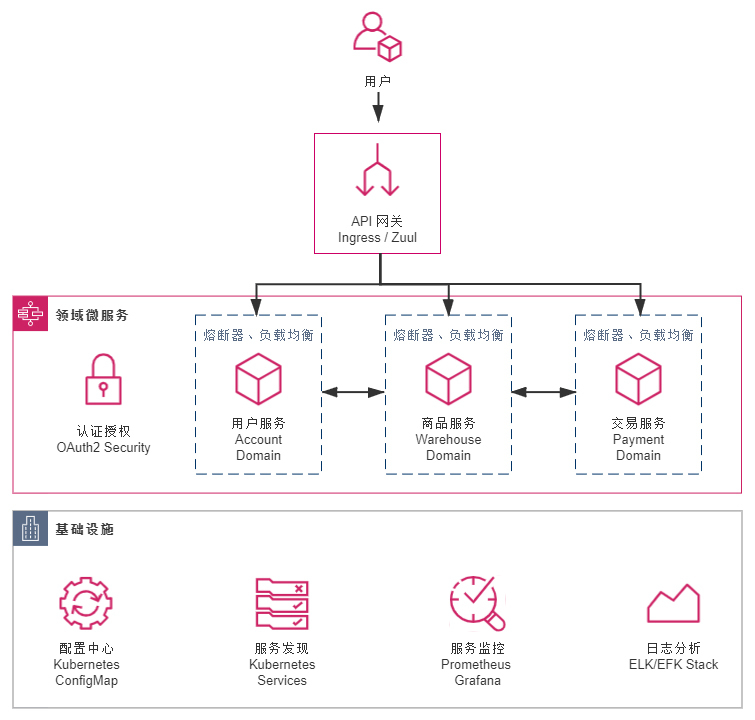

你好，我是周志明。

我在[第 5 讲](https://time.geekbang.org/column/article/312589)中，曾经把 2017 年描述为是“后微服务时代”的开端，这是容器生态发展历史中具有里程碑意义的一年。

在这一年，长期作为 Docker 竞争对手的[RKT](https://www.redhat.com/en/technologies/cloud-computing/openshift) 容器一派的领导者 CoreOS，宣布放弃自己的容器管理系统 Fleet，未来将会把所有容器管理的功能转移到 Kubernetes 之上去实现。

在这一年，容器管理领域的独角兽 Rancher Labs，宣布放弃其内置了数年的容器管理系统 Cattle，提出了“All-in-Kubernetes”战略，从 2.0 版本开始把 1.x 版本能够支持多种容器管理工具的 Rancher，“反向升级”为只支持 Kubernetes 一种容器管理系统。

在这一年，Kubernetes 的主要竞争者 Apache Mesos 在 9 月正式宣布了“[Kubernetes on Mesos](https://k8smeetup.github.io/docs/getting-started-guides/mesos/)”集成计划，由竞争关系转为对 Kubernetes 提供支持，使其能够与 Mesos 的其他一级框架（如[HDFS](https://docs.d2iq.com/latest/usage/service-guides/hdfs/index.html)、[Spark](https://docs.d2iq.com/latest/usage/service-guides/spark/index.html) 和[Chronos](https://mesos.github.io/chronos/docs/getting-started.html)，等等）进行集群资源动态共享、分配与隔离。

在这一年，Kubernetes 的最大竞争者 Docker Swarm 的母公司 Docker，终于在 10 月被迫宣布 Docker 要同时支持 Swarm 与 Kubernetes 两套容器管理系统，事实上承认了 Kubernetes 的统治地位。

至此，这场已经持续了三、四年时间，以 Docker Swarm、Apache Mesos 与 Kubernetes 为主要竞争者的“容器战争”就终于有了明确的结果，Kubernetes 登基加冕是容器发展中一个时代的终章，也将是软件架构发展下一个纪元的开端。

## 需求场景

当引入了[基于 Spring Cloud 的微服务架构](https://time.geekbang.org/column/article/365336)后，小书店 Fenix's Bookstore 初步解决了扩容缩容、独立部署、运维和管理等问题，满足了产品经理不断提出的日益复杂的业务需求。

可是，对于团队的开发人员、设计人员、架构人员来说，并没有感觉到工作变得轻松，微服务中的各种新技术名词，比如配置中心、服务发现、网关、熔断、负载均衡等，就够一名新手学习好长一段时间；从产品角度来看，各种 Spring Cloud 的技术套件，比如 Config、Eureka、Zuul、Hystrix、Ribbon、Feign 等，也占据了产品的大部分编译后的代码容量。

而之所以在微服务架构里，我们选择在应用层面，而不是基础设施层面去解决这些分布式问题，完全是因为由硬件构成的基础设施，跟不上由软件构成的应用服务灵活性的无奈之举。

不过，当 Kubernetes 统一了容器编排管理系统之后，这些纯技术性的底层问题，就开始有了被广泛认可和采纳的基础设施层面的解决方案。为此，Fenix's Bookstore 也迎来了它在“后微服务时代”中的下一次架构演进，这次升级的目标主要有两点。

**目标一：尽可能缩减非业务功能代码的比例。**

在 Fenix's Bookstore 中，用户服务（Account）、商品服务（Warehouse）、交易服务（Payment）三个工程是真正承载业务逻辑的，认证授权服务（Security）可以认为是同时涉及到了技术与业务，而配置中心（Configuration）、网关（Gateway）和服务注册中心（Registry）则是纯技术性。我们希望尽量消除这些纯技术的工程，以及那些依附在其他业务工程上的纯技术组件。

**目标二：尽可能在不影响原有代码的前提下完成迁移。**

得益于 Spring Framework 4 中的 Conditional Bean 等声明式特性的出现，近年来新发布的 Java 技术组件中，[声明式编程](https://en.wikipedia.org/wiki/Declarative_programming)（Declarative Programming）已经逐步取代了[命令式编程](https://en.wikipedia.org/wiki/Imperative_programming)（Imperative Programming），成为主流的选择。

在声明式编程的支持下，我们可以从目的而不是过程的角度，去描述编码意图，让代码几乎不会与具体的技术实现产生耦合。而如果要更换一种技术实现，我们也只需要调整配置中的声明即可。

那么，从升级结果来看，如果仅以 Java 代码的角度来衡量，本工程与此前基于 Spring Cloud 的实现没有任何差异，两者的每一行 Java 代码都是一模一样的。

而实际上，**真正的区别**在于 Kubernetes 的实现版本中，直接删除了配置中心、服务注册中心的工程，在其他工程的 pom.xml 中，也删除了如 Eureka、Ribbon、Config 等组件的依赖。取而代之的是新增了若干以 YAML 配置文件为载体的[Skaffold](https://skaffold.dev/)和 Kubernetes 的资源描述，这些资源描述文件，将会动态构建出 DNS 服务器、服务负载均衡器等一系列虚拟化的基础设施，去代替原有的应用层面的技术组件。升级改造之后的应用架构如下图所示：



## 运行程序

在已经[部署 Kubernetes 集群](https://icyfenix.cn/appendix/deployment-env-setup/setup-kubernetes/)的前提下，你可以通过以下几种途径运行程序，浏览最终的效果：

直接在 Kubernetes 集群环境上运行：

工程在编译时，就已经通过 Kustomize 产生出集成式的资源描述文件，你可以通过该文件直接在 Kubernetes 集群中运行程序：

```shell
# 资源描述文件
$ kubectl apply -f https://raw.githubusercontent.com/fenixsoft/microservice_arch_kubernetes/master/bookstore.yml
```

注意，在命令执行的过程中，一共需要下载几百 MB 的镜像，尤其是当 Docker 中没有各层基础镜像缓存时，请你根据自己的网速保持一定的耐心。等未来 GraalVM 对 Spring Cloud 的支持更成熟一些后，你也可以考虑采用 GraalVM 来改善这一点。

好，当所有的 Pod 都处于正常工作状态后，你可以在浏览器访问：http://localhost:30080，系统预置了一个用户（user:icyfenix，pw:123456），你也可以注册新用户来测试。

通过 Skaffold 在命令行或 IDE 中以调试方式运行：

一般开发基于 Kubernetes 的微服务应用，是在本地针对单个服务编码、调试完成后，通过 CI/CD 流水线部署到 Kubernetes 中进行集成的。如果只是针对集成测试，这并没有什么问题，但同样的做法应用在开发阶段就相当不方便了，我们不希望每做一处修改，都要经过一次 CI/CD 流程，这会非常耗时而且难以调试。

Skaffold 是 Google 在 2018 年开源的一款加速应用在本地或远程 Kubernetes 集群中，构建、推送、部署和调试的自动化命令行工具。对于 Java 应用来说，它可以帮助我们做到监视代码变动，自动打包出镜像，将镜像打上动态标签并更新部署到 Kubernetes 集群，为 Java 程序注入开放 JDWP 调试的参数，并根据 Kubernetes 的服务端口自动在本地生成端口转发。

以上都是根据skaffold.yml中的配置来进行的，开发时 Skaffold 会通过dev指令来执行这些配置，具体的操作过程如下所示：

```shell
# 克隆获取源码
$ git clone https://github.com/fenixsoft/microservice_arch_kubernetes.git && cd microservice_arch_kubernetes

# 编译打包
$ ./mvnw package

# 启动Skaffold
# 此时将会自动打包Docker镜像，并部署到Kubernetes中
$ skaffold dev
```

服务全部启动后，你可以在浏览器访问：http://localhost:30080，系统预置了一个用户（user:icyfenix，pw:123456），你也可以注册新用户来测试。

另外，由于面向的是开发环境，基于效率原因，我并没有像传统 CI 工程那样，直接使用 Maven 的 Docker 镜像来打包 Java 源码，而这就决定了在构建 Dockerfile 时，我们要监视的变动目标将是 Jar 文件，而不是 Java 源码。Skaffold 的执行是由 Jar 包的编译结果来驱动的，它只在进行 Maven 编译、输出了新的 Jar 包后才会更新镜像。

这样做的原因，一方面是考虑到在 Maven 镜像中打包，不方便利用本地的仓库缓存，尤其在国内网络中，速度实在难以忍受；另一方面，是我其实并不希望每保存一次源码时，都自动构建和更新一次镜像，毕竟比起传统的 HotSwap 或者 Spring Devtool Reload 来说，更新镜像重启 Pod 是一个更加重负载的操作。未来 CNCF 的[Buildpack](https://buildpacks.io/)成熟之后，应该可以绕过笨重的 Dockerfile，对打包和容器热更新做更加精细化的控制。

另外，如果你有 IDE 调试的需求，我推荐你采用[Google Cloud Code](https://cloud.google.com/code?hl=zh_cn)（Cloud Code 同时提供了 VS Code 和 IntelliJ Idea 的插件）来配合 Skaffold 使用，毕竟这是同一个公司出品的产品，搭配起来能获得几乎与本地开发单体应用一致的编码和调试体验。

## 技术组件

Fenix's Bookstore 采用基于 Kubernetes 的微服务架构，并采用 Spring Cloud Kubernetes 做了适配，其中主要的技术组件包括以下几种。

**环境感知**

Spring Cloud Kubernetes 本身引入了 Fabric8 的[Kubernetes Client](https://github.com/fabric8io/kubernetes-client)作为容器环境感知，不过引用的版本很旧，比如 Spring Cloud Kubernetes 1.1.2 中，采用的是 Fabric8 Kubernetes Client 4.4.1，Fabric8 提供的兼容性列表中，这个版本只支持到 Kubernetes 1.14，虽然实测在 1.16 上也能用，但是在 1.18 上就无法识别到最新的 Api-Server。

因此 Maven 引入依赖时，你需要手工处理，排除旧版本，引入新版本（本工程采用的是 4.10.1）。

**配置中心**

采用 Kubernetes 的 ConfigMap 来管理，通过[Spring Cloud Kubernetes Config](https://github.com/spring-cloud/spring-cloud-kubernetes/tree/main/spring-cloud-kubernetes-config)自动将 ConfigMap 的内容注入到 Spring 配置文件中，并实现动态更新。

**服务发现**

采用 Kubernetes 的 Service 来管理，通过[Spring Cloud Kubernetes Discovery](https://github.com/spring-cloud/spring-cloud-kubernetes/tree/main/spring-cloud-kubernetes-discovery)自动将 HTTP 访问中的服务转换为[FQDN](https://en.wikipedia.org/wiki/Fully_qualified_domain_name)。

**负载均衡**

采用 Kubernetes Service 本身的负载均衡能力实现（就是 DNS 负载均衡），就可以不再需要 Ribbon 这样的客户端负载均衡了。Spring Cloud Kubernetes 从 1.1.2 开始，也已经移除了对 Ribbon 的适配支持，也（暂时）没有对其代替品 Spring Cloud LoadBalancer 提供适配。

**服务网关**

网关部分仍然保留了 Zuul，没有采用 Ingress 来代替。这里我主要有两点考虑，一是 Ingress Controller 不算是 Kubernetes 的自带组件，它可以有不同的选择（如 KONG、Nginx、Haproxy 等），同时也需要独立安装，因此作为演示工程，出于环境复杂度最小化的考虑，我没有使用 Ingress；二是 Fenix's Bookstore 的前端工程是存放在网关中的，移除了 Zuul 之后也仍然要维持一个前端工程的存在，不能进一步缩减工程数量，也就削弱了移除 Zuul 的动力。

**服务熔断**

这里仍然采用 Hystrix，Kubernetes 本身无法做到精细化的服务治理，包括熔断、流控、监视，等等，我们将在基于 Istio 的服务网格架构中解决这个问题。

**认证授权**

这里仍然采用 Spring Security OAuth 2.0，Kubernetes 的 RBAC 授权可以解决服务层面的访问控制问题，但 Security 是跨越了业务和技术的边界的，认证授权模块本身仍然承担着对前端用户的认证、授权职责，这部分是与业务相关的。

## 协议

课程的工程代码部分采用[Apache 2.0 协议](https://www.apache.org/licenses/LICENSE-2.0)进行许可。在遵循许可的前提下，你可以自由地对代码进行修改、再发布，也可以将代码用作商业用途。但要求你：

* **署名**：在原有代码和衍生代码中，保留原作者署名及代码来源信息；

* **保留许可证**：在原有代码和衍生代码中，保留 Apache 2.0 协议文件。