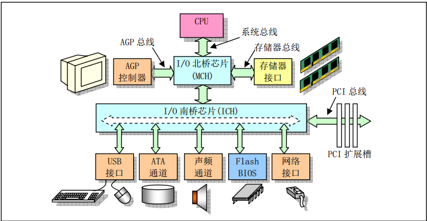
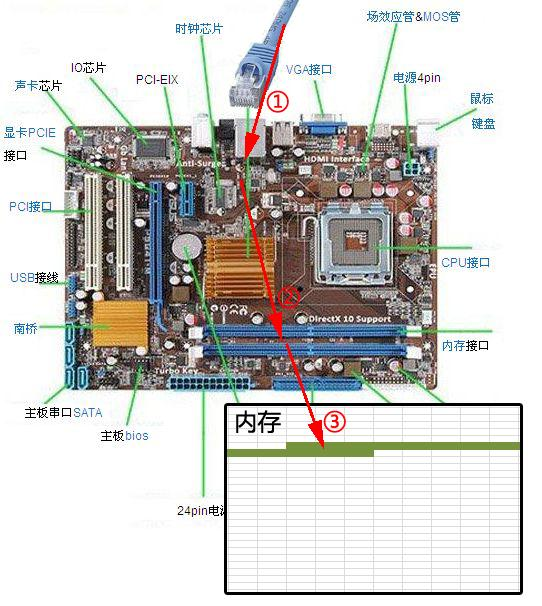
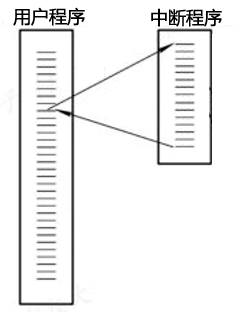
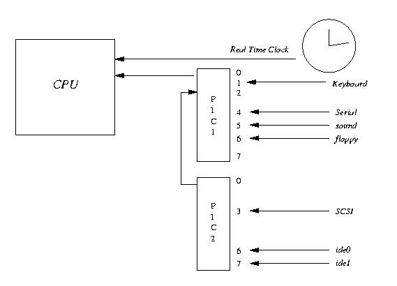
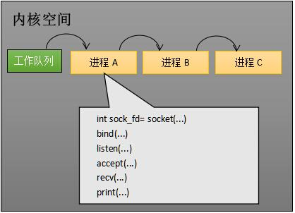
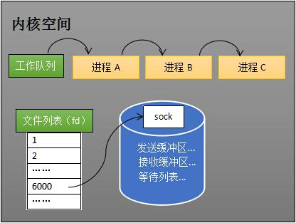
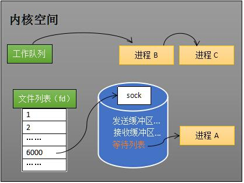

转载自[如果这篇文章说不清epoll的本质，那就过来掐死我吧！ （1）](https://zhuanlan.zhihu.com/p/63179839)。

从事服务端开发，少不了要接触网络编程。epoll作为linux下高性能网络服务器的必备技术至关重要，nginx、redis、[skynet](https://zhida.zhihu.com/search?content_id=102169513&content_type=Article&match_order=1&q=skynet&zhida_source=entity)和大部分游戏服务器都使用到这一[多路复用技术](https://zhida.zhihu.com/search?content_id=102169513&content_type=Article&match_order=1&q=%E5%A4%9A%E8%B7%AF%E5%A4%8D%E7%94%A8%E6%8A%80%E6%9C%AF&zhida_source=entity)。

**文**/罗培羽

因为epoll的重要性，不少游戏公司（如某某九九）在招聘服务端同学时，可能会问及epoll相关的问题。比如epoll和select的区别是什么？epoll高效率的原因是什么？如果只靠背诵，显然不能算上深刻的理解。

网上虽然也有不少讲解epoll的文章，但要不是过于浅显，就是陷入源码解析，很少能有通俗易懂的。于是决定编写此文，让缺乏专业背景知识的读者也能够明白epoll的原理。文章核心思想是：

**要让读者清晰明白EPOLL为什么性能好。**

本文会从网卡接收数据的流程讲起，串联起CPU中断、操作系统进程调度等知识；再一步步分析阻塞接收数据、select到epoll的进化过程；最后探究epoll的实现细节。目录：

> 一、从网卡接收数据说起  
> 二、如何知道接收了数据？  
> 三、进程阻塞为什么不占用cpu资源？  
> 四、内核接收网络数据全过程  
> 五、同时监视多个socket的简单方法  
> 六、epoll的设计思路  
> 七、epoll的原理和流程  
> 八、epoll的实现细节  
> 九、结论

## **一、从网卡接收数据说起**

下图是一个典型的计算机结构图，计算机由CPU、存储器（内存）、网络接口等部件组成。了解epoll本质的**第一步**，要从**硬件**的角度看计算机怎样接收网络数据。



计算机结构图（图片来源：linux内核完全注释之微型计算机组成结构）

下图展示了网卡接收数据的过程。在①阶段，网卡收到网线传来的数据；经过②阶段的硬件电路的传输；最终将数据写入到内存中的某个地址上（③阶段）。这个过程涉及到DMA传输、IO通路选择等硬件有关的知识，但我们只需知道：**网卡会把接收到的数据写入内存。**



网卡接收数据的过程

通过硬件传输，网卡接收的数据存放到内存中。操作系统就可以去读取它们。

## **二、如何知道接收了数据？**

了解epoll本质的**第二步**，要从**CPU**的角度来看数据接收。要理解这个问题，要先了解一个概念——中断。

计算机执行程序时，会有优先级的需求。比如，当计算机收到断电信号时（电容可以保存少许电量，供CPU运行很短的一小段时间），它应立即去保存数据，保存数据的程序具有较高的优先级。

一般而言，由硬件产生的信号需要cpu立马做出回应（不然数据可能就丢失），所以它的优先级很高。cpu理应中断掉正在执行的程序，去做出响应；当cpu完成对硬件的响应后，再重新执行用户程序。中断的过程如下图，和函数调用差不多。只不过函数调用是事先定好位置，而中断的位置由“信号”决定。



中断程序调用

以键盘为例，当用户按下键盘某个按键时，键盘会给cpu的中断引脚发出一个[高电平](https://zhida.zhihu.com/search?content_id=102169513&content_type=Article&match_order=1&q=%E9%AB%98%E7%94%B5%E5%B9%B3&zhida_source=entity)。cpu能够捕获这个信号，然后执行键盘中断程序。下图展示了各种硬件通过中断与cpu交互。



cpu中断（图片来源：net.pku.edu.cn）

现在可以回答本节提出的问题了：当网卡把数据写入到内存后，**网卡向cpu发出一个[中断信号](https://zhida.zhihu.com/search?content_id=102169513&content_type=Article&match_order=1&q=%E4%B8%AD%E6%96%AD%E4%BF%A1%E5%8F%B7&zhida_source=entity)，操作系统便能得知有新数据到来**，再通过网卡**中断程序**去处理数据。

## **三、进程阻塞为什么不占用cpu资源？**

了解epoll本质的**第三步**，要从**操作系统进程调度**的角度来看数据接收。阻塞是进程调度的关键一环，指的是进程在等待某事件（如接收到网络数据）发生之前的等待状态，recv、select和epoll都是阻塞方法。**了解“进程阻塞为什么不占用cpu资源？”，也就能够了解这一步**。

为简单起见，我们从普通的recv接收开始分析，先看看下面代码：

```c
//创建socket
int s = socket(AF_INET, SOCK_STREAM, 0);   
//绑定
bind(s, ...)
//监听
listen(s, ...)
//接受客户端连接
int c = accept(s, ...)
//接收客户端数据
recv(c, ...);
//将数据打印出来
printf(...)
```

这是一段最基础的网络编程代码，先新建socket对象，依次调用bind、listen、accept，最后调用recv接收数据。recv是个[阻塞方法](https://zhida.zhihu.com/search?content_id=102169513&content_type=Article&match_order=2&q=%E9%98%BB%E5%A1%9E%E6%96%B9%E6%B3%95&zhida_source=entity)，当程序运行到recv时，它会一直等待，直到接收到数据才往下执行。

> 插入：如果您还不太熟悉网络编程，欢迎阅读我编写的《Unity3D网络游戏实战(第2版)》，会有详细的介绍。

那么阻塞的原理是什么？

**工作队列**

操作系统为了支持多任务，实现了进程调度的功能，会把进程分为“运行”和“等待”等几种状态。运行状态是进程获得cpu使用权，正在执行代码的状态；等待状态是[阻塞状态](https://zhida.zhihu.com/search?content_id=102169513&content_type=Article&match_order=1&q=%E9%98%BB%E5%A1%9E%E7%8A%B6%E6%80%81&zhida_source=entity)，比如上述程序运行到recv时，程序会从运行状态变为等待状态，接收到数据后又变回运行状态。操作系统会分时执行各个运行状态的进程，由于速度很快，看上去就像是同时执行多个任务。

下图中的计算机中运行着A、B、C三个进程，其中进程A执行着上述基础网络程序，一开始，这3个进程都被操作系统的工作队列所引用，处于运行状态，会分时执行。



工作队列中有A、B和C三个进程

**等待队列**

当进程A执行到创建socket的语句时，操作系统会创建一个由文件系统管理的socket对象（如下图）。这个socket对象包含了发送缓冲区、[接收缓冲区](https://zhida.zhihu.com/search?content_id=102169513&content_type=Article&match_order=1&q=%E6%8E%A5%E6%94%B6%E7%BC%93%E5%86%B2%E5%8C%BA&zhida_source=entity)、等待队列等成员。等待队列是个非常重要的结构，它指向所有需要等待该socket事件的进程。



创建socket

当程序执行到recv时，操作系统会将进程A从工作队列移动到该socket的等待队列中（如下图）。由于工作队列只剩下了进程B和C，依据进程调度，cpu会轮流执行这两个进程的程序，不会执行进程A的程序。**所以进程A被阻塞，不会往下执行代码，也不会占用cpu资源**。



socket的等待队列

ps：操作系统添加等待队列只是添加了对这个“等待中”进程的引用，以便在接收到数据时获取进程对象、将其唤醒，而非直接将进程管理纳入自己之下。上图为了方便说明，直接将进程挂到等待队列之下。

**唤醒进程**

当socket接收到数据后，操作系统将该socket等待队列上的进程重新放回到工作队列，该进程变成运行状态，继续执行代码。也由于socket的接收缓冲区已经有了数据，recv可以返回接收到的数据。

**以下内容待续**

四、内核接收网络数据全过程

五、同时监视多个socket的简单方法

六、epoll的设计思路

七、epoll的原理和流程

八、epoll的实现细节

九、结论

既然说到[网络编程](https://zhida.zhihu.com/search?content_id=102169513&content_type=Article&match_order=4&q=%E7%BD%91%E7%BB%9C%E7%BC%96%E7%A8%8B&zhida_source=entity)，笔者的**《Unity3D网络游戏实战（第2版）》**是一本专门介绍如何开发**多人网络游戏**的书籍，用实例介绍开发游戏的全过程，非常实用。书中对网络编程有详细的讲解，全书用一个大例子贯穿，真正的“实战”教程。

致谢：本文力图详细说明epoll的原理，特别感谢

雄爷、堂叔 等同事审阅了文章并给予修改意见。


**系列文章**

[罗培羽：如果这篇文章说不清epoll的本质，那就过来掐死我吧！ （1）](https://zhuanlan.zhihu.com/p/63179839)

[罗培羽：如果这篇文章说不清epoll的本质，那就过来掐死我吧！ （2）](https://zhuanlan.zhihu.com/p/64138532)

[罗培羽：如果这篇文章说不清epoll的本质，那就过来掐死我吧！ （3）](https://zhuanlan.zhihu.com/p/64746509)