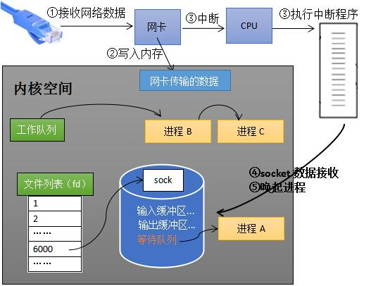
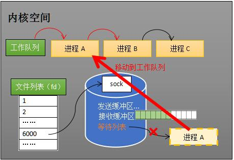
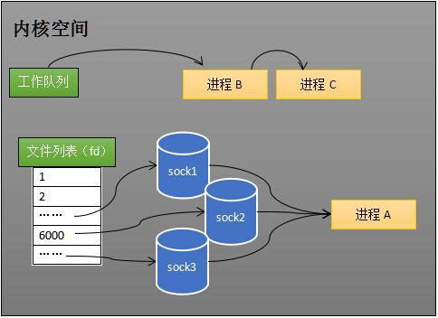
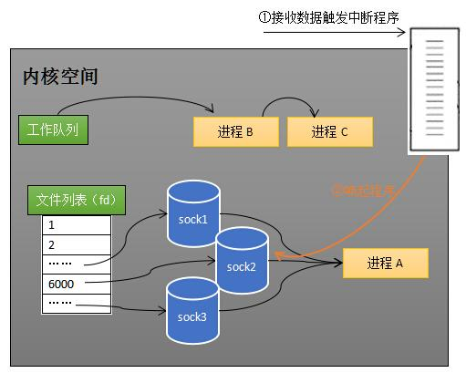
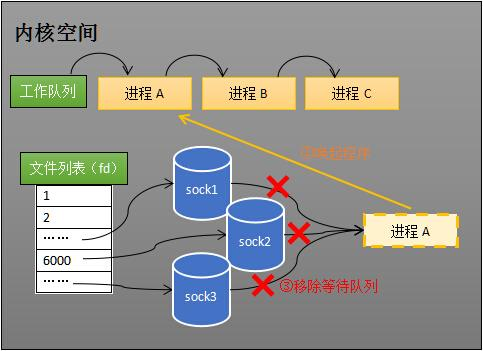
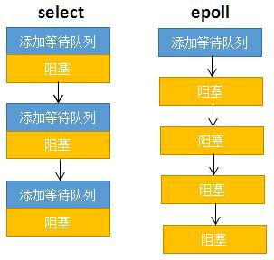
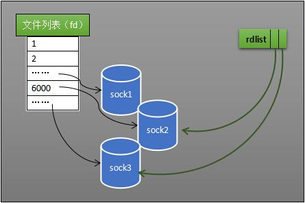

转载自[如果这篇文章说不清epoll的本质，那就过来掐死我吧！ （2）](https://zhuanlan.zhihu.com/p/64138532)。

从事服务端开发，少不了要接触[网络编程](https://zhida.zhihu.com/search?content_id=102382364&content_type=Article&match_order=1&q=%E7%BD%91%E7%BB%9C%E7%BC%96%E7%A8%8B&zhida_source=entity)。epoll作为linux下高性能网络服务器的必备技术至关重要，大部分游戏服务器都使用到这一[多路复用技术](https://zhida.zhihu.com/search?content_id=102382364&content_type=Article&match_order=1&q=%E5%A4%9A%E8%B7%AF%E5%A4%8D%E7%94%A8%E6%8A%80%E6%9C%AF&zhida_source=entity)。文章核心思想是：要让读者清晰明白EPOLL为什么性能好。

**文**/罗培羽

**上篇回顾**

一、从网卡接收数据说起

二、如何知道接收了数据？

三、进程阻塞为什么不占用cpu资源？

**系列文章**

[罗培羽：如果这篇文章说不清epoll的本质，那就过来掐死我吧！ （1）](https://zhuanlan.zhihu.com/p/63179839)

[罗培羽：如果这篇文章说不清epoll的本质，那就过来掐死我吧！ （2）](https://zhuanlan.zhihu.com/p/64138532)

[罗培羽：如果这篇文章说不清epoll的本质，那就过来掐死我吧！ （3）](https://zhuanlan.zhihu.com/p/64746509)

## **四、内核接收网络数据全过程**

**这一步，贯穿网卡、中断、[进程调度](https://zhida.zhihu.com/search?content_id=102382364&content_type=Article&match_order=1&q=%E8%BF%9B%E7%A8%8B%E8%B0%83%E5%BA%A6&zhida_source=entity)的知识，叙述阻塞recv下，内核接收数据全过程。**

如下图所示，进程在recv阻塞期间，计算机收到了对端传送的数据（步骤①）。数据经由网卡传送到内存（步骤②），然后网卡通过中断信号通知cpu有数据到达，cpu执行中断程序（步骤③）。此处的中断程序主要有两项功能，先将网络数据写入到对应socket的[接收缓冲区](https://zhida.zhihu.com/search?content_id=102382364&content_type=Article&match_order=1&q=%E6%8E%A5%E6%94%B6%E7%BC%93%E5%86%B2%E5%8C%BA&zhida_source=entity)里面（步骤④），再唤醒进程A（步骤⑤），重新将进程A放入工作队列中。



内核接收数据全过程

唤醒进程的过程如下图所示。



唤醒进程

**以上是内核接收数据全过程**

这里留有两个思考题，大家先想一想。

其一，操作系统如何知道网络数据对应于哪个socket？

其二，如何同时监视多个socket的数据？

（——我是分割线，想好了才能往下看哦~）

公布答案的时刻到了。

第一个问题：因为一个socket对应着一个[端口号](https://zhida.zhihu.com/search?content_id=102382364&content_type=Article&match_order=1&q=%E7%AB%AF%E5%8F%A3%E5%8F%B7&zhida_source=entity)，而网络数据包中包含了ip和端口的信息，内核可以通过端口号找到对应的socket。当然，为了提高处理速度，操作系统会维护端口号到socket的索引结构，以快速读取。

第二个问题是**多路复用的重中之重，**是本文后半部分的重点！

## **五、同时监视多个socket的简单方法**

服务端需要管理多个客户端连接，而recv只能监视单个socket，这种矛盾下，人们开始寻找监视多个socket的方法。epoll的要义是**高效**的监视多个socket。从历史发展角度看，必然先出现一种不太高效的方法，人们再加以改进。只有先理解了不太高效的方法，才能够理解epoll的本质。

假如能够预先传入一个socket列表，**如果列表中的socket都没有数据，挂起进程，直到有一个socket收到数据，唤醒进程**。这种方法很直接，也是select的设计思想。

为方便理解，我们先复习select的用法。在如下的代码中，先准备一个数组（下面代码中的fds），让fds存放着所有需要监视的socket。然后调用select，如果fds中的所有socket都没有数据，select会阻塞，直到有一个socket接收到数据，select返回，唤醒进程。用户可以遍历fds，通过FD\_ISSET判断具体哪个socket收到数据，然后做出处理。

```c
int s = socket(AF_INET, SOCK_STREAM, 0);  
bind(s, ...)
listen(s, ...)

int fds[] =  存放需要监听的socket

while(1){
    int n = select(..., fds, ...)
    for(int i=0; i < fds.count; i++){
        if(FD_ISSET(fds[i], ...)){
            //fds[i]的数据处理
        }
    }
}
```

**select的流程**

select的实现思路很直接。假如程序同时监视如下图的sock1、sock2和sock3三个socket，那么在调用select之后，操作系统把进程A分别加入这三个socket的等待队列中。



操作系统把进程A分别加入这三个socket的等待队列中

当任何一个socket收到数据后，中断程序将唤起进程。下图展示了sock2接收到了数据的处理流程。

> ps：recv和select的中断回调可以设置成不同的内容。



sock2接收到了数据，中断程序唤起进程A

所谓唤起进程，就是将进程从所有的等待队列中移除，加入到工作队列里面。如下图所示。



将进程A从所有等待队列中移除，再加入到工作队列里面

经由这些步骤，当进程A被唤醒后，它知道至少有一个socket接收了数据。程序只需遍历一遍socket列表，就可以得到就绪的socket。

这种简单方式**行之有效**，在几乎所有操作系统都有对应的实现。

**但是简单的方法往往有缺点，主要是：**

其一，每次调用select都需要将进程加入到所有监视socket的等待队列，每次唤醒都需要从每个队列中移除。这里涉及了两次遍历，而且每次都要将整个fds列表传递给内核，有一定的开销。正是因为遍历操作开销大，出于效率的考量，才会规定select的最大监视数量，默认只能监视1024个socket。

其二，进程被唤醒后，程序并不知道哪些socket收到数据，还需要遍历一次。

那么，有没有减少遍历的方法？有没有保存就绪socket的方法？这两个问题便是epoll技术要解决的。

> 补充说明： 本节只解释了select的一种情形。当程序调用select时，内核会先遍历一遍socket，如果有一个以上的socket接收缓冲区有数据，那么select直接返回，不会阻塞。这也是为什么select的返回值有可能大于1的原因之一。如果没有socket有数据，进程才会阻塞。

## **六、epoll的设计思路**

epoll是在select出现N多年后才被发明的，是select和poll的增强版本。epoll通过以下一些措施来改进效率。

**措施一：[功能分离](https://zhida.zhihu.com/search?content_id=102382364&content_type=Article&match_order=1&q=%E5%8A%9F%E8%83%BD%E5%88%86%E7%A6%BB&zhida_source=entity)**

select低效的原因之一是将“维护等待队列”和“阻塞进程”两个步骤合二为一。如下图所示，每次调用select都需要这两步操作，然而大多数应用场景中，需要监视的socket相对固定，并不需要每次都修改。epoll将这两个操作分开，先用epoll\_ctl维护等待队列，再调用epoll\_wait阻塞进程。显而易见的，效率就能得到提升。



相比select，epoll拆分了功能

为方便理解后续的内容，我们先复习下epoll的用法。如下的代码中，先用epoll\_create创建一个epoll对象epfd，再通过epoll\_ctl将需要监视的socket添加到[epfd](https://zhida.zhihu.com/search?content_id=102382364&content_type=Article&match_order=2&q=epfd&zhida_source=entity)中，最后调用epoll\_wait等待数据。

```c
int s = socket(AF_INET, SOCK_STREAM, 0);   
bind(s, ...)
listen(s, ...)

int epfd = epoll_create(...);
epoll_ctl(epfd, ...); //将所有需要监听的socket添加到epfd中

while(1){
    int n = epoll_wait(...)
    for(接收到数据的socket){
        //处理
    }
}
```

功能分离，使得epoll有了优化的可能。

**措施二：就绪列表**

select低效的另一个原因在于程序不知道哪些socket收到数据，只能一个个遍历。如果内核维护一个“就绪列表”，引用收到数据的socket，就能避免遍历。如下图所示，计算机共有三个socket，收到数据的sock2和sock3被rdlist（就绪列表）所引用。当进程被唤醒后，只要获取rdlist的内容，就能够知道哪些socket收到数据。



就绪列表示意图

**以下内容待续**

七、epoll的原理和流程

八、epoll的实现细节

九、结论

除了网络编程，「同步」也是[网络游戏开发](https://zhida.zhihu.com/search?content_id=102382364&content_type=Article&match_order=1&q=%E7%BD%91%E7%BB%9C%E6%B8%B8%E6%88%8F%E5%BC%80%E5%8F%91&zhida_source=entity)的核心课题。多人游戏中，玩家在世界中的位置旋转以及各种属性都会对游戏表现产生影响，需要同步给其他玩家。然而由于网络通信存在延迟和抖动，很难做到完美的同步效果。如果没能处理好，游戏将不同步和卡顿，这是玩家所不能容忍的。笔者即将开展一场知乎live **《网络游戏同步算法》**，分析同步技术，欢迎收听。

[网络游戏同步算法](https://www.zhihu.com/lives/1104162893850898432)

致谢：本文力图详细说明epoll的原理，特别感谢 [@陆俊壕](https://www.zhihu.com/people/e622f8ea68620104614bcc9a4ce3855d) [@AllenKong12](https://www.zhihu.com/people/8887d646fe997ca00f7ff99b724dd230) 雄爷、堂叔 等同事审阅了文章并给予修改意见。