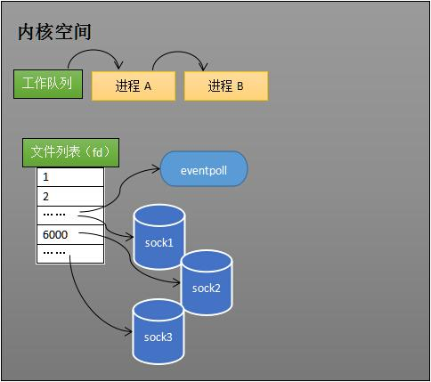
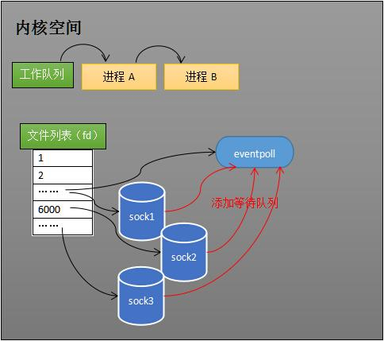
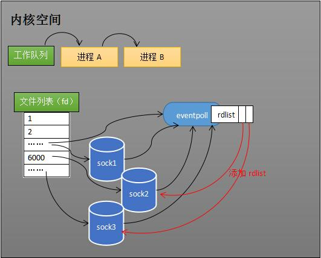
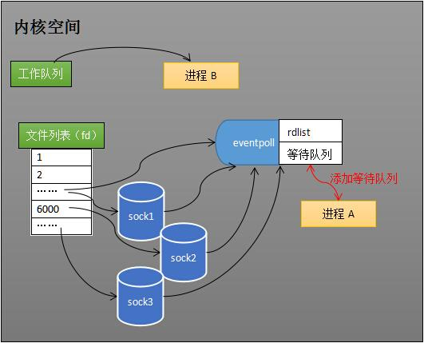
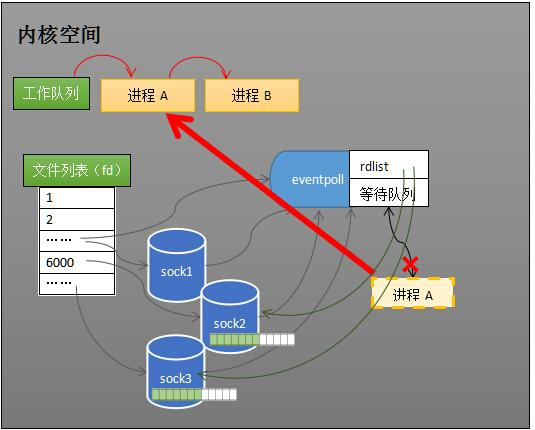
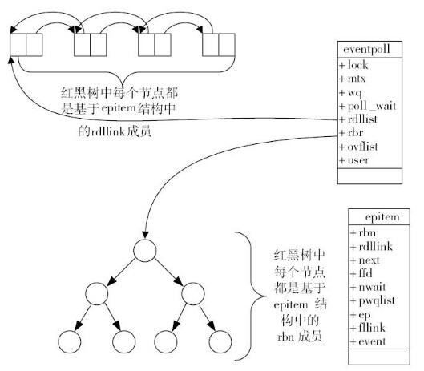
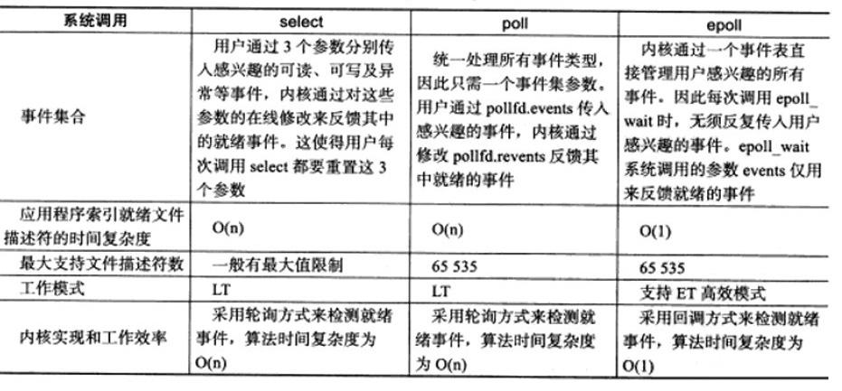

转载自[如果这篇文章说不清epoll的本质，那就过来掐死我吧！ （3）](https://zhuanlan.zhihu.com/p/64746509)。

epoll是开发linux高性能服务器的必备技术至，epoll本质，是服务端程序员的必须掌握的知识。

**文**/罗培羽

**上篇回顾**

四、内核接收网络数据全过程

五、同时监视多个socket的简单方法

六、epoll的设计思路

**系列文章**

[罗培羽：如果这篇文章说不清epoll的本质，那就过来掐死我吧！ （1）](https://zhuanlan.zhihu.com/p/63179839)

[罗培羽：如果这篇文章说不清epoll的本质，那就过来掐死我吧！ （2）](https://zhuanlan.zhihu.com/p/64138532)

[罗培羽：如果这篇文章说不清epoll的本质，那就过来掐死我吧！ （3）](https://zhuanlan.zhihu.com/p/64746509)

## **七、epoll的原理和流程**

本节会以示例和图表来讲解epoll的原理和流程。

**创建epoll对象**

如下图所示，当某个进程调用epoll\_create方法时，内核会创建一个eventpoll对象（也就是程序中epfd所代表的对象）。eventpoll对象也是文件系统中的一员，和socket一样，它也会有[等待队列](https://zhida.zhihu.com/search?content_id=102517484&content_type=Article&match_order=1&q=%E7%AD%89%E5%BE%85%E9%98%9F%E5%88%97&zhida_source=entity)。

内核创建eventpoll对象

创建一个代表该epoll的eventpoll对象是必须的，因为内核要维护“就绪列表”等数据，“就绪列表”可以作为eventpoll的成员。

**维护监视列表**

创建epoll对象后，可以用epoll\_ctl添加或删除所要监听的socket。以添加socket为例，如下图，如果通过epoll\_ctl添加sock1、sock2和sock3的监视，内核会将eventpoll添加到这三个socket的等待队列中。

添加所要监听的socket

当socket收到数据后，中断程序会操作eventpoll对象，而不是直接操作进程。

**接收数据**

当socket收到数据后，中断程序会给eventpoll的“就绪列表”添加socket引用。如下图展示的是sock2和sock3收到数据后，中断程序让rdlist引用这两个socket。

给就绪列表添加引用

eventpoll对象相当于是socket和进程之间的中介，socket的数据接收并不直接影响进程，而是通过改变eventpoll的就绪列表来改变[进程状态](https://zhida.zhihu.com/search?content_id=102517484&content_type=Article&match_order=1&q=%E8%BF%9B%E7%A8%8B%E7%8A%B6%E6%80%81&zhida_source=entity)。

当程序执行到epoll\_wait时，如果rdlist已经引用了socket，那么epoll\_wait直接返回，如果rdlist为空，阻塞进程。

**阻塞和唤醒进程**

假设计算机中正在运行进程A和进程B，在某时刻进程A运行到了epoll\_wait语句。如下图所示，内核会将进程A放入eventpoll的等待队列中，阻塞进程。

epoll\_wait阻塞进程

当socket接收到数据，中断程序一方面修改rdlist，另一方面唤醒eventpoll等待队列中的进程，进程A再次进入运行状态（如下图）。也因为rdlist的存在，进程A可以知道哪些socket发生了变化。

epoll唤醒进程

## **八、epoll的实现细节**

至此，相信读者对epoll的本质已经有一定的了解。但我们还留有一个问题，**eventpoll的数据结构**是什么样子？

再留两个问题，**[就绪队列](https://zhida.zhihu.com/search?content_id=102517484&content_type=Article&match_order=1&q=%E5%B0%B1%E7%BB%AA%E9%98%9F%E5%88%97&zhida_source=entity)**应该应使用什么数据结构？eventpoll应使用什么数据结构来管理通过epoll\_ctl添加或删除的socket？

（——我是分割线，想好了才能往下看哦~）

如下图所示，eventpoll包含了lock、mtx、wq（等待队列）、rdlist等成员。rdlist和rbr是我们所关心的。

epoll原理示意图，图片来源：《深入理解Nginx：模块开发与架构解析(第二版)》，陶辉

**就绪列表的数据结构**

就绪列表引用着就绪的socket，所以它应能够快速的插入数据。

程序可能随时调用[epoll\_ctl](https://zhida.zhihu.com/search?content_id=102517484&content_type=Article&match_order=4&q=epoll_ctl&zhida_source=entity)添加监视socket，也可能随时删除。当删除时，若该socket已经存放在就绪列表中，它也应该被移除。

所以就绪列表应是一种能够快速插入和删除的数据结构。双向链表就是这样一种数据结构，epoll使用[双向链表](https://zhida.zhihu.com/search?content_id=102517484&content_type=Article&match_order=2&q=%E5%8F%8C%E5%90%91%E9%93%BE%E8%A1%A8&zhida_source=entity)来实现就绪队列（对应上图的rdllist）。

**索引结构**

既然epoll将“维护监视队列”和“进程阻塞”分离，也意味着需要有个数据结构来保存监视的socket。至少要方便的添加和移除，还要便于搜索，以避免重复添加。红黑树是一种自平衡[二叉查找树](https://zhida.zhihu.com/search?content_id=102517484&content_type=Article&match_order=1&q=%E4%BA%8C%E5%8F%89%E6%9F%A5%E6%89%BE%E6%A0%91&zhida_source=entity)，搜索、插入和删除[时间复杂度](https://zhida.zhihu.com/search?content_id=102517484&content_type=Article&match_order=1&q=%E6%97%B6%E9%97%B4%E5%A4%8D%E6%9D%82%E5%BA%A6&zhida_source=entity)都是O(log(N))，效率较好。epoll使用了红黑树作为索引结构（对应上图的rbr）。

> ps：因为操作系统要兼顾多种功能，以及由更多需要保存的数据，rdlist并非直接引用socket，而是通过epitem间接引用，[红黑树](https://zhida.zhihu.com/search?content_id=102517484&content_type=Article&match_order=3&q=%E7%BA%A2%E9%BB%91%E6%A0%91&zhida_source=entity)的节点也是epitem对象。同样，文件系统也并非直接引用着socket。为方便理解，本文中省略了一些间接结构。

## **九、结论**

epoll在select和poll（poll和select基本一样，有少量改进）的基础引入了eventpoll作为中间层，使用了先进的数据结构，是一种高效的[多路复用技术](https://zhida.zhihu.com/search?content_id=102517484&content_type=Article&match_order=1&q=%E5%A4%9A%E8%B7%AF%E5%A4%8D%E7%94%A8%E6%8A%80%E6%9C%AF&zhida_source=entity)。

再留一点**作业**！

下表是个很常见的表，描述了select、poll和epoll的区别。读完本文，读者能否解释select和epoll的时间复杂度为什么是O(n)和O(1)？

select、poll和epoll的区别。图片来源《Linux高性能服务器编程》

笔者的**《Unity3D网络游戏实战（第2版）》** 是一本专门介绍如何开发**多人网络游戏**的书籍，用实例介绍开发游戏的全过程，手把手教你如何制作一款多人开房间的坦克对战游戏。

「同步」也是[网络游戏开发](https://zhida.zhihu.com/search?content_id=102517484&content_type=Article&match_order=1&q=%E7%BD%91%E7%BB%9C%E6%B8%B8%E6%88%8F%E5%BC%80%E5%8F%91&zhida_source=entity)的核心课题。如何恰当的使用不同的同步算法？帧同步的应用场景和优越有哪些？笔者即将开展一场知乎live **《网络游戏同步算法》**，欢迎收听。

[网络游戏同步算法](https://www.zhihu.com/lives/1104162893850898432)

致谢：本文力图详细说明epoll的原理，特别感谢 [@陆俊壕](https://www.zhihu.com/people/e622f8ea68620104614bcc9a4ce3855d) [@AllenKong12](https://www.zhihu.com/people/8887d646fe997ca00f7ff99b724dd230) 雄爷、堂叔 等同事审阅了文章并给予修改意见。

（完结）